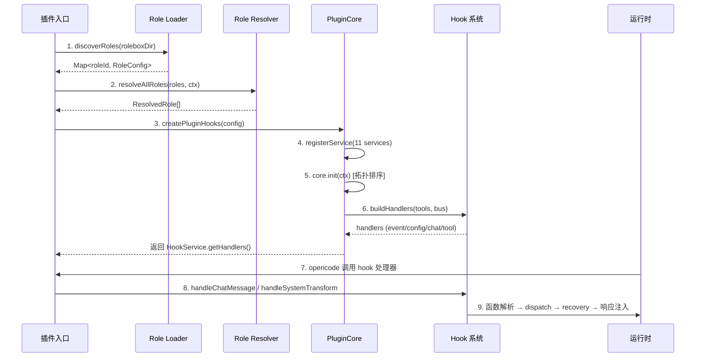
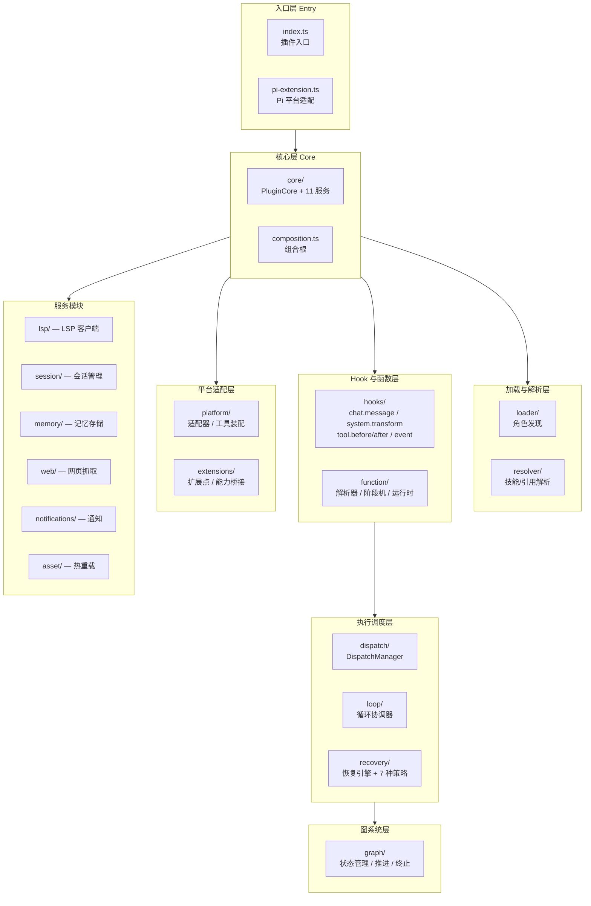

# 架构概览

> **相关文档：** [处理管道](/01-Overview/processing-pipeline) — 请求处理流程与阶段分解 | [服务架构](/01-Overview/service-architecture) — 11 个核心服务的依赖关系 | [运行时行为](/04-Advanced/runtime-behavior) — 运行时行为详解

## 角色引导生命周期

rolebox 作为 opencode 插件启动后，每个角色（Role）经历以下生命周期：



::: tip 速查建议
如果你是首次阅读架构文档，建议先浏览下方的**30+ 模块地图**了解各模块的职责和文件结构，再回到上方的**生命周期序列图**理解启动流程。这样可以先建立整体认知，再深入细节。
:::

### 生命周期阶段详解

| 阶段 | 关键文件 | 说明 |
|------|----------|------|
| **Init** | `src/index.ts:21-66` | 插件入口 `RoleboxPlugin(ctx)`，配置日志、发现 rolebox 目录 | 
| **Discover** | `src/loader/role-loader.ts:45-85` | 扫描 `role.yaml` 文件，按目录名作为 roleId 解析 |
| **Resolve** | `src/resolver/bootstrap.ts:56-83` → `src/resolver/orchestrator.ts` | 解析技能、引用、函数、子代理、协作图 |
| **Inject** | `src/core/composition.ts:50-103` | 创建 `PluginCore`，注册 11 个服务，拓扑排序初始化 |
| **Activate** | `src/core/plugin-core.ts:63-107` | 按依赖顺序调用各服务的 `init()`；失败时可降级 |
| **Runtime** | `src/hooks/chat-message.ts:16-257` | 消息处理、函数激活、循环调用、校正注入 |

> **行引用**: `src/index.ts:21-66` — 插件入口及 bootstrapRoles 调用  
> `src/resolver/bootstrap.ts:56-83` — 统一的角色发现与解析流程  
> `src/core/composition.ts:64-75` — 11 个服务的注册  
> `src/core/plugin-core.ts:63-107` — 拓扑排序初始化（含 StartupCheck）  
> `src/hooks/chat-message.ts:108-131` — 函数激活解析核心逻辑

---

## 30+ 模块地图

`src/` 目录下包含 30+ 个一级模块，按功能分类。各模块的详细文档：

### 核心层 (Core)

| 模块 | 文件数 | 职责 | 文档 |
|------|--------|------|------|
| `core/` | 10 | `PluginCore`、服务注册、事件总线、状态注册表、工具注册表、ServiceSupervisor | [插件接口](/03-Reference/plugin-interface) |
| `composition.ts` | 1 | 组合根，组装所有服务 → 返回 opencode hook 处理器 | — |

### 调度层 (Dispatch)

| 模块 | 文件数 | 职责 | 文档 |
|------|--------|------|------|
| `dispatch/` | 17 | DispatchManager、工厂、并发控制、预算、检查点、持久化、查询 | [调度配置](/03-Reference/dispatch-config) |
| `loop/` | 9 | 循环协调器、工作器调度、取消、参数解析、持久化 | [循环系统](/04-Advanced/loop-system) |
| `recovery/` | 11 | 恢复引擎、链执行器、错误检测、7 种内置策略 | [恢复系统](/03-Reference/recovery-system) |

 ### Hook 与函数系统 (Hooks & Functions)

| 模块 | 文件数 | 职责 | 文档 |
|------|--------|------|------|
| `hooks/` | 12 | Chat message、system.transform、tool.before/after、compaction、event-handler、state | [Hook 参考](/03-Reference/hooks) |
| `function/` | 16 | 函数解析器、运行时状态、会话状态、阶段机、门控、观察、处理器 | [函数指南](/02-Guide/functions) |

### 加载与解析 (Loader & Resolver)

| 模块 | 文件数 | 职责 | 文档 |
|------|--------|------|------|
| `loader/` | 3 | 角色发现、子代理加载 | [子代理](/02-Guide/subagents) |
| `resolver/` | 7 | 引导、环境变量、frontmatter、编排器、引用/技能解析 | [技能系统](/02-Guide/skills)、[引用文档](/02-Guide/references) |

### 平台适配层 (Platform)

| 模块 | 文件数 | 职责 | 文档 |
|------|--------|------|------|
| `platform/` | 7 | 适配器、端口定义、工具装配、能力声明 | [工具目录](/03-Reference/tool-catalog) |
| `extensions/` | 7 | 扩展点加载器、注册表、能力桥接 | [扩展系统](/03-Reference/extensions) |

### 服务模块 (Services)

| 模块 | 文件数 | 职责 | 文档 |
|------|--------|------|------|
| `notifications/` | 16 | 多通道通知、调度器、节流、静默时段、平台格式化 | [通知系统](/04-Advanced/notification-system) |
| `lsp/` | 8 | LSP 客户端管理器、服务器、工具、RPC | — |
| `session/` | 7+ | 会话工具、分析、导出、搜索、链接 | [会话工具](/04-Advanced/session-tools) |
| `memory/` | 3+ | 记忆存储、工具、搜索 | [记忆系统](/04-Advanced/memory-system) |
| `asset/` | 7 | 热重载、搜索、检查、验证、技能组合 | — |
| `web/` | 16 | Web 抓取、搜索、浏览器检测、SSRF 防护、可读性提取 | — |

### 辅助模块 (Utilities)

| 模块 | 文件数 | 职责 | 文档 |
|------|--------|------|------|
| `graph/` | 15 | 协作图模板、边解析、验证、状态、推进、终止 | [协作图](/02-Guide/collaboration-graph) |
| `signal/` | 2 | 信号账本、信号工具 | [信号系统](/04-Advanced/signal-system) |
| `sync/` | 2 | 代理文件同步、技能符号链接 | — |
| `tui/` | 7 | 终端 UI 组件、状态、逻辑、事件 | — |
| `cli/` | 2+ | CLI 路径工具 | [CLI 参考](/03-Reference/cli) |
| `prompt/` | 3+ | 提示构建器、代理配置 | — |
| `hashline/` | 1+ | 行哈希编辑引擎 | [Hashline 编辑](/04-Advanced/hashline-editing) |
| `utils/` | 6 | 路径、超时、状态路径、显示帮助 | — |

### 入口文件

| 文件 | 职责 |
|------|------|
| `index.ts` | opencode 插件入口点 |
| `pi-extension.ts` | Pi 平台扩展入口点 |
| `constants.ts` | 全局常量定义 |
| `types.ts` / `types.*.ts` | 类型定义文件 |
| `logger.ts` | 日志系统 |
| `project-config.ts` | 项目级配置加载 |

::: tip 60 秒理解数据流
rolebox 的核心数据流可概括为 5 个生命周期阶段：

1. **加载** — opencode 启动时，插件入口 `src/index.ts` 发现 rolebox 目录，加载所有 `role.yaml`
2. **解析** — Resolver 对每个角色解析其技能、引用、函数、子代理和协作图
3. **初始化** — PluginCore 按拓扑序初始化 11 个服务，注册事件总线和工具
4. **拦截** — 5 个 hook 回调拦截用户消息、系统提示构建、工具执行等管道阶段
5. **执行** — chat.message hook 解析函数激活，dispatch 引擎调度子代理，recovery 层处理失败

详见[处理管道](/01-Overview/processing-pipeline)了解各阶段的完整流程。
:::

---

## 在 opencode 生态系统中的定位

rolebox 在 opencode 生态中扮演三种角色：

### 1. 插件协议适配器

`src/index.ts:21-66` 实现了 `@opencode-ai/plugin` 的 `Plugin` 接口，通过 `PluginInput` 提供的 `ctx.client`（session 创建 API）与 opencode 核心交互。同时 `src/pi-extension.ts` 为 Pi IDE 提供独立的适配器路径（`PiLightweightServiceStack`、`PiEventBridge`）。

### 2. 工具注入层

通过 `src/core/composition.ts:64-75` 注册的 `ToolService`（`src/core/services/tool-service.ts:28-104`），rolebox 将 dispatch、session、LSP、memory、function 等 30+ 工具注入到 opencode 的工具链中。`buildCanonicalTools`（`src/platform/tool-assembly.ts`）跨平台统一工具定义格式。

### 3. 拦截层

rolebox 通过 opencode 的 5 个 hook 回调拦截和增强消息处理管道：

```
event         → src/hooks/event-handler.ts    — 会话生命周期事件
config        → src/core/services/hook-service.ts:167-206 — 代理配置注入
chat.message  → src/hooks/chat-message.ts     — 函数激活解析 + 循环调度
tool.execute.before → src/hooks/tool-before.ts — 参数验证 + 守卫
tool.execute.after  → src/hooks/tool-after.ts  — 结果捕获 + 图推进 + 观测
system.transform    → src/hooks/system-transform.ts — 系统提示构建
session.compacting  → src/hooks/compaction.ts  — 会话压缩
```

这种拦截模式使 rolebox 无需修改 opencode 核心代码即可实现函数系统、dispatch、协作图、恢复引擎等高级功能。

---

## 入口文件总览

| 入口点 | 平台 | 核心流程 |
|--------|------|----------|
| `src/index.ts:21-66` | opencode (Plugin) | `bootstrapRoles()` → `createPluginHooks()` → 返回 handlers |
| `src/pi-extension.ts:72-371` | Pi IDE (Extension) | 同上 + Pi 特定适配器 + 事件桥接 + 系统提示注入 |

---

## 模块依赖概览

以下 Mermaid 图展示了各层模块之间的依赖与协作关系（箭头表示数据流方向）：




以下文本图展示了 `src/` 下主要模块之间的依赖关系（箭头表示依赖方向）：

```
src/core/          ← 核心层：PluginCore、服务注册、事件总线
    ↑
src/dispatch/      ← 调度层：DispatchManager、并发控制、持久化
    ↑
src/loop/          ← 循环协调器：LoopCoordinator、参数解析
    ↑
src/recovery/      ← 恢复层：RecoveryEngine、策略链、错误检测
    ↑
src/hooks/         ← Hook 系统：chat.message、system.transform、tool.before/after
    ↑
src/function/      ← 函数系统：解析器、运行时状态、阶段机、门控
    ↑
src/graph/         ← 协作图：模板、边解析、状态推进、终止条件
    ↑
src/resolver/      ← 解析层：skill-resolver、reference-resolver、orchestrator
    ↑
src/loader/        ← 加载层：role-loader、子代理发现
```

核心层（`core/`）是所有服务的注册中心。调度层（`dispatch/`）、循环层（`loop/`）和恢复层（`recovery/`）依赖核心层的事件总线和服务注册表。Hook 系统（`hooks/`）是执行入口，调用函数系统（`function/`）进行激活解析，再通过调度层分配任务。图系统（`graph/`）为协作图提供状态推进与终止检测。解析层（`resolver/`）和加载层（`loader/`）仅在启动阶段使用，运行时不依赖。

## 下一步

- [处理管道](/01-Overview/processing-pipeline) — 完整的请求处理流程与阶段分解
- [服务架构](/01-Overview/service-architecture) — 11 个核心服务的拓扑序与降级机制
- [插件接口](/03-Reference/plugin-interface) — PluginCore 生命周期与平台适配
