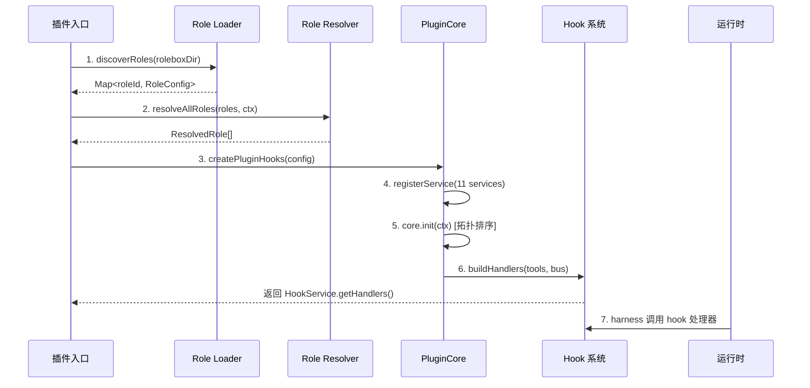
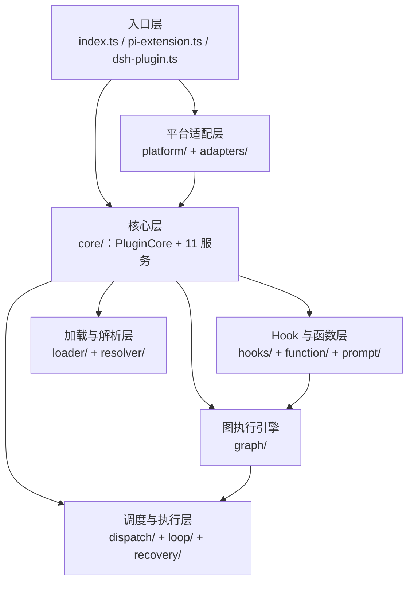

# 架构概览（Architecture）

本页是内部实现的**唯一架构入口**，回答三个问题：插件启动时如何把角色和服务拉起来、`src/` 下有哪些模块各自负责什么、三个 harness 如何共用同一条引导链。服务如何被注册、排序与降级见[服务架构](/01-Overview/service-architecture)；一条消息如何穿过这些模块见[处理管道](/01-Overview/processing-pipeline)。

> 相关：[服务架构](/01-Overview/service-architecture)｜[处理管道](/01-Overview/processing-pipeline)｜[平台与 Harness](/01-Overview/platform-harnesses)｜[源码索引](/06-Appendix/source-index)

> 自 v1.8.0 起，多代理编排只有命令式 `graph_*` 一条路径；声明式协作配置块已整体移除，迁移对照见[附录](/06-Appendix/migration)。

## 三入口与共享引导链

同一套核心逻辑适配三个 harness，差异全部收在入口模块与 `src/platform/adapters/` 之下：

| Harness | 入口模块 | 导出形状 | 适配要点 |
|---|---|---|---|
| opencode | `src/index.ts` | 默认导出 `{ id, server }` | `RoleboxPlugin(ctx)` 返回 hook handlers；`OpencodeSessionAdapter` + `OpencodeAgentRegistrar` 负责会话与代理注册 |
| pi（pi.dev） | `src/pi-extension.ts` | 默认导出 async 函数 | `PiLightweightServiceStack` 提供 hook 管线，`PiEventBridge` 把 pi 事件映射为规范事件 |
| dsh（DeepSeek Harness） | `src/dsh-plugin.ts` | 默认导出 `{ apply(ctx, config) }` 对象插件 | 注册子代理 provider 与工具，另有 web 角色切换与监控路由 |

三个入口调用同一条引导链：

```text
resolveRoleboxDirectories()  →  initializeRoleboxRuntime()  →  createPluginHooks()
  src/platform/factory.ts         src/platform/factory.ts      src/core/composition.ts
```

- **`resolveRoleboxDirectories()`** — 解析 rolebox 目录、全局技能目录、配置目录与内置函数目录。`roleboxDir` 是两分支回退：工作目录下的 `rolebox/` 存在时优先，否则取 harness 配置目录下的 `rolebox/`。
- **`initializeRoleboxRuntime()`** — 调用 `bootstrapRoles()` 完成角色发现与解析，可选地通过 registrar 把角色同步给宿主平台。
- **`createPluginHooks()`** — 组合根：创建 `PluginCore`、注册 11 个服务、初始化运行时，最后返回当前 harness 需要的 hook 处理器。装配细节见[服务架构](/01-Overview/service-architecture)。

## 角色引导生命周期

每个角色从被发现到可服务，依次经过下面六个阶段（三个入口同形）：


```mermaid
sequenceDiagram
    participant Entry as 插件入口
    participant Loader as Role Loader
    participant Resolver as Role Resolver
    participant Core as PluginCore
    participant Hook as Hook 系统
    participant Runtime as 运行时

    Entry->>Loader: 1. discoverRoles(roleboxDir)
    Loader-->>Entry: Map<roleId, RoleConfig>
    Entry->>Resolver: 2. resolveAllRoles(roles, ctx)
    Resolver-->>Entry: ResolvedRole[]
    Entry->>Core: 3. createPluginHooks(config)
    Core->>Core: 4. registerService(11 services)
    Core->>Core: 5. core.init(ctx) [拓扑排序]
    Core->>Hook: 6. buildHandlers(tools, bus)
    Hook-->>Entry: 返回 HookService.getHandlers()
    Runtime->>Hook: 7. harness 调用 hook 处理器
```

| 阶段 | 负责模块 | 做什么 |
|---|---|---|
| Init | `src/index.ts`、`src/pi-extension.ts`、`src/dsh-plugin.ts` | 解析目录、初始化日志目录、应用项目级配置（`.rolebox/config.json` 的 `defaultRole`） |
| Discover | `src/loader/role-loader.ts` | `discoverRoles()` 扫描 `role.yaml`，以目录名作为 roleId；同时加载基于文件的子代理 |
| Resolve | `src/resolver/bootstrap.ts` → `src/resolver/orchestrator.ts` | `bootstrapRoles()` 串起发现与解析；`resolveAllRoles()` 解析技能、引用、函数与子代理 |
| Inject | `src/core/composition.ts` | `createPluginHooks()` 创建 `PluginCore`、注册 11 个服务、调用 `core.init(ctx)` |
| Activate | `src/core/plugin-core.ts` | 先跑启动一致性检查（隔离损坏状态、清理过期锁与孤儿临时文件），再按拓扑序调用每个服务的 `init()` |
| Runtime | `src/hooks/chat-message.ts` | 拦截消息、解析函数激活、调度循环、把校正写回待注入队列 |

角色引导只发生在启动阶段：`src/loader/` 与 `src/resolver/` 在运行时不再参与，之后每次请求都由 hook 层与服务层处理。

## 在 Harness 生态中的三种角色

**插件协议适配器。** 每个 harness 都有自己的插件协议，入口模块把协议翻译成 rolebox 的引导调用；协议差异不越过 `src/platform/`。

**工具注入层。** `src/core/services/tool-service.ts` 装配工具，`src/platform/tool-assembly.ts` 的 `buildCanonicalTools()` 跨平台统一工具定义格式。模型可见的编排面只有命令式 `graph_*` 工具集与薄 `task_*` 兼容层；裸 `dispatch_*` / `loop_*` 工具在 `ToolService.init()` 中被显式停用，原因是它们会绕过图预算、审批门与循环上限。

**拦截层。** rolebox 通过 harness 的 hook 回调增强消息管道，无需改动宿主代码：

| 回调 | 实现模块 | 拦截内容 |
|---|---|---|
| `event` | `src/hooks/event-handler.ts` | 会话生命周期事件，并转成总线事件 `event:*` |
| `config` | `src/core/services/hook-service.ts` | 把解析后的角色与子代理配置注入宿主 |
| `chat.message` | `src/hooks/chat-message.ts` | 函数激活解析、循环调度 |
| `tool.execute.before` | `src/hooks/tool-before.ts` | 参数校验与守卫 |
| `tool.execute.after` | `src/hooks/tool-after.ts` | 结果捕获、观测器、自定义处理器 |
| `experimental.chat.system.transform` | `src/hooks/system-transform.ts` | 系统提示构建与注入 |
| `experimental.session.compacting` | `src/hooks/compaction.ts` | 会话压缩前保存检查点 |

回调的发射时机与注入顺序见[处理管道](/01-Overview/processing-pipeline)，Hook 的类型与配置见 [Hook 参考](/03-Reference/hooks)。

## 模块地图

`src/` 下是 26 个一级目录，外加若干顶层模块文件。下表路径相对 `src/`：

### 核心层（Core）

| 模块 | 职责 | 文档 |
|------|------|------|
| `core/` | `PluginCore`、服务注册、`EventBus`、`ServiceSupervisor`、工具与状态注册表 | [服务架构](/01-Overview/service-architecture)、[插件接口](/03-Reference/plugin-interface) |
| `core/composition.ts` | 组合根：注册 11 个服务并初始化，返回 hook 处理器 | [服务架构](/01-Overview/service-architecture) |

### 图执行引擎（Graph Engine）

| 模块 | 职责 | 文档 |
|------|------|------|
| `graph/engine/` | 图执行引擎：节点生命周期、join 评估、信号传播、级联取消、循环组、审批门、预算、持久化与恢复 | [图执行引擎](/04-Advanced/graph-engine)、[运行时行为](/04-Advanced/runtime-behavior) |
| `graph/tools/` | 8 个命令式图工具：`graph_create`、`graph_add_node`、`graph_add_edge`、`graph_add_loop`、`graph_run`、`graph_status`、`graph_cancel`、`graph_approve` | [图工作流](/02-Guide/graph-workflows) |
| `graph/parser-v2.ts`、`graph/validator-v2.ts`、`graph/serialize.ts`、`graph/templates.ts` | 图文档的解析、结构与语义校验、序列化与模板展开 | [图声明](/04-Advanced/graph-declaration) |

### 调度与执行层（Dispatch & Execution）

| 模块 | 职责 | 文档 |
|------|------|------|
| `dispatch/` | `DispatchManager`、子代理工厂与谱系、预算、检查点、进度、持久化、查询工具与状态文件锁 | [调度配置](/03-Reference/dispatch-config) |
| `loop/` | `LoopCoordinator`、工作器调度、取消、参数解析、循环状态持久化 | [循环系统](/04-Advanced/loop-system) |
| `recovery/` | `RecoveryEngine`、`RecoveryChainExecutor`、错误模式注册表、状态存储与 7 种内置策略 | [恢复系统](/03-Reference/recovery-system) |

### Hook 与函数系统（Hooks & Functions）

| 模块 | 职责 | 文档 |
|------|------|------|
| `hooks/` | `chat.message`、`system.transform`、`tool.before/after`、事件处理、压缩，以及 `custom/` 自定义 Hook | [处理管道](/01-Overview/processing-pipeline)、[自定义 Hook](/02-Guide/custom-hooks) |
| `function/` | 函数解析器、运行时状态、会话状态、阶段机、门控条件、观测器、处理器加载 | [函数系统](/02-Guide/functions) |

### 加载与解析（Loader & Resolver）

| 模块 | 职责 | 文档 |
|------|------|------|
| `loader/` | 角色发现（`role-loader.ts`）与子代理加载（`subagents.ts`） | [子代理](/02-Guide/subagents) |
| `resolver/` | 引导、环境变量、frontmatter、模型解析、编排器、引用与技能解析 | [技能系统](/02-Guide/skills)、[引用文档](/02-Guide/references) |
| `prompt/` | 代理提示构建、agent 配置、reminder | — |

### 平台适配层（Platform）

| 模块 | 职责 | 文档 |
|------|------|------|
| `platform/` | 适配器（opencode / pi / dsh）、端口定义、工具装配、能力声明、路径解析与平台注册表 | [平台与 Harness](/01-Overview/platform-harnesses)、[工具目录](/03-Reference/tool-catalog) |
| `extensions/` | 扩展点加载器、注册表、能力桥接与 7 个内置扩展点（conditions / graph_topologies / recovery_strategies / recovery_patterns / notification_channels / notification_events / observe_events） | [扩展系统](/03-Reference/extensions) |

### 服务模块（Services）

| 模块 | 职责 | 文档 |
|------|------|------|
| `notifications/` | 多通道通知、调度器、节流、静默时段、平台格式化 | [通知系统](/04-Advanced/notification-system) |
| `lsp/` | LSP（语言服务器协议，Language Server Protocol）客户端管理器、服务器生命周期与工具 | [LSP 工具](/03-Reference/tools/lsp-tools) |
| `session/` | 会话工具、分析、导出、搜索与链接 | [会话工具](/04-Advanced/session-tools) |
| `memory/` | 记忆存储（SQLite + FTS5）、工具与搜索 | [记忆系统](/04-Advanced/memory-system) |
| `asset/` | 资产热重载、搜索、检查、验证与技能组合 | — |
| `web/` | Web 抓取、搜索、浏览器检测、SSRF（服务端请求伪造，Server-Side Request Forgery）防护与可读性提取 | — |

### 辅助模块（Utilities）

| 模块 | 职责 | 文档 |
|------|------|------|
| `hashline/` | 内容哈希锚定编辑引擎（读、写、原子写入、校验） | [Hashline 编辑](/04-Advanced/hashline-editing) |
| `signal/` | 信号常量、信号工具、会话级信号账本 | [信号系统](/04-Advanced/signal-system) |
| `sync/` | 代理文件同步与技能符号链接 | — |
| `tui/` | 终端 UI 组件、状态、逻辑与事件 | — |
| `terminal/` | 持久交互式终端工具（屏幕缓冲、会话注册表） | [平台工具](/03-Reference/tools/platform-tools) |
| `copilot/` | 轮次结束决策管道：内置函数续跑、用户规则匹配与 LLM 判定 | — |
| `cli/` | CLI（命令行界面，Command-Line Interface）主入口、子命令、路径、注册表客户端与下载进度 | [CLI 参考](/03-Reference/cli) |
| `utils/` | 路径、状态路径、超时、文件系统、会话作用域与引用搜索 | — |

## 模块依赖方向

依赖方向自上而下，箭头表示「被谁导入」：


```mermaid
graph TD
    Entry["入口层<br/>index.ts / pi-extension.ts / dsh-plugin.ts"]
    Platform["平台适配层<br/>platform/ + adapters/"]
    Core["核心层<br/>core/：PluginCore + 11 服务"]
    HookFunc["Hook 与函数层<br/>hooks/ + function/ + prompt/"]
    GraphL["图执行引擎<br/>graph/"]
    Exec["调度与执行层<br/>dispatch/ + loop/ + recovery/"]
    LoadRes["加载与解析层<br/>loader/ + resolver/"]

    Entry --> Platform
    Entry --> Core
    Core --> LoadRes
    Core --> HookFunc
    Core --> GraphL
    Core --> Exec
    HookFunc --> GraphL
    GraphL --> Exec
    Platform --> Core
```

- **`core/` 是唯一的注册中心**：hooks、dispatch、loop、function、graph、session、memory、lsp、asset、platform、extensions、notifications、prompt、recovery 都从它取服务实例或状态。
- **`graph/` 是子代理编排的一等子系统**：它通过命令式 `graph_*` 工具构造执行图，经只读接缝驱动 `dispatch/` 派发任务，并把失败交给 `recovery/`。
- **`recovery/` 与 `extensions/` 互为上下游**：扩展点可以向恢复引擎注册自定义策略与错误模式。
- **`loader/` 与 `resolver/` 只在启动阶段使用**，运行时不依赖。

贡献代码时遵循同一条约束：**上层模块可以导入下层模块，下层模块不得反向依赖上层模块**。例如 `hooks/` 可以导入 `dispatch/`，`dispatch/` 不应导入 `hooks/`；`web/`、`hashline/`、`sync/`、`tui/` 这类叶子模块不依赖其他业务模块。

## 源码目录

`src/` 的完整一级结构如下（这也是文档中唯一描述源码树的地方；面向读者的角色目录结构见[目录结构](/01-Overview/directory-structure)，概念到模块的对照表见[源码索引](/06-Appendix/source-index)）：

```text
src/
├── asset/          # 资产热重载、搜索、检查、验证、技能组合
├── cli/            # CLI 主入口、子命令、路径、注册表客户端、下载进度
├── copilot/        # 轮次结束决策管道：内置函数续跑、规则匹配、LLM 判定
├── core/           # PluginCore、服务注册、事件总线、ServiceSupervisor、注册表
├── dispatch/       # DispatchManager、子代理工厂、预算、检查点、进度、持久化、查询
├── extensions/     # 扩展点加载器、注册表、能力桥接与 7 个内置扩展点
├── function/       # 函数解析器、运行时状态、阶段机、门控条件、观测器
├── graph/          # 图执行引擎 engine/ + 8 个命令式 graph_* 工具 tools/
├── hashline/       # 内容哈希锚定编辑引擎（读、写、原子写入、校验）
├── hooks/          # chat.message、system.transform、tool.before/after、compaction
├── loader/         # 角色发现 role-loader.ts、子代理加载 subagents.ts
├── loop/           # 循环协调器、工作器调度、取消、持久化
├── lsp/            # LSP 客户端管理器、服务器、工具
├── memory/         # 记忆存储（SQLite + FTS5）、工具、搜索
├── notifications/  # 多通道通知、调度器、节流、静默时段
├── platform/       # 适配器（opencode / pi / dsh）、端口定义、工具装配、路径解析
├── prompt/         # 代理提示构建、agent 配置、reminder
├── recovery/       # 恢复引擎、链执行器、错误检测、7 种内置策略
├── resolver/       # 引导、环境变量、frontmatter、模型解析、编排器、引用/技能解析
├── session/        # 会话工具、分析、导出、搜索
├── signal/         # 信号常量、信号工具、会话级信号账本
├── sync/           # 代理文件同步、技能符号链接
├── terminal/       # 持久交互式终端工具（屏幕缓冲、会话注册表）
├── tui/            # 终端 UI 组件、状态、逻辑、事件
├── utils/          # 路径、状态路径、超时、文件系统、会话作用域、引用搜索
└── web/            # Web 抓取、搜索、浏览器检测、SSRF 防护、可读性提取
```

顶层模块文件除三个入口外，还有 `src/constants.ts`（全局常量）、`src/logger.ts`（日志系统）、`src/project-config.ts`（`.rolebox/config.json` 的加载与应用），以及 `src/types.ts` 与按域拆分的类型定义文件。

核心层展开后是贡献者最常读的一层：

```text
src/core/
├── plugin-core.ts        # 服务注册表、拓扑排序初始化、逆序清理、单服务重启
├── composition.ts        # 组合根 createPluginHooks：注册 11 个服务并返回处理器
├── service.ts            # PluginService 与 ServiceHealth 接口
├── service-supervisor.ts # 受监督重启：滑动窗口预算、指数退避、永久降级
├── event-bus.ts          # 进程内发布/订阅总线
├── state-registry.ts     # 全局状态注册表
├── tool-registry.ts      # 工具 schema 注册表
└── services/             # 11 个服务的实现
```

图子系统是第二个高频入口，它只有两个子目录和五个顶层模块：

```text
src/graph/
├── engine/        # 图执行引擎（25 个模块）
├── tools/         # 8 个命令式 graph_* 工具
├── index.ts       # 子系统出口
├── parser-v2.ts   # 图文档解析
├── validator-v2.ts # 结构与语义校验
├── serialize.ts   # 序列化
└── templates.ts   # 模板展开
```

## 相关页面

- [服务架构](/01-Overview/service-architecture) — 11 个服务的职责、依赖、生命周期与降级
- [处理管道](/01-Overview/processing-pipeline) — 一条消息经过的七个阶段与可拦截点
- [图执行引擎](/04-Advanced/graph-engine) — 图模型、节点生命周期与 join 语义
- [源码索引](/06-Appendix/source-index) — 概念到模块的对照表
- [开发环境搭建](/05-Contributing/development-setup) — 构建、测试与调试
- [贡献指南](/05-Contributing/contributing) — 提交流程与代码规范
