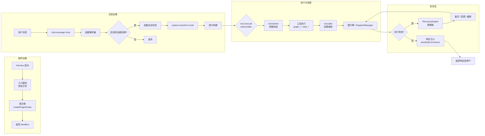
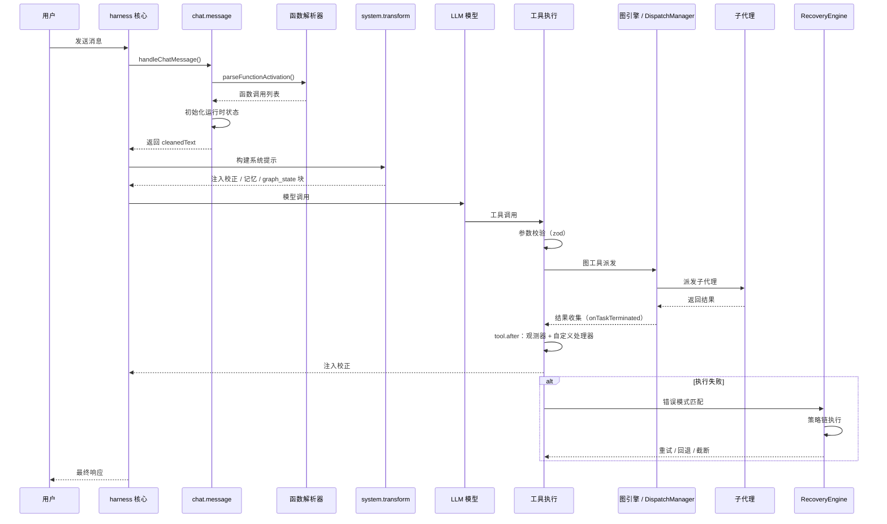

# 处理管道（Processing Pipeline）

本页只讲**消息流水线**：一条用户消息依次经过哪些阶段、每个阶段由哪个模块负责、可以在哪里拦截，以及校正注入如何形成回环。服务的装配与依赖见[服务架构](/01-Overview/service-architecture)；模块全景与源码目录见[架构概览](/01-Overview/architecture-overview)。

> 相关：[架构概览](/01-Overview/architecture-overview)｜[服务架构](/01-Overview/service-architecture)｜[Hook 参考](/03-Reference/hooks)｜[图工作流](/02-Guide/graph-workflows)

## 数据流总览

一条用户消息从输入到响应的完整流转：



对应的时序：



### 一分钟速览

| 阶段 | 描述 |
|------|------|
| **1. 插件加载** | 入口模块发现 rolebox 目录 → 引导角色 → 组合根返回 handler 对象 |
| **2. 消息处理** | `chat.message` hook 拦截用户消息，解析 `\|fn:args\|` 语法，初始化函数会话状态与运行时状态 |
| **3. 系统提示构建** | `system.transform` hook 在每次模型调用前注入校正、记忆、可用函数块、函数状态块与 `graph_state` 引擎方位块 |
| **4. 工具执行** | `tool.before` 校验参数并拦下对运行中任务的重复轮询；`tool.after` 捕获结果、运行观测器与自定义处理器 |
| **5. 函数解析** | 解析简单 / 位置 / 键值 / 链式四种语法；阶段机评估门控条件与函数转换 |
| **6. 图引擎与派发** | 模型只看到 `graph_*` 与 `task_*`；图节点由引擎经 `DispatchBridge` 派发，`DispatchManager` 管理任务生命周期 |
| **7. 恢复层** | `RecoveryEngine` 匹配错误模式并执行策略链：可恢复则重试，否则中止 |

## 阶段详解

### 阶段 1：插件加载（Plugin Loading）

harness 启动时调用入口模块导出的插件函数，随后走同一条引导链（三个入口的差异见[架构概览](/01-Overview/architecture-overview)）：

- **`src/index.ts`、`src/pi-extension.ts`、`src/dsh-plugin.ts`** — 解析 rolebox 目录、初始化运行时，最后调用组合根 `createPluginHooks()` 并返回 handler 对象。
- **`src/resolver/bootstrap.ts`** — `bootstrapRoles()` 串起 `discoverRoles()`（发现所有角色）与 `resolveAllRoles()`（解析技能、引用、函数与子代理）。
- **`src/core/composition.ts`** — 装配 11 个服务并返回处理器。

关键数据类型沿调用链传递：`Plugin`（宿主插件接口）→ `PluginInput`（client、directory）→ hook handler 对象。

### 阶段 2：消息处理（Message Processing）

用户消息到达时，`src/hooks/chat-message.ts` 的 `handleChatMessage` 按固定次序处理：

1. **合成注入检测** — 识别 auto-continue、循环进度、copilot 注入与派发通知，这些不是真实用户轮，跳过不必要的处理。
2. **Hook 阶段** — 先跑内置 Hook，再跑自定义 Hook，两者都分 `before` 与 `after` 两段。
3. **自动激活函数** — 按角色的 `auto_activate` 激活默认函数并初始化运行时状态（每个会话只做一次）。
4. **函数激活解析** — `parseFunctionActivation()` 从消息文本提取 `|fn:args|` 模式，并按当前角色的函数清单过滤。
5. **循环调度** — 检测 `|loop|` 调用，解析参数后交给 `LoopCoordinator.register()`。
6. **运行时状态初始化** — 为每个激活函数建运行时状态；只有真实用户轮才重置续跑计数。
7. **观测器执行** — 运行 `on:message` 观测器，把产生的校正写进待注入队列。

```typescript
// handleChatMessage 的核心调用链
parseFunctionActivation(part.text)  // → { functions, calls, cleanedText }
functionSessionState.activate()      // → 更新激活状态
functionRuntime.init()               // → 创建运行时状态
state.activeLoopManager.register()   // → 注册循环任务
```

### 阶段 3：系统提示构建（System Transform）

每次模型调用前，`src/hooks/system-transform.ts` 的 `handleSystemTransform` 重建系统提示：

1. **校正注入** — 取出 `pendingCorrections` 中属于本会话的内容注入提示，然后清空。
2. **引擎方位块** — 从内存中的图注册表构造 `graph_state` 块（`buildEngineGraphStateBlock`，位于 `src/graph/engine/graph-state-block.ts`）；没有活跃图时为空串，所有注入点自动无操作。
3. **可用函数块** — 列出当前代理已解析的全部函数，即使一个都没激活。
4. **记忆注入** — 按角色的 `memory` 配置从记忆存储检索并注入关联内容；函数激活与否都会执行。
5. **函数块构建** — 对每个激活函数调用 `evaluateGateAndTransitions()`：评估门控条件更新阶段（active / gated），评估转换条件得到激活与停用列表，按优先级排序后注入，并附带被消费的工件。
6. **依赖守卫** — 检查函数的 `requires` 依赖是否都已激活，缺失时注入 reminder。

### 阶段 4：工具执行（Tool Execution）

模型调用工具时触发前后两个回调：

**`src/hooks/tool-before.ts`** — `handleToolBefore`：

- **参数校验** — 用 zod 的 `.strict()` 模式校验工具参数，拒绝未知参数并回写可用参数清单。
- **轮询守卫** — 阻止对仍在运行的任务调用 `dispatch_output`。

**`src/hooks/tool-after.ts`** — `handleToolAfter`：

- **重复轮询校正** — 若 `dispatch_output` 仍返回 "still running"，注入一条校正阻止模型继续轮询。
- **函数观测器** — `runToolObserve()` 运行 `on:tool_after` 观测器。
- **自定义处理器** — `loadHandlers()` 与 `drainHandlerContext()` 运行为该工具注册的处理器。
- **内置与自定义 Hook** — `before`、`after` 两段各跑一遍。

图推进**不在** `tool.after`：节点派发后，引擎通过 `DispatchBridge`（`src/graph/engine/dispatch-bridge.ts`）注册的 `onTaskTerminated` 监听器获知任务终结并推进前沿。`tool.after` 只负责结果捕获、观测器与自定义处理器。

### 阶段 5：函数解析（Function Parsing）

`src/function/parser.ts` 的 `parseFunctionActivation` 支持三种基本语法，第四种是它们的链式组合：

```text
|fn|                        → 简单激活
|fn:arg1,arg2|              → 位置参数
|fn key1=val1 key2=val2|    → 键值参数
|fn1|fn2:arg|fn3 k=v|       → 链式激活
```

`src/function/phase-machine.ts` 的 `evaluateGateAndTransitions` 消费解析结果：门控条件决定 `gateSatisfied` 与 `phase`（active / gated），转换条件生成 `activate` 与 `deactivate` 列表。

### 阶段 6：图引擎与派发（Graph & Dispatch）

模型可见的编排面只有两个：命令式 `graph_*` 工具集与薄 `task_*` 兼容层。裸 `dispatch_*` / `loop_*` 工具不在可见面上，原因与停用位置见[架构概览](/01-Overview/architecture-overview)。

- **8 个 `graph_*` 工具** — `src/graph/tools/index.ts`；参数与用法见[图工作流](/02-Guide/graph-workflows)与[编排工具](/03-Reference/tools/orchestration-tools)。
- **`task_*` 兼容层** — `createTaskTools()` 的定义在 `src/dispatch/query/task-tools.ts`；注册时剔除会绕过图预算与审批的 `task_retry`，实际暴露 `task_search`、`task_budget`、`task_graph`、`task_chronology`、`task_export`。

执行侧是 `src/dispatch/core/manager.ts` 的 `DispatchManager`：任务创建 → 派发 → 结果收集 → 超时与看门狗 → 持久化。图引擎与它之间只隔 `src/graph/engine/dispatch-bridge.ts` 这一层只读接缝，引擎不触碰 `DispatchManager` 内部。

### 阶段 7：恢复层（Recovery）

`src/recovery/engine.ts` 的 `RecoveryEngine` 在工具执行失败后接手：

- **错误检测** — `src/recovery/error-detection.ts` 的错误模式注册表把失败归类（session_error、edit_error、json_error、context_window、empty_response 等）。
- **策略链** — `src/recovery/chain-executor.ts` 依次执行 7 种内置策略：中止 / 重试 / 回退模型 / 截断 / 压缩 / 提醒后重试 / 汇总。每种策略的行为与配置见[恢复系统](/03-Reference/recovery-system)。
- **状态持久化** — `src/recovery/state.ts` 记录每次恢复尝试，供后续诊断与看门狗使用。

## 在哪里拦截（Where to Hook In）

rolebox 通过 harness 的 7 个 hook 回调拦截管道各阶段：

| Hook 回调 | 管道阶段 | 实现模块 | 拦截时机 |
|-----------|----------|----------|----------|
| `event` | 会话生命周期 | `src/hooks/event-handler.ts` | 会话创建、切换、结束等生命周期事件；同时发射 `event:*` 总线事件 |
| `config` | 插件加载（阶段 1） | `src/core/services/hook-service.ts` | 把解析后的角色与子代理配置注入宿主 |
| `chat.message` | 消息处理（阶段 2） | `src/hooks/chat-message.ts` | 用户消息到达时解析函数激活、调度循环；发射 `hook:chat.message` |
| `experimental.chat.system.transform` | 系统提示构建（阶段 3） | `src/hooks/system-transform.ts` | 每次模型调用前注入校正、记忆、函数状态与 `graph_state` |
| `tool.execute.before` | 工具执行（阶段 4 前） | `src/hooks/tool-before.ts` | 工具执行前参数校验与守卫；发射 `hook:tool.execute.before` |
| `tool.execute.after` | 工具执行（阶段 4 后） | `src/hooks/tool-after.ts` | 工具执行后结果捕获、观测器与自定义处理器 |
| `experimental.session.compacting` | 会话压缩 | `src/hooks/compaction.ts` | 会话压缩前保存检查点（checkpoint，进度快照） |

### 自定义 Hook

除内置 Hook 外，`src/hooks/custom/` 支持自定义 Hook 注入，可在 `chat.message`、`system.transform`、`tool.execute.*` 的 `before` / `after` 阶段注册自定义逻辑（注册表由 `src/core/services/hook-service.ts` 持有）。声明与写法见[自定义 Hook](/02-Guide/custom-hooks)。

### 拦截优先级

1. **内置 Hook** — rolebox 核心逻辑。
2. **自定义 Hook** — 通过 `custom/` 目录注册的用户扩展。
3. **观测器** — 通过 `on:message` 与 `on:tool_after` 配置的按需逻辑。

三者都遵循「先 `before` 后 `after`」，且内置 Hook 先于自定义 Hook 执行。

::: tip 调试技巧
想确认某个阶段是否被正确拦截，可以在 `role.yaml` 里临时加一个自定义 Hook，在对应事件的 `before` 或 `after` 阶段用 `ctx.inject()` 注入一条标记消息。这是验证拦截时机最快的方式，不需要改 rolebox 源码。
:::

## 流水线回环（Pipeline Loop）

整条流水线并不是单向的：工具执行与观测器产生的校正会进入下一个模型的系统提示，形成闭环。

```text
用户消息
  ↓
chat.message hook  ←── 合成注入检测（跳过 auto-continue、通知等）
  ↓
函数激活解析 → 运行时状态初始化
  ↓
system.transform hook（注入校正、记忆、函数状态、graph_state）
  ↓
模型调用
  ↓
tool.execute.before（参数校验 + 轮询守卫）
  ↓
工具执行（graph_* / task_* 等）
  ↓
tool.execute.after（结果捕获 + 观测器 + 处理器）
  ↓
── 有 pending corrections? ──→ 是 → 校正注入 → 再次触发模型调用
  ↓
  否
  ↓
返回最终响应
```

回环的驱动点是 `system.transform` 的校正注入：`pendingCorrections` 里的每条内容都会进入下一次系统提示，由模型在下一次调用时处理。

回环不会无限转下去，终止由三处硬约束共同保证：循环组的 `max_traversals`（硬性遍历次数上限，见[图声明](/04-Advanced/graph-declaration)）、节点的重试与超时上限，以及人工或编排器发起的取消（`graph_cancel`）。

## 相关页面

- [架构概览](/01-Overview/architecture-overview) — 模块地图、依赖方向与源码目录
- [服务架构](/01-Overview/service-architecture) — 11 个服务的职责、依赖与降级
- [Hook 参考](/03-Reference/hooks) — 内置 Hook 的完整类型与配置
- [图工作流](/02-Guide/graph-workflows) — 命令式 `graph_*` 多代理工作流的现行写法
- [恢复系统](/03-Reference/recovery-system) — 错误模式与策略链
