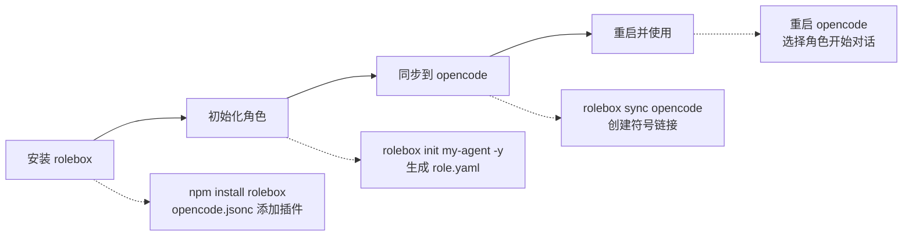

# 快速开始

> **相关文档：** [目录结构](/01-Overview/directory-structure) — 项目文件组织与解析优先级 | [创建角色](/02-Guide/create-a-role) — 创建第一个 `role.yaml` | [CLI 参考](/03-Reference/cli) — 命令行工具完整参考 | [兼容性说明](/04-Advanced/compatibility) — opencode 版本要求与环境兼容性

rolebox 是一个 [opencode](https://github.com/nicholasgriffintn/opencode) 插件，它将一个 AI 编程助手变成一整个专家团队 — 用 YAML 定义角色、函数、技能和协作图，无需编写代码。

> 如果你是首次接触 rolebox 的贡献者，请先阅读[贡献者设置指南](/02-Guide/getting-started)完成开发环境搭建。

每次 AI 编程会话都从零开始。你的助手不记得昨天的架构决策、上周的 Bug 修复、或三个会话之前约定的编码规范。你反复解释，它反复犯错，进度逐渐停滞。**rolebox 为 AI 赋予了持久记忆。** 跨会话、跨项目，你的代理记住一切。但记忆只是起点 — rolebox 将通用的聊天助手转化为精密工具：一个完全用 YAML 定义、秒级部署、永不遗忘的完整工程团队。

## 什么是 rolebox

rolebox 在 opencode 之上提供了三层能力：

1. **角色系统**：用 YAML 声明式定义 AI 代理的行为、技能和权限
2. **协作编排**：多代理并发调度，支持任务图、预算控制和结果验证
3. **持久记忆**：跨会话、跨角色的 SQLite 记忆系统，代理不会遗忘

## 快速启动路径

从零到第一个调度任务，只需四个步骤：



## 安装

```bash
cd ~/.config/opencode && npm install rolebox
```

在 `opencode.jsonc` 中启用插件：

```jsonc
{
  "plugin": ["rolebox"]
}
```

::: tip ⚙️ 版本兼容性
rolebox 要求 `opencode >= 1.0.0`（详见 package.json 中的 `engines` 字段）。如果你使用较旧版本的 opencode，请先升级到 v1.0.0 或更高版本。更多版本兼容详情见 [兼容性说明](/04-Advanced/compatibility)。
:::

## 创建第一个角色

```bash
rolebox init my-agent -y
```

一个立即可用的角色目录会生成在 `~/.config/opencode/rolebox/my-agent/`。目录包含：

- `role.yaml` — 角色配置文件
- `skills/` — 技能目录（可选）
- `functions/` — 函数目录（可选）
- `references/` — 引用文档目录（可选）

重启 opencode，在代理列表中即可选择 `my-agent`。

## 安装 Emperor 编排器

Emperor 是 rolebox 的顶层编排角色，它能规划、委派和验证复杂任务：

```bash
rolebox install emperor
```

Emperor 的工作流程：
1. 你描述需求（自然语言）
2. Emperor 进行三阶段规划（草案 → 审查 → 定稿）
3. 并行调度子任务给专家团队（UI、后端、测试、数据、文档、质量）
4. 验证每个结果 — 闭环验证
5. 必要时修正 — 最多 2 轮重新调度

## 基本使用

启动 opencode 后，在代理列表中选择一个角色开始对话。角色会根据其定义自动激活对应的技能和函数。

常用命令：

```bash
rolebox list           # 列出所有已安装角色
rolebox info <name>    # 查看角色详细信息
rolebox sync           # 同步已安装角色与注册中心
rolebox monitor        # 实时调度指标仪表盘 (TUI)
rolebox memory stats   # 查看记忆系统统计
```

## 完整工作流程：第一次 Emperor 调度

以下是一个典型的 rolebox + Emperor 使用会话，展示从初始化到任务委派的完整链路：

```bash
# 1. 初始化角色脚手架
$ rolebox init my-editor -y
✓ Created standard role at /Users/me/my-editor
Run `rolebox sync opencode` to deploy

# 2. 部署到 opencode
$ rolebox sync opencode
✓ Synced my-editor → ~/.config/opencode/rolebox/my-editor

# 3. 安装 Emperor 编排器
$ rolebox install emperor
✓ Installed emperor@latest

# 4. 查看已安装的角色
$ rolebox list
Installed roles:
  emperor              0.23.0  (rolebox-registry)

# 5. 查看 Emperor 详情
$ rolebox info emperor

emperor
── Details ──
  Name:        Emperor
  Description: Top-level orchestration role for rolebox
  Version:     0.23.0
  Registry:    rolebox-registry
  Path:        ~/.local/share/rolebox/roles/rolebox-registry/emperor@0.23.0
── Functions (3) ──
  plan, execute, loop
── Subagents (6) ──
  • ui           UI department executor
  • backend      Backend/API domain executor
  • test         Testing/QA domain executor
  • data         Data department
  • docs         Documentation department
  • quality      Quality gate
── Sync ──
  ✓ Symlinked to ~/.config/opencode/rolebox/emperor

# 6. 重启 opencode，选择 emperor 角色，发出任务：
# "为我的 CLI 工具添加一个 --verbose 标志"
# Emperor 自动执行三阶段规划 → 并行调度子任务 → 验证结果
```

Emperor 的工作模式：

| 阶段 | 动作 | 说明 |
|------|------|------|
| **规划** | 草案 → 审查 → 定稿 | 使用 `plan` 函数调研代码库，经三阶段审查后落地可执行计划 |
| **调度** | 并行派发子任务 | 根据领域路由到 UI/后端/测试/数据/文档/质量部门 |
| **验证** | 逐项验收 | 每步执行后运行 LSP 诊断和测试命令，形成闭环 |
| **修正** | 最多 2 轮重调度 | 验证失败时，重新调度失败的子任务 |

## 常见问题排查

### 插件未出现在代理列表

```bash
# 确认插件配置
$ cat ~/.config/opencode/opencode.jsonc
{
  "plugin": ["rolebox"]
}

# 确认角色已同步
$ rolebox status

# 手动重新同步
$ rolebox sync opencode
```

重启 opencode 后，在输入框 `/` 菜单或模型选择器中可见已安装的角色。

### `rolebox` 命令未找到

```bash
# 确认全局安装
$ npm list -g rolebox

# 若未安装
$ cd ~/.config/opencode && npm install rolebox

# 确认 PATH 包含 npm 全局 bin 目录
$ npm bin -g
```

同步至 opencode 前，`rolebox` CLI 独立于 opencode 运行。

### YAML 解析错误

rolebox 使用 js-yaml 解析 `role.yaml`。常见错误：

- **缩进不一致**：YAML 要求空格缩进，不支持 Tab
- **字段类型错误**：如 `functions` 应为字符串数组，`temperature` 应为数字
- **无效枚举值**：`mode` 只接受 `primary` / `subagent`

```bash
# 验证 role.yaml 语法
$ rolebox info my-role --check
```

使用 `--check` 标志会计算角色目录的完整性哈希并与锁文件比对，发现文件损坏或不一致。

---

### 引导式学习路径

::: tip 推荐阅读顺序
如果你是 rolebox 的新用户，建议按以下路径阅读文档：

1. **[架构概览](/01-Overview/architecture-overview)** — 了解模块化架构和角色引导生命周期
2. **[目录结构](/01-Overview/directory-structure)** — 熟悉项目文件组织和解析优先级
3. **[创建角色](/02-Guide/create-a-role)** — 编写第一个 `role.yaml`，定义技能、函数和子代理
4. **[函数系统](/02-Guide/functions)** — 掌握 `|functionName|` 语法和函数生命周期
5. **[技能系统](/02-Guide/skills)** — 学习按需加载的知识模块
6. **[子代理](/02-Guide/subagents)** — 理解层级嵌套的代理委派机制
7. **[协作图](/02-Guide/collaboration-graph)** — 配置多代理协作拓扑和终止条件
8. **[高级主题](/04-Advanced/runtime-behavior)** — 深入运行时行为、记忆系统、通知和信号系统
:::

### `rolebox sync` 无输出

```bash
# 确认锁文件是否存在
$ cat ~/.local/share/rolebox/lock.json

# 若锁文件不存在或为空，先安装一个角色
$ rolebox install emperor

# 再执行同步
$ rolebox sync opencode
```

`rolebox sync` 依赖安装锁文件（`lock.json`）中的角色列表。没有已安装的角色时，同步操作不会产生错误输出，只有空结果（"Synced 0 roles to opencode"）。确认插件已在 `opencode.jsonc` 中注册后，重启 opencode 即可看到角色。

### 角色加载成功但技能不可用

```bash
# 用 --check 标志验证角色完整性
$ rolebox info my-role --check

# 确认技能文件存在于正确路径
$ ls ~/.config/opencode/rolebox/my-role/skills/

# 检查角色 role.yaml 中技能名称拼写
$ cat ~/.config/opencode/rolebox/my-role/role.yaml | grep skills
```

技能文件必须放在 `{roleDir}/skills/` 目录下，且 `role.yaml` 中 `skills` 字段声明的技能名称需与文件名（不含扩展名）一致。使用 `--check` 标志时，`rolebox info` 会计算角色目录的完整性哈希并与安装锁文件比对（`src/cli/commands/info.ts:275-278`），发现不一致时会给出具体差异。

如果技能文件存在但未加载，确认文件是有效的 Markdown（简单技能使用 `{name}.md`）或包含 `SKILL.md` 入口文件（复杂技能使用 `{name}/SKILL.md` 目录布局）。

::: tip 最快的上手路径
如果你只有 5 分钟，按以下清单操作即可拥有一个可工作的 Emperor 编排器。完成后再回过头来阅读本文档的完整内容。
:::

## 前 5 分钟清单

> 1. ☐ `npm install rolebox` — 安装插件
> 2. ☐ 在 `opencode.jsonc` 中添加 `"plugin": ["rolebox"]`
> 3. ☐ `rolebox init my-agent -y` — 创建第一个角色
> 4. ☐ `rolebox install emperor` — 安装编排器
> 5. ☐ `rolebox sync opencode` — 部署到 opencode
> 6. ☐ 重启 opencode，选择 **emperor** 角色
> 7. ☐ 发出第一个任务：给我设计一个项目结构

## 下一步

- [快速入门](/02-Guide/getting-started) — 用户快速入门与贡献者开发指南
- [创建角色](/02-Guide/create-a-role) — 编写完整的 `role.yaml` 配置，定义技能、函数和子代理
- [目录结构](/01-Overview/directory-structure) — 了解项目文件组织，包括 `.rolebox/state/` 运行时目录
- [角色定义参考](/03-Reference/role-yaml) — `role.yaml` 完整字段说明
- [CLI 使用](/03-Reference/cli) — 命令行工具完整参考
