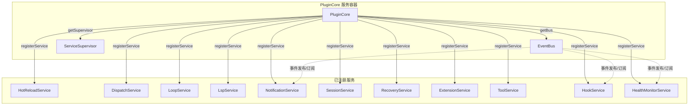
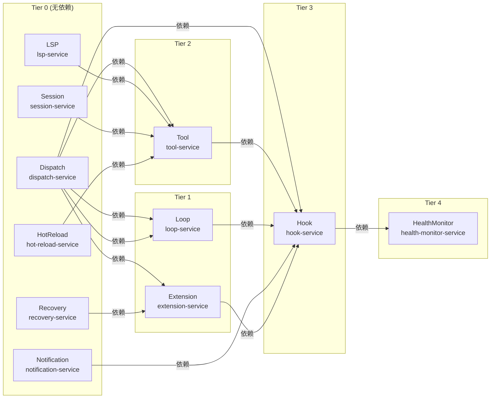
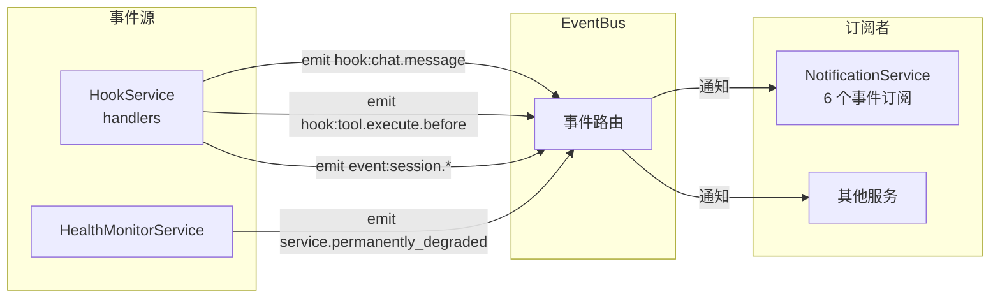

# 服务架构

> **相关文档：** [架构概览](/01-Overview/architecture-overview) — 模块地图与入口文件总览 | [处理管道](/01-Overview/processing-pipeline) — 请求处理流程与阶段分解 | [插件接口](/03-Reference/plugin-interface) — PluginCore 生命周期与平台适配

## PluginCore + 11 服务

rolebox 采用微内核架构：`PluginCore` 作为服务容器，管理 11 个服务（PluginService）的完整生命周期。



## 服务依赖关系

服务按拓扑排序初始化（`src/core/plugin-core.ts:187-219`），`dependencies` 数组声明依赖：



> **行引用**: `src/core/services/hook-service.ts:35-48` — HookService 依赖 6 个下游服务  
> `src/core/services/loop-service.ts:35-38` — LoopService 依赖 DispatchService  
> `src/core/services/extension-service.ts:17-19` — ExtensionService 依赖 dispatch + recovery  
> `src/core/services/tool-service.ts:28-31` — ToolService 依赖 4 个服务

## 每个服务的职责与生命周期

### PluginService 接口

**`src/core/service.ts:14-31`** — 所有服务实现此接口：

```typescript
interface PluginService {
  name: string;            // 唯一服务名，如 "dispatch-service"
  dependencies: string[];  // 依赖的服务名列表
  critical?: boolean;      // 关键服务失败 → 插件初始化失败
  init(ctx: PluginContext): Promise<void>;   // 初始化
  dispose(): Promise<void>;                  // 清理
  health?(): ServiceHealth;                  // 可选健康检查
}
```

### 服务列表

| # | 服务名 | `critical` | 依赖 | 职责 |
|---|--------|-----------|------|------|
| 1 | `hot-reload-service` | ❌ | 无 | 文件监视、增量/全量重加载、变更分类（fast/medium/full） |
| 2 | `dispatch-service` | ✅ | 无 | `DispatchManager`、子代理谱系、持久化、GC |
| 3 | `loop-service` | ✅ | dispatch | `LoopCoordinator`、循环状态恢复、回环协调 |
| 4 | `lsp-service` | ❌ | 无 | LSP 客户端管理器、服务器生命周期、诊断/补全工具 |
| 5 | `notification-service` | ❌ | 无 | 多通道通知（邮件/Slack/Webhook）、调度、节流 |
| 6 | `session-service` | ❌ | 无 | 会话 CRUD、搜索、导出、分析工具 |
| 7 | `recovery-service` | ✅ | 无 | `RecoveryEngine`、内置 Hook 注册、启动状态检查 |
| 8 | `extension-service` | ❌ | dispatch, recovery | 扩展加载、策略/模式桥接、并发策略热替换 |
| 9 | `tool-service` | ❌ | dispatch, lsp, session, hot-reload | 30+ 工具组装、模式注册 |
| 10 | `hook-service` | ❌ | dispatch, loop, notification, recovery, extension, tool | 事件/消息/系统变换/工具 Hook 构建 |
| 11 | `health-monitor-service` | ❌ | hook | 周期性健康检查、`ServiceSupervisor` 重启调度 |

### 生命周期方法

每个服务经历 `init()` → `dispose()` 两个阶段。`PluginCore` 以 **拓扑排序**（`src/core/plugin-core.ts:187-219`）顺序初始化，以**逆序**清理：

```
// 初始化顺序（topoSort 结果）
Tier 0: hot-reload → dispatch → lsp → notification → session → recovery
Tier 1: loop → extension
Tier 2: tool
Tier 3: hook
Tier 4: health-monitor

// 清理顺序（topoSort 逆序）
health-monitor → hook → tool → extension → loop → recovery → session → notification → lsp → dispatch → hot-reload
```

### 服务降级机制

非关键服务（`critical: false`/undefined）的 `init()` 失败会被捕获，服务标记为 `permanently_degraded`，其依赖者被跳过：

::: tip 关键服务 vs 非关键服务
标有 `critical: true` 的服务（dispatch-service、loop-service、recovery-service）是系统的核心支柱——它们初始化失败会导致整个插件启动失败。非关键服务初始化失败则仅标记降级，不影响其余服务启动。这种设计确保即使某些可选模块（如 LSP、通知）出现问题，核心调度功能仍然可用。
:::

```typescript
// src/core/plugin-core.ts:79-106
if (degradedDeps.length > 0) {
  this.degraded.add(svc.name);  // 跳过因依赖降级
  continue;
}
try { await svc.init(ctx); } catch (err) {
  if (svc.critical) throw err;    // 关键服务 → 致命
  this.degraded.add(svc.name);    // 非关键 → 标记降级
}
```

> **行引用**: `src/core/plugin-core.ts:79-106` — 服务降级逻辑

---

## 事件总线模式

**`src/core/event-bus.ts:14-56`** — `EventBus` 实现轻量级发布/订阅模式：



### 事件类型

| 事件 | 发射源 | 订阅者 | 用途 |
|------|--------|--------|------|
| `hook:chat.message` | `src/hooks/chat-message.ts:213` | NotificationService | 触发消息通知 |
| `hook:tool.execute.before` | `src/hooks/tool-before.ts:149-162` | NotificationService | 触发工具调用通知 |
| `event:session.idle` | `src/hooks/event-handler.ts` | NotificationService | 空闲会话通知调度 |
| `event:session.error` | event-handler | NotificationService | 错误通知 |
| `event:session.deleted` | event-handler | NotificationService | 清理通知跟踪 |
| `event:message.updated` | event-handler | NotificationService | 更新通知 |
| `service.permanently_degraded` | HealthMonitorService | 其他服务 | 服务永久降级广播 |

**`src/core/services/notification-service.ts:59-96`** 展示了事件订阅模式：

```typescript
this.unsubs.push(
  this.bus.on("hook:chat.message", (payload) => {
    mgr.handleChatMessage(payload.sessionID, payload.agent);
  }),
);
// ... 共 6 个订阅
```

---

## 组合根

**`src/core/composition.ts:50-103`** — `createPluginHooks` 是系统的组合根：

1. **初始化角色元数据**（第 55-62 行）：填充 `auto_activate` 和 `locked` 映射
2. **创建 PluginCore**（第 64 行）：`new PluginCore()` 
3. **注册 11 个服务**（第 65-75 行）：
   ```typescript
   core.registerService(new HotReloadService());
   core.registerService(new DispatchService());
   core.registerService(new LoopService());
   core.registerService(new LspService());
   core.registerService(new NotificationService());
   core.registerService(new SessionService());
   core.registerService(new RecoveryService());
   core.registerService(new ExtensionService());
   core.registerService(new ToolService());
   core.registerService(new HookService());
   core.registerService(new HealthMonitorService());
   ```
4. **初始化所有服务**（第 77 行）：`core.init(ctx)` — 拓扑排序调用各服务的 `init()`
5. **注册关闭处理**（第 80-94 行）：SIGINT/SIGTERM/exit 时的冲洗和清理
6. **返回处理器**（第 102 行）：`HookService.getHandlers()` → opencode 需要的 handler 对象

## 服务间协作示例：dispatch → loop → recovery

```mermaid
sequenceDiagram
    participant Hook as HookService
    participant Dispatch as DispatchService
    participant Loop as LoopService
    participant Recovery as RecoveryService
    participant Sub as 子代理

    Hook->>Hook: 解析 |loop:N| 函数
    Hook->>Loop: register(loop 任务)
    Loop->>Dispatch: dispatch(子代理)
    Dispatch->>Sub: 启动子代理会话
    Sub-->>Dispatch: 返回结果
    Dispatch-->>Loop: 通知完成
    Loop-->>Hook: 注入校正（启动下一轮）

    Note over Dispatch,Recovery: 发生错误时
    Dispatch->>Recovery: recover(sessionID, error)
    Recovery->>Recovery: 匹配错误模式 → 选择策略链
    Recovery->>Recovery: chainExecutor.execute()
    Recovery-->>Dispatch: 恢复结果 (recovered/aborted/exhausted)
```

> **行引用**: `src/core/composition.ts:64-75` — 全部 11 个服务注册  
> `src/core/event-bus.ts:36-46` — 事件发射核心实现  
> `src/core/services/notification-service.ts:59-96` — 事件总线订阅模式  
> `src/core/plugin-core.ts:63-107` — 拓扑排序初始化与降级逻辑  
> `src/core/service.ts:14-31` — PluginService 接口定义

## 下一步

- [插件接口](/03-Reference/plugin-interface) — PluginCore 完整生命周期与服务注册
- [架构概览](/01-Overview/architecture-overview) — 模块地图与入口文件总览
- [处理管道](/01-Overview/processing-pipeline) — 请求处理流程与阶段分解
