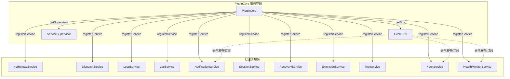
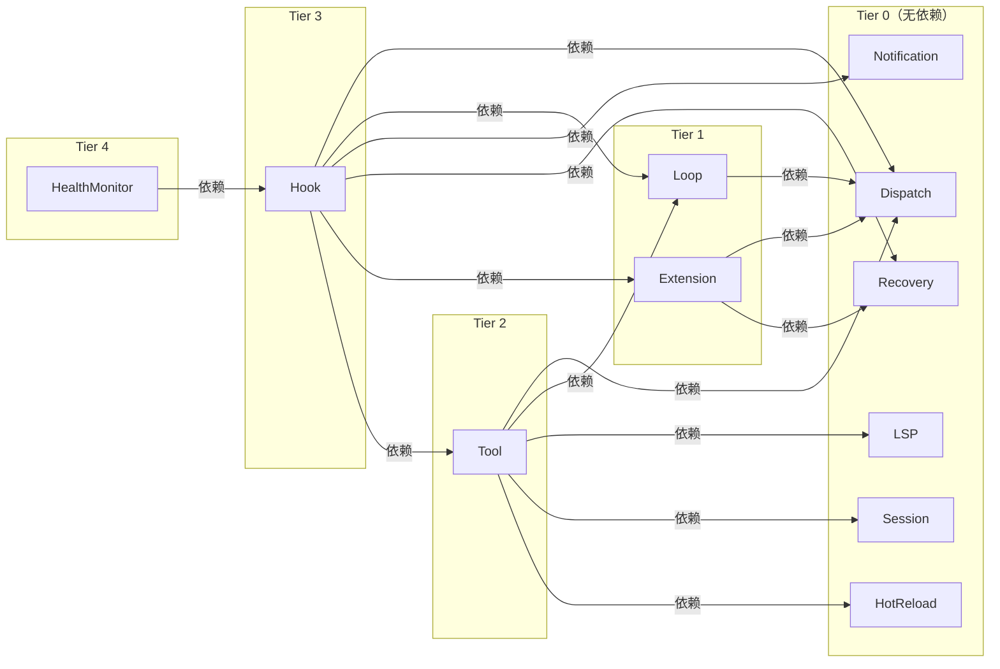
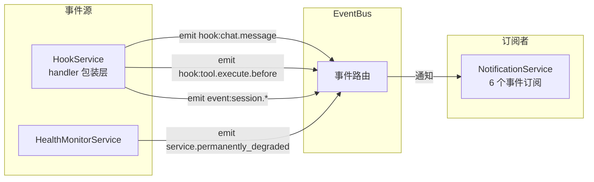
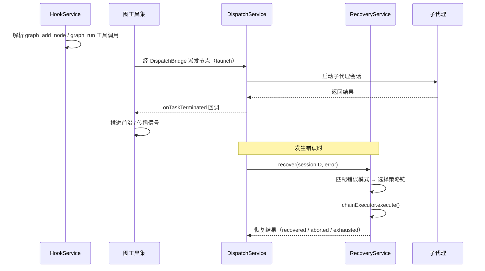

# 服务架构（Service Architecture）

本页只讲**服务装配层**：`PluginCore` 如何注册、排序、初始化、降级与重启 11 个服务，服务之间如何通过事件总线通信，以及组合根把它们拼成当前 harness 需要的处理器。模块全景与源码目录见[架构概览](/01-Overview/architecture-overview)；一条消息如何穿过这些服务见[处理管道](/01-Overview/processing-pipeline)。

> 相关：[架构概览](/01-Overview/architecture-overview)｜[处理管道](/01-Overview/processing-pipeline)｜[插件接口](/03-Reference/plugin-interface)

## PluginCore 与 11 个服务

rolebox 采用微内核架构：`PluginCore` 是插件核心容器，持有服务注册表、事件总线（`EventBus`）与受监督重启器（`ServiceSupervisor`），并管理 11 个服务（`PluginService`）的完整生命周期。


```mermaid
graph TB
    subgraph Core[PluginCore 服务容器]
        PC[PluginCore]
        EB[EventBus]
        SSV[ServiceSupervisor]
    end

    subgraph Services[已注册服务]
        HR[HotReloadService]
        DS[DispatchService]
        LS[LoopService]
        LSP[LspService]
        NS[NotificationService]
        SSVC[SessionService]
        RS[RecoveryService]
        ES[ExtensionService]
        TS[ToolService]
        HS[HookService]
        HMS[HealthMonitorService]
    end

    PC -->|registerService| HR
    PC -->|registerService| DS
    PC -->|registerService| LS
    PC -->|registerService| LSP
    PC -->|registerService| NS
    PC -->|registerService| SSVC
    PC -->|registerService| RS
    PC -->|registerService| ES
    PC -->|registerService| TS
    PC -->|registerService| HS
    PC -->|registerService| HMS

    PC -->|getBus| EB
    PC -->|getSupervisor| SSV

    EB -.->|事件发布/订阅| HS
    EB -.->|事件发布/订阅| NS
    EB -.->|事件发布/订阅| HMS
```

服务通过 `src/core/service.ts` 的 `PluginService` 接口参与生命周期：

```typescript
interface PluginService {
  name: string;            // 唯一服务名，如 "dispatch-service"
  dependencies: string[];  // 依赖的服务名列表
  critical?: boolean;      // 关键服务失败 → 插件初始化失败
  init(ctx: PluginContext): Promise<void>;
  dispose(): Promise<void>;
  health?(): ServiceHealth;
}
```

## 服务依赖关系

服务按**拓扑排序**（按依赖关系排定初始化顺序：先初始化被依赖的服务）初始化。排序由 `PluginCore.topoSort()` 的深度优先遍历给出，循环依赖会抛出 `DescriptiveCycleError`；`init()` 按该顺序逐个调用 `svc.init(ctx)`。依赖由每个服务自己的 `dependencies` 数组声明：


```mermaid
graph LR
    subgraph Tier0["Tier 0（无依赖）"]
        HR[HotReload]
        DS[Dispatch]
        LSP[LSP]
        NS[Notification]
        SSVC[Session]
        RS[Recovery]
    end

    subgraph Tier1["Tier 1"]
        LS[Loop]
        ES[Extension]
    end

    subgraph Tier2["Tier 2"]
        TS[Tool]
    end

    subgraph Tier3["Tier 3"]
        HS[Hook]
    end

    subgraph Tier4["Tier 4"]
        HMS[HealthMonitor]
    end

    LS -->|依赖| DS
    ES -->|依赖| DS
    ES -->|依赖| RS
    TS -->|依赖| DS
    TS -->|依赖| LS
    TS -->|依赖| LSP
    TS -->|依赖| SSVC
    TS -->|依赖| HR
    HS -->|依赖| DS
    HS -->|依赖| LS
    HS -->|依赖| NS
    HS -->|依赖| RS
    HS -->|依赖| ES
    HS -->|依赖| TS
    HMS -->|依赖| HS
```

Tier 是依赖深度，不是调用顺序。`topoSort()` 实际产出的顺序由**注册顺序 + 依赖优先**共同决定，注册顺序即组合根里的注册次序：

```text
hot-reload → dispatch → loop → lsp → notification → session → recovery
  → extension → tool → hook → health-monitor
```

清理顺序是该序列的**逆序**（`dispose()` 内部对拓扑排序结果取反）：

```text
health-monitor → hook → tool → extension → recovery → session → notification
  → lsp → loop → dispatch → hot-reload
```

## 每个服务的职责与生命周期

| # | 服务名 | `critical` | 依赖 | 职责 |
|---|--------|-----------|------|------|
| 1 | `hot-reload-service` | 否 | 无 | 监视角色目录，按变更分类走快速（单角色重解析）或全量（重新发现 + 重解析）重加载 |
| 2 | `dispatch-service` | 是 | 无 | `DispatchManager`、子代理谱系、任务持久化与状态垃圾回收 |
| 3 | `loop-service` | 是 | dispatch | `LoopCoordinator`、循环状态恢复与回环协调 |
| 4 | `lsp-service` | 否 | 无 | LSP（语言服务器协议，Language Server Protocol）客户端管理器、服务器生命周期、诊断与补全等工具 |
| 5 | `notification-service` | 否 | 无 | 多通道通知（系统提示、声音、自定义命令、Webhook、文件、日志六类内置通道，并可注册自定义通道工厂）、调度与节流 |
| 6 | `session-service` | 否 | 无 | 6 个会话工具：`session_list`、`session_read`、`session_search`、`session_info`、`session_diff`、`session_fork` |
| 7 | `recovery-service` | 是 | 无 | `RecoveryEngine`、内置恢复 Hook 注册与启动状态检查 |
| 8 | `extension-service` | 否 | dispatch、recovery | 扩展点加载，把自定义恢复策略与错误模式桥接进恢复引擎 |
| 9 | `tool-service` | 否 | dispatch、loop、lsp、session、hot-reload | 工具装配与 schema 注册，决定模型能看到哪些工具 |
| 10 | `hook-service` | 否 | dispatch、loop、notification、recovery、extension、tool | 事件、消息、系统提示与工具 Hook 的构建，返回 harness 需要的处理器 |
| 11 | `health-monitor-service` | 否 | hook | 周期性健康检查（默认 30 秒一次），触发受监督重启 |

每个服务只经历 `init()` 与 `dispose()` 两个阶段；初始化是拓扑序，清理是逆序。除了全量 `dispose()`，`PluginCore.restartService(name)` 支持**单服务重启**：它沿反向依赖图做 BFS 找出目标服务及其全部传递依赖者，再按拓扑序先 `dispose()` 后 `init()`。

### 服务降级机制

降级指服务初始化失败时，仅标记该服务不可用并跳过其依赖者，而不是让整个插件崩溃。非关键服务（`critical: false` 或未声明）的 `init()` 失败会被捕获，服务标记为降级，其依赖者被跳过：

```typescript
// PluginCore.init() 节选
for (const svc of ordered) {
  const degradedDeps = svc.dependencies.filter(d => this.degraded.has(d));
  if (degradedDeps.length > 0) {
    this.degraded.add(svc.name);   // 依赖已降级 → 跳过
    continue;
  }
  try { await svc.init(this.ctx); } catch (err) {
    if (svc.critical) throw err;    // 关键服务 → 致命
    this.degraded.add(svc.name);    // 非关键 → 标记降级
  }
}
```

标有 `critical: true` 的服务是 dispatch-service、loop-service、recovery-service：它们初始化失败会导致整个插件启动失败。非关键服务失败只影响自身与其依赖者——LSP 或通知出问题时，核心调度仍然可用。

除了初始化期的一次性判定，运行时还有一层兜底：`HealthMonitorService` 周期性检查各服务的 `health()`，对不健康者调用 `ServiceSupervisor.tryRestart()`。监督器带滑动窗口预算（默认 60 秒内最多 3 次）、指数退避（1 秒起步、翻倍、上限 30 秒），预算耗尽后把服务标记为 `permanently_degraded` 并广播 `service.permanently_degraded` 事件。监督器自身的任何异常都不会向外传播。

## 事件总线

`src/core/event-bus.ts` 提供进程内发布/订阅：`on()` 返回退订函数，`emit()` 顺序执行处理器并吞掉异常（处理器失败只记日志，不影响其他订阅者），`clear()` 可按事件或整体清空。


```mermaid
flowchart LR
    subgraph Emitters[事件源]
        HSVC[HookService<br/>handler 包装层]
        HMSVC[HealthMonitorService]
    end

    subgraph Bus[EventBus]
        EV[事件路由]
    end

    subgraph Subscribers[订阅者]
        NSVC[NotificationService<br/>6 个事件订阅]
    end

    HSVC -->|emit hook:chat.message| EV
    HSVC -->|emit hook:tool.execute.before| EV
    HSVC -->|emit event:session.*| EV
    HMSVC -->|emit service.permanently_degraded| EV
    EV -->|通知| NSVC
```

| 事件 | 发射源 | 订阅者 | 用途 |
|------|--------|--------|------|
| `hook:chat.message` | hook-service 的 handler 包装层 | NotificationService | 触发消息通知 |
| `hook:tool.execute.before` | 同上 | NotificationService | 触发工具调用通知 |
| `event:session.idle` | 同上（事件类型取自规范化后的 harness 事件） | NotificationService | 空闲会话通知调度 |
| `event:session.error` | 同上 | NotificationService | 错误通知 |
| `event:session.deleted` | 同上 | NotificationService | 清理通知跟踪 |
| `event:message.updated` | 同上 | NotificationService | 更新通知 |
| `service.permanently_degraded` | HealthMonitorService | 由部署方或扩展订阅 | 服务永久降级广播 |

NotificationService 的订阅写法是总线用法的样板——每个订阅都把退订函数收进数组，`dispose()` 时统一退订：

```typescript
this.unsubs.push(
  this.bus.on("hook:chat.message", (payload) => {
    mgr.handleChatMessage(payload.sessionID, payload.agent);
  }),
);
// 其余订阅同形：hook:tool.execute.before / event:session.idle /
// event:session.error / event:session.deleted / event:message.updated
```

事件统一在 hook-service 的 handler 包装层发射，而**不是**在 `src/hooks/` 的实现文件里——后者是纯函数，收发状态都通过 `HookState` / `HookDeps` 显式传递。

## 组合根

`src/core/composition.ts` 的 `createPluginHooks()` 是系统的组合根，按固定次序完成装配：

1. **写入角色元数据** — 把每个角色的 `auto_activate` 与 `locked` 收进 hook 状态表。
2. **创建容器** — `new PluginCore()`。
3. **注册 11 个服务** — 依次注册 HotReload、Dispatch、Loop、Lsp、Notification、Session、Recovery、Extension、Tool、Hook、HealthMonitor。
4. **初始化** — `core.init(ctx)`：先跑启动一致性检查，再拓扑排序调用各服务的 `init()`。
5. **注册关闭处理** — 在 `exit` / `SIGINT` / `SIGTERM` 上冲刷循环状态、派发持久化、函数运行时与信号账本，然后异步清理服务。
6. **返回处理器** — `HookService.getHandlers()` 给出当前 harness 需要的 handler 对象。

第 6 步有明确的兜底：hook-service 未注册、或其 handler 装配被跳过（依赖链降级）时，组合根返回一组 no-op handlers 而不是 `undefined`。宿主可以继续运行，真正的诊断在错误日志里；把整个插件（以及宿主进程）拖垮不是可接受的失败方式。

## 协作示例：图节点 → dispatch → recovery

一次带图的子代理派发串起了三个服务：


```mermaid
sequenceDiagram
    participant Hook as HookService
    participant Graph as 图工具集
    participant Dispatch as DispatchService
    participant Recovery as RecoveryService
    participant Sub as 子代理

    Hook->>Hook: 解析 graph_add_node / graph_run 工具调用
    Graph->>Dispatch: 经 DispatchBridge 派发节点（launch）
    Dispatch->>Sub: 启动子代理会话
    Sub-->>Dispatch: 返回结果
    Dispatch-->>Graph: onTaskTerminated 回调
    Graph->>Graph: 推进前沿 / 传播信号

    Note over Dispatch,Recovery: 发生错误时
    Dispatch->>Recovery: recover(sessionID, error)
    Recovery->>Recovery: 匹配错误模式 → 选择策略链
    Recovery->>Recovery: chainExecutor.execute()
    Recovery-->>Dispatch: 恢复结果（recovered / aborted / exhausted）
```

图中只经过 `DispatchBridge` 这一层只读接缝：图引擎调用 `launch` / `onTaskTerminated` / `getTask` / `cancelTask` 等公开方法，不触碰 `DispatchManager` 内部。循环能力同样留在容器内：`loop-service` 承担内部循环与持久化，而模型可见的循环语义由 `graph_add_loop`（带 `max_traversals` 硬上限）表达。

## 相关页面

- [架构概览](/01-Overview/architecture-overview) — 模块地图、依赖方向与源码目录
- [处理管道](/01-Overview/processing-pipeline) — 一条消息经过的七个阶段与可拦截点
- [插件接口](/03-Reference/plugin-interface) — `PluginCore` 生命周期与平台适配
- [图执行引擎](/04-Advanced/graph-engine) — 图模型与节点生命周期
- [恢复系统](/03-Reference/recovery-system) — 错误模式、策略链与恢复配置
