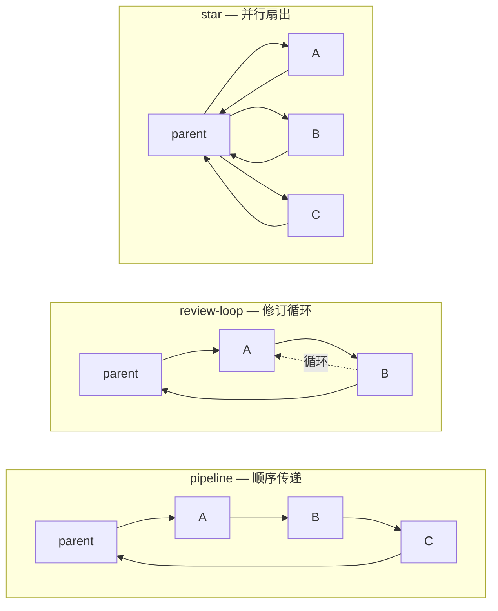

# 协作图

> **相关文档：** [子代理](/02-Guide/subagents) — 子代理声明与配置 | [终止条件](/04-Advanced/termination-conditions) — 高级循环终止模式 | [扩展机制](/03-Reference/extensions) — 自定义拓扑与终止条件注册

默认情况下，父角色自行决定向谁派发任务以及何时派发。协作图（Collaboration Graph）为其添加结构：你定义工作流（谁向谁传递工作），rolebox 自动处理路由。

可以把它想象成代理的流程图。

## 快速开始

在 role.yaml 中添加 `collaboration:` 块。最简单的方式是选择一个内置拓扑：

```yaml
name: Review Team Lead
description: Coordinates code review workflow
prompt: |
  You are a team lead coordinating a code review workflow.
  Follow the collaboration graph to dispatch work.
subagents:
  - name: Coder
    description: Implements code changes
    prompt: You are a senior developer. Write clean, testable code.
  - name: Reviewer
    description: Reviews code for quality
    prompt: You review code for correctness, style, and edge cases.
collaboration:
  topology: review-loop
  agents: [coder, reviewer]
  max_iterations: 3
```

就这样。父代理先派发给 Coder，Coder 的输出传给 Reviewer，Reviewer 可以将工作循环回 Coder 进行修改，也可以结束工作流。最多 3 轮循环后，工作流自动结束。

## 内置拓扑

三种开箱即用的模式：

| 拓扑 | 数据流 | 适用场景 |
|---|---|---|
| `pipeline` | parent → A → B → C → parent | 顺序传递。每个代理在前一个的输出基础上构建。 |
| `review-loop` | parent → A → B → A（循环）→ parent | 修订循环。最后一个代理可以将工作发回再处理一轮。 |
| `star` | parent → A, parent → B, parent → C（并行） | 扇出。每个代理独立工作并独立回报。 |

```yaml
# pipeline：A → B → C，结束。
collaboration:
  topology: pipeline
  agents: [researcher, writer, editor]

# review-loop：writer ↔ editor，最多 5 轮。
collaboration:
  topology: review-loop
  agents: [writer, editor]
  max_iterations: 5

# star：所有代理并行工作。
collaboration:
  topology: star
  agents: [frontend, backend, devops]
```

### 拓扑可视化

三种内置拓扑的结构对比——节点代表代理，箭头代表数据流向：



::: tip 拓扑选择速查
- 有明确的串行步骤 → **pipeline**
- 需要审查-修改循环 → **review-loop**
- 任务彼此独立 → **star**
- 超过 80% 的场景这三种内置拓扑就能覆盖
:::

## 如何选择拓扑

选择合适的拓扑取决于团队规模、审批要求、并行化需求和容错策略。以下决策矩阵帮助你在不同场景下做出选择：

### 决策矩阵

| 条件 / 场景 | pipeline | review-loop | star | 自定义流 |
|---|---|---|---|---|
| **团队规模（代理数）** | 2-5 个，串行依赖 | 2-4 个，含审查者 | 2-10 个，无依赖 | 任意，需要非标路由 |
| **代理间是否有依赖？** | 是，每个依赖前一个 | 是，但最后一步可循环 | 否，完全独立 | 部分依赖 |
| **需要审批/修改循环？** | 不需要 | 是，核心场景 | 不需要 | 可能需要 |
| **并行化需求** | 低（串行执行） | 低（串行 + 循环） | 高（完全并行） | 视配置而定 |
| **终止条件复杂度** | 简单（到末尾结束） | 中等（循环停止条件） | 简单（全部回报即结束） | 复杂（需手动配置） |
| **配置复杂度** | 极低（一行拓扑名） | 低（拓扑名 + max_iterations） | 极低（一行拓扑名） | 高（需手动定义所有边） |
| **典型场景** | ETL 管道、文档流水线 | 代码审查、设计审批 | 并行研究、多源数据采集 | 条件分支、非对称路由 |

### 选择流程

1. **首选内置拓扑** — 80% 以上的场景可以用 pipeline、review-loop 或 star 覆盖。从最简单的拓扑开始，避免过度设计。
2. **按需添加混合模式** — 当内置拓扑无法满足需求时，在拓扑基础上添加少量自定义边来补充（如 pipeline + reviewer 回退边）。
3. **自定义流作为最后手段** — 仅当内置拓扑 + 混合模式仍无法满足非标路由时，才使用完整的自定义 `flow`。
4. **超过 6 条边时拆分** — 如果自定义边超过 6 条，考虑将工作流拆分为多个协作图，每个图聚焦一个阶段。复杂的图往往意味着边界不清。

### 检查清单

选择拓扑前，回答以下问题：

- [ ] 代理之间是否有严格的执行顺序依赖？
- [ ] 是否需要多轮审查/修订循环？
- [ ] 所有代理可以完全并行工作吗？
- [ ] 工作流包含条件分支或非对称路由吗？
- [ ] 预计自定义边会超过 6 条吗？

根据答案对照决策矩阵，选择最匹配的拓扑。

::: tip 内置拓扑定义
三种拓扑定义于 `src/graph/templates.ts:51-81`，通过 `expandTemplate`（第 24-49 行）根据拓扑类型生成对应的 FlowEdge 数组：

| 拓扑 | 数据流 | 适用场景 |
|---|---|---|
| `pipeline` | parent → A → B → C → parent | 顺序传递。每个代理在前一个的输出基础上构建。 |
| `review-loop` | parent → A → B → A（循环）→ parent | 修订循环。最后一个代理可以将工作发回再处理一轮。 |
| `star` | parent → A, parent → B, parent → C（并行） | 扇出。每个代理独立工作并独立回报。 |
:::

## 真实工作流示例

以下三个示例展示协作图在实际工作流中的应用，均基于真实角色设计。

### 示例 1：代码审查流水线（planner → implementer → reviewer）

这是 Emperor 编排器模式的简化版本（完整实现在 `rolebox/README.md:229-255`）。Emperor 使用 3 阶段规划器（规划 → 审阅 → 定稿）配合多部门并行执行：

```yaml
name: Emperor
description: AI engineering lead orchestrator
prompt: |
  You are an AI engineering lead. Follow the collaboration graph to
  plan, delegate, and validate work across specialist sub-agents.
  You NEVER write code — you read, route, and summarize.
subagents:
  - name: chancellor
    description: Strategic planner
    prompt: You are a technical strategist. Analyze requirements and produce plans.
  - name: jinyiwei
    description: Domain router and executor
    prompt: You are a domain router. Execute plans by delegating to specialists.
  - name: validator
    description: Validation stage
    prompt: You validate execution reports against the strategy. Emit pass/revise.
collaboration:
  topology: review-loop
  agents: [chancellor, jinyiwei, validator]
  max_iterations: 2
  termination:
    any_of:
      - { max_iterations: 2 }
      - result_matches:
          agent: validator
          contains: "PASS"
```

工作流：Emperor → chancellor 制定策略 → jinyiwei 执行并派发 → validator 验证结果。验证未通过时循环回 chancellor 进行修订。最多 2 轮修订后自动结束。当 validator 输出包含 "PASS" 时提前终止。

### 示例 2：先研究后实现（researcher → implementer，star 拓扑）

研究阶段和实现阶段是独立的并行工作，但研究必须先于实现启动。此模式使用两个协作图分阶段编排：

```yaml
name: ResearchThenImplement
description: Independent research across domains, followed by implementation
prompt: |
  You coordinate a research-then-implementation workflow.
  First dispatch research in parallel, then dispatch implementation
  using research findings.
subagents:
  - name: domain-researcher
    description: Domain-specific deep research
    prompt: You research a specific domain and produce findings.
  - name: user-researcher
    description: User research specialist
    prompt: You conduct user research and gather requirements.
  - name: tech-researcher
    description: Technology feasibility researcher
    prompt: You evaluate technology feasibility and constraints.
  - name: implementer
    description: Implementation specialist
    prompt: You implement solutions based on research findings.
collaboration:
  topology: star
  agents: [domain-researcher, user-researcher, tech-researcher]
```

编排器先启动研究阶段的 star 拓扑，等待三个研究代理全部完成并回报到 `parent`。然后编排器综合研究成果，再派发给 `implementer` 进行实现。此模式的关键在于编排器本身负责阶段切换——协作图只负责单阶段的并行扇出。

### 示例 3：多阶段审批流（drafter → reviewer → finalizer）

适用于需要多层审批的正式流程，如技术设计文档的撰写与批准：

```yaml
name: DocPipeline
description: Multi-stage document drafting, review, and approval
prompt: |
  You manage a document workflow. Follow the pipeline: draft -> review -> finalize.
  If the reviewer rejects, the document goes back for revision.
subagents:
  - name: drafter
    description: Creates initial document draft
    prompt: You write technical documents. Be thorough and precise.
  - name: reviewer
    description: Reviews and approves/rejects documents
    prompt: You review documents for accuracy, completeness, and clarity.
  - name: finalizer
    description: Final approval and publication
    prompt: You do final formatting check and approve for publication.
collaboration:
  topology: pipeline
  agents: [drafter, reviewer, finalizer]
  flow:
    - "reviewer -> drafter: needs revision"
  max_iterations: 3
  termination:
    any_of:
      - { max_iterations: 3 }
      - result_matches:
          agent: finalizer
          contains: "PUBLISHED"
```

工作流：drafter 撰写初稿 -> reviewer 审查，如需修改则退回 drafter 形成修订循环 -> finalizer 做最终格式检查并输出 "PUBLISHED" 后工作流结束。

::: tip 模式演变
以上示例展示了从简单到复杂的常见模式。大多数场景都可以从三个基础模式中选择：纯串行用 pipeline、带审查循环用 review-loop、并行独立工作用 star。如[拓扑选择指南](#如何选择拓扑)所述，先从简单拓扑开始，按需渐进增强。
:::

## 自定义流

需要更多控制？显式定义边：

```yaml
collaboration:
  flow:
    - "parent -> researcher"
    - "researcher -> writer: research findings"
    - "writer -> editor: draft content"
    - from: editor
      to: writer
      label: revision requests
    - from: editor
      to: parent
      label: approved
      exit: true
  max_iterations: 2
```

两种边语法（可自由混合）：

- **字符串形式**：`"from -> to"` 或 `"from -> to: label"`
- **对象形式**：`{ from: ..., to: ..., label: ..., exit: true }`

特殊规则：

- `parent` 是保留名称 — 指编排器（你的主角色）
- 指向 `parent` 或标记 `exit: true` 的边用于终止工作流
- `max_iterations` 防止循环图中的无限循环（检测到环时默认为 3）

## 混合模式：拓扑 + 自定义边

从模板开始，然后覆盖或添加边：

```yaml
collaboration:
  topology: pipeline
  agents: [coder, reviewer]
  flow:
    - "reviewer -> coder: needs revision"   # 在 pipeline 之上添加一条回边
  max_iterations: 3
```

自定义 `flow` 边与模板合并。如果自定义边与模板边具有相同的 `from → to`，则以自定义边为准。

::: tip 何时选择自定义流
内置拓扑（pipeline / review-loop / star）能满足大多数场景。自定义流仅在你需要非标工作流——如分支、条件跳转、或非对称代理路由时使用。如果发现自定义边数量超过 6 条，可以考虑将工作流拆分为多个协作图阶段。
:::

## 运行时行为

你无需手动管理工作流。rolebox 会自动处理：

1. 聊天开始时，图状态初始化（步骤 0，状态：活跃）
2. 编排器的系统提示会收到一个 `<collaboration_graph>` 块，描述工作流；以及一个 `<collaboration_state>` 块，显示当前进度
3. 每个子代理的提示会收到一个 `<collaboration_role>` 块，说明它的位置（例如，"你从 Coder 接收工作，你的输出传给 Editor。"）
4. 每次通过 `dispatch` 派发到子代理时，状态推进到下一步
5. 当到达退出边或超过最大迭代次数时，工作流完成

编排器 LLM 在每个轮次都能看到状态，因此它知道下一个该调用哪个代理，而无需在提示词中硬编码派发逻辑。

## 没有图？没问题

`collaboration:` 字段是可选的。有子代理但没有图的角色仍然完全按以前的方式工作 — 父代理通过 `dispatch` 自由决定派发顺序。

## 循环终止

默认情况下，循环在达到 `max_iterations` 时停止。`termination:` 块提供更精细的控制：当审查者批准、输出不再变化、超时触发或任意组合时停止。

```yaml
collaboration:
  topology: review-loop
  agents: [coder, reviewer]
  max_iterations: 5
  termination:
    any_of:
      - { max_iterations: 5 }
      - { converged: "reviewer confirms code quality is satisfactory" }
```

### 条件类型

提供五种条件类型：

```yaml
# 在 N 次循环迭代后停止
- { max_iterations: 5 }

# 距离第一次循环迭代 N 毫秒后停止
- { timeout_ms: 120000 }

# LLM 法官评估自然语言收敛标准
- { converged: "reviewer confirms code quality is satisfactory" }

# 当特定代理的输出匹配模式时停止
- result_matches:
    agent: reviewer
    contains: "APPROVED"      # 子串匹配
    # regex: "LGTM|APPROVED"  # 或正则匹配
    # score_gte: 8            # 或数值分数阈值
    # no_changes: true        # 或输出哈希与上一轮相同

# 当同一代理连续 N 次产生相同输出时停止
- { stuck: { repeats: 2 } }
```

### 组合条件

条件通过 `any_of`（第一个条件胜出）或 `all_of`（所有条件必须满足）组合：

```yaml
# 哪个先触发就停止
termination:
  any_of:
    - { max_iterations: 10 }
    - { stuck: { repeats: 2 } }

# 只有两个都为真时才停止
termination:
  all_of:
    - { max_iterations: 2 }
    - result_matches:
        agent: reviewer
        contains: "APPROVED"
```

你可以在同一个配置中同时使用 `any_of` 和 `all_of`。每个组独立评估，然后结果通过 AND 逻辑合并。

### 终止原因

当工作流结束时，状态中包含结构化的 `terminationReason`，让编排器知道为什么停止：

| 原因 | 触发条件 |
|---|---|
| `max_iterations` | 循环次数达到上限 |
| `timeout` | 墙上时钟超过 `timeout_ms` |
| `stuck` | 代理输出重复了 N 次 |
| `converged` | LLM 法官确认收敛 |
| `result_match` | 代理输出匹配 `result_matches` 条件 |
| `error` | 评估期间出现不可恢复的错误 |

编排器的系统提示显示原因，以便它能合成适当的最终响应。

### 建议性执行

::: tip
终止是**建议性的**，而非强制停止。当条件触发时，编排器会收到引导信息，建议其收尾并综合结果。它不会强制拒绝工具调用或在轮次中途终止会话。建议在编排器提示词中明确处理终止后的收尾逻辑。
:::

### 优先级与注意事项

**每循环 vs 全局 `max_iterations`：** `collaboration:` 块上的根级 `max_iterations` 是全局安全上限。`termination.any_of` 或 `termination.all_of` 中的 `max_iterations` 是每循环组的上限。每循环上限触发其自己的终止原因；全局上限是最终兜底，无论终止配置如何都会生效。

::: warning `timeout_ms` 精确度说明
超时**仅在轮次之间检查**，而非轮次中途。如果一个长时间代理轮次在截止时间之前就已经开始，它将继续运行直到完成。因此，超时最多可能超出整整一个轮次的持续时间。对于时间敏感的工作流，建议同时设置 `max_iterations` 作为安全兜底。
:::

**旧版兼容：** 仅包含 `max_iterations`（无 `termination:` 块）的现有配置完全以原有方式工作，无需迁移。

## 常见协作图反模式

协作图是强大的工作流工具，但使用不当会引入不必要的复杂性。以下是三种最常见的反模式：

### 1. 过早自定义流（6+ 条边）

**症状：** 一开始就使用 `flow` 定义大量边（6 条以上），而不是从内置拓扑起步。

**问题：** 自定义边越多，工作流的可读性和可维护性越低。超过 6 条边时，图的拓扑结构已经难以一目了然。此外，自定义流绕过了内置拓扑的默认终止策略，你需要手动为每条退出边设置 `exit: true`。

**正确做法：** 始终从内置拓扑（`pipeline` / `review-loop` / `star`）开始。当发现内置拓扑无法满足需求时，再通过混合模式（拓扑 + 自定义边）渐进增强。如果混合模式仍然需要 6 条以上的边，考虑将工作流拆分为多个协作图，每个图聚焦一个阶段。

### 2. 用协作图取代 Emperor 编排器

**症状：** 在父角色中定义协作图，由父角色承担全局工作流编排职责，同时该父角色还处理其他业务逻辑。

**问题：** 协作图是为**单个工作流**设计的路由工具，不是全局编排器。将协作图掺杂在其他职责中会导致提示词膨胀、状态管理混乱。Emperor（或类似编排器角色）负责全局调度；协作图只在编排器内部定义具体的工作流。

**正确做法：** 保持职责分离。编排器角色负责"派发什么工作给谁"，协作图负责"工作按什么顺序流转"。如果需要全局编排，将编排器作为独立的父角色，在其 `collaboration` 块中定义拓扑。

### 3. 为处理步骤定义子代理

**症状：** 将工作流中的每个处理步骤都定义为独立的子代理（如 `parser` -> `validator` -> `transformer` -> `exporter`），而不是合并为有意义的领域角色。

**问题：** 创建大量子代理增加了角色加载时间、系统提示成本和调度开销。每个子代理都需要独立的 LLM 调用，步骤越多，端到端延迟和 token 消耗越高。将一个领域概念拆分为多个步骤代理，还会丢失领域语义——代理不知道该步骤在其领域上下文中的位置。

**正确做法：** 按**领域职责**而非**处理步骤**划分子代理。例如，用 `researcher`、`writer`、`editor`（三个领域角色）替代 `outline-writer` -> `content-drafter` -> `fact-checker` -> `proofreader`（四个步骤）。一个领域代理可以内部处理多个步骤，减少图的复杂度。

```yaml
# 反模式：按步骤定义
subagents: [parser, validator, transformer, exporter]
# 协作图需要 4 个节点 + 5 条边，复杂度高

# 正确：按领域定义
subagents: [data-engineer, reviewer]
# 协作图只需 2 个节点 + 3 条边，含义清晰
```

## 故障排查

协作图配置错误通常会在角色加载时被验证器捕获。以下是四种最常见的配置错误及其解决方法：

### 1. 引用了不存在的子代理

**症状：** 验证器报错 `Edge references unknown agent "xxx" in "from" field`。

**原因：** `flow` 或 `termination.any_of/all_of` 中引用的子代理名称未在 `subagents:` 块中声明。

**修复：** 确保所有边中引用的代理名称（`from` 和 `to`）与 `subagents:` 中定义的一致。注意大小写敏感。

```yaml
# 错误：agent 名称不匹配
subagents:
  - name: Code Reviewer
collaboration:
  flow:
    - "parent -> code-reviewer"   # 引用名称不同

# 正确：名称严格一致
subagents:
  - name: code-reviewer
collaboration:
  flow:
    - "parent -> code-reviewer"
```

验证逻辑实现于 `src/graph/validator.ts:51-76` — 所有边的 from/to 必须在可用代理集合或 `"parent"` 之中。

### 2. 缺少退出边导致死循环

**症状：** 验证器报错 `No exit edge found: graph has no termination path`。

**原因：** 在循环拓扑中未设置任何指向 `parent` 或标记 `exit: true` 的边，工作流无法正常结束。

**修复：** 使用内置拓扑时，退出边由模板自动生成。只有自定义 `flow` 时需要手动指定。确保至少有一条边满足 `to: parent` 或 `exit: true`。

```yaml
# 错误：无退出边
flow:
  - "parent -> researcher"
  - "researcher -> writer"

# 正确：至少有一条退出路径
flow:
  - "parent -> researcher"
  - "researcher -> writer"
  - "writer -> parent"
```

验证逻辑参见 `src/graph/validator.ts:81-91`。

### 3. 终止条件引用了不存在的代理

**症状：** 验证器报错 `termination result_matches references unknown agent "xxx"` 或 `termination converged references unknown agent "xxx"`。

**原因：** `termination.result_matches.agent` 或 `termination.converged` 中引用的代理名称未在子代理列表中。

**修复：** 确保终止条件中引用的代理名称与 `subagents:` 中的定义完全一致。

```yaml
# 错误
subagents:
  - name: reviewer
termination:
  any_of:
    - result_matches:
        agent: Reviewer      # 大小写不匹配

# 正确
termination:
  any_of:
    - result_matches:
        agent: reviewer
```

验证逻辑参见 `src/graph/validator.ts:186-218`。

### 4. 孤儿代理：定义了但未在图边中引用

**症状：** 验证器警告 `Orphan agent "xxx" is not referenced in any edge`。

**原因：** 在 `subagents:` 中定义了代理，但协作图中没有从这个代理出发或到达的边。该代理永远不会被派发。

**修复：** 要么在边的 `from` 或 `to` 中引用该代理，要么从 `subagents:` 中移除它。

## 边缘情况

### 子代理执行失败

当工作流中的子代理执行失败（抛出错误或超时）时：

1. **父代理接收到错误状态** — 图不会自动回退或重试
2. **是否继续工作流取决于父代理**：父代理可以选择跳过失败节点、重试或终止整个工作流
3. **未完成的步骤标记为已失败** — 图状态跟踪失败位置，但不会自动路由绕过

建议在父代理的提示词中明确处理子代理失败的情况。例如：

```yaml
# 在编排器提示词中建议
prompt: |
  You are coordinating a research-to-writing pipeline.
  If a subagent fails, decide whether to retry once or skip to the next agent.
  Report failures in your final summary.
```

### 恢复与重试机制

dispatch 系统提供了 `dispatch_checkpoint` 和 `task_retry` 机制来支持从失败中恢复：

- **检查点（checkpoint）：** 子代理可以在执行期间保存检查点，包含当前阶段、已完成项和剩余项。当任务重试时，检查点上下文自动注入到重试提示中，避免重复已完成的工作。
- **重试（retry）：** 对于失败的任务，父代理可以调用 `task_retry` 重新打开同一会话继续执行。传入 `modify_prompt` 可以补充新的上下文信息。
- **注意：** 以上机制是 dispatch 系统的能力，协作图本身不自动触发重试。父代理的提示词中应包含适当的错误处理策略。

### dispatch budget 与 max_iterations 的相互作用

协作图的 `max_iterations` 控制工作流循环次数，而 dispatch budget 控制总 token 消耗。两者共同作用：

- **`max_iterations` 是循环计数器** — 每轮循环包含一次或多次 dispatch 调用。pipeline 拓扑中一次循环包含 N 个代理，每个代理消耗一次 dispatch budget。
- **dispatch budget 是全局上限** — 当 budget 耗尽时，新的 dispatch 调用会被阻止，包括当前循环中的后续步骤。
- **交互效应：** 在高 token 消耗场景下，工作流可能在达到 `max_iterations` 之前就因为 dispatch budget 耗尽而无法继续。这会导致图状态显示不完整。

```yaml
# 最佳实践：同时配置
collaboration:
  topology: review-loop
  agents: [coder, reviewer]
  max_iterations: 3        # 循环次数限制
  # 对于长流程工作，建议两端都设置合理上限
```

建议在 dispatch budget 紧张的工作流中，将 `max_iterations` 设置为较小的值（2-3），并优先使用 `result_matches`（如检查 `"APPROVED"` 关键词）在条件满足时尽早终止循环。

如需了解更多，参见[终止条件](/04-Advanced/termination-conditions)。

## 下一步

- [扩展机制](/03-Reference/extensions) — 通过扩展系统注册自定义拓扑和终止条件
- [子代理](/02-Guide/subagents) — 了解如何声明和配置子代理
- [终止条件](/04-Advanced/termination-conditions) — 深入了解循环终止的更多高级模式
