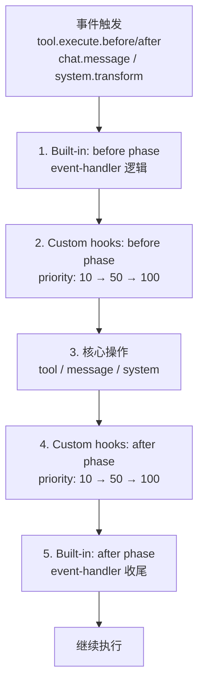

# 自定义 Hook 与扩展

> **相关文档：** [Hook 参考](/03-Reference/hooks) — 内置 Hook 类型与配置 | [扩展机制](/03-Reference/extensions) — 扩展点注册与自定义模块 | [创建角色](/02-Guide/create-a-role) — 完整的角色创建指南

自定义 Hook 允许你在 rolebox 的生命周期中注入自己的逻辑。通过 `role.yaml` 的 `hooks.custom` 字段声明。

## Hook 声明

```yaml
hooks:
  custom:
    - name: my-quality-checker
      description: "Checks code quality after edits"
      events: [tool.execute.after, chat.message]
      module: hooks/quality-checker.js
      config:
        severity: warn
        checks: [no_console_log]
      filter:
        tools: [edit, write, hashline_edit]
      priority: 50
      phase: after
```

### Schema 字段

| 字段 | 类型 | 默认值 | 描述 |
|------|------|--------|------|
| `name` | string | — | 唯一标识符 |
| `description` | string | — | 人类可读的描述 |
| `events` | string[] | — | 监听的事件列表 |
| `module` | string | — | Hook 模块路径（相对于角色目录或绝对路径） |
| `config` | object | — | 运行时传递给 hook 的配置 |
| `filter` | object | — | 限制 hook 触发的条件 |
| `filter.tools` | string[] | — | 仅针对特定工具（适用于 `tool.execute.before/after`） |
| `filter.eventTypes` | string[] | — | 仅针对特定事件子类型（适用于 `event`） |
| `priority` | number | `50` | 同 phase 内，较低值先执行 |
| `phase` | string | `"after"` | `"before"` 或 `"after"` |

### 事件类型

| 事件名 | 触发时机 | Handler 方法 |
|--------|----------|-------------|
| `chat.message` | 用户发送消息后 | `onChatMessage` |
| `tool.execute.before` | 工具执行前 | `onToolBefore` |
| `tool.execute.after` | 工具执行后 | `onToolAfter` |
| `system.transform` | 系统提示构建期间 | `onSystemTransform` |
| `event` | 生命周期事件（idle、error 等） | `onEvent` |

::: tip 从简单 Hook 开始
实现自定义 Hook 时，从 `onToolAfter` 或 `onChatMessage` 开始——这两个处理器覆盖了最常见的场景（工具执行后的质量检查和消息触发逻辑）。只有当你需要初始化资源或清理连接时，才使用 `onLoad` 和 `onDispose`。所有处理器方法都是可选的，只实现你需要的即可。
:::

## Module 契约

每个 Hook 模块是一个 JavaScript/TypeScript 文件，默认导出一个包含可选 handler 方法的对象。类型定义在 `src/hooks/custom/types.ts:70-84`。

### 所有 Handler 方法

| 方法 | 触发时机 | 输入参数 |
|------|----------|---------|
| `onChatMessage(ctx, { text })` | 用户发送消息后 | 完整消息文本 |
| `onToolBefore(ctx, { tool, args })` | 工具执行前 | 工具名和参数 |
| `onToolAfter(ctx, { tool, args, output })` | 工具执行后 | 工具名、参数和结果输出 |
| `onSystemTransform(ctx, { system })` | 系统提示构建期间 | 系统提示字符串数组（可修改） |
| `onEvent(ctx, { type, properties })` | 生命周期事件触发 | 事件类型和属性 |
| `onLoad(ctx)` | Hook 注册时调用一次 | — |
| `onDispose(ctx)` | 插件关闭时调用一次 | — |

### HookContext API

每个 Handler 接收一个 `ctx` (HookContext) 对象，类型定义在 `src/hooks/custom/types.ts:49-67`：

| 属性/方法 | 类型 | 描述 |
|-----------|------|------|
| `hookName` | string | Hook 配置的名称 |
| `config` | object \| undefined | Hook 的 `config` 配置 |
| `sessionID` | string \| undefined | 当前会话 ID |
| `agent` | string \| undefined | 当前代理 ID |
| `log` | Logger | 结构化日志记录器 |
| `inject(text)` | function | 向系统提示追加文本 |
| `replaceBlock(tag, newContent)` | function | 替换系统提示的 tagged block |
| `removeBlock(tag)` | function | 移除系统提示的 tagged block |
| `getBlocks()` | function | 获取当前系统提示的 block 列表 |
| `getFunctionState(fnName)` | function | 查询函数运行时状态 |
| `getDispatchState()` | function | 查询调度状态快照 |
| `getGraphState()` | function | 查询协作图状态 |
| `skip()` | function | 跳过当前操作（仅 tool.before 有效） |
| `retry()` | function | 重试当前操作（仅 tool.before 有效） |

## 示例：质量检查 Hook

### 声明（role.yaml）

```yaml
# role.yaml
name: Quality-Conscious Coder
hooks:
  custom:
    - name: no-console-log
      description: Detect stray console.log in file writes
      events: [tool.execute.after]
      module: hooks/no-console-log.js
      filter:
        tools: [write, edit]
      priority: 10
      phase: after
```

### 实现（hooks/no-console-log.js）

```javascript
// src: examples/hooks/no-console-log.js
export default {
  onToolAfter: (ctx, { tool, args, output }) => {
    if (tool !== "write" && tool !== "edit") return;
    const content = typeof args?.content === "string" ? args.content : "";
    if (content.includes("console.log(")) {
      ctx.inject(
        `Warning: console.log() detected in ${tool} output. Consider removing debug statements.`
      );
    }
  },
};
```

## 示例：系统提示转换

```javascript
export default {
  onSystemTransform: (ctx, { system }) => {
    // 在系统提示末尾追加自定义指令
    const blocks = ctx.getBlocks();
    const hasInstruction = blocks.some(b => b.tag === "custom-rules");

    if (!hasInstruction) {
      system.push("<custom-rules>");
      system.push("Always prefer arrow functions over function declarations.");
      system.push("</custom-rules>");
    }

    // 替换技术栈块
    ctx.replaceBlock("tech-stack",
      "<tech-stack>TypeScript, React, Bun</tech-stack>"
    );
  },
};
```

## 示例：事件 Hook

```javascript
export default {
  onEvent: (ctx, { type, properties }) => {
    if (type === "session.error") {
      ctx.log.warn(`Session error detected: ${properties?.error}`);
    }
    if (type === "session.idle") {
      // 空闲时执行清理任务
      ctx.log.info("Session idle, cleaning up...");
    }
  },

  onLoad: (ctx) => {
    ctx.log.info(`Hook ${ctx.hookName} loaded with config`, ctx.config);
  },

  onDispose: (ctx) => {
    ctx.log.info(`Hook ${ctx.hookName} shutting down`);
  },
};
```

## 示例：调度状态 Hook

```javascript
export default {
  onToolAfter: (ctx, { tool, args, output }) => {
    if (tool !== "dispatch") return;

    const dispatchState = ctx.getDispatchState();
    if (dispatchState && dispatchState.activeTaskCount > 3) {
      ctx.inject(
        `Note: There are ${dispatchState.activeTaskCount} active tasks running. Consider reducing concurrency.`
      );
    }
  },
};
```

## Hook 执行顺序

Hook 的生命周期严格分为 **before** 和 **after** 两个相位（`src/hooks/event-handler.ts:19-301`），相位内按 `priority` 排序（`src/hooks/custom/registry.ts:60-66`）。

### 完整执行顺序

对于每个事件（如 `tool.execute.after`），Hook 按以下顺序触发：

```
事件触发
│
├── 1. 内置 Hook — before 相位
│   │   （event-handler.ts:27-42，函数 continuation 和内置逻辑）
│   │
├── 2. 自定义 Hook — before 相位
│   │   按 priority 升序排列（priority: 10 在 priority: 50 之前）
│   │   （registry.ts:60-66）
│   │
├── 3. 核心逻辑执行
│   │   （工具执行 / 消息处理 / 系统构建）
│   │
├── 4. 自定义 Hook — after 相位
│   │   按 priority 升序排列
│   │   （registry.ts:60-66）
│   │
└── 5. 内置 Hook — after 相位
        （event-handler.ts:284-300）
```

### Phase 内优先级排序

```yaml
hooks:
  custom:
    - name: fast-check
      events: [tool.execute.after]
      module: hooks/fast-check.js
      priority: 10        # 先执行
      phase: after
    - name: deep-check
      events: [tool.execute.after]
      module: hooks/deep-check.js
      priority: 100       # 后执行
      phase: after
```

优先级规则（`registry.ts:64-66`）：
- **低 priority 值先执行**：priority: 10 在 priority: 50 之前
- **相同 priority**：按注册顺序保持
- **默认值**：未填 priority 时默认为 `50`
- **跨相位**：所有 before 相位 Hook 在任何 after 相位 Hook 之前执行，无论 priority 值

### 完整相位流向图



## Filter 与 Phase

**Filter** 限制哪些工具调用或事件触发 hook：

```yaml
filter:
  tools: [write, edit]          # 仅对 write/edit 工具调用触发
  eventTypes: [session.error]   # 仅对 session.error 事件触发
```

**Phase** 控制相对内置 handler 的执行顺序：

- `"before"` — 在内置 handler 逻辑之前执行
- `"after"`（默认）— 在内置 handler 完成后执行

多个相同 phase 的 hook 按 `priority` 排序（较小值优先）。相同 priority 下按注册顺序保持。

## 模块加载

Hook 模块通过动态 `import()` 加载并缓存（`src/hooks/custom/loader.ts:9-28`）：

- 相对路径相对于角色目录解析（`src/hooks/custom/loader.ts:13-15`）
- 绝对路径直接使用
- 一旦加载，模块会被缓存直到 `clearHookModuleCache()` 被调用
- 缓存用于测试和热重载场景

## 安全保证

### 故障隔离

::: info 安全保证
- Hook **永远不会**导致代理崩溃。每个 handler 都包裹在 try/catch 中 — 失败会记录警告并继续执行（`src/hooks/custom/registry.ts:129-131`）
- 模块加载失败（文件丢失、语法错误）会被记录，hook 被跳过 — registry 存储 `null` 并继续运行（`src/hooks/custom/loader.ts:23-27`）
- 单个 hook 的中止不会影响其他 hook 的执行
:::


### 注入机制

`inject()` 方法通过已有的 `appendCorrection` 系统追加到系统提示中（`src/hooks/custom/registry.ts:41`）：
- 与内置防护使用相同的路径
- 注入在下一轮系统提示构建时生效

### 弃用处理

在插件关闭时，所有 hook 收到 `onDispose` 调用：
- 调用顺序：与注册顺序无关，每个 hook 仅调用一次
- 即使某个 `onDispose` 抛出异常，其他 hook 的销毁仍然继续（`src/hooks/custom/registry.ts:206-209`）

## 常见 Hook 配方

### 配方 1：禁止 console.log（no-console-log）

检测在 `write` / `edit` 工具输出中遗留的 `console.log` 调试语句，并向代理注入提醒。

```yaml
# role.yaml
hooks:
  custom:
    - name: no-console-log
      description: Detect stray console.log in file writes
      events: [tool.execute.after]
      module: hooks/no-console-log.js
      filter:
        tools: [write, edit]
      priority: 10
      phase: after
```

```javascript
// hooks/no-console-log.js — 完整实现件：examples/hooks/no-console-log.js
export default {
  onToolAfter: (ctx, { tool, args, output }) => {
    if (tool !== "write" && tool !== "edit") return;
    const content = typeof args?.content === "string" ? args.content : "";
    if (content.includes("console.log(")) {
      ctx.inject(
        `<system-reminder>Warning: console.log() detected in ${tool} output.</system-reminder>`
      );
    }
  },
};
```

### 配方 2：编辑后自动提交（auto-commit-on-edit）

在每次 `edit` 工具调用后自动 git commit 变更，保持工作区历史清晰。

```yaml
hooks:
  custom:
    - name: auto-commit-on-edit
      description: Auto-commit after every edit
      events: [tool.execute.after]
      module: hooks/auto-commit.js
      filter:
        tools: [edit, hashline_edit]
      priority: 90
      phase: after
```

```javascript
// hooks/auto-commit.js
export default {
  onToolAfter: async (ctx, { tool, args, output }) => {
    // 通过 inject 触发代理执行 git commit
    ctx.inject(
      "An edit was just applied. Consider running `git add -A && git commit -m \"auto: edit changes\"` " +
      "if the changes are coherent and tested."
    );
  },
};
```

### 配方 3：会话摘要记录（session-summary）

在会话结束时记录关键事件摘要，用于日志回顾。

```yaml
hooks:
  custom:
    - name: session-summary
      description: Log session summary on key events
      events: [event]
      module: hooks/session-summary.js
      filter:
        eventTypes: [session.idle, session.error]
      priority: 20
      phase: after
```

```javascript
// hooks/session-summary.js
export default {
  onEvent: (ctx, { type, properties }) => {
    if (type === "session.error") {
      ctx.log.warn(`Session error: ${JSON.stringify(properties)}`);
    }
    if (type === "session.idle") {
      const dispatchState = ctx.getDispatchState?.();
      if (dispatchState && dispatchState.activeTaskCount > 0) {
        ctx.log.info(
          `Session idle with ${dispatchState.activeTaskCount} active tasks`
        );
      }
    }
  },

  onDispose: (ctx) => {
    ctx.log.info(`Session hook "${ctx.hookName}" disposed`);
  },
};
```

## 注册内部机制

CustomHookRegistry 类（`src/hooks/custom/registry.ts:18-215`）：

```
CustomHookRegistry
├── byEvent Map: event → RegisteredHook[]
├── register(hook, roleDir) — 加载模块，激活 onLoad，按事件注册
├── getHooks(event, phase) — 按 phase 和 priority 排序
├── runHooks(event, phase, ctxFactory, input) — 执行所有符合条件的 hook
│   ├── filter 检查（tool filter / eventTypes filter）
│   ├── 转发到对应 handler 方法
│   └── try/catch 包裹每个调用
└── dispose() — 调用 onDispose，清除注册表
```

## 扩展机制（补充）

除了自定义 Hook，rolebox 还提供扩展点来扩展封闭词表（详见 [扩展参考](/03-Reference/extensions)）：

| 扩展作用域 | 用途 | Module 契约 |
|-----------|------|-------------|
| `conditions` | 自定义 gate/transition/continue_until 条件 | `{ handler: (arg, env) => boolean }` |
| `graph_topologies` | 自定义协作图拓扑 | `{ expand: (agents) => FlowEdge[] }` |
| `termination_conditions` | 自定义循环终止条件 | `{ parse: (value, agents) => LoopCondition \| null }` |
| `recovery_strategies` | 自定义错误恢复策略 | `{ name, execute }` |
| `recovery_patterns` | 自定义错误检测模式 | `{ name, category, match }` |
| `notification_channels` | 自定义通知渠道 | `{ create: (config) => { kind, send, dispose } }` |
| `observe_events` | 自定义 observe 事件处理器 | `{ handle: (ctx, spec) => string[] }` |

扩展的安全性保证与 Hook 相同：模块加载失败被捕获并记录，不会导致代理崩溃。

## 下一步

- [Hook 参考](/03-Reference/hooks) — 内置 Hook 类型与配置
- [扩展机制](/03-Reference/extensions) — 扩展点注册与自定义模块
- [创建角色](/02-Guide/create-a-role) — 完整的角色创建指南
