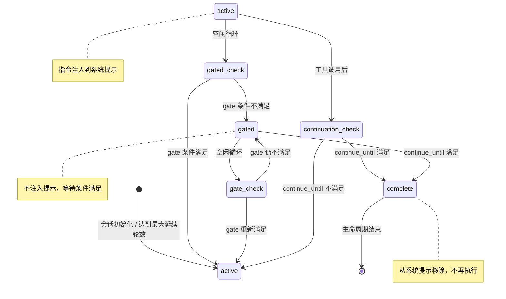

# 函数系统

> **相关文档：** [编写函数](/02-Guide/writing-functions) — 自定义函数开发指南 | [技能系统](/02-Guide/skills) — 按需加载的知识模块 | [子代理](/02-Guide/subagents) — 函数与 dispatch 的协作

函数（Function）是可组合的行为模块，用户通过 `|名称|` 语法在运行时激活。它们会按需向系统提示中注入额外的指令。

每个角色默认搭载三个内置函数（`plan`、`execute`、`loop`，定义于 `src/constants.ts:76`）。用户通过在消息前加前缀来激活它们：

```
|plan| 重新设计认证模块
|execute| 实现我们讨论过的重构
|plan|execute| 为 API 添加分页功能
```

## 工作原理

1. 用户输入 `|plan| 做某事` → 解析器剥离 `|plan|`，为该会话激活函数
2. 在之后的每个轮次，函数的指令会被注入到系统提示中
3. 函数一旦激活，在整个会话中持续有效

## 编写自定义函数

创建一个带有 YAML frontmatter 的 Markdown 文件：

```markdown
---
name: review
description: Code review mode with configurable focus
params:
  focus: correctness
  severity: normal
---

You are reviewing code with focus on **{focus}** at **{severity}** level.

Check for:
- Logic errors and edge cases
- Performance implications
- Consistency with existing patterns
```

## 参数化函数

函数通过两种语法风格接受参数：

**位置参数**（按参数声明顺序映射）：

```
|review:security,strict| 检查认证模块
```

**键值参数**（显式命名）：

```
|review focus=security severity=strict| 检查认证模块
```

**混合使用**（部分带参数，部分不带）：

```
|plan|review:security| 分析这个 PR
```

未提供的参数回退到其声明的默认值。没有 `params` 块的函数会忽略任何传入的参数。

## 解析优先级

1. `{roleDir}/functions/{name}.md` — 角色本地覆盖
2. `~/.config/opencode/functions/{name}.md` — 全局用户定义
3. 内置（`plan`、`execute`）— rolebox 自带

### 解析算法

解析器（`src/resolver/function-resolver.ts`）按以下优先级搜索：

1. `{roleDir}/functions/{name}.md` — 角色本地覆盖（`FunctionSource.RoleLocal`）
2. `~/.config/opencode/functions/{name}.md` — 全局用户定义（`FunctionSource.Global`）
3. 内置（`plan`、`execute`、`loop`）— rolebox 自带（`FunctionSource.BuiltIn`）

内置函数定义于 `src/constants.ts:76`：

```typescript
export const DEFAULT_FUNCTIONS: readonly string[] = ["plan", "execute", "loop"];
```

## 高级配置字段

函数的 YAML frontmatter 支持完整的配置字段集（接口定义于 `src/types.core.ts:166-192`）。以下是按类别分组的字段说明。

### 基础标识

| 字段 | 类型 | 必需 | 描述 |
|------|------|------|------|
| `name` | `string` | 建议 | 函数名称，未提供则从文件名推导 |
| `description` | `string` | 是 | 人类可读的描述 |

在实践中，名称建议总是显式声明——文件名更改后函数名不会自动跟随。

### 参数与执行阶段

| 字段 | 类型 | 必需 | 描述 |
|------|------|------|------|
| `params` | `Record<string, string>` | 否 | 参数声明（名称 → 默认值） |
| `phase` | `string` | 否 | 执行阶段标签（如 `plan`、`execute`） |
| `priority` | `number` | 否 | 执行优先级（较低值优先） |

`phase` 用于逻辑分组而非排序——真正的执行顺序由 `priority` 控制，数值越小越先执行。

### 依赖与制品（Dependency & Artifact）

| 字段 | 类型 | 必需 | 描述 |
|------|------|------|------|
| `requires` | `string[]` | 否 | **依赖函数名称列表** — 这些函数必须先激活 |
| `produces` | `string` | 否 | **此函数产生的制品名称**（如 plan 产生 `plan` 制品） |
| `consumes` | `string` | 否 | **此函数消费的制品名称**（如 execute 消费 `plan`） |

::: tip 依赖链设计建议
`requires` 实现为隐式 gate 条件。当依赖的函数未激活时，当前函数保持 `gated` 状态。最常见的模式是 `execute → plan`：execute 依赖 plan 先完成计划制定。注意不要引入循环依赖——如果 A requires B 且 B requires A，两者都会永久阻塞在 `gated` 状态。
:::

### 门控与延续（Gate & Continuation）

| 字段 | 类型 | 必需 | 描述 |
|------|------|------|------|
| `gate` | `Condition` | 否 | **门控条件** — 满足后才激活。支持复合逻辑：`all`、`any`、`not` |
| `continue_until` | `Condition` | 否 | **自动延续条件** — 满足后标记为 `complete` |
| `continue_max` | `number` | 否 | 最大延续轮数（默认 5，全局硬编码上限 25） |
| `requires_evidence` | `string[]` | 否 | **延续前必须观察到的证据标签**（如 `lsp_diagnostics`、`test`） |

这四者共同构成函数的"生命线"控制：`gate` 决定何时开始，`continue_until` 决定何时结束，`continue_max` 防止无限循环，`requires_evidence` 确保达到质量门槛才继续。

### 生命周期观察与转换

| 字段 | 类型 | 必需 | 描述 |
|------|------|------|------|
| `observe` | `ObserveSpec[]` | 否 | **生命周期观察器** — 在工具执行、消息到达、激活时触发 |
| `transitions` | `TransitionSpec[]` | 否 | **状态转换规则** — 条件满足时激活/停用其他函数 |

`observe` 用于捕获制品和设置证据，`transitions` 用于跨函数编排。两者协同：observe 观察到的状态变化可以作为 transitions 的触发条件。

### 高级与平台配置

| 字段 | 类型 | 必需 | 描述 |
|------|------|------|------|
| `state_schema_version` | `number` | 否 | 状态 schema 版本，用于向前兼容 |
| `handlers` | `string` | 否 | Tier-2 处理器 JS 模块路径 |
| `auto_activate` | `string[]` | 否 | 会话启动时自动激活的函数列表（无需 `\|name\|` 语法） |
| `locked` | `boolean` | 否 | 当为 `true` 时，`auto_activate` 的函数不能被停用 |

`auto_activate` 和 `locked` 字段同样存在于 `RoleConfig`（`src/types.core.ts:129-132`）中，用于角色级配置：

```yaml
# role.yaml
auto_activate:
  - execute           # 会话启动时自动进入执行模式
locked: true          # execute 函数不能被停用
```

## 函数生命周期可视化

函数的运行阶段由门控评估和延续条件共同驱动。实际状态定义于 `src/function/runtime-state.ts:7`，共有三种。

### 状态转换图

以下状态图展示函数的三种核心状态及其转换路径——每次空闲循环中都会进行门控评估，每次工具调用后检查延续条件：



**状态说明：**

| 状态 | 含义 |
|------|------|
| `active` | 函数正在活跃运行，指令注入到系统提示中 |
| `gated` | 函数被门控条件（`gate`）或隐式依赖（`requires`）阻塞，不注入提示 |
| `complete` | 函数已完成，从系统提示中移除 |

**转换机制：**

每次空闲循环调用 `evaluateGateAndTransitions()`（`src/function/phase-machine.ts:9-29`），根据 gate 条件决定 active ↔ gated 转换。每次工具调用后，延续逻辑（`src/hooks/event-handler.ts:160-164`）检查 `continue_until` 条件，满足时标记为 `complete`；handler 返回 `false` 时也会触发完成（第 182-183 行）。

<details>
<summary>展开查看转换机制的源码引用</summary>

| 转换 | 源码位置 | 说明 |
|------|---------|------|
| active → gated | `src/function/phase-machine.ts:16-17` | gate 条件不满足时 |
| gated → active | `src/function/phase-machine.ts:16-17` | gate 条件重新满足时 |
| → complete | `src/hooks/event-handler.ts:160-164` | continue_until 满足时 |
| → complete (handler) | `src/hooks/event-handler.ts:182-183` | handler 返回 false 时 |

</details>

::: tip 实践中理解状态机
`gated` 状态不是错误——它是函数正常工作的一部分。当你看到函数处于 `gated` 状态，意味着它正在等待某些条件（如另一个函数先完成、用户确认、信号触发等）。用 `rolebox info` 查看函数状态可以快速了解"谁在等谁"。
:::


## 按角色配置函数

```yaml
# 在内置默认值基础上添加自定义函数（合并而非替换）
# 内置函数 [plan, execute, loop] 始终可用
# 除非通过 disable_functions 显式移除。
functions:
  - plan                       # 已是内置 — 显式声明以保持清晰
  - review
  - my-custom-fn

# 禁用特定的内置函数
disable_functions:
  - execute                    # 从最终集合中移除 execute
```

> **注意：** `functions:` 字段是**合并**内置默认值，而非替换。
> - `functions: [my-fn]` → 启用 = `[plan, execute, loop, my-fn]`（合并 + 去重）
> - `functions: [plan, my-fn]` → 启用 = `[plan, execute, loop, my-fn]`（移除重复项）
> - `disable_functions: [execute]` → 从合并集合中移除 `execute`
> - 如果没有声明 `functions:` 字段，则仅使用内置默认值 `[plan, execute, loop]`。

### 依赖与门控示例

以下示例定义了一个依赖 `plan` 函数的 analyze 函数。它会等待 plan 完成后再执行，并消费 plan 制品：

```yaml
---
name: analyze
description: Analyze the plan and produce a risk assessment
phase: analyze
priority: 30
requires: [plan]            # 依赖 plan 函数先激活
consumes: plan              # 消费 plan 制品
produces: analysis          # 产生 analysis 制品
gate:                       # 门控条件：plan 制品存在 + 用户确认
  all: [artifact_exists(plan), user_approval]
continue_until: artifact_exists(analysis)
continue_max: 10
requires_evidence:
  - lsp_diagnostics
observe:
  - on: tool_after
    tool: write
    capture_artifact: analysis
    set_evidence: analysis_done
---
```

**执行流程：**

1. 用户激活 `|plan|execute|analyze| 分析认证模块`
2. `plan` 函数进入 `gated` 阶段，`analyze` 也进入 `gated`（因 `requires: [plan]`）
3. `plan` 的 gate 条件满足后 → 激活 `execute`，停用 `plan`
4. `analyze` 的 `requires: [plan]` 此时才满足 → `analyze` 进入 `active` 阶段
5. 执行完成后，`analyze` 在 `artifact_exists(analysis)` 满足时标记为 `complete`

`requires` 字段实现为隐式 gate 条件：当依赖的函数尚未激活时，当前函数保持 `gated` 状态。此逻辑由函数状态机（`src/function/phase-machine.ts`）处理。

## 调试函数激活问题

函数未按预期激活时，按以下三个步骤排查：

### 1. 使用 rolebox info 检查函数列表

```bash
rolebox info my-role
```

输出中的 `functions` 部分列出该角色解析的所有函数及其来源（`role-local` / `global` / `built-in`）。确认目标函数已出现在列表中。

### 2. 检查运行时状态文件

函数运行时状态持久化在工作区 `.rolebox/state/` 目录下。

**文件名格式：** `fnstate-{hash}.json`（`src/function/runtime-store.ts:26`）

其中 `{hash}` 由 `shortHash()`（`src/utils/state-paths.ts:15-17`）生成，是工作区目录绝对路径的 SHA-256 前 12 位十六进制字符。

```json
{
  "sessions": [
    {
      "sessionId": "...",
      "fns": [
        {
          "name": "analyze",
          "state": {
            "phase": "gated",
            "gateSatisfied": false,
            "continuationCount": 0,
            "evidenceObserved": {}
          }
        }
      ]
    }
  ]
}
```

重点关注每个函数的 `phase` 和 `gateSatisfied` 字段。

### 3. 验证依赖链

如果函数处于 `gated` 阶段，检查其 `requires` 依赖链。`requires` 实现为隐式 gate 条件（`src/function/phase-machine.ts:9-29`），当依赖函数未激活时当前函数保持 `gated`。

1. 打开状态文件，找到目标函数及其所有依赖
2. 确认每个依赖函数的 `phase` 为 `active` 或 `complete`
3. 若依赖函数有 `gate` 声明，还需确认其 `gateSatisfied` 为 `true`


## 内置函数

**plan** — 指示代理在制定计划前用工具（Read、Grep、Glob、LSP）调查代码库。生成带有验证策略的结构化计划，等待用户批准后再执行。

**execute** — 指示代理逐步实现，每次修改后通过工具验证（lsp_diagnostics、构建、测试）。采用两次尝试升级策略处理故障。

**loop** — 在隔离的 worker 会话中重复运行同一任务。原始会话成为纯粹的编排器：它确认激活，通过 dispatch 系统将每一轮派发到子 worker，并在轮次完成时生成面向用户的摘要。编排器本身永远不执行任务。

```
|loop| 重构 utils 模块          # 5 轮（默认），inherit 模式
|loop:3| 运行测试套件           # 3 轮
|loop:10,fresh| 生成示例        # 10 轮，fresh 模式
```

**工作原理：**

1. 每一轮（包括第一轮）都在通过 dispatch 系统派发的全新子 worker 会话中执行
2. 原始会话是纯粹的编排器/观察者。它确认激活，每个完成的轮次生成一个面向用户的摘要，从不执行任务
3. 每轮的摘要成为下一轮的种子上下文（`inherit` 模式），创建自包含的上下文链
4. 迭代计数控制停止，没有 LLM 提前停止机制

**模式：**

| 模式 | 行为 |
|---|---|
| `inherit`（默认） | 第 N+1 轮获取第 N 轮的摘要作为种子上下文 |
| `fresh` | 每轮仅以基础任务开始，无先前上下文 |

**取消：** 在轮次运行期间发送的任何用户消息都会立即取消循环。系统重新提示（dispatch 完成通知、自动继续信号）永远不会取消。

::: tip 使用 `function_graph` 可视化函数依赖
内置的 `function_graph` 工具可以可视化函数的 `requires`/`produces`/`consumes` 依赖关系，以及基于 `transitions` 的状态机图。运行 `|function_graph focus=dependencies|` 查看依赖图，或 `|function_graph focus=state_machine|` 查看状态转换。详见[编写函数 → 函数依赖图](/02-Guide/writing-functions#函数依赖图)。
:::

::: tip `requires_evidence` 使用建议
`requires_evidence` 是确保函数结果可靠性的关键机制。当函数需要验证自身输出时，声明必选的证据标签：

```yaml
---
name: execute
requires_evidence: [lsp_diagnostics, test]
---
```

这意味着：
- 在 `lsp_diagnostics` 和 `test` 这两个证据标签都被观察到之前，函数不会自动继续
- 证据由 `observe` 中的 `set_evidence` 或外部工具调用自动标记
- 所有必需证据满足后，`evidence_met()` 条件变为 `true`，可在 `continue_until` 中作为条件使用

典型用途：代码生成函数要求先通过类型检查和测试，再开始下一轮修改。
:::

## 集成配方

以下配方演示如何将多个函数和高级配置字段组合成完整的工作流。每个配方包含可直接复制的 YAML 配置和运行说明。

### 配方 1：串联 plan → execute 工作流

**问题陈述：** 你希望代理在实现代码之前先制定计划，并且只有在计划被批准后才执行。`plan` 和 `execute` 需要按顺序串接——不跳过计划，不提前执行。

**解决方案：** 利用函数的 `requires`、`consumes` 和 `produces` 字段，让 `execute` 依赖 `plan` 先完成（来源：`functions.md:184-209`）。

**YAML 配置**（保存到 `~/.config/opencode/rolebox/plan-executor/functions/execute.md`）：

```yaml
---
name: execute
description: Execute approved plan with verification
phase: execute
priority: 20
requires: [plan]              # 等待 plan 先完成
consumes: plan                # 消费 plan 制品（规划结果）
produces: result              # 产生 result 制品
gate:
  all: [artifact_exists(plan), user_approval]
continue_until: artifact_exists(result)
continue_max: 10
requires_evidence:
  - lsp_diagnostics
  - test
---
```

**配套 role.yaml：**

```yaml
# ~/.config/opencode/rolebox/plan-executor/role.yaml
name: Plan Executor
description: Executes code changes only after plan approval
functions:
  - plan
  - execute
```

**运行方式：**

```
|plan|execute| 为 user 模块添加注册功能
```

**预期行为（来源：`functions.md:201-207`）：**
1. `plan` 函数激活 → 代理调研代码库，生成结构化计划
2. `execute` 因 `requires: [plan]` 处于 `gated` 状态，系统提示中不注入执行指令
3. plan 完成后 → `execute` 的 `requires` 条件满足 → 进入 `active` 状态
4. 代理按计划逐步实现，每次修改后运行 LSP 诊断和测试
5. 当测试通过且结果制品生成后，`continue_until` 条件满足，函数标记为 `complete`

**出错时检查什么：**
- 如果 `execute` 始终处于 `gated` 状态，检查 `plan` 是否确实已完成（查看 `.rolebox/state/` 下的运行时状态文件，`functions.md:224-250`）
- 确认依赖链没有循环：`requires: [plan]` 意味着 plan 必须先激活
- `continue_max` 默认 5 次（硬编码上限 25，见 `functions.md:105`），达到上限后即使条件未满足也会停止

### 配方 2：使用基于 signal 的门控

**问题陈述：** 你希望某个函数只在特定控制信号（signal）发出后才激活，而不是在会话启动时立即生效。例如，一个"紧急修复"函数只有在用户发送 `signal:emergency` 时才激活，覆盖常规流程。

**解决方案：** 使用 `gate` 字段配合 `condition` 条件表达式（来源：`functions.md:103` 和 `src/function/phase-machine.ts`）。

**YAML 配置**（保存到 `~/.config/opencode/rolebox/emergency-fix/functions/emergency-fix.md`）：

```yaml
---
name: emergency-fix
description: Emergency hotfix mode — bypasses normal review
phase: hotfix
priority: 5
gate:
  all:
    - signal_received(emergency)
    - user_approval
continue_until: signal_received(resolved)
continue_max: 3
produces: hotfix
---
You are in **emergency hotfix mode**. Normal review processes are bypassed.
Focus on the minimal fix to resolve the issue. After applying the fix,
verify it resolves the problem and emit signal `resolved` when done.

Rules:
1. Make the smallest possible change
2. Verify the fix immediately
3. Do NOT refactor unrelated code
4. When done, the system will automatically deactivate this function
```

**配套 role.yaml：**

```yaml
# ~/.config/opencode/rolebox/emergency-fix/role.yaml
name: Emergency Fix
description: Hotfix agent with signal-based gating
functions:
  - emergency-fix
  - plan
  - execute
```

**激活方式：**

```
|plan|execute|emergency-fix| 修复生产环境的登录崩溃
```

**预期行为：**
1. `emergency-fix` 函数初始为 `gated`，因为 `signal_received(emergency)` 条件不满足
2. 用户发出 `signal:emergency` 后，gate 条件满足 → 函数进入 `active` 阶段
3. 特殊指令注入系统提示，代理以紧急修复模式运行
4. 修复完成后发出 `signal:resolved`，`continue_until` 条件满足 → 函数标记为 `complete`

**出错时检查什么：**
- signal 名称在 `gate` 和 `continue_until` 中必须一致（如 `emergency` vs `resolved`）
- `user_approval` 条件需要用户在对话中确认（来源：`functions.md:188`）
- 函数处于 `gated` 状态是正常的——这证明门控机制在起作用。用 `rolebox info` 查看函数状态

### 配方 3：使用 loop 进行迭代优化

**问题陈述：** 你有一个需要反复改进的任务——比如优化代码格式、逐步提炼文档、或多轮测试修复。手动重复 dispatch 很繁琐，你需要自动迭代。

**解决方案：** 使用内置 `loop` 函数（来源：`functions.md:269-291`），在隔离的 worker 会话中自动重复执行同一任务。

**YAML 配置**（保存到 `~/.config/opencode/rolebox/iterative-formatter/role.yaml`）：

```yaml
name: Iterative Formatter
description: Iteratively improves code formatting across rounds
prompt: |
  You are a code formatting specialist. In each round, read
  the source files and improve their formatting and style.
  Do NOT change logic — only formatting and naming conventions.
functions:
  - plan
  - execute
  - loop
```

**运行方式：**

```
|loop:5| 格式化 src/ 目录下的所有 TypeScript 文件
```

**预期行为（来源：`functions.md:279-282`）：**
1. 第 1 轮：子 worker 格式化第一批文件，生成摘要
2. 第 2 轮（`inherit` 模式）：子 worker 获取第 1 轮的摘要作为上下文，继续格式化新文件或改进已有文件
3. 第 3-5 轮：重复，每次都有上一轮的上下文（来源：`functions.md:286-289`）
4. 所有 5 轮完成后，编排器返回每轮的摘要

**高级变体——使用 `fresh` 模式运行独立轮次：**

```
|loop:3,fresh| 运行测试并报告失败项
```

每轮完全独立，不获之前轮次的上下文（`functions.md:289`）。适合并行测试或对比不同策略的效果。

**使用检查点与 loop 组合：**

结合 `dispatch_checkpoint`（`subagents.md:256-266`），loop 可以在超时或中断后恢复：

1. 每轮完成时保存 `dispatch_checkpoint`，记录已处理的文件列表
2. 如果 loop 被中断，重新启动时从检查点恢复
3. 避免重新处理已完成的工作

**出错时检查什么：**
- 默认 5 轮（`|loop:5|` 中的数字可自定义，`functions.md:272-274`）
- 在轮次运行期间发送用户消息会**立即取消**整个循环（`functions.md:291`）
- 循环使用子 worker 调度，受并发限制（默认每个模型最多 5 个并发，来源：`subagents.md:303-304`）
- 如果期望的结果在 5 轮内未达到，增加迭代次数：`|loop:10|`

## 下一步

- [技能系统](/02-Guide/skills) — 了解按需加载的知识模块系统
- [子代理](/02-Guide/subagents) — 了解 dispatch 调度的目标代理声明与配置
- [编写函数](/02-Guide/writing-functions) — 深入了解如何编写自定义函数
