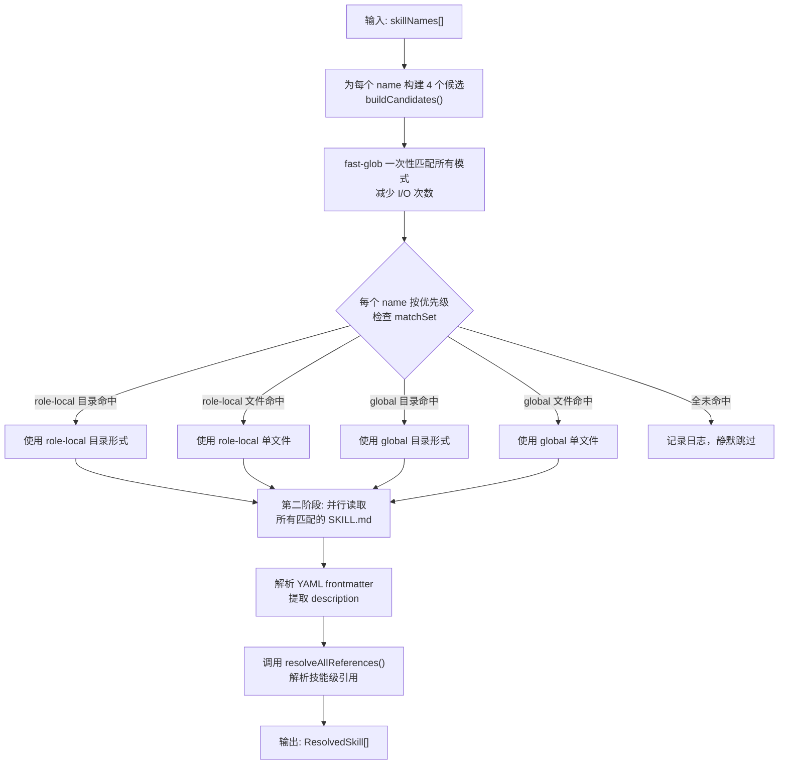
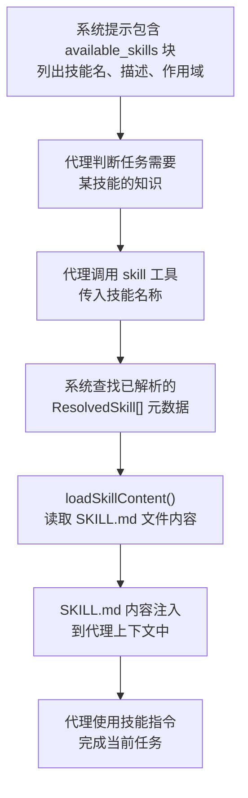

# 技能系统

> **相关文档：** [编写技能](/02-Guide/authoring-skills) — 技能模块开发实战 | [函数系统](/02-Guide/functions) — 技能与函数的对比 | [引用文档](/02-Guide/references) — 引用文档的自动发现机制

技能（Skill）是按需加载的知识模块，代理在需要时通过 `skill` 工具加载。与函数不同（函数一旦激活就持续存在），技能是上下文相关的按需加载。

```markdown
---
name: review-checklist
description: Comprehensive code review checklist
---

When reviewing code, check:
- Error handling completeness
- Input validation
- ...
```

## 解析顺序

1. `{roleDir}/skills/{name}/SKILL.md`（角色本地，目录形式）
2. `{roleDir}/skills/{name}.md`（角色本地，单文件形式）
3. `~/.config/opencode/skills/{name}/SKILL.md`（全局，目录形式）
4. `~/.config/opencode/skills/{name}.md`（全局，单文件形式）

### 解析算法

解析器实现于 `src/resolver/skill-resolver.ts:22-34`。`buildCandidates()` 为每个技能名生成四个候选位置，按优先级排列：

```typescript
interface Candidate {
  scope: ResolvedSkill["scope"];
  pattern: string;
}

function buildCandidates(name, roleDir, globalSkillsDir): Candidate[] {
  return [
    { scope: SkillScope.Rolebox, pattern: skillDirPath(roleSkillsDir, name) },
    { scope: SkillScope.Rolebox, pattern: skillFilePath(roleSkillsDir, name) },
    { scope: SkillScope.Opencode, pattern: skillDirPath(globalSkillsDir, name) },
    { scope: SkillScope.Opencode, pattern: skillFilePath(globalSkillsDir, name) },
  ];
}
```

**两阶段执行流程**（第 43-118 行）：

1. **批量 glob**（第 50-57 行）：将所有候选模式用 `fast-glob` 一次性匹配，减少 I/O
2. **逐个判定**（第 69-81 行）：每个技能名按优先级检查 `matchSet`，第一个命中的胜出

未找到的技能名会被记录日志并静默跳过（第 109-116 行），不抛出错误。

第二遍（第 84-106 行）并行读取所有匹配的 SKILL.md，从 YAML frontmatter 提取 `description`，并调用 `resolveAllReferences`（`src/resolver/reference-resolver.ts:184-216`）解析技能级的引用文档。

### 分辨率算法工作流

解析分两个阶段进行（`src/resolver/skill-resolver.ts:43-118`），先批量 glob 再逐个判定：



**第一阶段 — 收集候选与批量匹配**（第 50-81 行）：

1. `buildCandidates()` 为每个技能名生成四个 `{scope, pattern}` 候选
2. 所有技能的所有候选模式合并为一个数组，通过 `fast-glob` 一次性匹配
3. 每个技能名按优先级（role-local 目录 > role-local 文件 > global 目录 > global 文件）遍历候选，第一个在 `matchSet` 中存在的即为胜出者
4. 如果四个候选均未匹配，技能名被记录日志并被静默跳过

**第二阶段 — 内容加载与引用解析**（第 84-106 行）：

1. 对所有胜出的技能并行读取 `SKILL.md` 文件内容
2. 解析 YAML frontmatter 提取 `description` 字段
3. 调用 `resolveAllReferences()`（`src/resolver/reference-resolver.ts:184-216`）解析技能级引用
4. 返回 `ResolvedSkill[]`，每个包含 `{name, description, scope, filePath, references}`

## 技能加载决策流程

解析器找到技能文件后，运行时加载流程如下：



**关键步骤：**

1. **available_skills 展示**（`src/prompt/builder.ts:121-131`）：系统提示中 `available_skills` 块列出所有已解析的技能及其描述，供代理自主判断
2. **代理触发 skill 工具**：代理根据任务需求判断需要加载哪个技能，通过 `skill` 工具调用其名称
3. **内容加载**（`src/resolver/skill-resolver.ts:125-136`）：`loadSkillContent()` 读取 SKILL.md 全文，若文件不存在则抛出错误
4. **上下文注入**：加载后的技能内容被注入到代理的当前轮次上下文中，代理据此执行任务


## 完整示例
以下是一个含引用文档的技能目录结构：

```
roles/
└── code-reviewer/
    ├── role.yaml
    └── skills/
        └── review-checklist/
            ├── SKILL.md
            └── references/
                ├── security-guide.md
                └── performance-tips.md
```

**`SKILL.md`**：

```markdown
---
name: review-checklist
description: Comprehensive code review checklist with domain references
references:
  security-guide: references/security-guide.md
  performance-tips: references/performance-tips.md
---

When reviewing code, check:

### Correctness
- Error handling completeness
- Input validation at all entry points
- Type safety and null handling

### Performance
- Unnecessary allocations
- Loop efficiency
- Cache utilization opportunities

### Security
- SQL injection / XSS prevention
- Authentication and authorization checks
- Sensitive data exposure
```

`references/` 下的 Markdown 文件会被自动发现（`src/resolver/reference-resolver.ts:97-128`），描述来自 frontmatter `description` 或自动从文件名推导。

::: tip
使用内置的 `skill_compose` 工具（`src/asset/skill-compose.ts:194-263`）分析多个技能的引用冲突。当两个技能引用同名文件但路径不同时，`skill_compose` 会报告冲突：

```
|skill_compose skill_names=['skill-a','skill-b'] check_conflicts=true|
```

该工具会列出匹配的技能、按文件路径去重引用、并将冲突标记为 ⚠️。冲突检测实现在 `src/asset/skill-compose.ts:75-103`。
:::

### 调试技能分辨率

技能未按预期加载时，使用 `rolebox info --check` 诊断技能列表和文件完整性：

```bash
rolebox info my-role --check
```

输出中包含技能列表和完整性校验结果。`--check` 参数（`src/cli/commands/info.ts:270-278`）计算角色目录的哈希并与安装时记录的指纹比对，确保文件未被篡改或遗漏。

常见排查步骤：

1. **验证技能是否在 role.yaml 中声明** — 技能名必须在 `skills:` 或 `opencode_skills:` 列表中
2. **检查文件名大小写** — Linux/macOS 文件系统区分大小写，`ReviewChecklist` 与 `review-checklist` 是不同的
3. **确认目录结构正确** — 目录形式要求文件必须名为 `SKILL.md`（大小写敏感），单文件形式要求 `{name}.md`
4. **使用 `rolebox list` 验证角色已安装** — `rolebox list` 会列出所有已安装的角色及其技能

### 从零创建并加载技能

以下示例展示完整的技能创建流程，从目录结构到验证加载：

**步骤 1：在角色目录中创建技能**

```
~/.config/opencode/rolebox/my-agent/
├── role.yaml
└── skills/
    └── project-context/          # 目录形式（推荐）
        ├── SKILL.md
        └── references/
            └── architecture.md   # 技能级引用
```

**步骤 2：编写 `SKILL.md`**

```markdown
---
name: project-context
description: Current project architecture context and conventions
---

You are working on a TypeScript project with the following conventions:
- Use functional programming style where practical
- All public APIs must have JSDoc comments
- Tests live alongside source files
```

**步骤 3：在 `role.yaml` 中声明**

```yaml
skills:
  - project-context
```

**步骤 4：验证加载**

```bash
rolebox info my-agent --check
```

输出中 `project-context` 应出现在技能列表中。如果不在列表中，检查步骤 1-3 中的目录结构、文件名和 YAML 语法。

详细的技能编写规范参见[编写技能](/02-Guide/authoring-skills)。

## 技能 vs 函数

| | 技能（Skill） | 函数（Function） |
|---|---|---|
| 激活方式 | 代理通过 `skill` 工具自行判定 | 用户通过 `|名称|` 语法激活 |
| 生命周期 | 每次调用单次使用 | 会话内持续存在 |
| 用途 | 参考知识 | 行为修改 |
| 注入方式 | 按需注入上下文 | 激活期间始终在系统提示中 |

## 何时不用技能

技能是上下文知识模块，但以下场景不适合使用技能：

### 技能过载（Skill Overload）

同时加载过多技能会导致系统提示膨胀，信息噪声淹没核心指令。若单个角色声明的技能超过 5-6 个，使用 `skill_compose` 工具检查引用冲突和重复：

```
|skill_compose skill_names=['skill-a','skill-b','skill-c'] check_conflicts=true|
```

`skill_compose`（`src/asset/skill-compose.ts:194-263`）会列出匹配技能、去重引用、标记冲突。如果多个技能涉及相同领域的知识，考虑合并为一个综合性技能。

### 用技能承载过程逻辑

技能注入的是静态指令文本。若需要条件分支、状态管理或执行顺序控制，应使用函数（Function）而非技能。

| 应使用函数 | 不应使用技能 |
|---|---|
| 如果 `lsp_diagnostics` 有错误则重试 | ❌ 在 SKILL.md 中描述重试逻辑 |
| 先执行 plan 再执行 execute | ❌ 在技能中编排多个步骤 |
| 用户输入 `|review|` 触发代码审查 | ❌ 在技能中定义激活语法 |

### 用技能承载动态数据

技能文件是静态的，不适合存储频繁变化的数据。需要动态数据时，使用引用文档（Reference）或持久化存储：

- **引用文档**（`references/`）：随时间更新但仍相对静态的知识
- **状态文件**（`fnstate-{hash}.json`）：会话级运行时状态
- **内存系统**（`memory_write` / `memory_recall`）：跨会话持久化


## 下一步

- [函数系统](/02-Guide/functions) — 了解基于行为修改的函数系统
- [引用文档](/02-Guide/references) — 了解引用文档的自动发现与解析机制
- [编写技能](/02-Guide/authoring-skills) — 深入理解技能 frontmatter 规范、引用声明与注册
