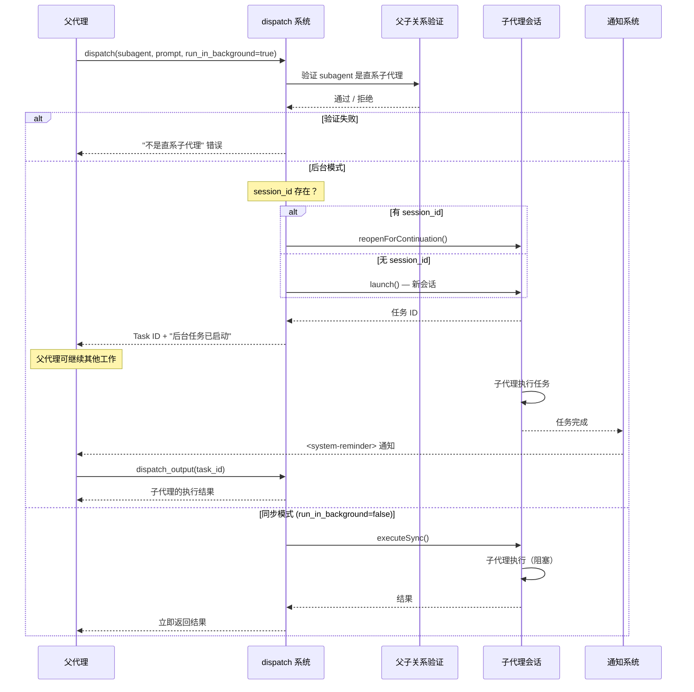

# 子代理

> **相关文档：** [协作图](/02-Guide/collaboration-graph) — 代理间拓扑编排 | [调度配置](/03-Reference/dispatch-config) — 并发与预算控制 | [创建角色](/02-Guide/create-a-role) — 角色创建基础

子代理（Subagent）是父角色通过 `dispatch` 工具委托工作的子级代理。借助子代理，你可以构建能协调多个专业子代理的角色，每个子代理都拥有自己的提示词、技能和配置。

## 适用场景

当角色需要将工作拆分给多个专家时，使用子代理。例如，团队主管可以将研究工作委托给一个子代理，将实现工作委托给另一个，每个子代理都针对其领域进行了调优。

## 内联声明

在父级 `role.yaml` 中直接定义子代理：

```yaml
# team-lead/role.yaml
name: Team Lead
description: Delegates work to specialist sub-agents
model: gpt-4
prompt: |
  You are a team lead. Delegate tasks to the appropriate specialist.
subagents:
  - name: Implementer
    description: Writes production code
    prompt: |
      You are a senior software engineer. Write clean, testable code.
    temperature: 0.1
```

`subagents:` 下的每个条目接受与常规 `role.yaml` 相同的字段（name、description、prompt、model 等）。

### auto_activate 与 locked

子代理支持两个额外的控制字段（定义于 `src/types.core.ts:76-78`）：

```yaml
subagents:
  - name: CodeReviewer
    description: Reviews code changes
    auto_activate:
      - review-function        # 子代理启动时自动激活这些函数
    locked: true               # auto_activate 的函数不能被停用
```

| 字段 | 类型 | 描述 |
|------|------|------|
| `auto_activate` | `string[]` | 子代理会话启动时自动激活的函数名称列表，无需用户使用 `|name|` 语法手动激活 |
| `locked` | `boolean` | 当为 `true` 时，`auto_activate` 指定的函数不能被 transition 或用户停用，防止关键功能被意外关闭 |

这两个字段在 `ResolvedSubAgent` 接口中透传（`src/types.core.ts:233-235`），并在运行时由函数状态机强制执行。

## 文件式声明

对于需要自己的技能或函数的子代理，使用目录结构：

```
team-lead/
├── role.yaml
└── subagents/
    └── researcher/
        ├── role.yaml
        └── skills/
            └── research-checklist/
                └── SKILL.md
```

文件式子代理会从 `subagents/` 目录自动发现。你可以混合使用两种方式：部分子代理内联声明，部分文件式声明。

## 配置继承

子代理在未显式设置时会从父级继承特定字段。

| 会被继承 | 不会被继承 |
|---|---|
| model | name |
| color | description |
| variant | prompt |
| temperature | prompt_file |
| top_p | skills |
| permission | functions |
| tools | |

`mode` 字段对于子代理始终被强制设为 `"subagent"`。

## 三层嵌套示例

以下是一个团队主管 → 实现者 → 代码检查器的三层嵌套结构：

```
team-lead/
├── role.yaml
├── subagents/
│   └── implementer/
│       ├── role.yaml
│       ├── functions/
│       │   └── code-writer.md
│       └── subagents/
│           └── linter/
│               ├── role.yaml
│               └── skills/
│                   └── style-check/
│                       └── SKILL.md
```

**`team-lead/role.yaml`**（根父级）：

```yaml
name: Team Lead
description: Orchestrates implementation work
subagents:
  - name: Implementer
    description: Writes production code
```

**`team-lead/subagents/implementer/role.yaml`**（中间层）：

```yaml
name: Implementer
description: Writes code and delegates linting
functions:
  - code-writer
subagents:
  - name: Linter
    description: Checks code style
    prompt: You are a strict code reviewer. Enforce project style guidelines.
```

**`team-lead/subagents/implementer/subagents/linter/role.yaml`**（叶子层）：

```yaml
name: Linter
description: Performs code style checks
skills:
  - style-check
```

生成的子代理 ID 链：

| 层级 | 子代理 ID |
|------|-----------|
| 根 | `team-lead` |
| 第 1 级 | `team-lead--implementer` |
| 第 2 级 | `team-lead--implementer--linter` |

调度时，父代理只能直接调度其直属子代理。例如，`team-lead` 可以调度 `team-lead--implementer`，而 `team-lead--implementer` 可以调度 `team-lead--implementer--linter`。跨层直接调度由 dispatch 系统的父子关系检查（`src/dispatch/tools.ts:52-58`）阻止。

## 命名约定

::: tip dispatch 效率建议
dispatch 的开销主要在子代理的**会话初始化**上。对于短任务（如读取文件后立即返回结果），使用同步 dispatch（`run_in_background=false`）更高效。对于长任务（代码生成、批量处理），使用后台 dispatch 可以让父代理同时做其他工作。在一轮会话中复用 `session_id` 继续模式可以避免反复初始化开销。
:::

## Dispatch 工具

父代理通过 `dispatch` 工具将工作委派给子代理（实现于 `src/dispatch/tools.ts:13-112`）：

```
dispatch(subagent="team-lead--implementer", prompt="实现认证模块", run_in_background=true)
```

### Dispatch 生命周期

以下是 dispatch 的完整生命周期时序——从父代理发起调用到获取结果的两种路径（后台 vs 同步）：



### 实践提示：选择后台模式还是同步模式

| 场景 | 推荐模式 | 原因 |
|------|---------|------|
| 读取文件、简单查询 | 同步 | 立即获取结果，无回调开销 |
| 代码生成、批量处理 | 后台 | 不阻塞父代理，可并行工作 |
| 多步骤任务链 | 后台 + `session_id` | 保留子代理上下文，避免重新初始化 |
| 结果需精确获取 | 后台 + `dispatch_output` | 等待完成通知后再拉取完整结果 |

### 工具签名

以下所有 dispatch 工具的参数 schema 定义于 `src/dispatch/tools.ts` 及 `src/dispatch/query/`。

#### `dispatch` — 启动任务

| 参数 | 类型 | 必需 | 描述 |
|------|------|------|------|
| `subagent` | `string` | 是 | 要调度的子代理 ID |
| `prompt` | `string` | 是 | 子代理的任务提示词 |
| `run_in_background` | `boolean` | 是 | 是否异步运行 |
| `description` | `string` | 否 | 人类可读的任务描述 |
| `session_id` | `string` | 否 | 前次 dispatch 的任务 ID，用于继续工作 |
| `timeout_ms` | `number` | 否 | 后台任务超时（毫秒），覆盖默认值 |

**后台任务**异步运行。父代理立即获得一个任务 ID，并在任务完成时收到 `<system-reminder>` 通知。收到通知后调用 `dispatch_output` 来获取结果。

**同步任务**会阻塞直到子代理完成（10 分钟超时）。用于父代理需要立即获取结果的短任务。

#### `dispatch_output` — 获取结果

| 参数 | 类型 | 必需 | 描述 |
|------|------|------|------|
| `task_id` | `string` | 是 | dispatch 返回的任务 ID |
| `max_chars` | `number` | 否 | 内联返回的最大字符数（默认 16000），超出则写入文件 |
| `offset` | `number` | 否 | 结果文本的起始位置（0 基） |
| `limit` | `number` | 否 | 从 offset 开始返回的最大字符数 |
| `tail` | `boolean` | 否 | 返回末尾的 max_chars 字符而非窗口 |

实现于 `src/dispatch/tools.ts:116-260`。

#### `dispatch_cancel` — 取消任务

| 参数 | 类型 | 必需 | 描述 |
|------|------|------|------|
| `task_id` | `string` | 是 | 要取消的任务 ID |

实现于 `src/dispatch/tools.ts:262-278`。

#### `dispatch_approve` — 批准人工审批任务

| 参数 | 类型 | 必需 | 描述 |
|------|------|------|------|
| `task_id` | `string` | 是 | 处于 `awaiting_approval` 状态的任务 ID |

将任务转换为完成状态并通知父会话。仅 `awaiting_approval` 状态的任务可被批准。实现于 `src/dispatch/tools.ts:280-309`。

#### `dispatch_reject` — 拒绝人工审批任务

| 参数 | 类型 | 必需 | 描述 |
|------|------|------|------|
| `task_id` | `string` | 是 | 处于 `awaiting_approval` 状态的任务 ID |
| `reason` | `string` | 否 | 拒绝原因 |

将任务转换为错误状态。实现于 `src/dispatch/tools.ts:311-345`。

#### `dispatch_metrics` — 运行时指标

| 参数 | 类型 | 必需 | 描述 |
|------|------|------|------|
| `format` | `"summary"` \| `"json"` | 否 | 输出格式，默认为 `"summary"` |
| `export_path` | `string` | 否 | 将 JSON 快照写入文件的路径 |

提供 dispatch 子系统的计数器（如 `dispatch_cancelled_total`）、仪表和直方图。需要设置 `ROLEBOX_METRICS` 环境变量。实现于 `src/dispatch/tools.ts:347-427`。

#### `dispatch_budget` — 预算查询

| 参数 | 类型 | 必需 | 描述 |
|------|------|------|------|
| `parent_session_id` | `string` | 否 | 要查询的会话 ID（默认当前会话） |

显示配置限额、当前使用量、剩余预算和使用百分比。实现于 `src/dispatch/tools.ts:429-446`。

#### `dispatch_status` — 任务存活检查

| 参数 | 类型 | 必需 | 描述 |
|------|------|------|------|
| `task_id` | `string` | 否 | 任务的 ID；省略时返回调用会话的所有任务摘要 |

检查任务存活状态，不抛出错误。与 `dispatch_output` 不同，即使任务仍在运行也不会报错。实现于 `src/dispatch/query/task-status.ts`。

#### `dispatch_progress` — 进度报告

| 参数 | 类型 | 必需 | 描述 |
|------|------|------|------|
| `task_id` | `string` | 是 | 要报告进度的任务 ID |
| `stage` | `string` | 是 | 当前阶段标签（如 `researching`、`implementing`） |
| `message` | `string` | 是 | 人类可读的进度描述 |
| `percentage` | `number` | 否 | 完成百分比（0-100） |

子代理调用此工具向父代理报告增量进度。百分比跨越 25/50/75/100% 阈值时会触发里程碑通知。实现于 `src/dispatch/progress/progress-tools.ts:85-133`。

#### `dispatch_checkpoint` — 检查点保存

| 参数 | 类型 | 必需 | 描述 |
|------|------|------|------|
| `task_id` | `string` | 是 | 检查点所属的任务 ID |
| `phase` | `string` | 是 | 当前阶段标签 |
| `completed_items` | `string[]` | 是 | 已完成的项 |
| `remaining_items` | `string[]` | 是 | 待处理的项 |
| `metadata` | `object` | 否 | 扩展元数据 |

保存中间执行检查点。当任务重试时，检查点上下文自动注入到提示中，避免重复工作。实现于 `src/dispatch/query/checkpoint-tools.ts`。

### 后台 vs 同步选择指南

| 场景 | 推荐 |
|------|------|
| 需要立即获取结果的短任务 | 同步（`run_in_background=false`） |
| 耗时操作（代码生成、批量处理） | 后台（`run_in_background=true`） |
| 需要任务之间传递上下文 | `session_id` 继续模式 |
| 需要精确任务结果 | 后台 + `dispatch_output` |
| 仅需确认任务已启动 | 后台，忽略返回值 |

### 会话继续

传入 `session_id`（之前 dispatch 返回的任务 ID）可以在同一个 opencode 会话中重新提示子代理，保留完整对话历史：

```
dispatch(subagent="team-lead--implementer", session_id="<previous-task-id>", prompt="现在添加测试", run_in_background=true)
```

实现于 `src/dispatch/tools.ts:72-74`：当提供 `session_id` 时，调度器调用 `reopenForContinuation()` 而非 `launch()`，重用之前的子代理会话。

::: info
`session_id` 继续模式的核心优势：子代理保留之前轮次的所有上下文（已读取的文件、已执行的命令、已做出的决策）。这对于多步骤工作流特别有用，例如"先分析代码，然后根据分析结果实现测试"，无需在每次 dispatch 中重复传递上下文。
:::

### 单任务超时

后台任务接受可选的 `timeout_ms` 参数来覆盖默认的 15 分钟超时：

```
dispatch(subagent="team-lead--implementer", prompt="长时间任务", run_in_background=true, timeout_ms=600000)
```

不设置的话，长时间运行的任务会被回收。

### 并发控制

后台任务受每个模型的信号量限制（默认：每个模型最多 5 个并发任务）。当所有槽位都被占用时，新任务进入有界先进先出队列（默认深度：10）。如果队列也已满，dispatch 会立即失败并返回错误。每个模型保留一个槽位用于同步 dispatch，以确保同步调用不会因后台队列满载而饿死。

并发状态可通过 `dispatch_status` 查询。

## 子代理的技能和函数

子代理可以拥有自己的 `skills/` 和 `functions/` 目录（仅限文件式声明）。子代理的技能会以 `rolebox--{父ID}--{子ID}--{技能名}` 的形式符号链接到 opencode。

## 限制

文件式子代理支持通过嵌套的 `subagents/` 目录进行最多 `maxDepth=3`（可配置）的递归嵌套。不支持运行时创建子代理，子代理之间也不能直接通信。所有协调工作都通过父代理进行。`--` 分隔符在每一层都会串联（例如 `grandparent--parent--child`）。

## 问题排查配方

以下配方帮助你解决子代理使用中常见的三类问题。每个配方从现象出发，提供排查步骤和修正方案。

### 配方 1：我的子代理没有出现

**问题陈述：** 你在 `role.yaml` 中声明了一个子代理，但调用 `dispatch` 时系统提示"Invalid subagent"，目标子代理不在可用列表中。

**排查步骤：**

1. **检查目录结构和文件名**（来源：`examples/team-lead/`）
   ```
   team-lead/
   ├── role.yaml             # 父角色，此处声明子代理
   └── subagents/
       └── researcher/
           └── role.yaml     # 文件式子代理
   ```
   - 文件式子代理必须位于 `subagents/{name}/role.yaml`，名称不匹配会导致发现失败
   - 如果使用内联声明，检查 `role.yaml` 中 `subagents` 字段的缩进

2. **确认子代理 ID 格式**（来源：`subagents.md:141-148`）
   - 嵌套子代理的 ID 以 `--` 分隔：如 `team-lead--implementer--linter`
   - 父代理只能调度直属子代理（`subagents.md:148`），跨层调度会被阻止
   - 用 `rolebox info <role-name>` 查看所有已解析的子代理 ID

3. **检查 role.yaml 语法**
   ```yaml
   # ❌ 错误 — subagents 被当作键值对而非列表
   subagents:
     researcher:
       description: Researches code patterns

   # ✅ 正确 — subagents 是列表（以 - 开头）
   subagents:
     - name: Researcher
       description: Researches code patterns
       prompt: Research the relevant code...
   ```

**修正后的配置示例：**

```yaml
name: Team Lead
description: Delegates work to specialist sub-agents
subagents:
  - name: Researcher
    description: Finds and synthesizes information
    prompt: You are a research specialist. Find accurate information.
    permission:
      allow: [Read, Grep, Glob]
```

**验证方法：** 保存后重启 opencode，运行：
```
rolebox info team-lead
```
输出应显示 Researcher 在子代理列表中。

### 配方 2：子代理返回结果为空

**问题陈述：** 执行 `dispatch` 后子代理返回成功，但 `dispatch_output` 的结果为空或只有简短确认，没有实质内容。

**排查步骤：**

1. **检查子代理的 `prompt` 字段是否为空**（来源：`subagents.md:33`——"每个条目接受与常规 role.yaml 相同的字段"）
   - `prompt` 是子代理的系统提示。如果为空或太简短，子代理没有充足上下文来执行任务
   - 子代理**不会**自动继承父角色或内联声明中的 prompt（`create-a-role.md:227-235`）

2. **检查子代理的权限是否足够**
   ```yaml
   # ❌ 错误 — 子代理只有读权限但任务需要写文件
   - name: Implementer
     description: Writes code
     permission:
       allow: [Read, Grep, Glob]   # 没有 Edit/Write，无法完成写操作

   # ✅ 正确 — 根据任务授予适当权限
   - name: Implementer
     description: Writes code
     permission:
       allow: [Read, Grep, Glob, Bash, Edit, Write]
   ```

3. **确认 dispatch 参数正确**（来源：`subagents.md:170-177`）
   ```
   # ❌ 错误 — 缺少 prompt 参数
   dispatch(subagent="team-lead--implementer", run_in_background=true)

   # ✅ 正确 — 所有必需参数完整
   dispatch(subagent="team-lead--implementer", prompt="实现用户认证模块", run_in_background=true)
   ```

**排查命令：**

```bash
# 查看子代理的完整配置
rolebox info team-lead --verbose

# 审查运行时状态文件
cat .rolebox/state/dispatch-task-*.json | grep -E "(status|result)"
```

### 配方 3：子代理使用了错误的模型

**问题陈述：** 你的父角色使用 `gpt-4`，但子代理实际运行在默认模型上（如 `claude-3-haiku`），导致输出质量不如预期。

**原因分析**（来源：`create-a-role.md:227-235`，子代理字段继承规则）：

子代理**不会自动继承**父角色的 `model` 字段。这是一个常见误区——在父角色中设置 `model: gpt-4` 不会传播给子代理。除非子代理显式声明 `model`，否则使用平台默认模型。

**修正前（子代理使用默认模型）：**

```yaml
name: Team Lead
model: gpt-4
prompt: You are a team lead.
subagents:
  - name: Researcher
    description: Researches topics
    prompt: Research the relevant code...
    # ❌ model 缺失 — 使用默认模型
```

**修正后（子代理显式声明 model）：**

```yaml
name: Team Lead
model: gpt-4
prompt: You are a team lead.
subagents:
  - name: Researcher
    description: Researches topics
    model: gpt-4                 # ✅ 显式声明 — 不会继承父角色的 model
    prompt: Research the relevant code...
```

**排查步骤：**

1. **检查子代理的 `model` 字段**：每个需要特定模型的子代理都必须显式声明
2. **使用 `rolebox info` 查看解析结果**：
   ```bash
   rolebox info team-lead --verbose
   ```
   输出中每个子代理的 `model` 字段会显示实际使用的模型
3. **不要在父角色中为子代理指定模型**：父角色中的 `model` 是父角色的模型，子代理需要自己的 `model` 声明（来源：`create-a-role.md:232-233`）

**继承速查表：**

| 是否从父角色继承 | 字段 |
|---|---|
| ❌ 不会自动继承 | `model`、`temperature`、`top_p`、`skills`、`permission`、`functions` |
| ✅ 需要显式声明 | `name`、`prompt` |
| ✅ 可选声明 | `description`、`color`、`tools` |

## 下一步

- [协作图](/02-Guide/collaboration-graph) — 通过结构化工作流编排多个子代理
- [创建角色](/02-Guide/create-a-role) — 了解如何创建和配置 rolebox 角色
