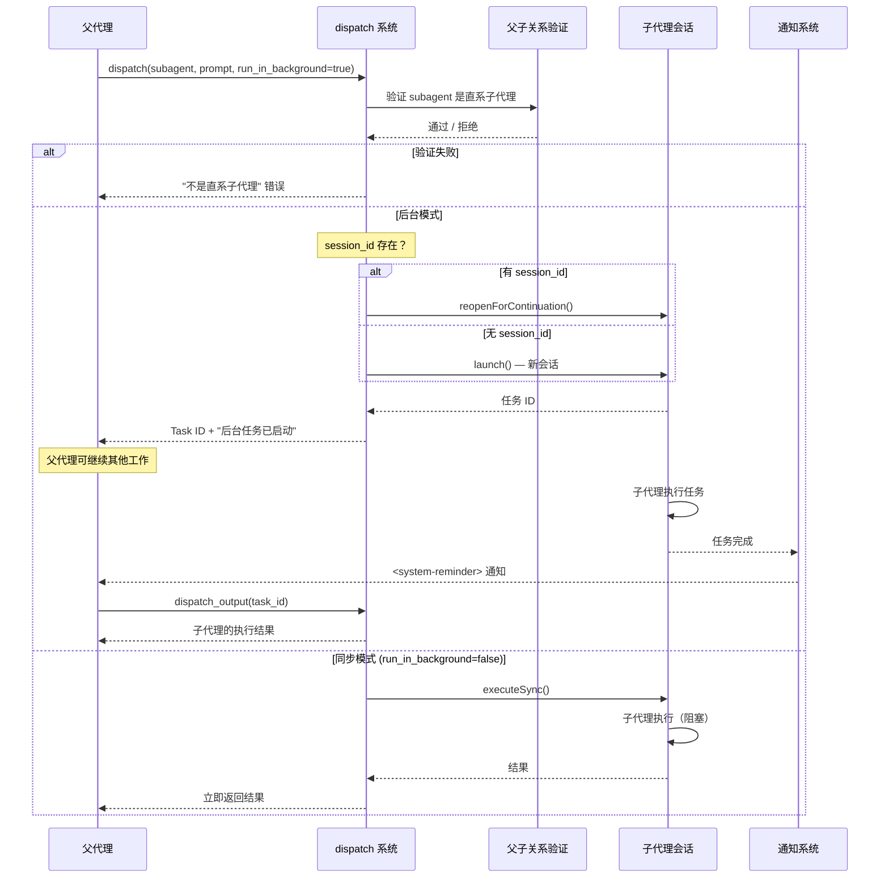

# 子代理

> **相关文档：** [协作图](/02-Guide/collaboration-graph) — 代理间拓扑编排 | [调度配置](/03-Reference/dispatch-config) — 并发与预算控制 | [创建角色](/02-Guide/create-a-role) — 角色创建基础

子代理（Subagent）是父角色委托工作的子级代理。在 rolebox 中，委托通过**图执行引擎（graph engine）**完成——这是 rolebox 统一的多代理编排引擎，它把"谁把工作传给谁"建模成一张有向图来执行：父角色将每次委托建模为一个图节点（`{agent, prompt}` 元组），由引擎负责派发、信号路由与结果回收。`dispatch_*` 工具仍以兼容层形式存在。借助子代理，你可以构建能协调多个专业子代理的角色，每个子代理都拥有自己的提示词、技能和配置。

## 适用场景

当角色需要将工作拆分给多个专家时，使用子代理。例如，团队主管可以将研究工作委托给一个子代理，将实现工作委托给另一个，每个子代理都针对其领域进行了调优。

## 内联声明

在父级 `role.yaml` 中直接定义子代理：

```yaml
# team-lead/role.yaml
name: Team Lead
description: Delegates work to specialist sub-agents
model: gpt-4
prompt: |
  You are a team lead. Delegate tasks to the appropriate specialist.
subagents:
  - name: Implementer
    description: Writes production code
    prompt: |
      You are a senior software engineer. Write clean, testable code.
    temperature: 0.1
```

`subagents:` 下的每个条目接受与常规 `role.yaml` 相同的字段（name、description、prompt、model 等）。

### auto_activate 与 locked

子代理支持两个额外的控制字段（定义于 `src/types.core.ts:76-78`）：

```yaml
subagents:
  - name: CodeReviewer
    description: Reviews code changes
    auto_activate:
      - review-function        # 子代理启动时自动激活这些函数
    locked: true               # auto_activate 的函数不能被停用
```

| 字段 | 类型 | 描述 |
|------|------|------|
| `auto_activate` | `string[]` | 子代理会话启动时自动激活的函数名称列表，无需用户使用 `|name|` 语法手动激活 |
| `locked` | `boolean` | 当为 `true` 时，`auto_activate` 指定的函数不能被 transition 或用户停用，防止关键功能被意外关闭 |

这两个字段在 `ResolvedSubAgent` 接口中透传（`src/types.core.ts:233-235`），并在运行时由函数状态机强制执行。

## 文件式声明

对于需要自己的技能或函数的子代理，使用目录结构：

```
team-lead/
├── role.yaml
└── subagents/
    └── researcher/
        ├── role.yaml
        └── skills/
            └── research-checklist/
                └── SKILL.md
```

文件式子代理会从 `subagents/` 目录自动发现。你可以混合使用两种方式：部分子代理内联声明，部分文件式声明。

## 配置继承

子代理在未显式设置时会从父级继承特定字段。

| 会被继承 | 不会被继承 |
|---|---|
| model | name |
| color | description |
| variant | prompt |
| temperature | prompt_file |
| top_p | skills |
| permission | functions |
| tools | |

`mode` 字段对于子代理始终被强制设为 `"subagent"`。

## 三层嵌套示例

以下是一个团队主管 → 实现者 → 代码检查器的三层嵌套结构：

```
team-lead/
├── role.yaml
├── subagents/
│   └── implementer/
│       ├── role.yaml
│       ├── functions/
│       │   └── code-writer.md
│       └── subagents/
│           └── linter/
│               ├── role.yaml
│               └── skills/
│                   └── style-check/
│                       └── SKILL.md
```

**`team-lead/role.yaml`**（根父级）：

```yaml
name: Team Lead
description: Orchestrates implementation work
subagents:
  - name: Implementer
    description: Writes production code
```

**`team-lead/subagents/implementer/role.yaml`**（中间层）：

```yaml
name: Implementer
description: Writes code and delegates linting
functions:
  - code-writer
subagents:
  - name: Linter
    description: Checks code style
    prompt: You are a strict code reviewer. Enforce project style guidelines.
```

**`team-lead/subagents/implementer/subagents/linter/role.yaml`**（叶子层）：

```yaml
name: Linter
description: Performs code style checks
skills:
  - style-check
```

生成的子代理 ID 链：

| 层级 | 子代理 ID |
|------|-----------|
| 根 | `team-lead` |
| 第 1 级 | `team-lead--implementer` |
| 第 2 级 | `team-lead--implementer--linter` |

调度时，父代理只能直接调度其直属子代理。例如，`team-lead` 可以调度 `team-lead--implementer`，而 `team-lead--implementer` 可以调度 `team-lead--implementer--linter`。跨层直接调度由 dispatch 系统的父子关系检查（`src/dispatch/tools.ts:52-58`）阻止。

## 命名约定

::: tip dispatch 效率建议
dispatch 的开销主要在子代理的**会话初始化**上。对于短任务（如读取文件后立即返回结果），使用同步 dispatch（`run_in_background=false`）更高效。对于长任务（代码生成、批量处理），使用后台 dispatch 可以让父代理同时做其他工作。在一轮会话中复用 `session_id` 继续模式可以避免反复初始化开销。
:::

## 委托：图执行引擎

rolebox `1.0.0` 将多代理协作统一到**图执行引擎**（`src/graph/engine/`）上（CHANGELOG.md:12 引入）。父角色通过命令式 `graph_*` 工具将每次委托建模为一个图节点：

```
graph_create(name="<任务名>")
graph_add_node(graph_id, id="review", agent="team-lead--implementer", prompt="实现认证模块")
graph_run(graph_id, node_id="review")
```

节点是角色无关的 `{agent, prompt}` 元组（`src/types.graph-v2.ts:65-83`）。`graph_run` 是**非阻塞**的——它派发就绪节点后立即返回，当所有节点完成时引擎向父会话注入 `[GRAPH COMPLETE]` 系统提醒；父代理在下一轮通过 `graph_status(graph_id, include_output=true)` 读取结果一次。这是"派发-唤醒"（yield-and-wake）模型，取代了旧的阻塞等待。

核心 `graph_*` 工具（参数 schema 见 `src/graph/tools/index.ts`）：

| 工具 | 作用 |
|------|------|
| `graph_create` | 创建一个图/编排上下文，返回 `graph_id` |
| `graph_add_node` | 注册一个 `{id, agent, prompt}` 节点（可含 `needs_approval`（需要人工批准）、`join`、`budget`、`completion_condition`） |
| `graph_add_edge` | 在两个节点间添加有向边（`type`：`always` / `on_signal`（收到指定信号时激活）/ `on_condition`（指定条件为真时激活）） |
| `graph_add_loop` | 声明一个有界循环组（loop group，可重复执行的一组节点，带最大轮数上限；`max_traversals` 为硬上限） |
| `graph_run` | 非阻塞派发就绪节点并返回 |
| `graph_status` | 查询节点/循环/图的运行状态 |
| `graph_cancel` | 取消图、节点或循环组 |
| `graph_approve` | 批准/拒绝一个阻塞的 `needs_approval` 节点（`action: approve\|reject`） |

需要按顺序运行的多步工作，用 `graph_add_edge` 连接节点后整体运行；循环修订用 `graph_add_loop`。完整 API（应用程序接口，Application Programming Interface）与高级模式见[图执行引擎](/04-Advanced/graph-engine)。

::: tip 图工具相关术语
- **needs_approval**：一种节点标记，表示"需要人工批准"；图引擎会在此暂停等待人类确认。
- **审批门（HITL，人工在环，Human-in-the-loop）**：图执行到需要人工确认的节点时暂停，等人工批准后再继续。
- **join 评估**：图引擎判断某节点的所有上游输入是否齐备、从而是否满足执行条件的评估。
- **on_signal / on_condition**：图边的两种触发方式——分别表示"收到指定信号时激活这条边"和"指定条件为真时激活这条边"。
- **级联取消（cascade）**：取消一个节点时，连带取消其所有下游依赖节点。
- **检查点（checkpoint）**：子代理执行期间保存的进度快照，重试时可注入，避免重复已完成的工作。
- **台账（ledger）**：按会话或函数记录的信号写入记录，用于追踪信号历史。
:::

## Dispatch 兼容工具

`dispatch_*` 工具作为兼容层保留（`src/dispatch/tools.ts:14-24`），供仍使用命令式调用的调用方使用。它与 `graph_*` 是两个独立命名空间，可共存。父代理通过 `dispatch` 工具将工作委派给子代理（`src/dispatch/tools.ts:26-139`）：

```
dispatch(subagent="team-lead--implementer", prompt="实现认证模块", run_in_background=true)
```

### Dispatch 生命周期

以下是 dispatch 的完整生命周期时序——从父代理发起调用到获取结果的两种路径（后台 vs 同步）：


```mermaid
sequenceDiagram
    participant Parent as 父代理
    participant Dispatch as dispatch 系统
    participant Validator as 父子关系验证
    participant SubAgent as 子代理会话
    participant Notify as 通知系统

    Parent->>Dispatch: dispatch(subagent, prompt, run_in_background=true)
    Dispatch->>Validator: 验证 subagent 是直系子代理
    Validator-->>Dispatch: 通过 / 拒绝

    alt 验证失败
        Dispatch-->>Parent: "不是直系子代理" 错误
    else 后台模式
        Note over Dispatch: session_id 存在？
        alt 有 session_id
            Dispatch->>SubAgent: reopenForContinuation()
        else 无 session_id
            Dispatch->>SubAgent: launch() — 新会话
        end
        SubAgent-->>Dispatch: 任务 ID
        Dispatch-->>Parent: Task ID + "后台任务已启动"

        Note over Parent: 父代理可继续其他工作
        SubAgent->>SubAgent: 子代理执行任务
        SubAgent-->>Notify: 任务完成
        Notify-->>Parent: <system-reminder> 通知

        Parent->>Dispatch: dispatch_output(task_id)
        Dispatch-->>Parent: 子代理的执行结果
    else 同步模式 (run_in_background=false)
        Dispatch->>SubAgent: executeSync()
        SubAgent->>SubAgent: 子代理执行（阻塞）
        SubAgent-->>Dispatch: 结果
        Dispatch-->>Parent: 立即返回结果
    end
```

### 实践提示：选择后台模式还是同步模式

| 场景 | 推荐模式 | 原因 |
|------|---------|------|
| 读取文件、简单查询 | 同步 | 立即获取结果，无回调开销 |
| 代码生成、批量处理 | 后台 | 不阻塞父代理，可并行工作 |
| 多步骤任务链 | 后台 + `session_id` | 保留子代理上下文，避免重新初始化 |
| 结果需精确获取 | 后台 + `dispatch_output` | 等待完成通知后再拉取完整结果 |

### 工具签名

以下所有 dispatch 工具的参数 schema 定义于 `src/dispatch/tools.ts` 及 `src/dispatch/query/`。

#### `dispatch` — 启动任务

| 参数 | 类型 | 必需 | 描述 |
|------|------|------|------|
| `subagent` | `string` | 是 | 要调度的子代理 ID |
| `prompt` | `string` | 是 | 子代理的任务提示词 |
| `run_in_background` | `boolean` | 是 | 是否异步运行 |
| `description` | `string` | 否 | 人类可读的任务描述 |
| `session_id` | `string` | 否 | 前次 dispatch 的任务 ID，用于继续工作 |
| `timeout_ms` | `number` | 否 | 后台任务超时（毫秒），覆盖默认值 |

**后台任务**异步运行。父代理立即获得一个任务 ID，并在任务完成时收到 `<system-reminder>` 通知。收到通知后调用 `dispatch_output` 来获取结果。

**同步任务**会阻塞直到子代理完成（10 分钟超时）。用于父代理需要立即获取结果的短任务。

#### `dispatch_output` — 获取结果

| 参数 | 类型 | 必需 | 描述 |
|------|------|------|------|
| `task_id` | `string` | 是 | dispatch 返回的任务 ID |
| `max_chars` | `number` | 否 | 内联返回的最大字符数（默认 16000），超出则写入文件 |
| `offset` | `number` | 否 | 结果文本的起始位置（0 基） |
| `tail` | `boolean` | 否 | 返回末尾的 max_chars 字符而非窗口 |

实现于 `src/dispatch/tools.ts:141-275`。仅在收到任务完成的 `<system-reminder>` **之后**调用——切勿轮询。

#### `dispatch_cancel` — 取消任务

| 参数 | 类型 | 必需 | 描述 |
|------|------|------|------|
| `task_id` | `string` | 是 | 要取消的任务 ID |

实现于 `src/dispatch/tools.ts:277-293`。

#### `dispatch_metrics` — 运行时指标

| 参数 | 类型 | 必需 | 描述 |
|------|------|------|------|
| `format` | `"summary"` \| `"json"` | 否 | 输出格式，默认为 `"summary"` |
| `export_path` | `string` | 否 | 将 JSON 快照写入文件的路径 |

提供 dispatch 子系统的计数器、仪表和直方图。需要设置 `ROLEBOX_METRICS` 环境变量。实现于 `src/dispatch/tools.ts:295-375`。

#### `dispatch_status` — 任务存活检查

| 参数 | 类型 | 必需 | 描述 |
|------|------|------|------|
| `task_id` | `string` | 否 | 任务的 ID；省略时返回调用会话的所有任务摘要 |

检查任务存活状态，不抛出错误。与 `dispatch_output` 不同，即使任务仍在运行也不会报错。实现于 `src/dispatch/query/task-status.ts`。

::: warning v1.0.0 移除的工具
`dispatch_approve`、`dispatch_reject`、`dispatch_budget`、`dispatch_progress`、`dispatch_checkpoint` 已在 `1.0.0` 随多代理工作向图引擎整合时移除（`src/dispatch/tools.ts:16-20`；见 `CHANGELOG.md:8`）。它们的功能由 `graph_*` 工具取代：
- **人工审批** → `graph_approve(graph_id, node_id, action="approve"\|"reject", reason?)`（`src/graph/tools/approve-tools.ts:42-87`）
- **预算查询** → `graph_status(..., include_budget=true)` 或 `graph_create(..., budget={...})`
- **进度报告 / 检查点** → 由引擎信号账本（`signalLedger`）与节点制品/证据记录承担
:::

### 后台 vs 同步选择指南

| 场景 | 推荐 |
|------|------|
| 需要立即获取结果的短任务 | 同步（`run_in_background=false`） |
| 耗时操作（代码生成、批量处理） | 后台（`run_in_background=true`） |
| 需要任务之间传递上下文 | `session_id` 继续模式 |
| 需要精确任务结果 | 后台 + `dispatch_output` |
| 仅需确认任务已启动 | 后台，忽略返回值 |

### 会话继续

传入 `session_id`（之前 dispatch 返回的任务 ID）可以在同一个 opencode 会话中重新提示子代理，保留完整对话历史：

```
dispatch(subagent="team-lead--implementer", session_id="<previous-task-id>", prompt="现在添加测试", run_in_background=true)
```

实现于 `src/dispatch/tools.ts:72-74`：当提供 `session_id` 时，调度器调用 `reopenForContinuation()` 而非 `launch()`，重用之前的子代理会话。

::: info
`session_id` 继续模式的核心优势：子代理保留之前轮次的所有上下文（已读取的文件、已执行的命令、已做出的决策）。这对于多步骤工作流特别有用，例如"先分析代码，然后根据分析结果实现测试"，无需在每次 dispatch 中重复传递上下文。
:::

### 单任务超时

后台任务接受可选的 `timeout_ms` 参数来覆盖默认的 15 分钟超时：

```
dispatch(subagent="team-lead--implementer", prompt="长时间任务", run_in_background=true, timeout_ms=600000)
```

不设置的话，长时间运行的任务会被回收。

### 并发控制

后台任务受每个模型的信号量限制（默认：每个模型最多 5 个并发任务）。当所有槽位都被占用时，新任务进入有界先进先出队列（默认深度：10）。如果队列也已满，dispatch 会立即失败并返回错误。每个模型保留一个槽位用于同步 dispatch，以确保同步调用不会因后台队列满载而饿死。

并发状态可通过 `dispatch_status` 查询。

## 子代理的技能和函数

子代理可以拥有自己的 `skills/` 和 `functions/` 目录（仅限文件式声明）。子代理的技能会以 `rolebox--{父ID}--{子ID}--{技能名}` 的形式符号链接到 opencode。

## 限制

文件式子代理支持通过嵌套的 `subagents/` 目录进行最多 `maxDepth=3`（可配置）的递归嵌套。不支持运行时创建子代理，子代理之间也不能直接通信。所有协调工作都通过父代理进行。`--` 分隔符在每一层都会串联（例如 `grandparent--parent--child`）。

## 问题排查配方

以下配方帮助你解决子代理使用中常见的三类问题。每个配方从现象出发，提供排查步骤和修正方案。

### 配方 1：我的子代理没有出现

**问题陈述：** 你在 `role.yaml` 中声明了一个子代理，但调用 `dispatch` 时系统提示"Invalid subagent"，目标子代理不在可用列表中。

**排查步骤：**

1. **检查目录结构和文件名**（来源：`examples/team-lead/`）
   ```
   team-lead/
   ├── role.yaml             # 父角色，此处声明子代理
   └── subagents/
       └── researcher/
           └── role.yaml     # 文件式子代理
   ```
   - 文件式子代理必须位于 `subagents/{name}/role.yaml`，名称不匹配会导致发现失败
   - 如果使用内联声明，检查 `role.yaml` 中 `subagents` 字段的缩进

2. **确认子代理 ID 格式**（来源：`subagents.md:141-148`）
   - 嵌套子代理的 ID 以 `--` 分隔：如 `team-lead--implementer--linter`
   - 父代理只能调度直属子代理（`subagents.md:148`），跨层调度会被阻止
   - 用 `rolebox info <role-name>` 查看所有已解析的子代理 ID

3. **检查 role.yaml 语法**
   ```yaml
   # ❌ 错误 — subagents 被当作键值对而非列表
   subagents:
     researcher:
       description: Researches code patterns

   # ✅ 正确 — subagents 是列表（以 - 开头）
   subagents:
     - name: Researcher
       description: Researches code patterns
       prompt: Research the relevant code...
   ```

**修正后的配置示例：**

```yaml
name: Team Lead
description: Delegates work to specialist sub-agents
subagents:
  - name: Researcher
    description: Finds and synthesizes information
    prompt: You are a research specialist. Find accurate information.
    permission:
      allow: [Read, Grep, Glob]
```

**验证方法：** 保存后重启 opencode，运行：
```
rolebox info team-lead
```
输出应显示 Researcher 在子代理列表中。

### 配方 2：子代理返回结果为空

**问题陈述：** 执行 `dispatch` 后子代理返回成功，但 `dispatch_output` 的结果为空或只有简短确认，没有实质内容。

**排查步骤：**

1. **检查子代理的 `prompt` 字段是否为空**（来源：`subagents.md:33`——"每个条目接受与常规 role.yaml 相同的字段"）
   - `prompt` 是子代理的系统提示。如果为空或太简短，子代理没有充足上下文来执行任务
   - 子代理**不会**自动继承父角色或内联声明中的 prompt（`create-a-role.md:227-235`）

2. **检查子代理的权限是否足够**
   ```yaml
   # ❌ 错误 — 子代理只有读权限但任务需要写文件
   - name: Implementer
     description: Writes code
     permission:
       allow: [Read, Grep, Glob]   # 没有 Edit/Write，无法完成写操作

   # ✅ 正确 — 根据任务授予适当权限
   - name: Implementer
     description: Writes code
     permission:
       allow: [Read, Grep, Glob, Bash, Edit, Write]
   ```

3. **确认 dispatch 参数正确**（来源：`subagents.md:170-177`）
   ```
   # ❌ 错误 — 缺少 prompt 参数
   dispatch(subagent="team-lead--implementer", run_in_background=true)

   # ✅ 正确 — 所有必需参数完整
   dispatch(subagent="team-lead--implementer", prompt="实现用户认证模块", run_in_background=true)
   ```

**排查命令：**

```bash
# 查看子代理的完整配置
rolebox info team-lead

# 审查运行时状态文件
cat .rolebox/state/dispatch-task-*.json | grep -E "(status|result)"
```

### 配方 3：子代理使用了错误的模型

**问题陈述：** 你的父角色使用 `gpt-4`，但子代理实际运行在默认模型上（如 `claude-3-haiku`），导致输出质量不如预期。

**原因分析**（来源：`src/loader/role-loader.ts:95-159`，`applyInheritance`）：子代理的 `model` 遵循继承规则——若父角色设置了 `model` 且子代理未显式覆盖，子代理会继承父角色的 `model`（`INHERITABLE_FIELDS`，`src/constants.ts:123-131`）。如果子代理运行在默认模型上，说明：

- 父角色**没有**声明 `model`，且子代理也未声明 → 使用平台默认模型
- 子代理显式声明了 `model` → 使用子代理自己的声明（覆盖继承值）

**修正前（父角色未声明 model，子代理使用默认模型）：**

```yaml
name: Team Lead
prompt: You are a team lead.
subagents:
  - name: Researcher
    description: Researches topics
    prompt: Research the relevant code...
    # 父角色与子代理均未声明 model → 使用默认模型
```

**修正方式一（在父角色声明 model，子代理继承）：**

```yaml
name: Team Lead
model: gpt-4                 # ✅ 父角色声明 → 子代理未覆盖时继承
prompt: You are a team lead.
subagents:
  - name: Researcher
    description: Researches topics
    prompt: Research the relevant code...
```

**修正方式二（子代理显式声明，覆盖父角色）：**

```yaml
name: Team Lead
model: gpt-4
prompt: You are a team lead.
subagents:
  - name: Researcher
    description: Researches topics
    model: claude-3-haiku     # ✅ 显式覆盖父角色的 model
    prompt: Research the relevant code...
```

**排查步骤：**

1. **用 `rolebox info` 查看解析结果**：
   ```bash
   rolebox info team-lead
   ```
   （`--json` 可输出机器可读字段；`info` 命令没有 `--verbose` 标志，参数见 `src/cli/commands/info.ts:265-279`）
2. **确认父角色与子代理的 `model` 声明**：子代理未声明 `model` 时继承父角色；父角色也未声明则使用平台默认模型

**继承速查表（`applyInheritance`，`src/loader/role-loader.ts:139-149`）：**

| 是否从父角色继承 | 字段 |
|---|---|
| ✅ 自动继承（未显式声明时） | `model`、`color`、`variant`、`temperature`、`top_p`、`permission`、`tools` |
| ❌ 不继承 | `name`、`description`、`prompt` / `prompt_file`、`skills`、`opencode_skills`、`functions`、`disable_functions`、`subagents`、`auto_activate`、`locked` |

## 下一步

- [协作图](/02-Guide/collaboration-graph) — 通过结构化工作流编排多个子代理
- [创建角色](/02-Guide/create-a-role) — 了解如何创建和配置 rolebox 角色
