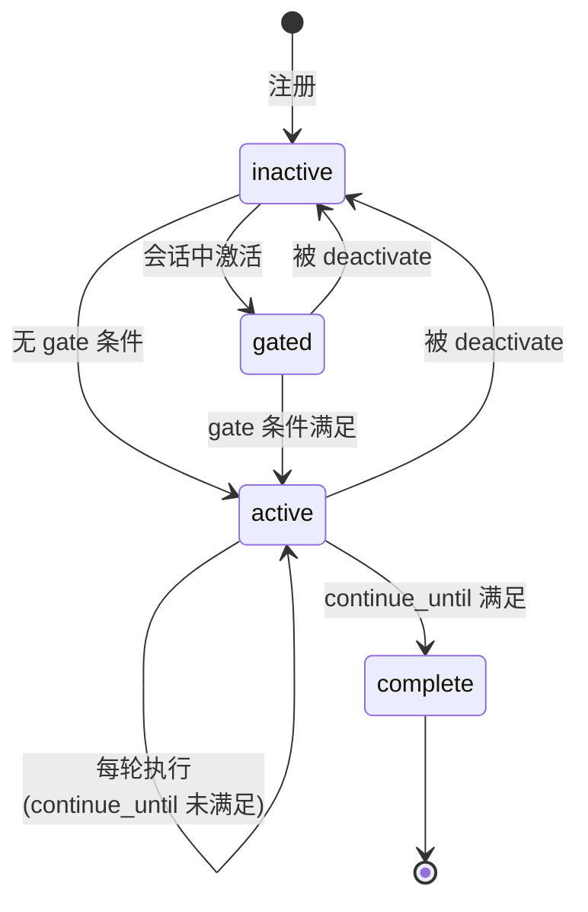

# 编写函数

> **相关文档：** [函数系统](/02-Guide/functions) — 函数解析顺序与激活机制 | [技能系统](/02-Guide/skills) — 函数与技能的对比 | [创建角色](/02-Guide/create-a-role) — 完整的角色创建指南

函数是可组合的行为模块，用户通过 `|name|` 语法激活。激活后，函数的指令会注入到系统提示中，并在整个会话期间保持活跃。

## 基础函数文件

每个函数是一个带有 YAML frontmatter 的 Markdown 文件：

```markdown
---
name: review
description: Code review mode with configurable focus
params:
  focus: correctness
  severity: normal
---

You are reviewing code with focus on **{focus}** at **{severity}** level.

Check for:
- Logic errors and edge cases
- Performance implications
- Consistency with existing patterns
```

将文件保存到 `{roleDir}/functions/review.md` 即可被角色加载。

## Frontmatter 完整规范

| 字段 | 类型 | 必需 | 描述 |
|------|------|------|------|
| `name` | string | 建议 | 函数名称，如果未提供则从文件名推导 |
| `description` | string | 是 | 人类可读的描述 |
| `params` | object | 否 | 参数声明（名称 → 默认值） |
| `phase` | string | 否 | 执行阶段标签（如 `plan`、`execute`） |
| `priority` | number | 否 | 执行优先级（较低值优先） |
| `requires` | string[] | 否 | 依赖的函数名称列表 |
| `produces` | string | 否 | 此函数产生的制品名称 |
| `consumes` | string | 否 | 此函数消费的制品名称 |
| `gate` | Condition | 否 | 门控条件 — 满足后才激活 |
| `continue_until` | Condition | 否 | 自动延续条件 — 满足后标记完成 |
| `continue_max` | number | 否 | 最大延续轮数（默认 5） |
| `requires_evidence` | string[] | 否 | 自动延续前必须观察到的证据标签 |
| `observe` | ObserveSpec[] | 否 | 生命周期观察器定义 |
| `transitions` | TransitionSpec[] | 否 | 状态转换规则 |
| `state_schema_version` | number | 否 | 状态 schema 版本（用于向前兼容） |
| `handlers` | string | 否 | Tier-2 处理器模块路径 |

### 参数化函数

函数通过两种语法风格接受参数（`src/function/parser.ts:44-94`）：

**位置参数**（按 frontmatter 中 `params` 声明顺序映射）：
```
|review:security,strict| check the auth module
```

**键值对**（显式命名）：
```
|review focus=security severity=strict| check the auth module
```

**混合使用**：
```
|plan|review:security| analyze this PR
```

未提供的参数回退到声明时的默认值。没有 `params` 声明的函数会忽略传入的参数。

解析优先级（`src/function/parser.ts:65-94`）：
1. 优先尝试冒号语法（`name:arg1,arg2`）
2. 回退到键值对语法（`name key=val`）
3. 最终视为纯名称（无参数）

### 解析优先级（文件级别）

1. `{roleDir}/functions/{name}.md` — 角色本地覆盖
2. `~/.config/opencode/functions/{name}.md` — 全局用户定义
3. 内置函数（`plan`、`execute`、`loop`）— rolebox 提供

::: tip 函数名称唯一性
自定义函数的名称不能与内置函数（`plan`、`execute`、`loop`）或已经存在的角色级函数重名。如果角色本地目录和全局目录存在同名函数，角色本地覆盖会优先于全局。如需禁用某个内置函数，使用 `disable_functions` 字段而非创建同名覆盖。
:::

## Phase（阶段）

`phase` 字段标记函数的执行阶段，用于在 UI 或日志中区分不同的执行步骤。

::: tip
`phase` 是**纯标签**，本身无运行时语义。它不会控制执行顺序——真正的排序由 `priority` 决定（较低值优先）。`phase` 的主要用途是分组显示和组织日志。如需控制执行顺序，使用 `priority` 而非 `phase`。
:::


```yaml
---
name: plan
phase: plan
priority: 20
---
```

## 函数生命周期

函数从注册到完成经历四个阶段。以下状态图展示了 phase、gate、transitions 和 continue_until 之间的关系：



每个阶段的含义：

| 阶段 | 说明 | 转换条件 |
|------|------|----------|
| `inactive` | 函数已注册，未在当前会话中激活 | 用户通过 `|name|` 激活或 `transitions` 激活 |
| `gated` | 已激活但 gate 条件未满足 | `gate` 配置的条件表达式变为 `true` |
| `active` | 完全激活，指令注入系统提示 | `continue_until` 条件满足或 `transitions` 停用 |
| `complete` | 函数已完成其目标 | 最终阶段，不再参与状态评估 |

## Gate（门控）

`gate` 条件控制函数何时从未激活过渡到完全激活。未满足 gate 时函数仍处于 `gated` 阶段。gate 条件满足后，函数进入 `active` 阶段（`src/function/phase-machine.ts:9-18`）。

```yaml
---
name: plan
gate:
  all: [artifact_exists(plan), user_approval]
transitions:
  - when: gate
    activate: [execute]
    deactivate: [plan]
---
```

gate 使用 [条件表达式](#条件表达式) 语法评估。上例中，`plan` 函数在 `plan` 制品存在且用户审批前保持 `gated` 状态。

## Transitions（状态转换）

`transitions` 定义当条件满足时应激活或停用哪些函数。转换在每轮评估 gate 后执行（`src/function/phase-machine.ts:19-28`）。

```yaml
---
name: plan
transitions:
  - when: gate
    activate: [execute]
    deactivate: [plan]
  - when: user_approval
    deactivate: [review]
---
```

每个转换项包含：
- `when` — 触发条件
- `activate` — 要激活的函数列表
- `deactivate` — 要停用的函数列表

特殊条件 `gate` 等价于当前函数的 gate 条件满足。

## Observe（观察器）

Observe 定义函数在声明周期事件发生时的反应。支持内置事件和自定义事件。

### 内置事件

| 事件名 | 触发时机 | 源码 |
|--------|----------|------|
| `tool_after` | 工具执行后 | `src/function/observe.ts:27-118` |
| `message` | 用户发送消息 | `src/function/observe.ts:154-179` |
| `activate` | 函数激活时 | `src/function/observe.ts:181-190` |

### ObserveSpec 字段

| 字段 | 类型 | 描述 |
|------|------|------|
| `on` | string | 事件名 |
| `tool` | string | 仅针对特定工具 |
| `inject` | string | 要注入到提示中的内容 |
| `set_evidence` | string | 标记某个证据已观察到 |
| `capture_artifact` | string | 提取 fenced block 为制品 |
| `capture_payload_as` | string | 存储工具载荷为制品 |
| `sync_todos` | boolean | 同步 todowrite 状态 |
| `when` | Condition | 额外守卫条件 |
| `when_output` | object | 输出内容匹配条件 |
| `when_args` | object | 参数匹配条件 |

### Observe 示例

```yaml
---
name: execute
observe:
  # 每当 todowrite 被调用时，同步待办列表状态到函数状态
  - on: tool_after
    tool: todowrite
    sync_todos: true

  # 激活时注入一条指令
  - on: activate
    inject: "If {plan} param is set, read .rolebox/plans/{plan}.md to find your resume point."
---
```

## Continue Until（自动延续）

`continue_until` 定义一个条件，满足后函数标记为 `complete` 并停止自动延续。在非满足状态下，系统会在每轮空闲时自动继续函数执行。

```yaml
---
name: execute
continue_until:
  all: [plan_todos_complete, evidence_met]
continue_max: 30
requires_evidence: [lsp_diagnostics, test]
---
```

延续机制由 `src/function/continuation.ts:54-73` 实现：
- 全局最大延续轮数：25（硬编码于 `src/hooks/event-handler.ts:193`）
- 每函数最大延续轮数：由 `continue_max` 指定，默认 5
- 冷却规则：3 轮后冷却 1 回合，5 轮后冷却 3 回合（`src/function/continuation.ts:18-21`）
- 当 `requires_evidence` 声明的标签未被观察到时，延续被抑制

## 条件表达式

Conditions 是用于 gate、transition（`when`）和 continue_until 的布尔谓词。支持复合逻辑（`src/function/conditions.ts:51-91`）。

### 内置条件

| 条件名 | 语法 | 说明 |
|--------|------|------|
| `user_approval` | `user_approval()` | 用户在这一轮发了消息 |
| `artifact_exists` | `artifact_exists(name)` | 编号制品文件存在 |
| `plan_todos_complete` | `plan_todos_complete()` | 所有待办已勾选 |
| `evidence_met` | `evidence_met()` | 所有必需证据已观察到 |
| `tool_observed` | `tool_observed(name)` | 指定工具已被调用 |
| `signal_observed` | `signal_observed(type)` | signal 工具以指定类型被调用（详见[信号系统](/04-Advanced/signal-system)） |
| `turn_count` | `turn_count(N)` | N 轮或更多轮已过去 |
| `state_eq` | `state_eq(key=value)` | 函数状态键等于指定值 |
| `plan_incomplete` | `plan_incomplete(name)` | plan 文件有未勾选的 checkbox |

### 复合逻辑

```yaml
# 所有条件都必须满足
gate:
  all: [artifact_exists(plan), user_approval]

# 任意条件满足即可
continue_until:
  any:
    - plan_todos_complete
    - tool_observed(approve)

# 取反
gate:
  not: plan_todos_complete
```

## 完整示例

### 示例 1: review 函数（带阶段标记）

```yaml
---
name: review
description: Code review mode with configurable focus
phase: verify
priority: 30
params:
  focus: correctness
  severity: normal
observe:
  - on: tool_after
    tool: edit
    set_evidence: code_reviewed
continue_until: user_approval
continue_max: 3
---
```

文件路径：`{roleDir}/functions/review.md`

### 示例 2: plan → execute 工作流（内置函数实际定义）

plan 函数（`functions/plan.md`）：

```yaml
---
name: plan
description: Strategic planning — investigate, then produce a verifiable plan artifact, wait for approval
phase: plan
priority: 20
produces: plan
observe:
  - on: tool_after
    capture_artifact: plan
gate:
  all: [artifact_exists(plan), user_approval]
transitions:
  - when: gate
    activate: [execute]
    deactivate: [plan]
---
```

execute 函数（`functions/execute.md`）：

```yaml
---
name: execute
description: Execute the approved plan with per-step verification, continue until all steps done
phase: execute
priority: 20
consumes: plan
params:
  plan: ""
requires_evidence: [lsp_diagnostics, test]
continue_max: 30
observe:
  - on: tool_after
    tool: todowrite
    sync_todos: true
  - on: activate
    inject: "If {plan} param is set, read .rolebox/plans/{plan}.md to find your resume point."
continue_until:
  all: [plan_todos_complete, evidence_met]
---
```

### 示例 3: 自定义数据提取函数

```yaml
---
name: extract
description: Extract structured data from artifacts
phase: process
priority: 50
requires: [plan]
consumes: plan
produces: data
params:
  source: plan
  format: markdown
observe:
  - on: tool_after
    tool: write
    capture_artifact: data
    set_evidence: data_extracted
  - on: tool_after
    tool: read
    when_output:
      contains: "```"
    capture_artifact: data
transitions:
  - when: evidence_met
    activate: [review]
continue_until: artifact_exists(data)
continue_max: 10
---
```

## Tier-2 处理器

函数可以关联一个 JavaScript 模块作为 Tier-2 处理器，提供 `onToolAfter`、`onIdle`、`shouldContinue` 回调（`src/function/handlers-loader.ts:9-13`）。

```yaml
---
name: custom-fn
handlers: handlers/custom-fn.js
---
```

```javascript
// handlers/custom-fn.js
export default {
  onToolAfter: (ctx, { tool, args }) => {
    if (tool === "write") {
      ctx.inject("File written. Checking conventions...");
    }
  },
  onIdle: (ctx) => {
    // 自定义空闲处理逻辑
  },
  shouldContinue: (ctx) => {
    // 返回 true 继续，false 完成
    return ctx.artifact.exists("result") === false;
  },
};
```

## 函数状态查询

使用内置的 `function_state` 工具查询当前会话的函数状态：

```
|function_state| 无参数 — 查看所有活跃函数的状态、gate、证据和制品
```

输出示例：
```
| Function | Phase | Gate | Evidence | Artifacts | Cont. |
|---|---|---|---|---|---|
| plan | gated | ❌ | — | ✅ produces:`plan` | 0 |
| execute | active | — | — | — | 0 |
```

## 函数测试

### 使用 function_state 进行运行时检查

`function_state` 工具在开发和调试阶段可以直接验证函数行为：

```
# 检查函数是否已激活
|function_state| -> 查看每个函数的 Phase 列
# plan 应为 gated | execute 应为 active
```

### 验证 gate 条件

触发函数的 gate 条件后重新查询状态：

```
# 创建 plan 制品后
|function_state| -> plan 的 Phase 应从 gated 变为 active
```

### 验证 transition

确认函数激活和停用是否按预期执行：

```
# 执行 review 函数的 after-phase hook
|function_state| -> review 应出现在活跃列表
# gate 条件满足后
|function_state| -> review 应停用，execute 应激活
```

### 验证 evidence 和 continuation

```
# 确认证据被正确标记
|function_state| -> 检查 Evidence 列
# 确认 continuation 计数
|function_state| -> 检查 Cont. 列
```

## 函数依赖图

使用内置的 `function_graph` 工具可视化函数依赖：

```
|function_graph focus=dependencies| 显示 requires/produces/consumes 依赖图
|function_graph focus=state_machine| 显示基于 transition 的状态机图
```

## 下一步

- [函数系统](/02-Guide/functions) — 函数的解析顺序与激活机制
- [技能系统](/02-Guide/skills) — 对比函数与技能的适用场景
- [创建角色](/02-Guide/create-a-role) — 完整的角色创建指南
