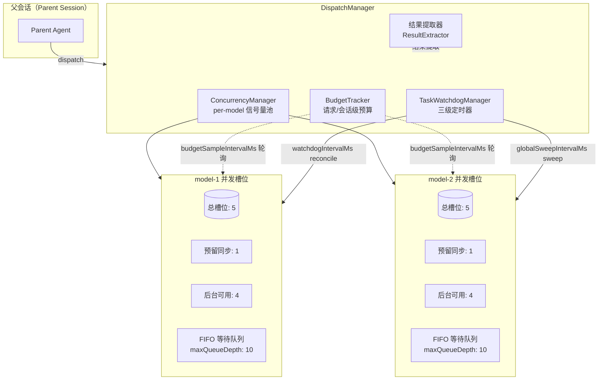

# 调度配置

> **相关文档：** [CLI 参考](/03-Reference/cli) — 通过命令行管理角色和注册中心 | [role.yaml 参考](/03-Reference/role-yaml) — 完整的 role.yaml 字段参考 | [子代理](/02-Guide/subagents) — 子代理声明与调度基础

本文档描述子代理调度系统的配置方式，包括 `role.yaml` 中的 `dispatch:` 块和全局环境变量覆盖。

## 调度架构总览

调度引擎的核心设计围绕三个关键维度展开：**并发池（Concurrency Pool）**、**预算跟踪（Budget Tracking）** 和 **生命周期管理**。以下拓扑图展示了各组件之间的关系：



### 并发池模型

每个模型（`providerID/modelID`）独立维护一个 `ConcurrencySlot` 实例（`src/dispatch/concurrency/concurrency.ts:103-111`）。每个槽位包含：

- **`active`** — 当前占用的并发槽位数
- **`limit`** — 最大并发限制（`maxConcurrent`，默认 5）
- **`reserved`** — 预留给同步调度的槽位数（`syncReservedSlots`，默认 1）
- **`queue`** — FIFO 等待队列，支持优先级排序（`priority` 越低越优先）
- **`activeByParent`** — 按父会话追踪活跃数，用于 `maxActivePerParent` 控制

后台任务实际可用的槽位为 `limit - reserved`。队列支持 Waiter TTL（默认 300 秒过期），过期后自动从队列移除并抛出 `WaiterTimeoutError`（`concurrency.ts:203-218`）。

### 调度生命周期

一个调度任务从创建到完成经历以下阶段：

1. **入队** — `dispatch()` 按子代理的 modelKey 路由到对应并发槽位
2. **等待槽位** — 如果槽位满载且仍有空余队列容量，任务进入 FIFO 队列。同一个 parentId 的超限任务会被优先排队（确保 `maxActivePerParent` 公平性，`concurrency.ts:171-173`）
3. **获得槽位** — 当有任务释放槽位时，`_promoteNextEligible()` 按优先级 × FIFO 顺序晋升等待者（`concurrency.ts:324-366`）
4. **执行** — 子代理会话启动，模型生成响应
5. **结果收集** — 任务完成或超时后，`ResultExtractor` 提取输出（详见「结果收集」章节）
6. **清理** — 释放并发槽位、停止看门狗定时器、记录预算消耗

### 预算跟踪

`BudgetTracker`（`src/dispatch/budget/budget-tracker.ts:39-66`）维护两个层级的累积消耗：

- **请求级（Request-level）**：以 `parentSessionId` 为键，累计同一父会话下所有子代理的总消耗。覆盖 `maxInputTokensPerRequest`、`maxOutputTokensPerRequest`、`maxCostPerRequest`
- **会话级（Session-level）**：以 `sessionId` 为键，跟踪单个子代理会话的消耗。覆盖 `maxInputTokensPerSession`、`maxCostPerSession`

采样器按 `budgetSampleIntervalMs` 间隔轮询运行中的会话，调用 `isRequestBudgetExceeded()`（`budget-tracker.ts:148-176`）和 `isSessionBudgetExceeded()`（`budget-tracker.ts:183-203`）检测超限。一旦超限，立即取消对应任务。预算数据通过延迟持久化（debounced write）保存到磁盘，在插件重启后可恢复（`budget-tracker.ts:58-59`）。
## role.yaml 中的 dispatch 块

在 `role.yaml` 中通过 `dispatch:` 块覆盖子代理调度的默认参数：

```yaml
dispatch:
  maxConcurrent: number             # 最大并发后台任务数（默认：5）
  maxQueueDepth: number             # 最大排队任务数（默认：10）
  syncReservedSlots: number         # 预留给同步调度的槽位数（默认：1）
  maxActivePerParent: number        # 每个父会话最大活跃任务数（默认：3）
  maxTotalSessionsPerRequest: number # 每次用户请求最大累积会话数（默认：无限制 / 按需启用）
  maxInputTokensPerRequest: number  # 每次请求最大累积输入 token 数（默认：无限制 / 按需启用）
  maxOutputTokensPerRequest: number # 每次请求最大累积输出 token 数（默认：无限制 / 按需启用）
  maxCostPerRequest: number         # 每次请求最大累积费用（USD）（默认：无限制 / 按需启用）
  maxInputTokensPerSession: number  # 每个调度会话最大输入 token 数（默认：无限制 / 按需启用）
  maxCostPerSession: number         # 每个调度会话最大费用（USD）（默认：无限制 / 按需启用）
  budgetSampleIntervalMs: number    # 预算采样间隔（毫秒）（默认：30000）
  backgroundStaleTimeoutMs: number  # 后台任务过期超时（毫秒）（默认：900000）
  syncAcquireTimeoutMs: number      # 同步槽位获取超时（毫秒）（默认：120000）
  syncPromptTimeoutMs: number       # 同步提示词超时（毫秒）（默认：600000）
  retryAfterMs: number              # 失败后重试延迟（毫秒）（默认：30000）
  backpressureMaxRetries: number    # 最大背压重试次数（默认：5）
  backpressureMaxDelayMs: number    # 最大背压延迟（毫秒）（默认：60000）
```

### 字段详解

#### `maxConcurrent`
按 `providerID/modelID` 键值（即每个模型密钥）限制的最大并发后台任务数（`src/dispatch/concurrency/concurrency.ts:92`）。当同一个模型同时运行多个子代理任务时，超出此限制的任务会进入等待队列。

#### `syncReservedSlots`
从 `maxConcurrent` 中预留的槽位数，专用于同步调度（sync dispatch）。后台任务实际可用的槽位为 `maxConcurrent - syncReservedSlots`（`src/dispatch/concurrency/concurrency.ts:168`）。例如，`maxConcurrent: 5` + `syncReservedSlots: 1` 表示后台任务最多同时占用 4 个槽位，预留 1 个槽位确保同步任务不会被后台任务完全阻塞。

#### `maxActivePerParent`
限制每个父会话（parent session）在同一个模型密钥上可以拥有的最大活跃任务数（`src/dispatch/concurrency/concurrency.ts:254-258`）。超过此限制时，即使全局槽位有空闲，该父会话的请求也会被排队，防止单个父会话独占并发资源。

#### `budgetSampleIntervalMs`
预算采样器定期检查各子代理会话的 token 消耗和费用的间隔（毫秒）（`src/dispatch/budget/budget-sampler.ts:7-21`）。当设置了 `maxInputTokensPerRequest`、`maxCostPerRequest` 等预算限制后，此采样器按此间隔轮询运行中的会话，一旦超限立即取消任务。默认 30000 毫秒（30 秒）。

### 预算配置示例

以下示例同时设置了 token 和 cost 两种预算限制，两者同时生效：

```yaml
dispatch:
  # 并发控制
  maxConcurrent: 8
  syncReservedSlots: 2

  # 请求级预算（累计所有子代理会话）
  maxInputTokensPerRequest: 100000   # 10万 token
  maxOutputTokensPerRequest: 50000   # 5万 token
  maxCostPerRequest: 0.5             # 0.5 USD

  # 会话级预算（单个子代理会话）
  maxInputTokensPerSession: 50000    # 5万 token
  maxCostPerSession: 0.25            # 0.25 USD

  # 采样间隔
  budgetSampleIntervalMs: 15000      # 15秒采样一次
```

当任意一个限制被触发时，系统会通过 `BudgetTracker.isRequestBudgetExceeded()`（`src/dispatch/budget/budget-tracker.ts:148-176`）检测到超限，并自动取消超限的任务。

::: tip 环境变量覆盖优先级
配置的合并优先级为：**环境变量 > `role.yaml` 中的 `dispatch:` 块 > 系统默认值**（`src/dispatch/config.ts:289-298` 中的 `mergeConfig()` 函数）。
:::

## 调度环境变量

通过环境变量全局覆盖调度配置：

| 变量 | 说明 | 默认值 |
|---|---|---|
| `ROLEBOX_DISPATCH_MAX_CONCURRENT` | 最大并发后台任务数 | 5 |
| `ROLEBOX_DISPATCH_MAX_QUEUE_DEPTH` | 最大排队任务数 | 10 |
| `ROLEBOX_DISPATCH_SYNC_RESERVED` | 预留同步调度槽位数 | 1 |
| `ROLEBOX_DISPATCH_MAX_ACTIVE_PER_PARENT` | 每个父会话最大活跃任务数 | 3 |
| `ROLEBOX_DISPATCH_MAX_TOTAL_SESSIONS_PER_REQUEST` | 每次请求最大累积会话数 | 无限制 / 按需启用 |
| `ROLEBOX_DISPATCH_RETRY_AFTER_MS` | 失败后重试延迟（毫秒） | 30000 |
| `ROLEBOX_DISPATCH_BG_STALE_MS` | 后台任务过期超时（毫秒） | 900000 |
| `ROLEBOX_DISPATCH_MATERIALIZE_TIMEOUT_MS` | 结果获取超时（毫秒） | 10000 |
| `ROLEBOX_DISPATCH_RESULT_RETENTION_MS` | 结果文件保留时间（毫秒） | 3600000 |
| `ROLEBOX_DISPATCH_MAX_INPUT_TOKENS_PER_REQUEST` | 每次请求最大累积输入 token 数 | 无限制 / 按需启用 |
| `ROLEBOX_DISPATCH_MAX_OUTPUT_TOKENS_PER_REQUEST` | 每次请求最大累积输出 token 数 | 无限制 / 按需启用 |
| `ROLEBOX_DISPATCH_MAX_COST_PER_REQUEST` | 每次请求最大累积费用（USD） | 无限制 / 按需启用 |
| `ROLEBOX_DISPATCH_MAX_INPUT_TOKENS_PER_SESSION` | 每个调度会话最大输入 token 数 | 无限制 / 按需启用 |
| `ROLEBOX_DISPATCH_MAX_COST_PER_SESSION` | 每个调度会话最大费用（USD） | 无限制 / 按需启用 |
| `ROLEBOX_DISPATCH_BUDGET_SAMPLE_INTERVAL_MS` | 预算采样间隔（毫秒） | 30000 |
| `ROLEBOX_METRICS` | 启用调度指标收集（设为任意真值） | 未设置 |

## 环境变量插值

可以在 `role.yaml` 的任何位置使用 `{env:VARIABLE_NAME}` 语法，在启动时解析。

```yaml
model: "{env:PREFERRED_MODEL}"
prompt: |
  你正在为 {env:COMPANY_NAME} 工作...
```

## 环境变量优先级

配置的合并遵循严格的优先级层级。以下图示直观展示了各配置来源的优先级关系：

```
优先级高
  │
  ├── 环境变量 (ROLEBOX_DISPATCH_*)
  │     └── 运行时覆盖，优先级最高
  │
  ├── role.yaml dispatch: 块
  │     └── 角色级配置，按角色覆盖
  │
  └── 系统默认值
        └── 源码内置默认值，仅当未指定时生效
优先级低
```

合并逻辑在 `src/dispatch/config.ts:289-298` 的 `mergeConfig()` 函数中实现：环境变量值会覆盖 `role.yaml` 中的对应字段，`role.yaml` 中未指定的字段回退到系统默认值。

> `role.yaml` 中的 `dispatch:` 块也支持 `{env:VARIABLE_NAME}` 环境变量插值，详见上方「环境变量插值」小节。

## 看门狗与健康检查

调度系统内置三级看门狗机制，由 `TaskWatchdogManager`（`src/dispatch/core/watchdog.ts`）统一协调，通过依赖注入的回调函数驱动。

### 三级定时器架构

| 层级 | 机制 | 间隔 | 职责 |
|------|------|------|------|
| Tier 1 | 每任务 reconcile 看门狗 | `watchdogIntervalMs`（`setTimeout`，自复位） | 检查单个任务是否仍活跃，超时未响应则触发 reconcile |
| Tier 2 | 全局 sweep | `globalSweepIntervalMs`（`setInterval`） | 对所有注册任务统一执行状态扫描，清理孤儿 |
| Tier 3 | 空闲 debounce | `idleDebounceMs`（`setTimeout`，按需触发） | 任务静止一段时间后触发完成确认，防止误判 |

Tier 1 看门狗调用 `onReconcile()` 回调重置任务状态；Tier 2 全局 sweep 调用 `onSweep()` 扫描所有任务；Tier 3 debounce 调用 `onDebounceElapsed()` 触发完成信号确认。所有回调被 `_runSafe()` 包裹，单次异常不会影响其他任务的定时器（`watchdog.ts:242-248`）。

### 后台任务过期

后台任务有一个总的超时限制，通过 `backgroundStaleTimeoutMs` 配置（默认 900000 ms = 15 分钟）。当任务超过此时间未完成且无任何进展（无工具调用、无事件）时，看门狗将其标记为超时（`timeout` 状态）。

同步调度的超时由两个独立参数控制：
- `syncAcquireTimeoutMs`（默认 120000 ms = 2 分钟）— 等待获取并发槽位的超时
- `syncPromptTimeoutMs`（默认 600000 ms = 10 分钟）— 子代理执行提示词的超时

### 并发队列清理

`ConcurrencyManager` 内置一个定期清理器（`_sweeperInterval`），每 60 秒运行一次 `_sweepExpiredWaiters()`（`concurrency.ts:372-394`），移除所有已取消的等待者（cancelled）和 TTL 超时的等待者（`expiresAt <= now`）。这是并发槽位侧的健康维护机制，与 `TaskWatchdogManager` 的全局 sweep 协同工作但相互独立。

### 看门狗生命周期

- **注册** — 当 `registerTask(taskId)` 被调用时，启动该任务的 reconcile 定时器；如果是第一个注册的任务，同时启动全局 sweep（`watchdog.ts:64-74`）
- **复位** — 每次收到路由事件时调用 `resetWatchdog(taskId)`，重置该任务的 reconcile 定时器（`watchdog.ts:93-98`）
- **注销** — 任务完成或取消时，`unregisterTask(taskId)` 清除所有定时器；如果是最后一个任务，停止全局 sweep（`watchdog.ts:80-90`）
- **清理** — `dispose()` 一次性清除所有定时器，适合在插件关闭时调用（`watchdog.ts:127-149`）

## 结果收集

### dispatch_output 工具

当后台任务完成后，父会话通过 `dispatch_output(task_id)` 工具获取结果（`src/dispatch/tools.ts:93-94`）。该工具的行为规则如下：

1. **必须等待 `&lt;system-reminder&gt;`** — 工具描述的提示明确禁止在未收到通知前轮询：*"Do NOT call dispatch_output to poll — wait for the notification first"*（`tools.ts:93`）
2. **正在运行的任务返回错误** — 如果任务仍在运行，调用 `dispatch_output` 会返回 `Task still running` 错误（`tools.ts:249-256`）
3. **分页支持** — 通过 `offset`、`limit`、`maxChars`、`tail` 参数支持大结果的分页读取
4. **自动溢出到文件** — 当结果超过 `maxChars`（默认 16000 字符）时，剩余内容溢出到侧边文件（sidecar），并在返回结果中包含 `file=` 路径和分页指针

### `result` 围栏提取

结果提取器（`src/dispatch/completion/result-extractor.ts:35-58`）扫描输出的每一行，寻找 ` `` ```result ``` `` ` 围栏标记：

- 遇到 ` `` ```result ``` `` ` 开启围栏，开始记录内容
- 遇到下一个 ` ``` `` ` 关闭围栏，保存为最终结果
- 如果输出中没有 ` `` ```result ``` `` ` 围栏，则将整个输出文本作为结果返回

提取结果在 `MaterializedResultRef` 中记录 `hadFence` 布尔标志（`src/dispatch/types.ts:38-39`），供调用方判断输出是否包含结构化围栏。

### 结果溢出（Spill to File）

当结果文本较大时，`spillToFile()`（`result-extractor.ts:97-111`）将完整结果写入磁盘：

```
{workspace}/.rolebox/state/results/{taskId}.txt
```

写入过程使用原子写入模式：先写 `.tmp` 临时文件 → `unlinkSync` 删除旧文件 → `renameSync` 替换。侧边文件可通过 `readSidecarWindow()` 和 `readSidecarTail()` 进行偏移量分页或尾部读取（`result-extractor.ts:149-248`），支持大文件的流式分页而不加载全部内容到内存。

### 孤儿文件清理

侧边结果文件保留 24 小时（`ORPHAN_SIDECAR_RETENTION_MS = 86400000`，`result-extractor.ts:345`）。`cleanupOrphanSidecars()`（`result-extractor.ts:358-408`）扫描结果目录，删除那些关联的 `DispatchTask` 已不存在且文件 mtime 超过保留阈值的孤儿文件。此函数在任务注销时由看门狗触发。

## 配置模式

根据使用场景的不同，以下提供了四种推荐配置模式。

### 保守型（Conservative）

适用于预算敏感或个人使用场景：严格控制并发和费用，避免意外消耗。

```yaml
dispatch:
  maxConcurrent: 3
  syncReservedSlots: 0
  maxQueueDepth: 5
  maxActivePerParent: 2
  maxInputTokensPerRequest: 50000
  maxOutputTokensPerRequest: 25000
  maxCostPerRequest: 0.15
  budgetSampleIntervalMs: 10000
  backgroundStaleTimeoutMs: 300000
```

特点：低并发（3 个槽位）、紧预算（单请求 0.15 USD）、快速采样（10 秒间隔），适合开发环境或个人工作站。

### 吞吐型（Throughput）

适用于生产环境或需要最大化并行处理能力的场景：放宽并发和预算限制，充分调度。

```yaml
dispatch:
  maxConcurrent: 16
  syncReservedSlots: 2
  maxQueueDepth: 30
  maxActivePerParent: 6
  maxInputTokensPerRequest: 500000
  maxOutputTokensPerRequest: 200000
  maxCostPerRequest: 2.0
  budgetSampleIntervalMs: 60000
  backpressureMaxRetries: 10
  backpressureMaxDelayMs: 120000
```

特点：高并发（16 个槽位）、松预算（单请求 2 USD）、长采样间隔（60 秒），适合 CI/CD 管道或批量处理。

### 交互型（Interactive）

适用于需要快速响应的交互式使用场景：预留较多同步槽位，减少后台任务对同步调度的干扰。

```yaml
dispatch:
  maxConcurrent: 8
  syncReservedSlots: 3
  maxQueueDepth: 10
  maxActivePerParent: 4
  syncAcquireTimeoutMs: 30000
  syncPromptTimeoutMs: 300000
```

特点：预留 3 个同步槽位（后台可用 5 个），缩短同步超时时间，确保交互式任务获得快速响应。

### 安全优先（Safety-first）

适用于生产环境或敏感工作流：严格预算上限 + 背压保护，防止级联失败。

```yaml
dispatch:
  maxConcurrent: 6
  syncReservedSlots: 1
  maxQueueDepth: 8
  maxActivePerParent: 2
  maxInputTokensPerRequest: 100000
  maxCostPerRequest: 0.3
  maxCostPerSession: 0.1
  budgetSampleIntervalMs: 15000
  backpressureMaxRetries: 3
  backpressureMaxDelayMs: 30000
  retryAfterMs: 60000
```

特点：严格的并发和预算限制、较低的背压重试上限（3 次）、较长的失败重试间隔（60 秒），外加会话级预算保护。

### 预设选型决策矩阵

根据不同的使用场景，以下矩阵帮助快速选择合适的预设配置：

| 使用场景 | 推荐预设 | 核心理由 |
|---------|---------|---------|
| **个人开发 / 预算敏感** | 保守型（Conservative） | 低并发（3 槽位）、紧预算（0.15 USD）、快速采样（10 秒），避免资源浪费 |
| **CI/CD / 批量处理** | 吞吐型（Throughput） | 高并发（16 槽位）、松预算（2 USD）、长采样间隔（60 秒），最大化并行吞吐 |
| **交互式开发 / 调试** | 交互型（Interactive） | 预留同步槽位（3 个）、缩短同步超时，确保交互式任务快速响应 |
| **生产环境 / 敏感工作流** | 安全优先（Safety-first） | 严格预算上限 + 背压保护 + 会话级费用限制，防止级联失败 |

选择预设后，可直接复制对应 YAML 块至 `role.yaml` 的 `dispatch:` 段落，再根据实际需要微调各字段。

## 故障排查：QueueFullError

### 错误含义

当调度队列达到容量上限时，系统抛出 `QueueFullError`（定义在 `src/dispatch/concurrency/concurrency.ts:49-61`）。此错误表明所有并发槽位均已占满，且排队等待的任务数已超过 `maxQueueDepth` 限制。

### 错误结构

```typescript
class QueueFullError extends Error {
  depth: number;       // 当前排队任务数
  limit: number;       // 队列深度限制（maxQueueDepth）
  retryAfter: number;  // 建议重试间隔（默认 30,000 ms）
}
```

触发条件：当 `acquireBackground()` 检测到槽位满载且队列中活跃等待者数量 ≥ `maxQueueDepth` 时（`concurrency.ts:128-133`），返回 `{ outcome: "full", error: QueueFullError }`，调用方捕获后应在 `retryAfter` 毫秒后重试。

### 排查步骤

1. **确认当前并发设置** — 检查 `role.yaml` 中的 `dispatch.maxConcurrent` 和 `dispatch.maxQueueDepth` 值
2. **检查同步预留** — 后台任务可用槽位为 `maxConcurrent - syncReservedSlots`。如果 `syncReservedSlots` 设置过高，后台槽位可能被过度挤压
3. **扩容量** — 在 `role.yaml` 中增加 `maxConcurrent`（增加总槽位）和/或 `maxQueueDepth`（增加排队容量）
4. **降低单任务执行时间** — 检查子代理任务是否因提示词过长或模型响应慢而长期占用槽位。考虑缩短 `syncPromptTimeoutMs` 或使用更快的模型
5. **检查背压配置** — 确保 `backpressureMaxRetries` 和 `retryAfterMs` 配合合理：当 QueueFullError 出现时，调度器会在 `retryAfterMs` 后自动重试，最多 `backpressureMaxRetries` 次（`src/dispatch/dispatch.ts` 背压逻辑）

### 示例调优

```yaml
dispatch:
  maxConcurrent: 10    # 从默认 5 扩容
  maxQueueDepth: 20    # 从默认 10 扩容
  syncReservedSlots: 1 # 后台可用 9 个槽位
  retryAfterMs: 15000  # 缩短重试间隔
  backpressureMaxRetries: 5
```

## 预设迁移指南

当从**保守型**升级到**吞吐型**时，需要调整以下 4 个核心字段。它们的改动直接影响并发能力与预算控制之间的平衡：

| 字段 | 保守型 | 吞吐型 | 变化影响 |
|------|--------|--------|---------|
| `maxConcurrent` | 3 | 16 | **并发槽位扩容**：从 3 增加到 16，允许更多子代理同时运行。这是提升整体吞吐量的核心杠杆 |
| `syncReservedSlots` | 0 | 2 | **预留同步槽位**：从 0 增加到 2，在高并发场景下为同步调度保留专用通道，防止后台任务完全阻塞同步操作 |
| `maxCostPerRequest` | 0.15 USD | 2.0 USD | **预算放宽**：从 0.15 提升至 2.0，约 13 倍。并发越高 token 消耗越大，预算必须相应提高。这是并发与成本之间的核心权衡 |
| `budgetSampleIntervalMs` | 10,000 | 60,000 | **采样间隔拉长**：从 10 秒增加到 60 秒，降低预算检查频率以换取更高调度吞吐。注意：采样越松，超限发现越晚 |

::: warning 迁移注意事项
上述 4 个字段之间存在联动关系：增大 `maxConcurrent` 而不相应提高 `maxCostPerRequest`，会导致高频触发预算超限而取消任务。反之，仅放宽预算而不扩容并发则无法提升吞吐。建议按 **并发 → 预算 → 采样** 的顺序依次调整，每次调整后观察实际调度表现。
:::

## 下一步

- [协作图](/02-Guide/collaboration-graph) — 子代理调度中的协作图配置
- [CLI 参考](/03-Reference/cli) — 通过命令行管理角色和注册中心
- [role.yaml 参考](/03-Reference/role-yaml) — 完整的 role.yaml 字段参考
