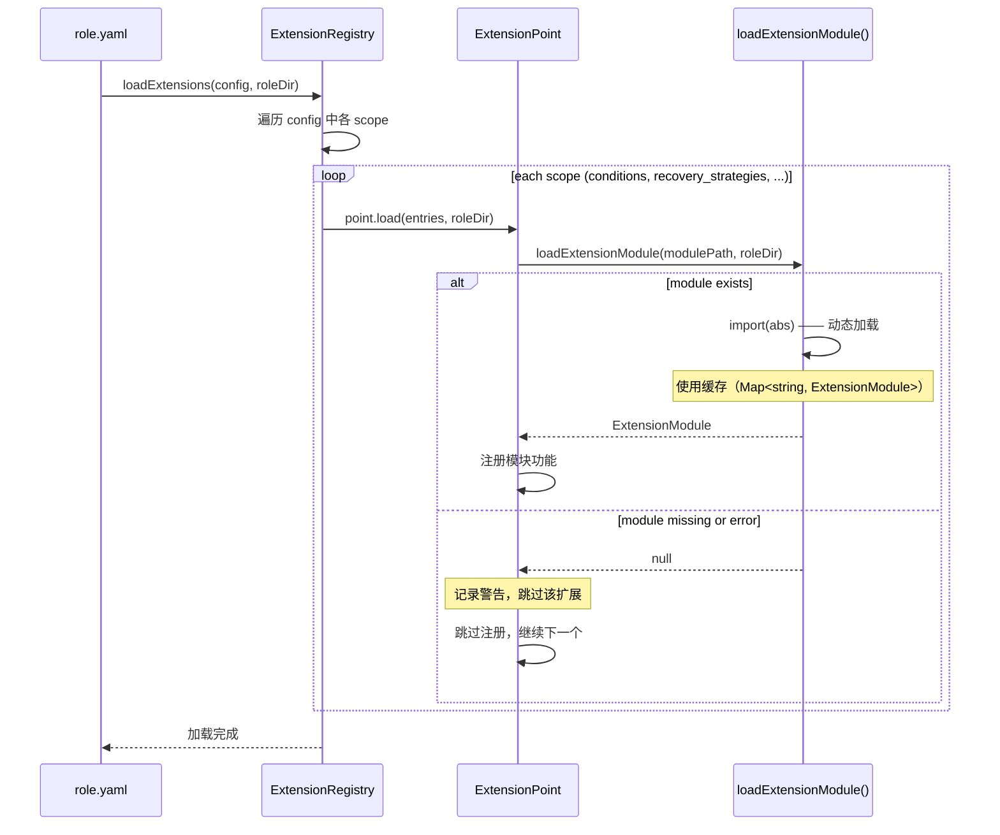

# 扩展机制

> **相关文档：** [Hook 机制](/03-Reference/hooks) — 自定义 Hook 系统 | [role.yaml 参考](/03-Reference/role-yaml) — extensions 配置字段 | [错误处理](/03-Reference/error-handling) — 恢复系统集成

扩展机制允许你注册自定义模块，以开放 rolebox 的封闭词汇表 —— 添加自定义条件、图拓扑、终止条件、恢复策略、通知通道和观察事件。无需修改源代码。

在 `role.yaml` 中声明 `extensions:` 块：

```yaml
extensions:
  conditions:
    - name: dispatch_all_complete
      module: ext/dispatch-complete.js
  graph_topologies:
    - name: diamond
      module: ext/diamond-topology.js
  recovery_strategies:
    - name: my-recovery
      module: ext/my-recovery.js
      categories: [session_error]
  notification_channels:
    - kind: slack
      module: ext/slack-channel.js
  observe_events:
    - name: dispatch_complete
      module: ext/dispatch-event.js
```

## 支持的作用域

共 8 种扩展作用域，每种对应一个封闭词汇表：

| 作用域 | 开放内容 | 模块合约 |
|---|---|---|
| `conditions` | 函数门控 / 转换 / continue_until 条件 | `{ handler: (arg, env) => boolean }` |
| `graph_topologies` | 协作图拓扑模板 | `{ expand: (agents) => FlowEdge[] }` |
| `termination_conditions` | 图循环终止条件类型 | `{ parse: (value, agents) => LoopCondition \| null }` |
| `recovery_strategies` | 错误恢复策略名称（通过 YAML 验证） | `{ name, execute }` |
| `recovery_patterns` | 错误检测模式 | `{ name, category, match }` |
| `notification_channels` | 通知通道类型 | `{ create: (config) => { kind, send, dispose } }` |
| `notification_events` | 通知事件类型（开放字符串） | *（无需模块 —— 事件为开放字符串）* |
| `observe_events` | 函数观察触发事件 | `{ handle: (ctx, spec) => string[] }` |
| `concurrency_policies` | 自定义并发控制策略 | `{ create: (opts) => IConcurrencyManager }` |

## 模块合约示例

### Conditions（条件）

```javascript
// ext/dispatch-complete.js
export default {
  handler: (arg, env) => {
    // env.sessionID、env.state、env.artifacts 可用
    return env.state.kv["dispatch_complete"] === true;
  },
};
```

### Notification Channels（通知通道）

通道模块导出 `create` 工厂函数，返回包含 `kind`、`send`、`dispose` 的对象（合约定义见 `src/extensions/types.ts:103-110`）：

```javascript
// ext/slack-channel.js
export default {
  create: (config) => ({
    kind: "slack",
    send: async (message) => {
      await fetch(config.webhookUrl, {
        method: "POST",
        body: JSON.stringify({ text: message.text }),
      });
    },
    dispose: async () => {
      // 清理 HTTP 连接等资源
    },
  }),
};
```

### Recovery Strategies（恢复策略）

策略模块导出 `name` 和 `execute` 方法。`execute` 接收上下文对象并返回执行结果（合约定义见 `src/extensions/types.ts:85-90`）：

```javascript
// ext/my-recovery.js
export default {
  name: "my-recovery",
  execute: async (ctx) => {
    // ctx 包含 sessionID、error、category 等信息
    console.log(`Recovering from: ${ctx.error.message}`);
    return { status: "success" };
  },
};
```

::: tip 恢复策略注册
自定义恢复策略除了实现模块合约外，还需要通过 `RecoveryEngine.registerStrategy()`（`src/recovery/engine.ts:163-166`）注册，并调用 `addKnownStrategy()`（`src/recovery/config.ts:101-103`）登记到已知策略列表，确保 YAML 配置验证通过。详见[错误处理](./error-handling#恢复系统-recovery-system)。
:::

### Termination Conditions（终止条件）

终止条件模块导出 `parse` 方法，接收原始值和可用代理列表，返回 `LoopCondition` 对象或 `null`（合约定义见 `src/extensions/types.ts:79-82`）：

```javascript
// ext/my-termination.js
export default {
  parse: (value, availableAgents) => {
    if (typeof value !== "object" || value === null) return null;
    if (value.type === "max_errors") {
      return {
        type: "max_errors",
        maxErrors: value.count ?? 3,
      };
    }
    return null;
  },
};
```

### Observe Events（观察事件）

观察事件模块导出 `handle` 方法，接收上下文和规格对象，返回字符串数组（合约定义见 `src/extensions/types.ts:113-116`）：

```javascript
// ext/dispatch-event.js
export default {
  handle: (ctx, spec) => {
    // ctx 包含 sessionID、agent、activeFns 等信息
    // spec 包含观察配置（event、filter 等）
    const injects = [];
    if (ctx.sessionID && spec.event === "dispatch_complete") {
      injects.push(`[observe] dispatch completed for session ${ctx.sessionID}`);
    }
    return injects;
  },
};
```

### Concurrency Policies（并发策略）

并发策略模块导出 `create` 工厂函数，接收调度配置默认值，返回自定义 `IConcurrencyManager` 实现（合约定义见 `src/extensions/types.ts:131-142`）：

```javascript
// ext/priority-concurrency.js
export default {
  create: ({ defaultLimit, maxQueueDepth, reserved, retryAfterMs }) => {
    return {
      // 实现 IConcurrencyManager 接口
      acquireBackground: (key, opts) => { /* ... */ },
      acquireSync: (key) => { /* ... */ },
      release: (key, parentId) => { /* ... */ },
      // ... 其他接口方法
    };
  },
};
```

## 安全机制

- 扩展加载失败会按模块捕获，记录警告并跳过 —— 不会导致 Agent 崩溃。
- 空的或缺失的 `extensions:` 块为无操作。
- 内置词汇表（条件、拓扑、策略、通道）保持不变 —— 扩展是**增量式**的。
- 模块加载使用动态 `import()` 并带缓存（与自定义 Hook 使用相同的模式）。

::: warning 模块缓存
扩展模块通过动态 `import()` 加载后会被 Node.js 模块缓存系统缓存。这意味着在同一个进程生命周期内，重复加载同一路径的模块会返回**同一个模块实例**，而不会重新执行模块代码。如果你在开发扩展时需要热重载，需要重启进程或使用 `?version=` 等 URL 参数破坏缓存（适用于支持 URL 导入的场景）。
:::

## 扩展注册流程详解

扩展从 YAML 声明到运行时生效，经历以下注册流程（验证自 `src/extensions/registry.ts` 和 `src/extensions/loader.ts`）：



### 关键源码实现

**`loadExtensionModule()`**（`src/extensions/loader.ts:15-34`）是模块加载的核心：

```typescript
// @src/extensions/loader.ts:15-34
export async function loadExtensionModule(
  modulePath: string,
  roleDir: string,
): Promise<ExtensionModule | null> {
  const abs = isAbsolute(modulePath)
    ? modulePath
    : join(roleDir, modulePath);

  if (cache.has(abs)) return cache.get(abs)!;  // 缓存命中

  try {
    const mod = (await import(abs)) as ExtensionModule;
    cache.set(abs, mod);
    return mod;
  } catch (err) {
    log.warn("Failed to load extension module", { modulePath: abs, err });
    cache.set(abs, null);
    return null;
  }
}
```

关键行为：
- **路径解析**：绝对路径直接使用，相对路径拼接 `roleDir`
- **模块缓存**：同路径只加载一次，后续返回缓存结果（`src/extensions/loader.ts:7`）
- **错误隔离**：加载失败返回 `null` 并写入 `null` 缓存，绝不抛出异常

**`ExtensionRegistry.loadExtensions()`**（`src/extensions/registry.ts:96-109`）是整个流程的调度入口：

```typescript
// @src/extensions/registry.ts:96-109
async loadExtensions(config, roleDir): Promise<void> {
  if (!config) return;                    // 空配置 → 无操作

  for (const [scope, entries] of Object.entries(config)) {
    if (!entries) continue;
    const point = this.points.get(scope);  // 按 scope 查找 ExtensionPoint
    if (point) {
      await point.load(entries, roleDir); // 委托给对应扩展点
    }
  }
}
```

### ExtensionPoint 分发机制

9 个内置扩展点各对应一个作用域（`src/extensions/registry.ts:38-65`），`ExtensionRegistry` 构造时注册：

::: info 扩展点分类说明
8 种扩展作用域涵盖了 rolebox 中所有可扩展的封闭词汇表。其中 `recovery_strategies` 和 `recovery_patterns` 共享恢复域，`notification_channels` 和 `notification_events` 共享通知域。选择作用域时，明确你要扩充的是逻辑（条件/策略）、结构（拓扑/模式）还是通道（通知）。
:::

| 扩展点 | 作用域 | 类名 |
|--------|--------|------|
| 自定义条件 | `conditions` | `ConditionExtensionPoint` |
| 图拓扑 | `graph_topologies` | `GraphTopologyExtensionPoint` |
| 终止条件 | `termination_conditions` | `TerminationConditionExtensionPoint` |
| 恢复策略 | `recovery_strategies` | `RecoveryStrategyExtensionPoint` |
| 恢复模式 | `recovery_patterns` | `RecoveryPatternExtensionPoint` |
| 通知通道 | `notification_channels` | `NotificationChannelExtensionPoint` |
| 通知事件 | `notification_events` | `NotificationEventExtensionPoint` |
| 观察事件 | `observe_events` | `ObserveEventExtensionPoint` |
| 并发策略 | `concurrency_policies` | `ConcurrencyPolicyExtensionPoint` |

### recovery_strategies 扩展与恢复系统的集成

`recovery_strategies` 作用域的扩展模块通过 `ExtensionRegistry.getLoadedStrategies()`（`src/extensions/registry.ts:79-81`）暴露给 `RecoveryService`。`RecoveryService` 在初始化时获取已加载的策略，并通过 `RecoveryEngine.registerStrategy()`（`src/recovery/engine.ts:163-166`）注册到引擎。

所以通过扩展注册的自定义恢复策略走以下完整链路：

```
role.yaml
  → extensions.recovery_strategies
    → ExtensionRegistry.loadExtensions()
      → RecoveryStrategyExtensionPoint.load()
        → loadExtensionModule() → import()
  → RecoveryService.init()
    → engine.registerStrategy(strategy)
      → strategyRegistry.register() + addKnownStrategy()
```

::: tip
如果自定义恢复策略需要通过扩展注册，务必同时调用 `addKnownStrategy()`（`src/recovery/config.ts:101-103`）将策略名称登记到已知策略列表，否则 YAML 配置验证会静默跳过该策略。详见[恢复系统](./recovery-system#扩展-api)。
:::

### 相关源码

| 文件 | 说明 |
|---|---|
| `src/extensions/types.ts:85-142` | 扩展模块合约定义（8 种合约接口） |
| `src/extensions/loader.ts:15-34` | `loadExtensionModule()` 模块加载器 |
| `src/extensions/registry.ts:38-109` | `ExtensionRegistry` + 9 个内置扩展点 |
| `src/extensions/extension-point.ts` | `ExtensionPoint<T>` 基础接口 |
| `src/recovery/config.ts:101-103` | `addKnownStrategy()` 已知策略注册 |
| `src/recovery/engine.ts:163-166` | `registerStrategy()` 策略引擎注册 |

## 下一步

- [运行时行为](/04-Advanced/runtime-behavior) — 协作图运行时状态管理与终止评估
- [Hook 机制](./hooks) — 了解如何通过 Hook 系统拦截和扩展运行时行为
