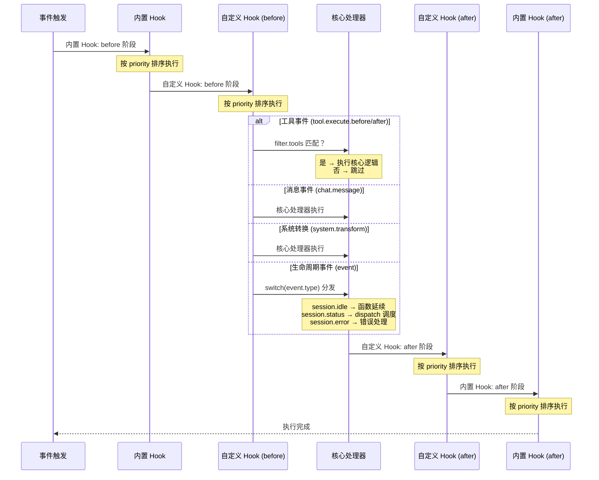
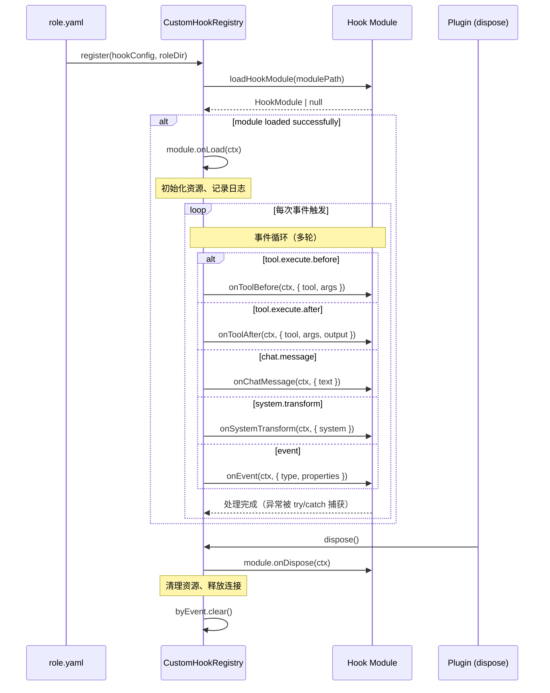

# Hook 机制

> **相关文档：** [扩展机制](/03-Reference/extensions) — 通过扩展系统注册自定义模块 | [role.yaml 参考](/03-Reference/role-yaml) — Hook 配置字段详解 | [自定义 Hook](/02-Guide/custom-hooks) — Hook 开发实战指南

Hook 在 `role.yaml` 的 `hooks.custom` 字段中声明，并在两个阶段触发：`before`（在内置处理器之前运行）和 `after`（在内置处理器之后运行）。每个 Hook 独立运行 —— 一个 Hook 的失败不会导致 Agent 崩溃。

## Schema

```yaml
hooks:
  custom:
    - name: my-quality-checker
      description: "在编辑后检查代码质量"
      events: [tool.execute.after, chat.message]
      module: hooks/quality-checker.js
      config:
        severity: warn
        checks: [no_console_log]
      filter:
        tools: [edit, write, hashline_edit]
      priority: 50
      phase: after
```

## 字段说明

| 字段 | 类型 | 默认值 | 说明 |
|---|---|---|---|
| `name` | string | — | Hook 的唯一标识符 |
| `description` | string | — | 可读描述 |
| `events` | string[] | — | 监听的事件：`chat.message`、`tool.execute.before`、`tool.execute.after`、`system.transform`、`event` |
| `module` | string | — | Hook 模块文件路径（相对于角色目录或绝对路径） |
| `config` | object | — | 运行时传递给 Hook 的任意配置 |
| `filter` | object | — | 限制 Hook 触发条件 |
| `filter.tools` | string[] | — | 仅对指定工具名称触发（适用于 `tool.execute.before` / `tool.execute.after`） |
| `filter.eventTypes` | string[] | — | 仅对指定事件类型触发（适用于 `event`：`session.idle`、`session.error` 等） |
| `priority` | number | `50` | 数值越小，在同阶段中越早执行 |
| `phase` | string | `"after"` | `"before"`（在内置逻辑之前运行）或 `"after"`（在内置逻辑之后运行） |

## Hook 模块接口

每个 Hook 模块是一个 JavaScript/TypeScript 文件，导出一个包含可选处理器方法的对象：

| 方法 | 触发时机 | 输入参数 |
|---|---|---|
| `onChatMessage(ctx, { text })` | 用户发送消息后 | 完整的消息文本 |
| `onToolBefore(ctx, { tool, args })` | 工具执行之前 | 工具名称和参数 |
| `onToolAfter(ctx, { tool, args, output })` | 工具执行之后 | 工具名称、参数和结果输出 |
| `onSystemTransform(ctx, { system })` | 构建系统提示词期间 | 系统提示词数组（可修改） |
| `onEvent(ctx, { type, properties })` | 生命周期事件时 | 事件类型和属性 |
| `onLoad(ctx)` | Hook 注册时调用一次 | — |
| `onDispose(ctx)` | 插件关闭时调用一次 | — |

## HookContext API

每个处理器接收一个 `ctx`（HookContext）对象：

| 属性 | 类型 | 说明 |
|---|---|---|
| `hookName` | string | Hook 配置的名称 |
| `config` | object \| undefined | 来自 role.yaml 的 Hook `config` |
| `sessionID` | string \| undefined | 当前会话 ID（可用时） |
| `agent` | string \| undefined | 当前代理 ID（可用时） |
| `inject(text)` | function | 向下一个系统提示词追加文本（使用 `appendCorrection` 机制） |
| `log` | Logger | 绑定到此 Hook 的结构化日志记录器 |

## 过滤器与阶段

**过滤器（Filter）** 限制哪些工具调用或事件触发 Hook：

```yaml
filter:
  tools: [write, edit]          # 仅在 write/edit 工具调用时触发
  eventTypes: [session.error]   # 仅在 session.error 事件时触发
```

**阶段（Phase）** 控制 Hook 相对于内置处理器的执行顺序：

- `"before"` — 在内置处理器执行逻辑之前触发
- `"after"`（默认） — 在内置处理器完成后触发

同一阶段的多个 Hook 按 `priority`（数值越小越早执行）排序。相同优先级时，保持注册顺序。

### 执行顺序全景

以下序列图展示一次事件（如 `tool.execute.before`）触发时的完整执行流水线，包括内置 Hook、自定义 Hook 和核心处理器的执行顺序（验证自 `src/hooks/event-handler.ts`）：



::: info 执行顺序要点
- **phase 控制顺序**：`before` → 核心处理器 → `after`，而不是自定义 Hook 的先后
- **内置 vs 自定义**：内置 Hook 先于自定义 Hook 的 before 阶段，后于 after 阶段——确保系统级行为始终优先或兜底
- **优先级排序**：同阶段同类型的 Hook 按 `priority`（默认 50，越小越早）排序
- **异常隔离**：每个 Hook 独立 try/catch，一个 Hook 的失败不会影响同阶段的其他 Hook
:::

## 完整示例

```yaml
# role.yaml
name: Quality-Conscious Coder
description: 警告调试代码并强制执行规范
hooks:
  custom:
    - name: no-console-log
      description: 检测文件写入中的遗漏 console.log
      events: [tool.execute.after]
      module: hooks/no-console-log.js
      filter:
        tools: [write, edit]
      priority: 10
      phase: after
```

```javascript
// hooks/no-console-log.js
export default {
  onToolAfter: (ctx, { tool, args, output }) => {
    const content = typeof args?.content === "string" ? args.content : "";
    if (content.includes("console.log(")) {
      ctx.inject(`警告：${tool} 输出中发现 console.log()。`);
    }
  },
};
```

## Hook Lifecycle Diagram

Hook 的完整生命周期从注册到销毁经历三个阶段：初始化（`onLoad`）、事件循环（多轮事件分发）、销毁（`onDispose`）。以下时序图展示了这一流程，验证自 `src/hooks/custom/registry.ts`：



生命周期验证点（`src/hooks/custom/registry.ts`）：

| 方法 | 触发时机 | 源码行 |
|------|---------|--------|
| `onLoad(ctx)` | 模块加载成功后立即调用 | `:37-48` |
| 事件处理器 | 每次匹配事件触发时调用（try/catch 包裹） | `:112-128` |
| `onDispose(ctx)` | `registry.dispose()` 调用时执行 | `:190-214` |

## onLoad / onDispose 生命周期

Hook 模块可以实现 `onLoad` 和 `onDispose` 生命周期方法（合约定义见 `src/hooks/custom/types.ts:82-84`）：

```javascript
// hooks/lifecycle-example.js
export default {
  onLoad: (ctx) => {
    // Hook 注册时调用一次，适合初始化资源
    // ctx 包含 hookName、config、log 等
    ctx.log.info(`Hook ${ctx.hookName} loaded`);
  },
  onDispose: (ctx) => {
    // 插件关闭时调用一次，适合清理资源
    ctx.log.info(`Hook ${ctx.hookName} disposed`);
  },
};
```

::: tip 生命周期使用建议
`onLoad` 适合初始化数据库连接、加载配置文件等一次性操作；`onDispose` 适合关闭连接、释放文件句柄等清理操作。避免在 `onLoad` 中执行耗时过长或可能阻塞的操作，因为 Hook 注册是插件初始化流程的一部分，阻塞会影响整个插件的启动速度。
:::

## 优先级排序示例

同一阶段的多个 Hook 按照 `priority` 字段排序（数值越小越早执行）。默认优先级为 `50`（`src/hooks/custom/types.ts:29`）。

以下配置：

```yaml
hooks:
  custom:
    - name: early-checker
      events: [tool.execute.before]
      module: hooks/early-checker.js
      priority: 10          # 高优先级（先执行）
      phase: before

    - name: late-checker
      events: [tool.execute.before]
      module: hooks/late-checker.js
      priority: 50          # 低优先级（后执行）
      phase: before
```

执行顺序：`early-checker` (priority 10) → `late-checker` (priority 50)。

如果两个 Hook 具有相同的 `priority` 值，它们会按照在 YAML 中的注册顺序执行。

## 内置 Hook 参考

rolebox 内置了以下 `hooks.builtin` 选项（在 `role.yaml` 的 `hooks:` 块中配置）：

### `auto_activate`

启用后，在首次用户消息到达时自动激活角色标记为 `auto_activate` 的函数，而无需用户显式使用 `|function_name|` 语法（`src/hooks/chat-message.ts:82-106`）。触发时机：`chat.message` 事件的处理过程中。

```yaml
hooks:
  builtin:
    auto_activate: true      # 启用函数自动激活
```

当 `auto_activate` 启用时：
1. 系统会在第一条用户消息到达时检查角色的 `auto_activate` 列表。
2. 匹配的函数自动进入活跃状态，无需手动调用。
3. 如果函数还配置了 `locked: true`，这些自动激活的函数无法通过后续的转换或用户请求停用。

## `inject()` 机制详解

`inject(text)` 是 `HookContext` 提供的方法（定义见 `src/hooks/custom/types.ts:54`），用于向下一个系统提示词追加文本。其底层依赖 `appendCorrection` 系统（`src/hooks/context.ts:8-15`）：

```typescript
// context.ts — appendCorrection 实现
function appendCorrection(
  corrections: Map<string, string>,
  sessionID: string,
  text: string,
): void {
  const existing = corrections.get(sessionID);
  corrections.set(sessionID, existing ? existing + "\n" + text : text);
}
```

- `appendCorrection` 以会话 ID 为键，将追加文本存储在 `pendingCorrections` Map 中。
- 如果同一个会话有多个追加请求，文本会通过换行符拼接。
- 在下一个系统提示词构建时，这些追加内容会被注入到 `system.transform` 阶段，与内置护栏使用相同的通道。

## 安全机制

- **Hook 不会导致 Agent 崩溃**。每个 Hook 处理器都用 try/catch 包裹 —— 失败时记录警告并继续执行。
- `inject()` 机制通过已有的 `appendCorrection` 系统向下一个系统提示词追加内容，与内置护栏使用相同的通道。
- 模块加载失败（文件缺失、语法错误）会被记录日志，该 Hook 会被跳过 —— 注册中心存储 `null` 并继续运行。

::: warning Hook 模块隔离
每个自定义 Hook 模块运行在独立的模块作用域中。一个 Hook 的全局状态不会自动与其他 Hook 共享。如果需要跨 Hook 通信，应使用 `config` 字段传递参数，或将共享状态持久化到文件或内存中合适的全局 Map（仅用于同进程通信，不建议依赖跨进程的共享状态）。
:::

## 自定义 Hook 调试

### 使用 `rolebox info --check` 验证 Hook 配置

`rolebox info <role> --check` 命令可验证角色的完整性哈希，包括 Hook 模块路径的有效性：

```bash
rolebox info my-role --check
```

该命令会检查：
- `role.yaml` 中 `hooks.custom` 声明的 `module` 路径是否可解析
- 模块文件是否存在（基于相对角色目录或绝对路径）
- 完整性哈希是否与角色缓存一致

如果模块路径无效，`rolebox info` 会输出警告信息，提示 Hook 注册失败的原因。

### 日志诊断

Hook 系统使用结构化日志（`createSubLogger`），日志前缀包含 `hook:` 标识：

| 日志前缀 | 来源 | 典型消息 |
|----------|------|---------|
| `hook:custom-loader` | `src/hooks/custom/loader.ts:5` | `Failed to load custom hook module` — 模块加载失败 |
| `hook:custom-registry` | `src/hooks/custom/registry.ts:8` | `Registered custom hook` / `onLoad threw` / `failed on {event}` |
| `hook:{name}` | `src/hooks/custom/registry.ts:42` | 每个 Hook 实例的独立日志器 |

常见调试场景：

```
# 模块加载失败（文件缺失或语法错误）
hook:custom-loader | WARN | Failed to load custom hook module
  modulePath: /path/to/hooks/my-hook.js
  err: Error: Cannot find module ...

# Hook 处理器运行时异常
hook:custom-registry | WARN | Custom hook "my-checker" failed on tool.execute.after
```

### 加载失败处理

模块加载失败不会阻塞其他 Hook 或导致 Agent 崩溃。`loadHookModule()`（`src/hooks/custom/loader.ts:9-28`）在失败时返回 `null` 并将缓存标记为 `null`，后续同路径加载请求直接返回 `null` 而不重新尝试。

## 下一步

- [自定义 Hook](/02-Guide/custom-hooks) — Hook 开发实战指南
- [扩展机制](./extensions) — 了解如何通过扩展系统注册自定义模块
