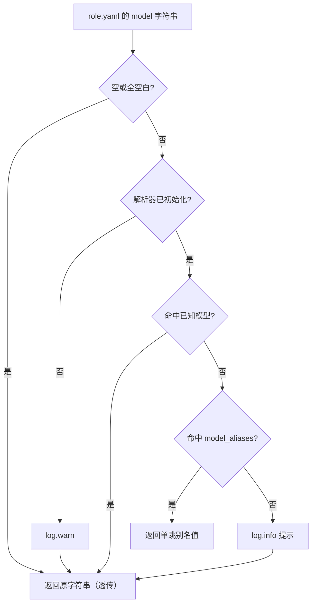

# 模型别名（Model Aliases）

注册中心里的角色常常带着占位模型名发布（如 `PLACEHOLDER`、`YOUR_MODEL_HERE`），而不是真实的 `provider/model_id`。与其逐个改角色的 `role.yaml`，不如在本地 `role_config.yaml` 里一次性定义**模型别名（model alias，把占位字符串映射到真实模型的本地配置）**。本页给出配置格式、解析优先级、失败时的降级行为与排查清单。

> 相关：[role.yaml 参考](/03-Reference/role-yaml)｜[平台与 Harness](/01-Overview/platform-harnesses)｜[CLI 参考](/03-Reference/cli)

## 最小示例

```yaml
# {configDir}/role_config.yaml
model_aliases:
  PLACEHOLDER: openrouter/anthropic/claude-sonnet-4
  YOUR_MODEL_HERE: anthropic/claude-opus-4
```

```text
应看到：角色加载时 model: PLACEHOLDER 被替换为 openrouter/anthropic/claude-sonnet-4；表内没有、也不属于已知模型的字符串原样透传，并在日志里得到一条 info 提示。
```

`model_aliases` 是一个「字符串 → 字符串」映射：key 是 `role.yaml` 中 `model:` 写下的占位字符串（精确匹配），value 是真实模型，形如 `provider/model_id`。把 `model:` 字符串换算成可用模型标识的组件称为**解析器（resolver）**，它只读取这一个配置键。

## 配置文件位置

`role_config.yaml` 放在当前 harness 的配置目录下，即 `{configDir}/role_config.yaml`：

| Harness | 路径 | 配置目录解析 |
|---|---|---|
| opencode | `~/.config/opencode/role_config.yaml` | `$XDG_CONFIG_HOME` 优先，否则 `~/.config/opencode` |
| pi | `~/.pi/agent/role_config.yaml` | `$PI_CODING_AGENT_DIR` 优先，否则 `~/.pi/agent` |
| dsh | `~/.dsh/role_config.yaml` | `$DSH_HOME` 优先，否则 `~/.dsh` |

在 opencode 上，`role_config.yaml` 与 `opencode.jsonc` 同目录——后者同时提供「已知模型」清单（见下节）。三个 harness 的完整目录规则见[平台与 Harness](/01-Overview/platform-harnesses)。

## 解析优先级

解析器共 5 个分支：2 个前置守卫 + 3 级优先级。整条链是非破坏性的——任何一级不匹配都返回原字符串，角色加载不会因此失败。

| 顺序 | 触发条件 | 结果 |
|---|---|---|
| 守卫 1 | `model` 为空或全空白 | 原样返回，不记日志 |
| 守卫 2 | 解析器尚未初始化 | `log.warn` + 原样返回 |
| Priority 1 | 命中**已知模型** | 原样返回（本身已是规范的 `provider/model_id`） |
| Priority 2 | 命中 `model_aliases` | 返回别名映射值（单跳） |
| Priority 3 | 两者都不命中 | `log.info` 输出提示 + 原样返回 |

**已知模型（known model，已出现在 `{configDir}/opencode.jsonc` 的 provider 模型目录中、本身已是规范 ID 的模型）** 与别名分别在每次初始化时从 `opencode.jsonc` 和 `role_config.yaml` 一起重新加载。



### Priority 3 的提示日志

未识别的值不会导致失败，而是输出一条 `log.info` 级提示，指出配置位置与 YAML 形状（其中 `${model}` 为实际模型名）：

```text
Model "${model}" is not a known model and has no alias configured. Passing through as-is. You can add an alias in role_config.yaml under the "model_aliases" key. Example: model_aliases:
  "${model}": provider/model_id
```

提示级别是 **info**，不是 error，也不是 warn：只有「解析器未初始化」这一守卫使用 `log.warn`。因此角色加载永远不会因为一个未识别的模型名而中断。

## 单跳语义

别名解析只做一次查表，不存在传递链：

```yaml
model_aliases:
  A: B
  B: C
```

`A` 会被解析成 `B`，**不会**继续解析成 `C`。若希望 `A` 最终落到 `C`，必须直接写 `A: C`。

## 容错加载

读取 `role_config.yaml` 的加载器**从不抛错**：任何异常输入都退化成「空映射」或「跳过该条」。

| 情况 | 行为 |
|---|---|
| 文件不存在 | 返回空映射，不记日志 |
| YAML 解析失败 | `log.warn` + 空映射 |
| 文档顶层不是对象（含 `null`） | 空映射 |
| 没有 `model_aliases` 键，或其值不是对象 | 空映射 |
| 别名 key 为空字符串 | 跳过该条 + `log.warn` |
| 别名 value 不是字符串（数字 / 布尔 / `null` / 数组 / 对象） | 跳过该条 + `log.warn`（日志含实际类型） |
| 别名 value 为空字符串 | 跳过该条 + `log.warn` |
| 合法条目 | 写入结果映射 |

跳过是**逐条**进行的：同一个文件里非法条目被跳过，合法条目照常生效。

## 生效时机

模型解析发生在**角色加载期**，不是工具调用期：

| 应用点 | 说明 |
|---|---|
| 启动引导 | 角色发现之前先初始化解析器，因此加载角色时别名已可用 |
| 角色级 `model` | 仅当 `model` 是字符串时替换为解析结果 |
| 子代理 `model` | 内联与文件式子代理的模型走同一个解析器 |

## 热重载

每次初始化都会重新加载 `opencode.jsonc` 与 `role_config.yaml` **两个**来源，没有幂等检查，也没有惰性初始化。因此编辑 `role_config.yaml` 后无需重启进程——下一次重载或启动即生效。

| 触发场景 | 说明 |
|---|---|
| opencode 完整热重载 | 重载周期内重新初始化解析器 |
| dsh 角色重载 | 重新初始化解析器 |
| 启动引导 | 每次启动都会初始化（opencode / pi / dsh 共用同一引导流程） |

若某条调用路径没有经过上述入口，就必须先显式初始化解析器；否则会命中「未初始化」守卫，`log.warn` 后原样透传。

## 排查清单

- **别名不生效** — key 必须与 `role.yaml` 中 `model:` 的字符串**精确相等**（大小写敏感）。
- **日志出现 "is not a known model and has no alias configured"** — Priority 3 命中：检查 `model_aliases` 的键名拼写，以及文件是否位于当前 harness 的配置目录。
- **别名指向另一个别名** — 不会递归；把 value 直接写成最终的 `provider/model_id`。
- **条目被丢弃，日志里只有一条 warn** — value 必须是字符串且非空；数字、布尔、`null`、数组与对象都会被跳过。

## 备注

> 自 v0.24.0 起，解析器在角色加载时支持别名回退——角色可以引用能解析为具体模型的别名。

## 相关页面

- [role.yaml 参考](/03-Reference/role-yaml) —— `model` 字段与其它字段的完整定义
- [平台与 Harness](/01-Overview/platform-harnesses) —— 三个 harness 的目录布局与安装
- [CLI 参考](/03-Reference/cli) —— `rolebox config` 交互式配置角色模型
