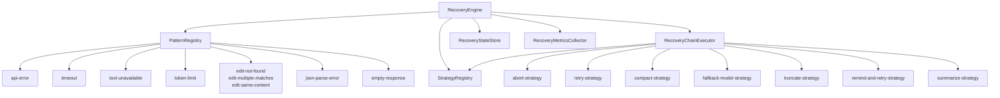
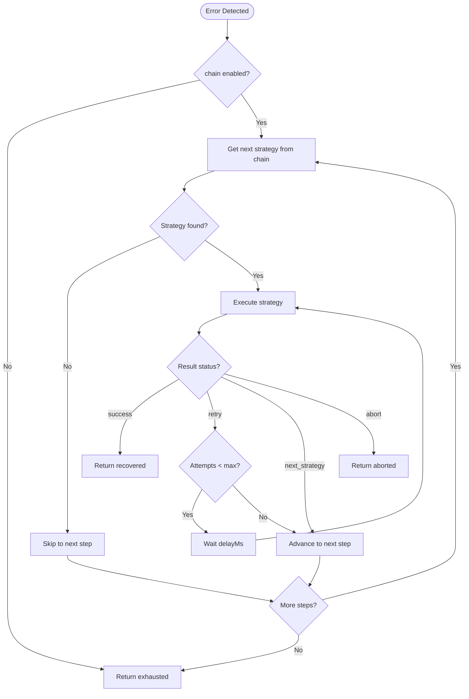
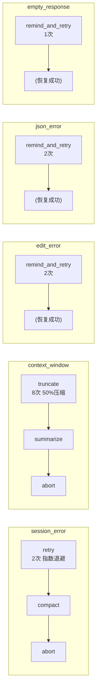

# 恢复系统

> **相关文档：** [错误处理](/03-Reference/error-handling) — 错误容忍设计原则概述 | [扩展机制](/03-Reference/extensions) — 恢复策略扩展注册 | [Hook 机制](/03-Reference/hooks) — 与恢复系统的集成点
>
> 本文档为恢复系统详细架构说明。概述见 [错误处理](./error-handling)。

恢复系统（Recovery System）是一个可插拔的错误恢复框架，用于拦截 Agent 运行时中的常见故障模式并自动执行补偿策略。它由 `RecoveryEngine` 统一管理，通过可配置的策略链（chain-of-strategies）将错误恢复逻辑与业务逻辑解耦。

---

## 架构总览

恢复系统由五个核心组件构成，呈分层架构：



| 组件 | 文件 | 职责 |
|---|---|---|
| `RecoveryEngine` | `src/recovery/engine.ts:21-56` | 恢复系统入口，管理配置、状态、指标和策略链执行 |
| `PatternRegistry` | `src/recovery/error-detection.ts:6-57` | 注册和匹配错误模式，从原始错误中提取结构化 `RecoveryError` |
| `StrategyRegistry` | `src/recovery/strategies/registry.ts:6-29` | 注册和查找恢复策略，运行时按名称获取策略实例 |
| `RecoveryChainExecutor` | `src/recovery/chain-executor.ts:20-124` | 顺序执行策略链，根据策略返回的状态决定流程走向 |
| `RecoveryStateStore` | `src/recovery/state.ts:33-215` | 持久化每会话恢复状态到 `.rolebox/state/recovery-{sessionID}.json` |
| `RecoveryMetricsCollector` | `src/recovery/metrics.ts:6-88` | 收集恢复指标（尝试次数、成功率、链结局） |

---

## RecoveryEngine

`RecoveryEngine`（`src/recovery/engine.ts:21-190`）是恢复系统的入口。它在构造时完成以下初始化工作（`src/recovery/engine.ts:30-56`）：

1. 初始化 `RecoveryMetricsCollector`
2. 创建 `PatternRegistry` 并注册 7 个默认错误模式（通过 `createDefaultPatterns()`）
3. 创建 `StrategyRegistry` 并注册 7 个内置恢复策略（通过 `registerBuiltinStrategies()`）
4. 创建 `RecoveryChainExecutor` 用于链式执行

### recover() 流程

`recover()` 方法（`src/recovery/engine.ts:65-161`）是恢复系统的核心入口：

```
recover(sessionID, error, category?)
  │
  ├─ 配置未启用 → 返回 { recovered: false }
  ├─ 提供了 category → PatternRegistry.detectCategory()
  │    未匹配 → 构造基础 RecoveryError
  ├─ 未提供 category → PatternRegistry.detectFirst()
  │    未匹配 → 返回 { recovered: false }
  │
  ├─ 记录 errorType 到指标（如果启用了指标收集）
  ├─ 查找 category 对应的 chainConfig
  │    无配置或禁用 → 返回 { recovered: false }
  │
  ├─ 创建 inject() 闭包（用于向系统 prompt 追加文本）
  ├─ 创建 onAttempt() 回调（记录持久化和指标）
  └─ chainExecutor.executeChain() → 处理结果
       │
       ├─ "recovered" → 清除持久化状态，返回 { recovered: true }
       ├─ "aborted"   → 返回 { recovered: false } 带错误消息
       └─ "exhausted" → 返回 { recovered: false } 带错误消息
```

### 生命周期方法

| 方法 | 文件行 | 用途 |
|---|---|---|
| `registerStrategy()` | `src/recovery/engine.ts:163-166` | 注册自定义恢复策略 |
| `registerErrorPattern()` | `src/recovery/engine.ts:168-170` | 注册自定义错误模式 |
| `getMetrics()` | `src/recovery/engine.ts:172-174` | 获取指标快照 |
| `getPatternRegistry()` | `src/recovery/engine.ts:176-178` | 获取 PatternRegistry 引用 |
| `getStrategyRegistry()` | `src/recovery/engine.ts:180-182` | 获取 StrategyRegistry 引用 |
| `dispose()` | `src/recovery/engine.ts:184-189` | 清理资源，刷新待写入的状态 |

---

## 错误检测 — PatternRegistry

`PatternRegistry`（`src/recovery/error-detection.ts:6-57`）维护一组 `ErrorPattern`，每个模式通过 `match(error: unknown): RecoveryError | null` 方法判断是否匹配。

### ErrorPattern 接口

定义在 `src/recovery/types.ts:192-203`：

```typescript
interface ErrorPattern {
  name: string;                              // 模式名称（用于日志和指标）
  category: RecoveryErrorCategory;           // 产生的错误类别
  match: (error: unknown) => RecoveryError | null; // 匹配函数
}
```

### 7 个默认错误模式

定义在 `src/recovery/error-detection.ts:90-297`（`createDefaultPatterns()` 工厂函数）：

| 模式名称 | 类别 | 触发条件 | 源码行 |
|---|---|---|---|
| `api-error` | `session_error` | 错误对象包含 `error.type`、`code` 或 `status` 字段 | `:96-115` |
| `timeout` | `session_error` | 消息包含 timeout / timed out / deadline exceeded / ETIMEDOUT 关键字 | `:119-135` |
| `tool-unavailable` | `session_error` | 消息匹配 tool not found / unknown tool / unavailable tool 正则 | `:139-154` |
| `token-limit` | `context_window` | 消息包含 context_length_exceeded / maximum context length / token limit 等关键字 | `:157-182` |
| `edit-not-found` | `edit_error` | Edit 工具返回 "oldString not found" | `:185-200` |
| `edit-multiple-matches` | `edit_error` | Edit 工具返回 "oldString found multiple times" | `:203-219` |
| `edit-same-content` | `edit_error` | Edit 工具返回 "oldString and newString must be different" | `:221-237` |
| `json-parse-error` | `json_error` | 消息匹配 JSON 语法错误正则（unexpected token / invalid json 等） | `:239-266` |
| `empty-response` | `empty_response` | 工具输出或模型响应为空或短于 5 字符 | `:268-297` |

### 三种检测方式

| 方法 | 行为 | 源码行 |
|---|---|---|
| `detect(error)` | 返回所有匹配的 RecoveryError 数组 | `:15-26` |
| `detectFirst(error)` | 返回第一个匹配的 RecoveryError | `:29-38` |
| `detectCategory(error, category)` | 仅匹配指定类别的模式 | `:42-53` |

错误消息提取由辅助函数 `extractMessage()`（`src/recovery/error-detection.ts:61-77`）处理，支持字符串、Error 对象、带 message/error/output/title 字段的对象等多种格式。

---

## 恢复策略

### 策略接口

所有策略实现 `RecoveryStrategy` 接口（`src/recovery/types.ts:259-264`）：

```typescript
interface RecoveryStrategy {
  readonly name: string;
  execute(ctx: RecoveryStrategyContext): Promise<RecoveryStrategyResult>;
}
```

上下文对象 `RecoveryStrategyContext`（`src/recovery/types.ts:214-234`）包含：
- `sessionID` — 会话标识
- `error` — 检测到的结构化错误
- `attempt` — 当前策略内的重试次数（1-based）
- `stepConfig` — 策略步骤的配置块
- `inject(text)` — 向系统 prompt 追加文本
- `client` — opencode 插件客户端实例（用于 API 调用）

返回值 `RecoveryStrategyResult`（`src/recovery/types.ts:246-250`）是判别联合体：

| 状态 | 含义 | 链执行器行为 |
|---|---|---|
| `success` | 恢复成功 | 终止链，返回 recovered |
| `retry` | 需要重试（可带延迟） | 保持在同一步骤，等待后重试 |
| `next_strategy` | 当前策略无效 | 前进到链中下一步骤 |
| `abort` | 放弃恢复 | 终止链，返回 aborted |

### 7 种内置恢复策略

所有内置策略通过 `registerBuiltinStrategies()` 注册（`src/recovery/strategies/index.ts:20-28`）：

#### 1. abort — 中止恢复

| 属性 | 值 |
|---|---|
| 策略名称 | `abort` |
| 文件 | `src/recovery/strategies/abort-strategy.ts:3-10` |
| 用途 | 终端策略，终止恢复链并注入中止消息 |
| 触发 | 作为策略链的最后一个兜底策略 |
| 行为 | 读取 `stepConfig.message`（默认 "Recovery aborted: all strategies exhausted"），通过 `ctx.inject()` 追加 `[RECOVERY ABORTED]` 标记到系统 prompt，返回 `{ status: "abort" }` |

#### 2. retry — 指数退避重试

| 属性 | 值 |
|---|---|
| 策略名称 | `retry` |
| 文件 | `src/recovery/strategies/retry-strategy.ts:3-17` |
| 用途 | 对临时性故障进行自动重试 |
| 触发 | 会话错误、网络抖动、临时不可用 |
| 行为 | 配置 `max_retries`（默认 2）、`backoff_ms`（默认 2000）、`backoff_factor`（默认 2）。每次重试延迟 = `backoff_ms * backoff_factor^attempt`。超出 `max_retries` 后返回 `next_strategy` |

#### 3. compact — 压缩会话上下文

| 属性 | 值 |
|---|---|
| 策略名称 | `compact` |
| 文件 | `src/recovery/strategies/compact-strategy.ts:3-18` |
| 用途 | 调用客户端 API 压缩会话上下文历史 |
| 触发 | 上下文过大或会话过于冗长 |
| 行为 | 尝试调用 `client.session.compact()`。如果客户端不支持 compact 或调用失败，返回 `next_strategy` |

#### 4. fallback_model — 备用模型提示

| 属性 | 值 |
|---|---|
| 策略名称 | `fallback_model` |
| 文件 | `src/recovery/strategies/fallback-model-strategy.ts:3-27` |
| 用途 | 使用备用模型重新发送恢复提示，绕过当前模型的故障点 |
| 触发 | 当前模型不可用或持续出错 |
| 行为 | 读取 `stepConfig.model` 指定备用模型。通过 `client.session.promptAsync()` 发送恢复指令。如果客户端不支持 promptAsync 或调用失败，返回 `next_strategy` |

#### 5. truncate — 截断指令注入

| 属性 | 值 |
|---|---|
| 策略名称 | `truncate` |
| 文件 | `src/recovery/strategies/truncate-strategy.ts:3-21` |
| 用途 | 在上下文窗口溢出时，要求模型减少输出长度 |
| 触发 | 上下文窗口限制错误（token-limit 模式） |
| 行为 | 配置 `max_truncations`（默认 8）、`target_ratio`（默认 0.5）、`min_output_size`（默认 500）。通过 `ctx.inject()` 注入截断指令，要求输出减少约 `(1 - target_ratio) * 100%`。超出 `max_truncations` 后返回 `next_strategy` |

#### 6. remind_and_retry — 提示并重试

| 属性 | 值 |
|---|---|
| 策略名称 | `remind_and_retry` |
| 文件 | `src/recovery/strategies/remind-and-retry-strategy.ts:3-17` |
| 用途 | 注入提示文本到系统 prompt 后重试，用于指导模型修正错误行为 |
| 触发 | 编辑错误（oldString not found）、JSON 解析错误 |
| 行为 | 配置 `max_retries`（默认 2）、`reminder_text`（自定义提示文本）。通过 `ctx.inject()` 追加提醒文本。每次重试间隔 1 秒。超出 `max_retries` 后返回 `next_strategy` |

#### 7. summarize — 上下文总结

| 属性 | 值 |
|---|---|
| 策略名称 | `summarize` |
| 文件 | `src/recovery/strategies/summarize-strategy.ts:3-36` |
| 用途 | 通过总结指令或 API 调用压缩上下文，减少 token 消耗 |
| 触发 | 上下文窗口溢出 |
| 行为 | 首选通过 `client.session.promptAsync()` 使用备用模型进行总结。如果 API 不可用，回退到通过 `ctx.inject()` 注入总结指令。返回 `retry` 状态以触发重试 |

### 策略一览表

| 策略 | 名称 | 配置参数 | 依赖 | 源码行 |
|---|---|---|---|---|
| 中止 | `abort` | `message` | 无 | `abort-strategy.ts:3-10` |
| 重试 | `retry` | `max_retries`, `backoff_ms`, `backoff_factor` | 无 | `retry-strategy.ts:3-17` |
| 压缩 | `compact` | — | `client.session.compact()` | `compact-strategy.ts:3-18` |
| 备用模型 | `fallback_model` | `model` | `client.session.promptAsync()` | `fallback-model-strategy.ts:3-27` |
| 截断 | `truncate` | `max_truncations`, `target_ratio`, `min_output_size` | 无（指令注入） | `truncate-strategy.ts:3-21` |
| 提示重试 | `remind_and_retry` | `max_retries`, `reminder_text` | 无（指令注入） | `remind-and-retry-strategy.ts:3-17` |
| 总结 | `summarize` | `model` | `client.session.promptAsync()`（可选） | `summarize-strategy.ts:3-36` |

---

## 策略链 (Strategy Chain)

策略链是恢复系统的核心设计模式（`src/recovery/chain-executor.ts:26-123`）。每个错误类别可以配置一个有序的策略序列。当错误被捕获时，`RecoveryChainExecutor` 按顺序执行链中的策略。

### 链执行流程图



### 链执行结果

执行链的结果有三种（`src/recovery/chain-executor.ts:14-18`）：

| 结果 | 含义 | 后续处理 |
|---|---|---|
| `recovered` | 链中某个策略成功恢复 | 清除持久化状态，返回 `{ recovered: true }` |
| `aborted` | 链中某个策略要求中止 | 返回 `{ recovered: false }` 和中止原因 |
| `exhausted` | 链中所有策略均未成功 | 返回 `{ recovered: false }` 和耗尽原因 |

### 默认策略链

定义在 `src/recovery/config.ts:48-78`（`DEFAULT_CHAINS`）：



| 错误类别 | 默认链 | 源码行 |
|---|---|---|
| `session_error` | retry(2次, 指数退避) → compact → abort | `:49-55` |
| `context_window` | truncate(最多8次, 50%压缩比) → summarize → abort | `:56-62` |
| `edit_error` | remind_and_retry(2次) | `:63-67` |
| `json_error` | remind_and_retry(2次) | `:68-72` |
| `empty_response` | remind_and_retry(1次) | `:73-77` |

### 全局限制

`RecoveryChainExecutor` 通过 `maxTotalAttempts`（`src/recovery/chain-executor.ts:48-51`）对所有策略步骤的总重试次数施加硬限制（默认 10）。超出限制后立即返回 `exhausted`。

::: info 链执行器的容错设计
`RecoveryChainExecutor` 内部对每个策略的 `execute()` 调用使用 try/catch 包裹。即使某个策略实现抛出了未预期的异常，执行器会将其视为普通 `next_strategy` 状态，继续执行下一个策略，而不是中断整个链。这确保了恢复链本身的健壮性。
:::

---

## 配置

### RecoveryConfig

恢复系统配置类型定义在 `src/recovery/types.ts:120-131`，默认值在 `src/recovery/config.ts:31-37`：

```typescript
interface RecoveryConfig {
  enabled: boolean;           // 全局开关（默认 true）
  maxTotalAttempts: number;   // 每会话最大恢复尝试次数（默认 10）
  persistState: boolean;      // 是否持久化恢复状态到磁盘（默认 true）
  collectMetrics: boolean;    // 是否收集恢复指标（默认 true）
  chains: Partial<Record<RecoveryErrorCategory, RecoveryChainConfig>>;
}
```

### 链配置

每个错误类别可以配置一条恢复链（`src/recovery/types.ts:107-112`）：

```typescript
interface RecoveryChainConfig {
  chain: StrategyStep[];   // 策略步骤有序列表
  enabled?: boolean;       // 是否启用该链（默认 true）
}

interface StrategyStep {
  strategy: string;                    // 策略名称（如 "retry"、"compact"、"abort"）
  config?: Record<string, unknown>;    // 策略特定配置
}
```

### 配置解析

`parseRecoveryConfig()`（`src/recovery/config.ts:121-188`）处理原始 YAML 配置：

1. 处理 `undefined` / `null`，回退到默认配置
2. 支持 `enabled`、`max_total_attempts`、`persist_state`、`collect_metrics` 顶层字段
3. 按类别解析策略链，未知的策略名称会发出警告并跳过
4. 合并角色级默认值（role-level defaults）覆盖解析后的值

### 已知策略名称验证

`KNOWN_STRATEGIES`（`src/recovery/config.ts:88-96`）维护了所有可识别的策略名称集合。自定义策略必须通过 `addKnownStrategy()`（`src/recovery/config.ts:101-103`）注册，否则 YAML 配置验证会跳过该策略。

---

## 状态持久化

`RecoveryStateStore`（`src/recovery/state.ts:33-215`）将每会话恢复状态持久化到 `.rolebox/state/recovery-{sessionID}.json`。

### 关键机制

| 机制 | 说明 | 源码行 |
|---|---|---|
| 文件路径 | `stateDirFor(workspaceDir) / recovery-{sessionID}.json` | `:42-44` |
| 原子写入 | 通过 `atomicWrite` / `atomicWriteSync` 确保不会写出半成品 | `:77-84`, `:93-99` |
| 脏映射 | 跟踪待写入的状态，支持 `flushSync()` 完全落盘 | `:196-199` |
| 自动去重 | `recordAttempt()` 按 `timestamp + strategy` 去重，防止重启后重复计数 | `:129-134` |
| 清理 | 恢复成功后调用 `delete()` 移除状态文件 | `:179-187` |

### RecoveryState

定义在 `src/recovery/types.ts:141-157`：

```typescript
interface RecoveryState {
  sessionID: string;                              // 会话标识
  attempts: RecoveryAttempt[];                    // 所有恢复尝试记录
  activeChains: Record<string, {                  // 当前活跃的链
    currentStep: number;                          // 当前执行步骤索引
    startTime: number;                            // 链启动时间戳
    totalAttempts: number;                        // 链内总尝试次数
  }>;
  metrics: RecoveryMetricsSnapshot;               // 累计指标快照
}
```

---

## 指标收集

`RecoveryMetricsCollector`（`src/recovery/metrics.ts:6-88`）收集运行时的恢复指标。

### RecoveryMetricsSnapshot

定义在 `src/recovery/types.ts:165-180`：

```typescript
interface RecoveryMetricsSnapshot {
  totalAttempts: number;              // 总恢复尝试次数
  successfulRecoveries: number;       // 总成功恢复次数
  abortedChains: number;              // 被中止的链数
  exhaustedChains: number;            // 耗尽的链数
  byCategory: Record<string, {        // 按类别统计
    attempts: number;
    successes: number;
  }>;
  byStrategy: Record<string, {        // 按策略统计
    attempts: number;
    successes: number;
  }>;
  errorTypeFrequency: Record<string, number>;  // 各错误类型出现频率
}
```

### 指标记录点

| 事件 | 记录方法 | 源码行 |
|---|---|---|
| 检测到错误类型 | `recordErrorType()` | `src/recovery/engine.ts:100-102` |
| 每次策略执行 | `recordAttempt()` | `src/recovery/engine.ts:116-123` |
| 链执行完成 | `recordChainOutcome()` | `src/recovery/engine.ts:141-143` |

---

## 错误类别

定义的错误类别在 `src/recovery/types.ts:32-39`：

| 类别 | 含义 | 默认是否有链 |
|---|---|---|
| `session_error` | Agent 会话遇到不可恢复的失败（超时、崩溃、意外终止） | 是 |
| `context_window` | 模型的上下文窗口已满或接近已满 | 是 |
| `edit_error` | 文件编辑操作失败（写入冲突、内容过期、权限拒绝） | 是 |
| `json_error` | JSON 解析错误（工具输出或响应中） | 是 |
| `empty_response` | 工具调用或模型响应返回空内容 | 是 |
| `tool_pair` | 配对的工具调用失败（如 read 成功但 write 失败） | 否 |
| `guard_violation` | 安全或验证守卫被触发 | 否 |

---

## 调度集成

恢复系统与调度（Dispatch）系统通过以下方式集成：

- 子代理调度失败时，Jinyiwei 会利用恢复系统的重试机制（`src/recovery/config.ts:51` 中 `session_error` 链的首个策略为 `retry`）
- 背压控制（backpressure）与恢复系统的 `maxTotalAttempts` 全局限制结合使用
- 恢复状态与调度状态共享 `.rolebox/state/` 目录（`src/recovery/state.ts:6-11`）

---

## 扩展 API

### 注册自定义恢复策略

```typescript
import { RecoveryStrategy } from "./types.ts";

const myStrategy: RecoveryStrategy = {
  name: "my_custom_strategy",
  async execute(ctx) {
    // 使用 ctx.error, ctx.attempt, ctx.stepConfig, ctx.inject()
    if (ctx.attempt >= 3) {
      return { status: "next_strategy", reason: "max attempts reached" };
    }
    ctx.inject("[CUSTOM] Executing custom recovery...\n");
    return { status: "retry", delayMs: 500, reason: "retrying" };
  },
};

// 注册到引擎
engine.registerStrategy(myStrategy);           // src/recovery/engine.ts:163-166
addKnownStrategy("my_custom_strategy");         // src/recovery/config.ts:101-103
```

### 注册自定义错误模式

```typescript
import { ErrorPattern, RecoveryError } from "./types.ts";

const myPattern: ErrorPattern = {
  name: "my-custom-error",
  category: "session_error",
  match(error: unknown): RecoveryError | null {
    const msg = typeof error === "string" ? error : error instanceof Error ? error.message : null;
    if (msg && msg.includes("MY_CUSTOM_ERROR")) {
      return {
        category: "session_error",
        errorType: "my_custom_error",
        message: msg,
        raw: error,
        timestamp: Date.now(),
      };
    }
    return null;
  },
};

engine.registerErrorPattern(myPattern);  // src/recovery/engine.ts:168-170
```

### 从 Engine 获取运行时组件

```typescript
const metrics = engine.getMetrics();            // src/recovery/engine.ts:172-174
const patterns = engine.getPatternRegistry();   // src/recovery/engine.ts:176-178
const strategies = engine.getStrategyRegistry(); // src/recovery/engine.ts:180-182
```

### 配置默认链覆盖

通过角色级配置覆盖默认链（`src/recovery/config.ts:174-185` 中 `roleDefaults` 合并逻辑）：

```yaml
recovery:
  enabled: true
  max_total_attempts: 15
  session_error:
    chain:
      - strategy: retry
        config:
          max_retries: 3
          backoff_ms: 1000
          backoff_factor: 3
      - strategy: fallback_model
        config:
          model: gpt-4
      - strategy: abort
        config:
          message: "Session recovery failed after custom chain"
    enabled: true
```

---

## 下一步

- [错误处理](/03-Reference/error-handling) — 恢复系统概述与错误容忍设计原则
- [Hook 机制](/03-Reference/hooks) — Hook 与恢复系统的集成点
- [调度配置](/03-Reference/dispatch-config) — 调度背压与重试配置
- [role.yaml 参考](/03-Reference/role-yaml) — postHooks、hooks.builtin 与恢复相关的配置字段
- [已知限制](/03-Reference/limitations) — 恢复系统的当前功能限制

### 相关源码

| 文件 | 说明 |
|---|---|
| `src/recovery/engine.ts` | RecoveryEngine 实现（190 行） |
| `src/recovery/chain-executor.ts` | RecoveryChainExecutor 实现（124 行） |
| `src/recovery/error-detection.ts` | PatternRegistry + 默认错误模式（298 行） |
| `src/recovery/config.ts` | 配置解析、默认链、已知策略列表（250 行） |
| `src/recovery/types.ts` | 核心类型定义（302 行） |
| `src/recovery/state.ts` | RecoveryStateStore 持久化层（215 行） |
| `src/recovery/metrics.ts` | RecoveryMetricsCollector 指标收集（88 行） |
| `src/recovery/strategies/interface.ts` | 策略类型重新导出 |
| `src/recovery/strategies/index.ts` | 内置策略注册入口 |
| `src/recovery/strategies/registry.ts` | StrategyRegistry 实现 |
| `src/recovery/strategies/abort-strategy.ts` | 中止策略 |
| `src/recovery/strategies/retry-strategy.ts` | 重试策略 |
| `src/recovery/strategies/compact-strategy.ts` | 压缩策略 |
| `src/recovery/strategies/fallback-model-strategy.ts` | 备用模型策略 |
| `src/recovery/strategies/truncate-strategy.ts` | 截断策略 |
| `src/recovery/strategies/remind-and-retry-strategy.ts` | 提示重试策略 |
| `src/recovery/strategies/summarize-strategy.ts` | 总结策略 |
