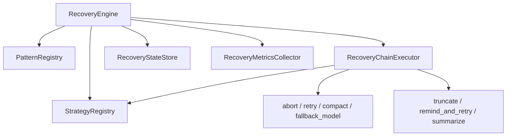

# 恢复系统（Recovery System）

恢复系统拦截 Agent 运行时的常见故障模式，按错误类别选择一条策略链并依次执行补偿动作。实现位于 `src/recovery/`，由 `RecoveryEngine` 统一管理错误检测、链执行、状态持久化与指标收集。

> **本页的边界**：本页是引擎内部实现。角色作者要写的 `hooks.recovery` 配置字段、默认值与示例见 [role.yaml 参考](/03-Reference/role-yaml)；用户面的降级行为总表与选型决策表见[错误处理](/03-Reference/error-handling)；恢复策略与错误模式的扩展注册协议见[扩展机制](/03-Reference/extensions)。

> 自 v0.19.0 起，恢复框架提供可配置策略链与恢复状态持久化。

## 1. 组件构成

| 组件 | 模块 | 职责 |
|---|---|---|
| `RecoveryEngine` | `src/recovery/engine.ts` | 入口：初始化默认模式与策略、编排 `recover()`、暴露注册 API |
| `PatternRegistry` | `src/recovery/error-detection.ts` | 注册与匹配错误模式，把原始错误转成结构化 `RecoveryError` |
| `StrategyRegistry` | `src/recovery/strategies/registry.ts` | 按名称注册与查找策略实例 |
| `RecoveryChainExecutor` | `src/recovery/chain-executor.ts` | 顺序执行策略链，按策略返回状态决定走向 |
| `RecoveryStateStore` | `src/recovery/state.ts` | 每会话状态持久化（写代次保护、原子写入、去重） |
| `RecoveryMetricsCollector` | `src/recovery/metrics.ts` | 尝试次数、成功率、链结局统计 |
| 内置策略 | `src/recovery/strategies/` | 7 个策略实现与注册入口 |
| 恢复型内置 Hook | `src/recovery/builtin/` | 5 个错误恢复 Hook 与 4 个护栏 Hook |


```mermaid
flowchart TD
    A[RecoveryEngine] --> B[PatternRegistry]
    A --> C[RecoveryChainExecutor]
    A --> D[StrategyRegistry]
    A --> E[RecoveryStateStore]
    A --> F[RecoveryMetricsCollector]
    C --> D
    C --> G[abort / retry / compact / fallback_model]
    C --> H[truncate / remind_and_retry / summarize]
```

`RecoveryEngine` 在构造时完成四件事：创建 `RecoveryMetricsCollector`；用 `createDefaultPatterns()` 注册 9 个默认错误模式；用 `registerBuiltinStrategies()` 注册 7 个内置策略；创建 `RecoveryChainExecutor`。

## 2. `recover()` 的主流程

```text
recover(sessionID, error, category?)
  ├─ 配置未启用 → { recovered: false }
  ├─ 给了 category → PatternRegistry.detectCategory()
  │      未匹配 → 退回构造一个基础 RecoveryError
  ├─ 未给 category → PatternRegistry.detectFirst()
  │      未匹配 → { recovered: false }
  ├─ 记录 errorType 指标
  ├─ 取该 category 的链配置
  │      无配置或链被禁用 → { recovered: false }
  ├─ 构造 inject() 闭包与 onAttempt() 回调
  └─ chainExecutor.executeChain()
        ├─ recovered → 清除持久化状态，{ recovered: true }
        ├─ aborted   → { recovered: false }（带中止原因）
        └─ exhausted → { recovered: false }（带耗尽原因）
```

生命周期方法（`registerStrategy()`、`registerErrorPattern()`、`getMetrics()`、`getPatternRegistry()`、`getStrategyRegistry()`、`dispose()`）都是薄封装；`dispose()` 只在 `persistState` 与 `collectMetrics` 同时为真时调用一次 `flushSync()`，把待写状态落盘。

## 3. 错误检测

`PatternRegistry` 持有一组 `ErrorPattern`，每个模式自行判断是否匹配：

```typescript
interface ErrorPattern {
  name: string;                                     // 模式名，用于日志与指标
  category: RecoveryErrorCategory;                  // 匹配后产生的错误类别
  match: (error: unknown) => RecoveryError | null;  // 匹配函数
}
```

| 方法 | 行为 |
|---|---|
| `detect(error)` | 返回全部匹配的 `RecoveryError` |
| `detectFirst(error)` | 返回第一个匹配项 |
| `detectCategory(error, category)` | 只在指定类别内匹配 |

### 9 个默认错误模式

| 模式 | 类别 | 触发条件 |
|---|---|---|
| `api-error` | `session_error` | 错误对象带有 `error.type`、`code` 或 `status` 字段 |
| `timeout` | `session_error` | 消息包含 timeout / timed out / deadline exceeded / ETIMEDOUT |
| `tool-unavailable` | `session_error` | 消息匹配 tool not found / unknown tool / unavailable tool |
| `token-limit` | `context_window` | 消息包含 context_length_exceeded / maximum context length / token limit |
| `edit-not-found` | `edit_error` | Edit 工具返回 oldString not found |
| `edit-multiple-matches` | `edit_error` | Edit 工具返回 oldString found multiple times |
| `edit-same-content` | `edit_error` | Edit 工具返回 oldString and newString must be different |
| `json-parse-error` | `json_error` | 消息匹配 JSON 语法错误正则（unexpected token / invalid json） |
| `empty-response` | `empty_response` | 工具输出或模型响应为空，或短于 5 个字符 |

错误消息的提取由 `extractMessage()` 统一处理，兼容字符串、`Error` 对象，以及带 `message` / `error` / `output` / `title` 字段的对象。

## 4. 恢复策略

所有策略实现同一个接口：

```typescript
interface RecoveryStrategy {
  readonly name: string;
  execute(ctx: RecoveryStrategyContext): Promise<RecoveryStrategyResult>;
}
```

上下文 `RecoveryStrategyContext` 提供 `sessionID`、`error`、`attempt`、`stepConfig`、`inject(text)` 与可选的 `sessionClient`。其中 `attempt` 是当前步骤内自 0 起计的尝试序号：执行器在每次 `retry` 之后自增，因此第一次执行时它是 0（源码类型注释写作 1-based，与执行器的实际传值不一致）。

返回值是判别联合，决定链执行器的走向：

| 状态 | 含义 | 链执行器行为 |
|---|---|---|
| `success` | 恢复成功 | 终止链，返回 recovered |
| `retry` | 需要重试（可带 `delayMs`） | 停留在同一步骤，等待后重试 |
| `next_strategy` | 当前策略无效 | 前进到链中的下一步骤 |
| `abort` | 放弃恢复 | 终止链，返回 aborted |

### 7 个内置策略

| 策略 | 配置参数 | 行为要点 |
|---|---|---|
| `abort` | `message` | 终端策略：注入 `[RECOVERY ABORTED]` 标记后返回 `abort` |
| `retry` | `max_retries`（2）、`backoff_ms`（2000）、`backoff_factor`（2） | 第 n 次重试延迟 `backoff_ms × backoff_factor^attempt`；`attempt >= max_retries` 时转 `next_strategy` |
| `compact` | 无 | 调用 `sessionClient.compact(sessionID)`；无该方法或返回 false 时转 `next_strategy` |
| `fallback_model` | `model` | 用指定模型重发恢复提示；未配置 `model` 或客户端无 `prompt` 时转 `next_strategy` |
| `truncate` | `max_truncations`（8）、`target_ratio`（0.5）、`min_output_size`（500） | 注入「把输出再压缩约 1 − target_ratio」的指令；超次数后转 `next_strategy` |
| `remind_and_retry` | `max_retries`（2）、`reminder_text` | 注入提醒文本后固定间隔 1 秒重试 |
| `summarize` | `model`（默认 `default`） | 优先让模型总结；客户端无 `prompt` 时回退为注入总结指令并返回 `retry` |

依赖 `sessionClient` 的三个策略（`compact`、`fallback_model`、`summarize`）在客户端能力缺失时都不抛错，而是降级为 `next_strategy` 或指令注入。

## 5. 策略链

`RecoveryChainExecutor.executeChain()` 按顺序遍历链。每个步骤把 `stepConfig` 交给策略；策略返回 `retry` 时保持步骤号不变、`attempt` 自增，返回 `next_strategy` 时步骤号加一并把 `attempt` 归零。链被禁用（`enabled: false`）或为空时立即返回 `exhausted`。

链的结局有三种：

| 结果 | 含义 | 引擎后续处理 |
|---|---|---|
| `recovered` | 某个策略成功 | 清除持久化状态，返回 `{ recovered: true }` |
| `aborted` | 某个策略要求中止 | 返回 `{ recovered: false }` 与中止原因 |
| `exhausted` | 链走完仍未成功 | 返回 `{ recovered: false }` 与耗尽原因 |

两条工程性保证：

- **全局尝试上限**：`maxTotalAttempts`（默认 10）对所有步骤的总尝试数生效，超出立即返回 `exhausted`。
- **策略异常不外溢**：每个策略的 `execute()` 都包在 try/catch 中，抛出的异常被折算成 `next_strategy`，链继续走下一步骤。

### 5 条默认链

| 错误类别 | 默认链 |
|---|---|
| `session_error` | `retry`（2 次指数退避）→ `compact` → `abort` |
| `context_window` | `truncate`（最多 8 次，目标 50%）→ `summarize` → `abort` |
| `edit_error` | `remind_and_retry`（2 次） |
| `json_error` | `remind_and_retry`（2 次） |
| `empty_response` | `remind_and_retry`（1 次） |

`tool_pair` 与 `guard_violation` 两个类别没有默认链，必须显式配置才会执行。

## 6. 配置解析

`parseRecoveryConfig()` 接收已经解析过的对象（来自 `hooks.recovery`），输出 `RecoveryConfig`：

```yaml
hooks:
  recovery:
    max_total_attempts: 15
    session_error:
      chain:
        - strategy: retry
          config: { max_retries: 3, backoff_ms: 1000, backoff_factor: 3 }
        - strategy: abort
```

| 输入键 | 目标字段 | 默认值 |
|---|---|---|
| `enabled` | `enabled` | `true` |
| `max_total_attempts` | `maxTotalAttempts` | `10` |
| `persist_state` | `persistState` | `true` |
| `collect_metrics` | `collectMetrics` | `true` |
| 以错误类别为键的块（`chain` + `enabled`） | `chains[category]` | 无（回落到默认链） |

解析规则有三条值得注意：

1. 某个类别解析出**非空** `chain` 时，它完全覆盖该类别，不再与默认链合并；`chain` 缺失或过滤后为空（例如所有策略名都不认识）时回落到默认链。
2. 链中出现的策略名必须已在 `KNOWN_STRATEGIES` 中；未知策略名会记警告并跳过该步骤。
3. 第二个参数 `roleDefaults` 会用整块对象覆盖解析结果，但当前生产调用点只传一个参数，因此角色覆盖实际走的是「声明即替换」。

完整的角色面字段说明见 [role.yaml 参考](/03-Reference/role-yaml)。

## 7. 状态持久化

`RecoveryStateStore` 把每会话状态写到 `.rolebox/state/recovery-{sessionID}.json`，目录由 `stateDirFor(workspaceDir)` 拼出（`src/utils/state-paths.ts`）。

| 机制 | 说明 |
|---|---|
| 原子写入 | 异步路径先写临时文件再 `renameSync()`；同步路径走 `atomicWriteSync()` |
| 写代次保护 | 每次写入意图递增 `writeGen`，被取代的在途异步写在 rename 前中止，旧内容不会覆盖新内容 |
| 脏映射 | 跟踪待写状态，`flushSync()` 一次性落盘 |
| 尝试去重 | `recordAttempt()` 按 `timestamp + strategy` 去重，防止重启后重复计数 |
| 清理 | 恢复成功后 `delete()` 移除状态文件，并递增写代次以阻止在途异步写把它重建出来 |

状态结构包含 `sessionID`、全部恢复尝试记录 `attempts`、当前活跃链 `activeChains`（`currentStep` / `startTime` / `totalAttempts`）与累计指标快照 `metrics`。

## 8. 指标

`RecoveryMetricsCollector` 记录的快照字段为：`totalAttempts`、`successfulRecoveries`、`abortedChains`、`exhaustedChains`、`byCategory`（每类别的 attempts / successes）、`byStrategy`（每策略的 attempts / successes）、`errorTypeFrequency`（错误类型出现次数）。

记录点有三个：检测到错误类型时记 `errorTypeFrequency`，每次策略执行后记一次尝试，链结束时记一次结局。

## 9. 错误类别

| 类别 | 含义 | 默认链 |
|---|---|---|
| `session_error` | 会话遇到不可恢复的失败（超时、崩溃、意外终止） | 有 |
| `context_window` | 上下文窗口已满或接近已满 | 有 |
| `edit_error` | 文件编辑失败（写入冲突、内容过期、权限拒绝） | 有 |
| `json_error` | JSON 解析错误 | 有 |
| `empty_response` | 工具调用或模型响应为空 | 有 |
| `tool_pair` | 配对的工具调用失败（如 read 成功但 write 失败） | 无 |
| `guard_violation` | 安全或验证护栏被触发 | 无 |

## 10. 调度集成

恢复系统与调度系统共享 `.rolebox/state/` 目录，并在两点上衔接：子代理调度失败时可以利用 `session_error` 链的 `retry` 先手重试；`maxTotalAttempts` 是跨策略、跨步骤的全局闸门，因此一次故障无论命中多少模式都不会无限重试。

## 11. 扩展 API

### 声明式注册

恢复策略与错误模式各有一个扩展作用域：`recovery_strategies` 与 `recovery_patterns`（两者都是 `ExtensionScope` 的合法取值，共 7 个作用域）。模块合约是：

| 作用域 | 模块必须导出 | 说明 |
|---|---|---|
| `recovery_strategies` | `name` + `execute` | 加载时调用 `addKnownStrategy(name)`，让配置解析接受该策略名 |
| `recovery_patterns` | `name` + `match` | 按 `name` 登记模块，类别由模块自身返回的错误对象决定 |

```javascript
// ext/my-recovery.js —— recovery_strategies 模块
export default {
  name: "my_custom_strategy",
  async execute(ctx) {
    if (ctx.attempt >= 3) return { status: "next_strategy", reason: "max attempts reached" };
    ctx.inject("[CUSTOM] Executing custom recovery...\n");
    return { status: "retry", delayMs: 500, reason: "retrying" };
  },
};
```

扩展点只负责加载与登记，真正把模块注册进引擎的是 `ExtensionService.init()`：它在初始化时遍历已加载模块，调用 `recoveryEngine.registerStrategy()` 或 `registerErrorPattern()`。声明语法与安全约束见[扩展机制](/03-Reference/extensions)。

### 命令式注册

已经拿到 `RecoveryEngine` 实例的代码可以直接注册，`registerStrategy()` 会同时把策略名加入已知集合：

```typescript
engine.registerStrategy(myStrategy);
engine.registerErrorPattern(myPattern);

const metrics = engine.getMetrics();
const patterns = engine.getPatternRegistry();
const strategies = engine.getStrategyRegistry();
```

`registerErrorPattern()` 接收的 `match()` 需返回完整的 `RecoveryError`（`category`、`errorType`、`message`、`raw`、`timestamp`），或返回 `null` 表示不匹配。

## 12. 平台差异

恢复引擎只在 opencode 组合根中装配：`createPluginHooks()` 注册 `RecoveryService`（`src/core/composition.ts`），由它实例化 `RecoveryEngine` 与内置 Hook 注册表（`src/core/services/recovery-service.ts`）。pi 与 dsh 的装载路径没有等价装配。

| 能力 | opencode | pi | dsh |
|---|---|---|---|
| `RecoveryEngine`（策略链、状态、指标） | 有 | 无 | 无 |
| 恢复型内置 Hook（`hooks.builtin` 的 9 个开关） | 有 | 无（`HookDeps.builtInHooks` 有意省略） | 无（`DshHookProvider` 只映射 tool-before / tool-after / chat-message） |
| `recovery:` 配置块与 `recovery_*` 扩展 | 生效 | 不生效 | 不生效 |

`hooks.builtin` 的 9 个开关是主开关 `recovery` 加 5 个错误恢复 Hook（`session_error`、`edit_error`、`json_error`、`context_window`、`empty_response`）与 4 个默认关闭的护栏 Hook（`tool_pair_validation`、`write_existing_file_guard`、`bash_file_read_guard`、`webfetch_redirect_guard`）。三套 harness 的能力对照见[平台与 Harness](/01-Overview/platform-harnesses)。

## 13. 当前实现边界

- **只在 opencode 生效**：pi 与 dsh 上 `hooks.recovery` 不产生任何效果，也没有降级提示。
- **配置解析的第二个参数在生产路径未被使用**：角色覆盖走声明即替换，不参与与默认链的深度合并。
- **`attempt` 的语义与类型注释不一致**：执行器从 0 开始传值，编写自定义策略时应以 0 起计。
- **链不是事务**：每个策略的副作用（注入指令、调用模型、压缩上下文）立即生效，链被中止时不会回滚已执行的步骤。

## 相关页面

- [role.yaml 参考](/03-Reference/role-yaml) — `hooks.recovery` 的字段、默认值与示例
- [错误处理](/03-Reference/error-handling) — 用户面的降级行为与选型决策表
- [扩展机制](/03-Reference/extensions) — `recovery_strategies` / `recovery_patterns` 的声明语法
- [Hook 机制](/03-Reference/hooks) — 恢复型内置 Hook 与护栏 Hook
- [平台与 Harness](/01-Overview/platform-harnesses) — 恢复引擎只在 opencode 装配
