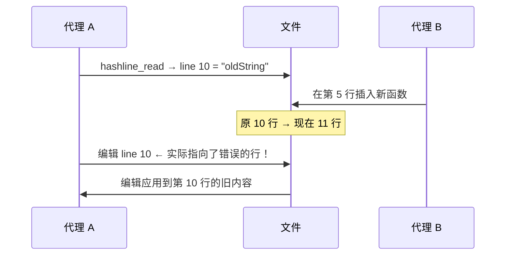
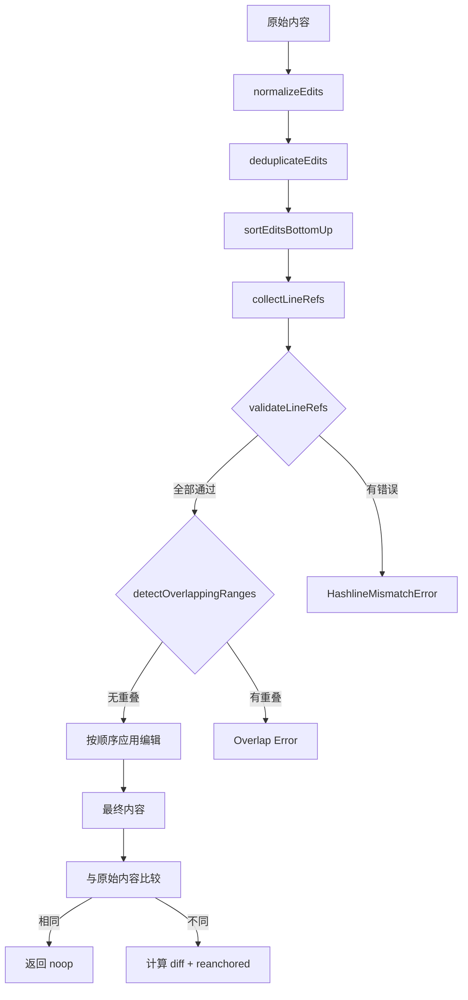
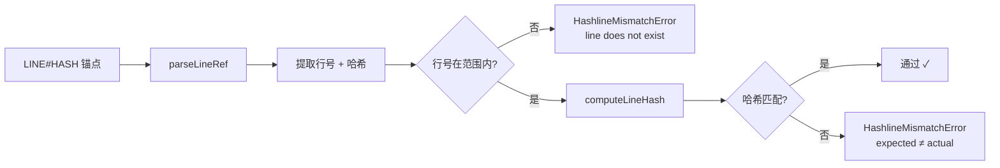

# Hashline 编辑

> **v0.17.0 引入** · **v0.23.0 引擎重构** — 内容哈希锚定编辑系统，替代传统行号编辑（CHANGELOG.md:202, 27）

> **相关文档：** [运行时行为](/04-Advanced/runtime-behavior) — 协作图状态机与 dispatch 驱动 | [会话工具](/04-Advanced/session-tools) — 10 工具会话管理套件 | [CLI 参考](/03-Reference/cli) — 命令行工具完整参考

::: tip Node.js 兼容性
Hashline 编辑系统所有模块均为纯 TypeScript 实现（文件 I/O + 哈希计算 + 文本处理），不依赖任何 Bun 特有 API（如 `bun:sqlite`）。在 Node.js ≥20.0.0 环境下可直接使用，无需额外依赖。详见[兼容性 → 可用 Node.js 运行的功能](/04-Advanced/compatibility#可用-node-js-运行的功能)。
:::


基于行号的编辑存在一个根本问题：当文件在读取和编辑之间发生变化时，行号会漂移，导致编辑应用到错误的行上。rolebox 用 **内容哈希锚定编辑** 解决了这个问题——每个行号附带一个内容哈希，编辑定位的是内容而非位置。

```
传统编辑: 10# oldString      ← 插入/删除后漂移
Hashline 编辑: 10#aB|newString  ← 哈希锚定，上游编辑不影响
```

源模块见 `src/hashline/`，核心引擎在 0.23.0 版本重构（`CHANGELOG.md:27`）。

---

::: tip hashline vs 传统编辑
如果你熟悉传统基于行号的编辑，hashline 的核心区别可以概括为：**传统编辑问"第几行？"——hashline 问"哪段内容？"**。即使文件在读取和写入之间被修改（新行插入、删除、排序），hashline 编辑总能找到正确的目标行。代价是每次编辑前必须先用 `hashline_read` 获取最新的行哈希锚点。
:::

## 1. 核心问题：基于行号的编辑为什么不可靠

### 漂移场景

传统编辑器记录位置为行号 + 字符串匹配。考虑以下操作序列：



当文件在读取和写入之间被并发修改时，行号映射完全失效。时间窗口越长——例如跨会话恢复——出现漂移的概率越高。

### Hashline 的解决路径

Hashline 编辑用 **内容哈希** 取代了位置依赖：

1. **读取时**：每行标注 `LINE#HASH|content`（`src/hashline/hashline-read.ts:9-21`）
2. **编辑时**：锚点通过哈希校验定位到正确行（`src/hashline/validation.ts:69-74`）
3. **版本校验**：整个文件的 SHA-256 作为追加防护（`src/hashline/hashline-edit.ts:106-114`）

---

## 2. Hashline 读取：`hashline_read` 工具

### 工具签名

`hashline_read` 工具（`src/hashline/hashline-read.ts:6-49`）读取文件并返回带内容哈希锚点的标注输出：

| 参数 | 类型 | 必填 | 说明 |
|------|------|------|------|
| `filePath` | `string` | 是 | 要读取的文件绝对路径 |
| `offset` | `number` (int ≥1) | 否 | 起始行号（1-based），省略则从第 1 行读 |
| `limit` | `number` (int ≥1) | 否 | 最多返回行数，省略则读到末尾 |

### 返回格式

```
version: <SHA-256 hex>
hashWidth: <number>
totalLines: <number>
[startLine: <number>]       ← 仅截断读取时出现
[endLine: <number>]         ← 仅截断读取时出现
LINE#HASH|content           ← 每行一条
```

数据流（`src/hashline/hashline-read.ts:55-116`）：

1. **规范化**：`canonicalizeFileText()` 去除 BOM，统一换行符为 `\n`（`src/hashline/hash.ts:91-118`）
2. **版本计算**：`computeFileVersion()` 对整个规范化内容做 SHA-256（`src/hashline/hash.ts:67-69`）
3. **哈希宽度**：`hashWidthForLineCount()` 根据总行数自动选择哈希长度（`src/hashline/hash.ts:18-27`）
4. **行哈希**：`computeLineHash()` 对每行单独计算（`src/hashline/hash.ts:37-61`）
5. **标注输出**：`${lineNumber}#${hash}|${content}`（`src/hashline/hash.ts:75-78`）

### 哈希计算公式

```
hash = base64(sha256(content.trimEnd()))[:width]
```

对于仅含符号（无字母/数字）的行，哈希会注入行号作为种子，以区分完全相同的内容行（`src/hashline/hash.ts:42-43`）：

```typescript
// src/hashline/hash.ts:42-43
const hasSignificantChar = /[\p{L}\p{N}]/u.test(trimmed);
const seed = hasSignificantChar ? "" : String(lineNumber ?? 0);
```

### 行尾规范化

文件读取时会经过 `FileTextEnvelope` 处理（`src/hashline/types.ts:90-94`）：

| 元数据字段 | 类型 | 说明 |
|-----------|------|------|
| `content` | `string` | 规范化后的纯 `\n` 内容 |
| `hadBom` | `boolean` | 原始文件是否包含 BOM |
| `lineEnding` | `"\n" \| "\r\n"` | 原始换行符类型 |

编辑完成后，`restoreFileText()`（`src/hashline/hash.ts:123-132`）将恢复原始换行格式和 BOM。

---

## 3. Hashline 编辑：`hashline_edit` 工具

### 工作流

```
1. hashline_read → 获取 version 和 LINE#HASH 锚点
2. hashline_edit → 提交带锚点的编辑操作
3. 如需再次编辑同一文件 → 先重新读取获取最新锚点
```

### 工具签名

`hashline_edit` 工具（`src/hashline/hashline-edit.ts:207-386`）接收 `files` 数组参数：

| 参数 | 类型 | 必填 | 说明 |
|------|------|------|------|
| `files[].filePath` | `string` | 是 | 要编辑的文件绝对路径 |
| `files[].version` | `string` | 是 | 从 `hashline_read` 获取的 SHA-256 版本，用于检测外部修改 |
| `files[].hashWidth` | `number` (int 2-8) | 否 | 从 `hashline_read` 获取的哈希宽度，与文件实际行数交叉校验 |
| `files[].edits[]` | `EditOp[]` | 是（至少 1） | 编辑操作列表 |

### 编辑操作类型

#### replace（默认）

替换一行或一个范围的行：

```
编辑配置：
  op: "replace"
  pos: "10#aB"         ← 起始锚点（必填）
  end: "15#cD"         ← 结束锚点（范围替换时必填，单行替换省略）
  lines: "new content" ← 替换内容（省略或空字符串 = 删除这些行）
```

- `pos` 指向起始行（`src/hashline/edit-primitives.ts:33-53`）
- `end` 指向结束行（含），范围包括两端（`src/hashline/edit-primitives.ts:59-94`）
- 起始行 > 结束行会报错（`src/hashline/edit-primitives.ts:71-75`）
- 替换内容会自动恢复原行的前导缩进（`src/hashline/edit-primitives.ts:86-88`）
- 替换内容中的范围边界回声会被自动剥离（`src/hashline/text-normalize.ts:91-125`）

#### append

在锚点行**之后**插入内容，省略 `pos` 时追加到文件末尾：

```
编辑配置：
  op: "append"
  pos: "10#aB"          ← 在此行后插入（省略则追加到 EOF）
  lines: "new content"  ← 要插入的内容
```

实现见 `applyInsertAfter`（`src/hashline/edit-primitives.ts:99-122`）。插入内容中若首行与锚点行内容相同（锚点回声），则自动剥离首行（`src/hashline/text-normalize.ts:52-62`）。

#### prepend

在锚点行**之前**插入内容，省略 `pos` 时插入到文件开头：

```
编辑配置：
  op: "prepend"
  pos: "10#aB"          ← 在此行前插入（省略则插入到 BOF）
  lines: "new content"  ← 要插入的内容
```

实现见 `applyInsertBefore`（`src/hashline/edit-primitives.ts:127-150`）。插入内容中若末行与锚点行内容相同，则自动剥离末行（`src/hashline/text-normalize.ts:69-80`）。

### 返回格式

```
version: <新 SHA-256>
files:
  filePath: <path>
  version: <sha256>
  diff: |
    --- a/<path>
    +++ b/<path>
    @@ -N,M +P,Q @@
    ...
  additions: <number>
  deletions: <number>
  reanchored:
    line N: <oldHash> -> <newHash>
```

附加字段（仅在存在时出现）：

| 字段 | 说明 |
|------|------|
| `corrections_applied` | 自动锚点修正列表（模糊匹配检测到统一偏移） |
| `noop_edits` | 未产生变化的编辑数（内容与原文相同） |
| `deduplicated_edits` | 被去重的重复编辑数 |

---

## 4. 快照语义与自底向上应用

### 核心原则

所有编辑操作**引用文件的原始状态**，而非逐步累积的中间状态。这是 hashline 编辑系统最关键的语义保证。

### 自底向上排序

编辑在应用前会被 `sortEditsBottomUp()`（`src/hashline/edit-ordering.ts:62-74`）按行号**降序**排列：

```typescript
// src/hashline/edit-ordering.ts:62-74
export function sortEditsBottomUp(edits: EditOp[]): EditOp[] {
  return [...edits].sort((a, b) => {
    const lineA = getEditLineNumber(a);
    const lineB = getEditLineNumber(b);
    if (lineA !== lineB) return lineB - lineA; // descending
    return opPriority(a.op) - b.op; // replace(0) < append(1) < prepend(2)
  });
}
```

为什么降序？因为从文件底部开始编辑，上面的行号不会受到下面变化的影响。

### 行内优先级

当多个编辑操作定位到同一行时，优先级顺序确保可预期行为：

| 操作 | 优先级 | 说明 |
|------|--------|------|
| `replace` | 0（最高） | 先替换内容 |
| `append` | 1 | 在替换后的行后插入 |
| `prepend` | 2（最低） | 最后在行前插入 |

### 重叠检测

编辑系统会检测重叠的 replace 范围（`src/hashline/edit-ordering.ts:105-130`）：

```typescript
// src/hashline/edit-ordering.ts:116-122
if (rangesOverlap(start, end, existing.start, existing.end)) {
  return `Overlapping replace ranges detected: "${edit.pos}..${edit.end}" overlaps with "${existing.pos}..${existing.endRef}". Edits must not overlap.`;
}
```

重叠的编辑会被拒绝，强制调用方显式指定非重叠区域。

### 去重

相同操作的完全重复编辑会被自动去重（`src/hashline/edit-ordering.ts:81-99`），去重键由 `op + pos + end + lines` 组成的字符串决定。

### 流程图



---

## 5. 编辑管线详解

### 完整管线

`applyEditsWithReport()`（`src/hashline/edit-primitives.ts:199-272`）执行 6 步管线：

| 步骤 | 函数 | 文件 | 说明 |
|------|------|------|------|
| 1 | `normalizeEdits()` | `edit-primitives.ts:11-28` | 规范化原始参数：补默认 `op`、处理 `null/undefined` |
| 2 | `deduplicateEdits()` | `edit-ordering.ts:81-99` | 移除完全相同的重复编辑 |
| 3 | `sortEditsBottomUp()` | `edit-ordering.ts:62-74` | 按行号降序 + 行内优先级排序 |
| 4 | `validateLineRefs()` | `validation.ts:81-114` | 批量校验所有锚点哈希 |
| 5 | `detectOverlappingRanges()` | `edit-ordering.ts:105-130` | 检测并拒绝重叠范围 |
| 6 | 逐条应用 | `edit-primitives.ts:227-263` | 按排序后的顺序依次执行 |

### 文本清理

在应用编辑时，系统自动执行多项清理（`src/hashline/text-normalize.ts`）：

| 清理项 | 函数 | 触发条件 |
|--------|------|----------|
| 去除 `LINE#HASH|` 前缀 | `stripLinePrefixes()` | 任何操作 |
| 恢复前导缩进 | `restoreLeadingIndent()` | replace 操作，模板行有缩进而替换行没有 |
| 剥离插入锚点回声 | `stripInsertAnchorEcho()` | append 操作，首行与锚点行相同 |
| 剥离前置锚点回声 | `stripInsertBeforeEcho()` | prepend 操作，末行与锚点行相同 |
| 剥离范围边界回声 | `stripRangeBoundaryEcho()` | replace-range 操作，边界行被包含在替换内容中 |

### 锚点验证

锚点验证由 `validateLineRef`（`src/hashline/validation.ts:52-75`）执行：



### `HashlineMismatchError`

当锚点校验失败时，抛出 `HashlineMismatchError`（`src/hashline/validation.ts:134-168`），包含：

- 所有不匹配的锚点列表（批量校验一次性收集所有错误）
- 每个不匹配行上下 ±3 行的上下文（`MISMATCH_CONTEXT = 3`）
- `suggestLineForHash()` 方法扫描全文件查找哈希匹配的行

错误信息示例：

```
Hashline mismatch at line 42: expected "aB", got "cD"

--- Line 42 ---
  40:   const x = 1;
  41:   const y = 2;
>>> 42:   const z = 3;
    expected hash: aB, actual: cD
  43:   return x + y;
  44: }
```

### 版本校验

在编辑管线开始前，`hashline-edit.ts:106-114` 会校验整个文件的 SHA-256 版本：

```typescript
// src/hashline/hashline-edit.ts:106-114
const actualVersion = computeFileVersion(canonicalContent);
try {
  validateVersion(expectedVersion, actualVersion);
} catch {
  return {
    error: `File version mismatch: expected ${expectedVersion}, got ${actualVersion}. Re-read the file.`,
  };
}
```

这意味着任何外部修改——即使在编辑没有触及的行——都会被检测并拒绝。

---

## 6. 自动锚点修正

当哈希不匹配且所有不匹配的偏移量一致时，系统会自动修正锚点（`src/hashline/fuzzy.ts:67-101`）：

```typescript
// src/hashline/fuzzy.ts:97-100
const firstOffset = offsets[0];
if (!offsets.every((o) => o === firstOffset)) return null;
return corrections;
```

例如，如果在编辑目标行上方插入了 3 行，所有锚点统一偏移 +3，系统会自动重新定位到正确的行。

### 模糊搜索

`findNearbyMatch()`（`src/hashline/fuzzy.ts:11-31`）在目标行 ±10 行（`FUZZY_SEARCH_WINDOW = 10`）范围内搜索内容哈希匹配的行：

```typescript
// src/hashline/fuzzy.ts:18
for (let dist = 1; dist <= maxDistance; dist++) {
  const below = targetLine + dist - 1;
  if (below < lines.length) {
    const hash = computeLineHash(lines[below], hashWidth, below + 1);
    if (hash === expectedHash) return below + 1;
  }
  // ... also check above
}
```

当自动修正成功时，编辑结果中包含 `corrections_applied` 字段列出所有重定位的锚点。

---

## 7. Myers Diff 与 Diff 生成

### Myers 差分算法

编辑完成后，`generateUnifiedDiff()`（`src/hashline/diff.ts:80-170`）生成标准 unified diff：

1. 使用 Myers O(ND) 算法（`src/hashline/myers-diff.ts:85-154`）计算最短编辑脚本
2. 参考：Eugene W. Myers, "An O(ND) Difference Algorithm and Its Variations" (1986)
3. 上下文行数 = 3（`UNIFIED_DIFF_CONTEXT = 3`）
4. 相邻 hunk 间隔 ≤ 6 行时自动合并（`src/hashline/diff.ts:172-215`）

### 输出格式

```diff
--- a/src/example.ts
+++ b/src/example.ts
@@ -10,7 +10,7 @@
   const x = 1;
   const y = 2;
-  const oldValue = 3;
+  const newValue = 42;
   return x + y;
 }
```

### 再锚定报告

`reanchorChangedLines()`（`src/hashline/diff.ts:30-64`）计算所有变更行的新哈希：

```typescript
// src/hashline/diff.ts:39-40
if (entry.op === "insert" && entry.newLine) {
  const newHash = computeLineHash(entry.content, hashWidth, entry.newLine);
```

编辑结果中的 `reanchored` 字段列出每行 `oldHash → newHash` 的映射，便于代理读取后立即进行后续编辑。

### 行计数

`countLineDiffs()`（`src/hashline/diff.ts:220-235`）统计增删行数：

```typescript
// src/hashline/diff.ts:228-233
let additions = 0;
let deletions = 0;
for (const entry of diff) {
  if (entry.op === "insert") additions++;
  if (entry.op === "delete") deletions++;
}
```

---

## 8. 原子写入

### 单文件原子写入

`atomicWriteFile()`（`src/hashline/atomic-write.ts:11-21`）确保文件永远不会处于半写入状态：

```typescript
// src/hashline/atomic-write.ts:11-21
export async function atomicWriteFile(filePath: string, content: string): Promise<void> {
  const tmpPath = join(dirname(filePath), `.${randomBytes(8).toString("hex")}.tmp`);
  try {
    await writeFile(tmpPath, content, "utf-8");
    await rename(tmpPath, filePath); // atomic on same filesystem
  } catch (error) {
    try { await unlink(tmpPath); } catch { /* ignore cleanup errors */ }
    throw error;
  }
}
```

写入策略：
1. 写入 `.randomHex.tmp` 临时文件
2. `rename()` 系统调用是同文件系统原子操作
3. 写入失败时清理临时文件

### 批量原子写入

`atomicWriteBatch()`（`src/hashline/atomic-write.ts:27-46`）扩展了原子保证到多文件编辑：

```
┌───── 第一步：全部写入临时文件 ─────────────────┐
│  file1 → .tmp_aaa                              │
│  file2 → .tmp_bbb                              │
│  file3 → .tmp_ccc                              │
└────────────────────────────────────────────────┘
                     │ 全部成功?
                     ▼
┌───── 第二步：全部重命名 ────────────────────────┐
│  .tmp_aaa → file1  (atomic rename)              │
│  .tmp_bbb → file2  (atomic rename)              │
│  .tmp_ccc → file3  (atomic rename)              │
└────────────────────────────────────────────────┘
                     │
         如果任一步失败 → 清理所有残余临时文件
```

这意味着多文件编辑要么全部成功，要么全部回滚——不会出现部分文件更新、部分未更新的中间状态。

---

## 9. 哈希自动升级

哈希宽度根据文件总行数自动调整（`src/hashline/constants.ts:6-14`）：

| 文件大小 | 行数阈值 | 默认哈希宽度 | 组合数 |
|-----------|----------|-------------|--------|
| 小文件 | ≤ 1000 | 2 字符 | 4,096 |
| 中等文件 | ≤ 10000 | 3 字符 | 262,144 |
| 大文件 | > 10000 | 4 字符 | 16,777,216 |

### 环境变量覆盖

可通过 `ROLEBOX_HASHLINE_WIDTH` 环境变量覆盖（`src/hashline/hash.ts:19-22`）：

```typescript
// src/hashline/hash.ts:19-22
const envOverride = process.env[HASH_WIDTH_ENV_VAR];
if (envOverride) {
  const w = parseInt(envOverride, 10);
  if (w >= 2 && w <= 8) return w;
}
```

允许范围：2-8 字符。可用于需要更高碰撞防护的特殊场景。

### hashWidth 交叉校验

编辑时，如果提供了 `hashWidth` 参数，系统会将其与文件实际行数交叉校验（`src/hashline/hashline-edit.ts:121-126`）：

```typescript
// src/hashline/hashline-edit.ts:121-126
if (providedHashWidth !== undefined && providedHashWidth !== hashWidth) {
  return {
    error: `hashWidth mismatch for ${filePath}: expected ${providedHashWidth} from read output, computed ${hashWidth} from file`,
  };
}
```

---

## 10. 与基于行号的编辑对比

| 特性 | 传统行号编辑 | Hashline 编辑 |
|------|-------------|---------------|
| **锚定依据** | 行号 + 字符串匹配 | 行号 + 内容哈希 |
| **并发安全** | 不安全——插入会导致漂移 | 安全——哈希校验保证 |
| **版本检测** | 无 | SHA-256 全文件版本 |
| **批量编辑** | 需手动计算行号偏移 | 自底向上自动排序 |
| **重叠检测** | 无 | 内置 |
| **去重** | 无 | 内置 |
| **模糊修正** | 无 | 自动偏移检测 |
| **原子写入** | 无 | 单文件和批量原子 |
| **diff 输出** | 通常无 | Myers unified diff |
| **再锚定** | 无 | 自动重新计算新哈希 |

### 跨会话恢复

基于行号的编辑在跨会话场景下最脆弱：文件经过多次编辑后，旧的行号完全不可用。Hashline 编辑的哈希锚定 + 版本校验使得编辑可以在会话边界安全恢复：

- 从 `.rolebox/plans/` 读取计划
- 重新读取文件获取当前哈希
- 使用新的锚点应用同样的编辑内容
- 版本校验确保未发生预期外的外部修改

---

## 11. 完整的编辑管线图

```mermaid
flowchart TD
    subgraph Input[输入]
        A1[filePath] --> A
        A2[version SHA-256] --> A
        A3[edits[]] --> A
        A4[optional hashWidth] --> A
    end

    A[hashline_edit execute] --> B[读取文件]
    B --> C{文件存在?}
    C -->|否| D[拒绝：锚点编辑<br>不能用于新文件]
    C -->|是| E[canonicalizeFileText]
    E --> F[validateVersion<br>全文件版本校验]
    F --> G{版本匹配?}
    G -->|否| H[拒绝：版本不匹配<br>要求重新读取]
    G -->|是| I[hashWidth 交叉校验]
    I --> J[normalizeEdits]
    J --> K[applyEditsWithReport]

    subgraph Pipeline[编辑管线]
        L[deduplicateEdits]
        M[sortEditsBottomUp]
        N[validateLineRefs]
        O[detectOverlappingRanges]
        P[逐条应用编辑]
        L --> M --> N --> O --> P
    end

    K --> Pipeline
    P --> Q{编辑产生变化?}
    Q -->|否| R[返回 noop 报告]
    Q -->|是| S[restoreFileText]
    S --> T[computeFileVersion]
    T --> U[generateUnifiedDiff]
    U --> V[countLineDiffs]
    V --> W[reanchorChangedLines]

    W --> X{单文件还是多文件?}
    X -->|单文件| Y[atomicWriteFile]
    X -->|多文件| Z[atomicWriteBatch]

    Y --> AA[格式化返回]
    Z --> AA
```

## 12. 工具参数完整参考

### `hashline_read` 参数

```typescript
// src/hashline/hashline-read.ts:22-36
args: {
  filePath: string;       // 必填，绝对路径
  offset?: number;        // 可选，1-based 起始行
  limit?: number;         // 可选，最大返回行数
}
```

### `hashline_edit` 参数

```typescript
// src/hashline/hashline-edit.ts:254-293
args: {
  files: Array<{
    filePath: string;                                      // 必填，文件绝对路径
    version: string;                                       // 必填，从 hashline_read 获取
    hashWidth?: number;                                    // 可选，只读输出的 hashWidth
    edits: Array<{
      op?: "replace" | "append" | "prepend";              // 可选，默认 "replace"
      pos?: string;                                        // LINE#HASH 锚点
      end?: string;                                        // 范围替换结束锚点
      lines?: string | string[];                          // 替换/插入内容
    }>;
  }>;
}
```

### 编辑操作参数组合

| 操作 | `pos` | `end` | `lines` | 行为 |
|------|-------|-------|---------|------|
| `replace`（单行） | 必填 | 省略 | 可选 | 替换该行，省略 `lines` 时删除该行 |
| `replace`（范围） | 必填 | 必填 | 可选 | 替换 [pos, end] 范围，省略则删除范围 |
| `append` | 可选 | — | 必填 | 在 pos 后插入，省略 pos 时追加到 EOF |
| `prepend` | 可选 | — | 必填 | 在 pos 前插入，省略 pos 时插入到 BOF |

---

## 核心要点

| 维度 | 关键信息 |
|------|----------|
| **核心原理** | 内容哈希锚定替代行号定位——编辑定位的是内容而非位置 |
| **防漂移机制** | LINE#HASH 锚点 + SHA-256 版本校验 + 模糊修正回退（±10 行窗口） |
| **快照语义** | 所有编辑引用文件的原始状态，自底向上应用，行号不受并发修改影响 |
| **哈希宽度** | 自动升级：小文件 2 位（4,096 桶）→ 中文件 3 位（262K 桶）→ 大文件 4 位（16M+ 桶） |
| **原子写入** | 临时文件 + fs.rename 确保写入完整性，崩溃时不会产生损坏的半写文件 |

## 引用索引

| 引用 | 文件 | 行号 |
|------|------|------|
| hashline_read 工具定义 | `src/hashline/hashline-read.ts` | 6-49 |
| 输出格式化 | `src/hashline/hashline-read.ts` | 55-116 |
| hashline_edit 工具定义 | `src/hashline/hashline-edit.ts` | 207-386 |
| 单文件处理管线 | `src/hashline/hashline-edit.ts` | 55-205 |
| 编辑原语 | `src/hashline/edit-primitives.ts` | 1-283 |
| 单行替换 | `src/hashline/edit-primitives.ts` | 33-53 |
| 范围替换 | `src/hashline/edit-primitives.ts` | 59-94 |
| 行后插入 | `src/hashline/edit-primitives.ts` | 99-122 |
| 行前插入 | `src/hashline/edit-primitives.ts` | 127-150 |
| EOF 追加 | `src/hashline/edit-primitives.ts` | 155-168 |
| BOF 前置 | `src/hashline/edit-primitives.ts` | 173-186 |
| 编辑管线 | `src/hashline/edit-primitives.ts` | 199-272 |
| 自底向上排序 | `src/hashline/edit-ordering.ts` | 62-74 |
| 去重 | `src/hashline/edit-ordering.ts` | 81-99 |
| 重叠检测 | `src/hashline/edit-ordering.ts` | 105-130 |
| 哈希计算 | `src/hashline/hash.ts` | 37-61 |
| 版本计算 | `src/hashline/hash.ts` | 67-69 |
| 文件规范化 | `src/hashline/hash.ts` | 91-118 |
| 文件恢复 | `src/hashline/hash.ts` | 123-132 |
| 哈希宽度分级 | `src/hashline/hash.ts` | 18-27 |
| 常数定义 | `src/hashline/constants.ts` | 1-27 |
| Myers diff | `src/hashline/myers-diff.ts` | 85-154 |
| Unified diff 生成 | `src/hashline/diff.ts` | 80-170 |
| 再锚定 | `src/hashline/diff.ts` | 30-64 |
| 行数统计 | `src/hashline/diff.ts` | 220-235 |
| 原子写入 | `src/hashline/atomic-write.ts` | 11-21 |
| 批量原子写入 | `src/hashline/atomic-write.ts` | 27-46 |
| 锚点验证 | `src/hashline/validation.ts` | 52-75 |
| 批量验证 | `src/hashline/validation.ts` | 81-114 |
| 版本验证 | `src/hashline/validation.ts` | 121-128 |
| HashlineMismatchError | `src/hashline/validation.ts` | 134-168 |
| 模糊修正 | `src/hashline/fuzzy.ts` | 11-31 |
| 统一偏移检测 | `src/hashline/fuzzy.ts` | 67-101 |
| 文本规范化 | `src/hashline/text-normalize.ts` | 1-125 |
| 类型定义 | `src/hashline/types.ts` | 1-101 |
| README 概述 | `README.md` | 76-89 |
| 0.23.0 引擎重构 | `CHANGELOG.md` | 27 |

---

## 下一步

- [运行时行为](/04-Advanced/runtime-behavior) — 协作图状态机与 dispatch 驱动推进
- [通知系统](/04-Advanced/notification-system) — 桌面通知架构与配置
- [会话工具](/04-Advanced/session-tools) — 10 工具会话管理套件
- [CLI 参考](/03-Reference/cli) — 命令行工具完整参考
