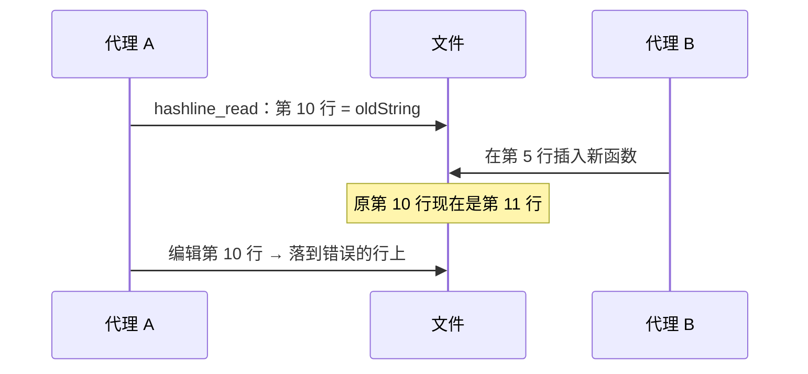
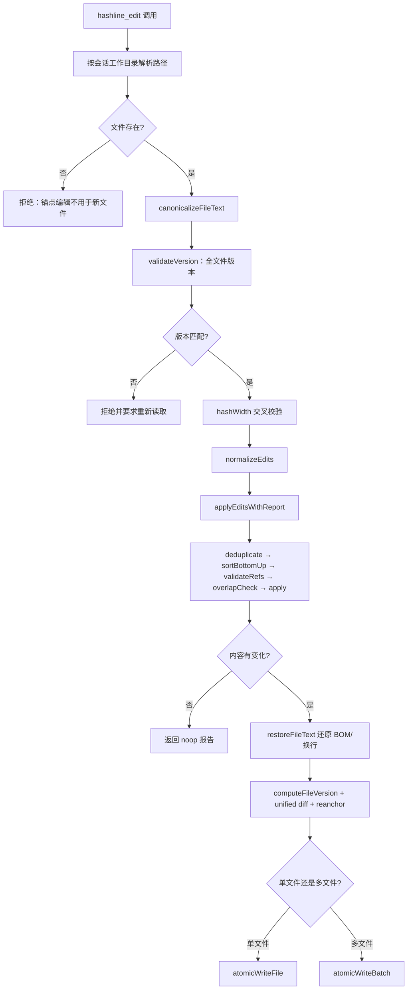

# Hashline 编辑（Hashline Editing）

Hashline 让编辑定位到**内容**而不是行号：每行附带一个内容哈希锚点，编辑提交时校验哈希与全文件版本，因此上游插入或删除不会把修改落到错误的行上。实现位于 `src/hashline/`，对外只暴露 `hashline_read` 与 `hashline_edit` 两个工具。

> **本页的边界**：本页讲的是原理与内部管线。两个工具的参数、返回格式与调用示例见[工具目录 · 平台分册](/03-Reference/tools/platform-tools)；工具清单与平台可用性见[工具目录](/03-Reference/tool-catalog)。

> 自 v1.8.0 起，相对路径按会话工作目录解析，dsh 平台改为按 schema 校验工具参数；哈希引擎自 v0.23.0 起重构（v0.17.0 引入）。

## 1. 为什么基于行号的编辑不可靠

传统编辑把位置记录成「行号 + 字符串匹配」。只要文件在读取与写入之间被改动，行号映射就失效：


```mermaid
sequenceDiagram
    participant A as 代理 A
    participant F as 文件
    participant B as 代理 B
    A->>F: hashline_read：第 10 行 = oldString
    B->>F: 在第 5 行插入新函数
    Note over F: 原第 10 行现在是第 11 行
    A->>F: 编辑第 10 行 → 落到错误的行上
```

时间窗口越长（例如跨会话恢复），漂移概率越高。Hashline 的替代方案是给每行绑定一个内容哈希：

```text
传统编辑:      10# oldString      ← 插入/删除后漂移
Hashline 编辑: 10#aB|newString    ← 哈希锚定，上游编辑不影响定位
```

代价是每次编辑前都必须先用 `hashline_read` 取到当前锚点：锚点描述的是**读取那一刻**的文件内容。

## 2. 锚点格式与哈希计算

锚点格式为 `LINE#HASH`，`HASH` 是 base64 字典（`A-Za-z0-9_-`）中的 2–8 个字符。单行哈希的计算是：

```text
hash = base64(sha256(content.trimEnd()))[:width]
```

对只含符号、没有字母或数字的行（缩进、括号等），哈希会混入行号作为种子，否则内容相同的多行会得到同一个锚点而无法区分：

```typescript
const hasSignificantChar = /[\p{L}\p{N}]/u.test(trimmed);
const seed = hasSignificantChar ? "" : String(lineNumber ?? 0);
```

哈希宽度按总行数自动选择，可用环境变量 `ROLEBOX_HASHLINE_WIDTH` 覆盖（有效范围 2–8）：

| 文件规模 | 行数阈值 | 默认宽度 | 组合数 |
|---|---|---|---|
| 小文件 | ≤ 1000 | 2 | 4096 |
| 中等文件 | ≤ 10000 | 3 | 262144 |
| 大文件 | > 10000 | 4 | 16777216 |

宽度越窄，锚点越短、碰撞概率越高；`hashWidth` 参数会在编辑时与文件实际行数交叉校验，不一致直接拒绝。

## 3. 读取管线

`hashline_read` 的执行步骤（`src/hashline/hashline-read.ts`）：

1. **规范化**：`canonicalizeFileText()` 去掉 BOM，把换行统一为 `\n`，同时记录原始换行风格。
2. **全文件版本**：`computeFileVersion()` 对规范化后的整体内容做 SHA-256。
3. **确定宽度**：`hashWidthForLineCount()` 按总行数（或环境变量覆盖）选宽度。
4. **逐行哈希**：`computeLineHash()` 为每行计算锚点。
5. **标注输出**：`formatHashLines()` 生成 `行号#哈希|内容`。

输出头部的元信息包括 `version`（全文件 SHA-256）、`hashWidth`、`totalLines`，截断读取时还有 `startLine` / `endLine`。

读取时保留的换行元数据放在 `FileTextEnvelope` 中：`content` 是规范化后的纯 `\n` 文本，`hadBom` 记录原文件是否带 BOM，`lineEnding` 记录原始换行符。写回时 `restoreFileText()` 按这些元数据还原 BOM 与换行风格，因此 hashline 不会把 CRLF 文件悄悄改成 LF。

## 4. 编辑管线

`hashline_edit` 对每个文件依次执行 6 步（`applyEditsWithReport()`，`src/hashline/edit-primitives.ts`）：

| 步骤 | 函数 | 模块 | 作用 |
|---|---|---|---|
| 1 | `normalizeEdits()` | `src/hashline/edit-primitives.ts` | 补默认 `op`，把 `null`/`undefined` 归一 |
| 2 | `deduplicateEdits()` | `src/hashline/edit-ordering.ts` | 去掉 `op + pos + end + lines` 完全相同的重复编辑 |
| 3 | `sortEditsBottomUp()` | `src/hashline/edit-ordering.ts` | 按行号降序、同行按操作优先级排序 |
| 4 | `validateLineRefs()` | `src/hashline/validation.ts` | 批量校验全部锚点哈希，一次收集所有不匹配 |
| 5 | `detectOverlappingRanges()` | `src/hashline/edit-ordering.ts` | 拒绝互相重叠的 replace 范围 |
| 6 | 逐条应用 | `src/hashline/edit-primitives.ts` | 按排序结果执行替换与插入 |

共有三种编辑操作：`replace`（默认，可替换单行或 `[pos, end]` 范围）、`append`（在锚点行之后插入，省略 `pos` 时追加到文件末尾）、`prepend`（在锚点行之前插入，省略 `pos` 时插到文件开头）。

### 4.1 快照语义

所有编辑都**引用文件的原始状态**，而不是逐步累积的中间状态。实现方式是自底向上排序：从文件底部开始应用，上面的行号就不会受下面改动的影响。

同一行上有多个操作时按固定优先级执行，保证结果可预期：

| 操作 | 优先级 | 效果 |
|---|---|---|
| `replace` | 0（最先） | 先替换该行内容 |
| `append` | 1 | 在替换后的行之后插入 |
| `prepend` | 2（最后） | 在行之前插入 |

重叠的 `replace` 范围会被拒绝，而不是静默合并：错误信息会同时给出两个范围的锚点，要求调用方划清边界。

### 4.2 文本清理

应用编辑时系统会自动处理锚点回声（调用方把上下文行一并当作新内容提交）与缩进：

| 清理项 | 函数 | 触发条件 |
|---|---|---|
| 去掉 `LINE#HASH\|` 前缀 | `stripLinePrefixes()` | 任何操作 |
| 恢复前导缩进 | `restoreLeadingIndent()` | replace，模板行有缩进而替换内容没有 |
| 剥离插入锚点回声 | `stripInsertAnchorEcho()` | append，插入内容首行等于锚点行 |
| 剥离前置锚点回声 | `stripInsertBeforeEcho()` | prepend，插入内容末行等于锚点行 |
| 剥离范围边界回声 | `stripRangeBoundaryEcho()` | replace 范围，边界行被重复包含 |

### 4.3 锚点校验与失败对象

`validateLineRef()` 先解析锚点，再检查行号是否在文件范围内，最后重算该行哈希并与期望值比较。任何一步失败都抛出 `HashlineMismatchError`：

```text
Hashline mismatch at line 42: expected "aB", got "cD"

--- Line 42 ---
  40:   const x = 1;
  41:   const y = 2;
>>> 42:   const z = 3;
    expected hash: aB, actual: cD
  43:   return x + y;
  44: }
```

批量校验会一次性收集所有不匹配的锚点（而不是遇到第一个就停），每条错误附带上下各 3 行的上下文；错误对象还提供 `suggestLineForHash()`，在全文件中扫描哈希匹配的行，便于调用方自助纠偏。

### 4.4 版本校验

在应用任何编辑之前，管线会重算全文件 SHA-256 并与读取时返回的 `version` 比对；不一致时直接返回错误，要求重新读取。这道闸门覆盖整个文件——即使改动发生在编辑没有触及的行上也会被拦下。

## 5. 自动锚点修正

当所有不匹配的锚点呈现**同一个偏移量**时，说明文件在上方被整体插入或删除了若干行，此时系统自动修正锚点而不是报错：

1. `findNearbyMatch()` 在目标行上下 `FUZZY_SEARCH_WINDOW`（10）行内查找哈希匹配的行。
2. `detectUniformOffset()` 统计所有不匹配项的共同偏移，取绝对值最小的一个；绝对值相同时取上方（负向）。
3. 修正结果以 `corrections_applied` 字段随编辑结果返回，列出每个被重定位的锚点及其新哈希。

偏移不一致（例如文件中间被改写）时不做修正，直接抛出 `HashlineMismatchError`——模糊修正只处理「整体平移」，不猜测语义。

## 6. Myers diff 与再锚定

编辑成功后 `generateUnifiedDiff()` 生成标准 unified diff：

1. 用 Myers O(ND) 算法（`src/hashline/myers-diff.ts`）求最短编辑脚本。
2. 上下文行数固定为 3。
3. 相邻 hunk 的间隔不超过 6 行时自动合并，避免碎片化输出。

```diff
--- a/my-role/prompt.md
+++ b/my-role/prompt.md
@@ -10,7 +10,7 @@
   const x = 1;
   const y = 2;
-  const oldValue = 3;
+  const newValue = 42;
   return x + y;
 }
```

`reanchorChangedLines()` 为所有变更行重算新哈希，`countLineDiffs()` 统计增删行数。结果里的 `reanchored` 字段给出每行 `oldHash → newHash` 的映射，使调用方无需重新读取即可继续编辑同一文件。

## 7. 原子写入

### 单文件

`atomicWriteFile()` 先把内容写到同目录的 `.<随机串>.tmp`，再用 `rename()` 覆盖目标——同文件系统内的 rename 是原子的，因此读者要么看到旧内容，要么看到新内容，不会读到半写状态；写入失败时清理临时文件。硬链接文件（`nlink > 1`）改为原地写入，以便共享 inode 的其它路径观察到修改。

### 批量

`atomicWriteBatch()` 把多文件写入拆成三个阶段：

```text
RESOLVE  解析全部目标路径（realpath 归一化）；重复路径直接拒绝
   ↓
STAGE    只为非原地写入的条目写临时文件；任一步失败 → 清理全部临时文件并抛错
   ↓        （此时磁盘上零写入）
COMMIT   按原始提交顺序 rename / 原地写
```

阶段划分保证 **staging 失败不会更新任何文件**。COMMIT 阶段不是事务：中途失败会抛出携带 `written` 列表与 `phase: "commit"` 的 `BatchWriteError`，已经落盘的文件不回滚，调用方需要据此判断哪些文件已更新。

### 路径锁

`src/hashline/path-lock.ts` 提供按路径的互斥锁（`withPathLock()` / `withPathLocks()`）：多文件编辑会按归一化路径排序后一次性获取全部锁，避免两个并发编辑交错写入同一批文件。

## 8. 与基于行号的编辑对比

| 特性 | 传统行号编辑 | Hashline 编辑 |
|---|---|---|
| 锚定依据 | 行号 + 字符串匹配 | 行号 + 内容哈希 |
| 并发安全 | 插入或删除即漂移 | 哈希校验保证定位正确 |
| 版本检测 | 无 | 全文件 SHA-256 |
| 批量编辑 | 需手工计算行号偏移 | 自底向上自动排序 |
| 重叠检测 | 无 | 内置，重叠即拒绝 |
| 去重 | 无 | 内置 |
| 模糊修正 | 无 | 统一偏移自动重定位（±10 行） |
| 原子写入 | 无 | 单文件与批量都原子 |
| diff 输出 | 通常无 | Myers unified diff |
| 再锚定 | 无 | 自动重算新哈希 |

跨会话恢复是行号编辑最脆弱的场景：文件经过多轮编辑后旧行号完全不可用。Hashline 的恢复路径是重新读取、拿到新锚点、用同样的编辑内容重新提交，版本校验保证期间没有预期外的外部修改。

## 9. 完整管线


```mermaid
flowchart TD
    A[hashline_edit 调用] --> B[按会话工作目录解析路径]
    B --> C{文件存在?}
    C -->|否| D[拒绝：锚点编辑不用于新文件]
    C -->|是| E[canonicalizeFileText]
    E --> F[validateVersion：全文件版本]
    F --> G{版本匹配?}
    G -->|否| H[拒绝并要求重新读取]
    G -->|是| I[hashWidth 交叉校验]
    I --> J[normalizeEdits]
    J --> K[applyEditsWithReport]
    K --> L[deduplicate → sortBottomUp → validateRefs → overlapCheck → apply]
    L --> M{内容有变化?}
    M -->|否| N[返回 noop 报告]
    M -->|是| O[restoreFileText 还原 BOM/换行]
    O --> P[computeFileVersion + unified diff + reanchor]
    P --> Q{单文件还是多文件?}
    Q -->|单文件| R[atomicWriteFile]
    Q -->|多文件| S[atomicWriteBatch]
```

## 10. 当前实现边界

- **不能创建新文件**：`hashline_edit` 只编辑已存在的文件，路径不存在时按「锚点编辑不适用于新文件」拒绝。
- **批量写入不是跨文件事务**：见 §7，commit 阶段失败不回滚。
- **锚点与读取时刻绑定**：同一文件连续编辑必须重新读取，`reanchored` 字段只是省事的快捷方式，不是版本保证。
- **只依赖 Node 标准库**：模块图里只有 `node:fs`、`node:fs/promises`、`node:crypto`、`node:path` 与 `zod`，不使用 Bun 特有 API。

## 相关页面

- [工具目录 · 平台分册](/03-Reference/tools/platform-tools) — `hashline_read` / `hashline_edit` 的参数与示例
- [工具目录](/03-Reference/tool-catalog) — 全部工具索引
- [贡献指南](/05-Contributing/contributing) — 文档与代码风格约定
- [会话工具](/04-Advanced/session-tools) — 会话级工具的子系统实现
