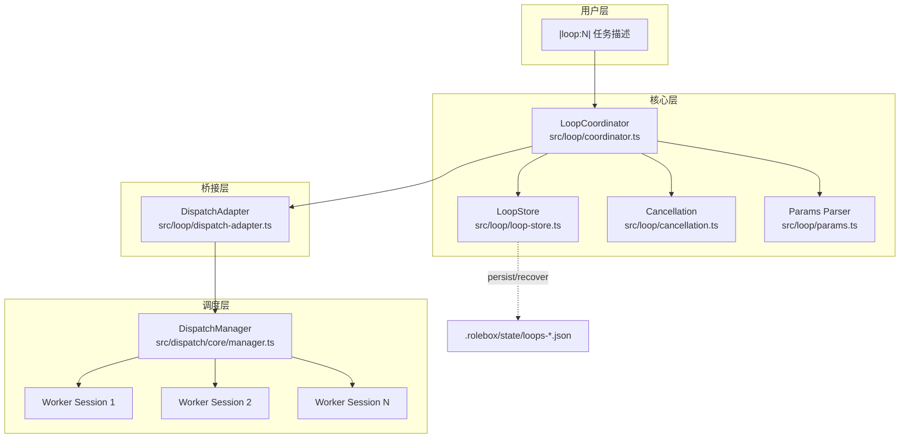
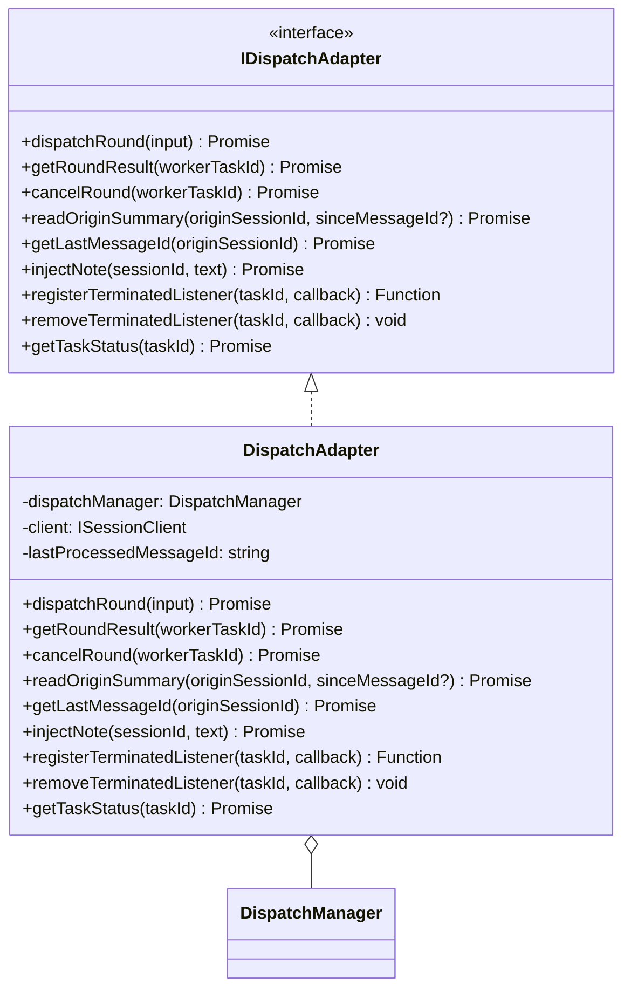
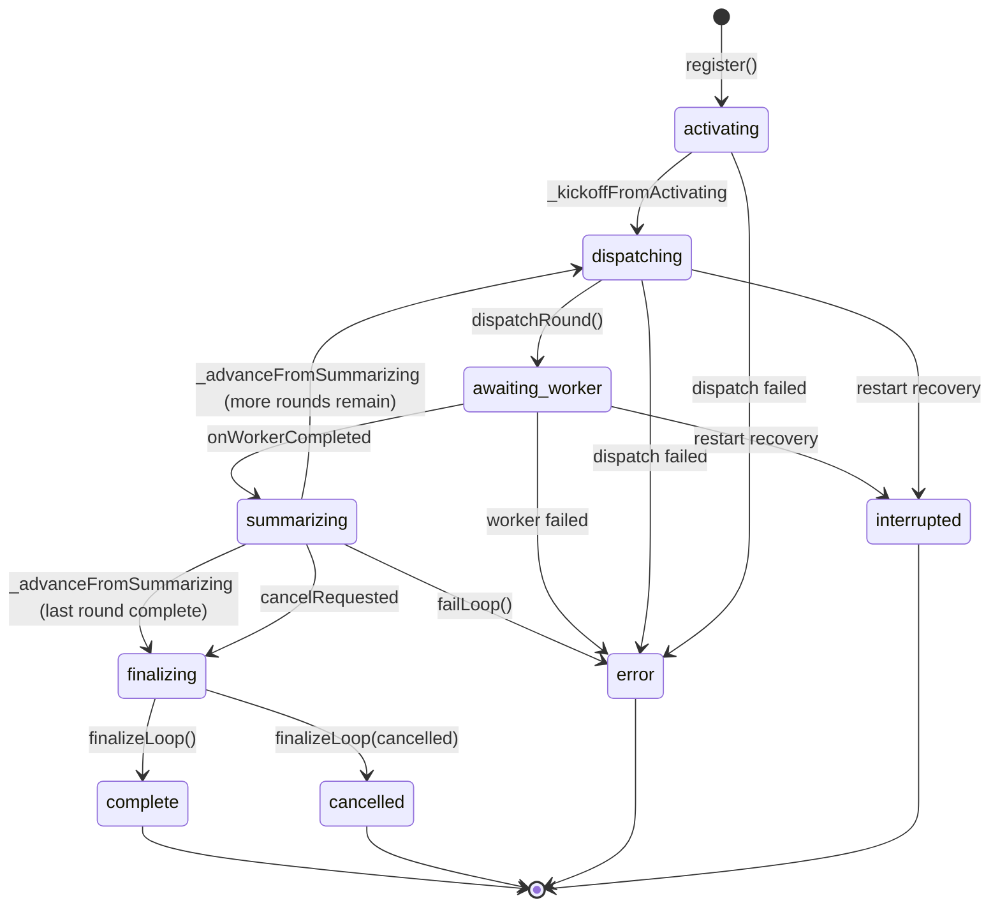
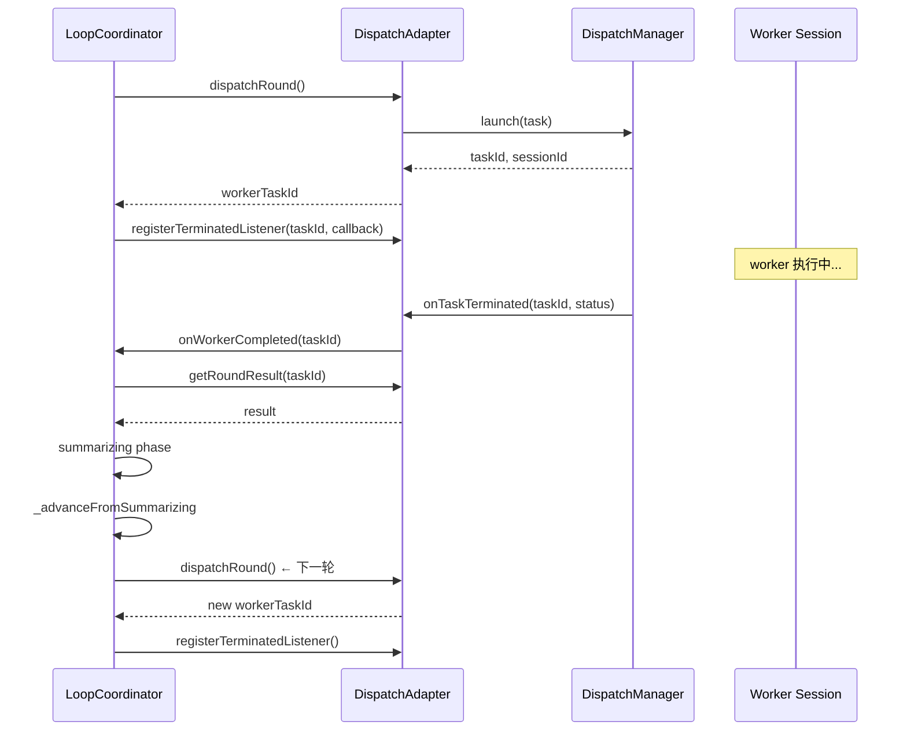
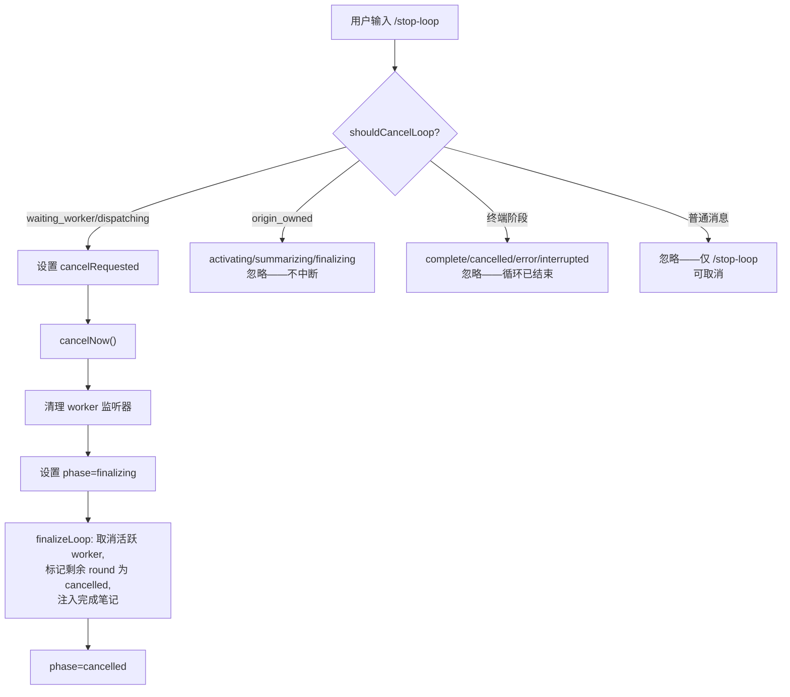

# 循环系统

> **相关文档：** [工作流模式](/04-Advanced/workflow-patterns) — 协作图拓扑与 Pipeline / Review-Loop / Star | [运行时行为](/04-Advanced/runtime-behavior) — 图状态管理与 FSM 生命周期 | [调度配置](/03-Reference/dispatch-config) — 并发与预算控制

循环系统让 rolebox 代理能够自主执行**多轮迭代任务**——每轮将前一轮的输出作为上下文，持续改进或处理结果。由 `|loop|` 函数触发，通过 **LoopCoordinator** 协调推链（push-chain）调度，**DispatcherAdapter** 桥接 dispatch 子系统。

```
|loop:3| 分析这三个提案并给出推荐
```

循环系统于 `0.22.0` 版本引入（`CHANGELOG.md:43`），`0.23.0` 版本由轮询模型重构为推链模型（`CHANGELOG.md:15`），消除轮间空闲检测延迟。

---

## 1. `|loop|` 函数

`|loop|` 是入口函数，由 `LOOP_FUNCTION_NAME` 常量定义（`src/loop/constants.ts:38`）。

### 基本语法

```text
|loop:N| <任务描述>
|loop:N,mode| <任务描述>
```

| 参数 | 位置 | 类型 | 说明 |
|------|------|------|------|
| `N` | `iterations` / `_0` | `number` | 迭代轮数，默认 5，上限 50 |
| `mode` | `mode` / `_1` | `"inherit"` / `"fresh"` | 上下文继承模式（默认 `"inherit"`） |

### 参数解析

参数由 `parseLoopParams()`（`src/loop/params.ts:34-83`）解析。支持两种命名方式，兼容位置参数和命名参数：

```text
# 位置参数
|loop:3| 分析这三个提案
|loop:5,fresh| 从头开始重复实验

# 命名参数
|loop:3,mode=fresh| 显式指定模式
|loop:iterations=3,mode=inherit| 完全命名形式
```

### Mode 语义

`LoopMode` 类型定义于 `src/loop/types.ts:5`：

| 模式 | 值 | 别名 | 行为 |
|------|-----|------|------|
| **inherit** | `"inherit"` | `"on"`, `"true"` | 将前一轮的统一摘要作为 seed 上下文传递给下一轮（默认） |
| **fresh** | `"fresh"` | `"no-inherit"`, `"off"`, `"false"` | 每轮从干净状态开始，不继承上下文 |

继承模式的 seed 拼接逻辑在 `dispatchRound()`（`src/loop/worker-dispatch.ts:21-28`）中：

```typescript
// src/loop/worker-dispatch.ts:21-28
let prompt = loop.basePrompt;
if (loop.mode === "inherit" && loop.lastSummary) {
  const seed =
    loop.lastSummary.length > SEED_CHAR_CAP
      ? loop.lastSummary.slice(-SEED_CHAR_CAP)
      : loop.lastSummary;
  prompt = seed + "\n\n---\n\n" + loop.basePrompt;
}
```

当 `mode = "inherit"` 时，上一轮的 `lastSummary` 截取末尾 `SEED_CHAR_CAP`（8000 字符，`constants.ts:20`）字符后，以 `---` 分隔符附加到 `basePrompt` 前。

### 参数约束

| 约束 | 值 | 来源 |
|------|-----|------|
| 默认轮数 | `5` | `constants.ts:2` |
| 硬上限 | `50` | `constants.ts:5` |
| 最小值 | `1` | `params.ts:53-55` |
| 超限行为 | 静默钳位到 50 并设置 `clamped` 标志 | `params.ts:57-61` |

```typescript
// src/loop/params.ts:57-61
if (iterations > MAX_ITERATIONS_HARD_CAP) {
  iterations = MAX_ITERATIONS_HARD_CAP;
  clamped = true;
}
```

::: warning 参数超限行为
如果 |loop:N| 中 N 超过了硬上限 50，系统会**静默钳位到 50** 并设置 `clamped` 标志，而**不会报错**。这意味着 |loop:100| 不会失败——它只会静默运行 50 轮。检查实际轮数时需留意此行为。
:::

---

## 2. 系统架构

循环系统由三个核心组件构成：



### 2.1 LoopCoordinator

`LoopCoordinator`（`src/loop/coordinator.ts:17-564`）是循环调度的核心。它管理所有活跃循环的状态，驱动推链调度，处理恢复和取消。

```typescript
// src/loop/coordinator.ts:30-38
constructor(
  private adapter: IDispatchAdapter,
  private opts?: {
    delayMs?: number;
    roundTimeoutMs?: number;
    persist?: (loops: Map<string, LoopState>) => void;
  },
)
```

关键职责：
- **状态管理**：持有 `Map<string, LoopState>` 管理所有活跃循环（行 18）
- **推链调度**：通过 `onWorkerCompleted → _advanceFromSummarizing → dispatchRound` 形成自驱链条（行 243-341）
- **并发控制**：使用 `_advancing` 映射实现重入保护，防止推链冲突（行 19）
- **停滞锁检测**：通过 `_advancingSweeper` 周期性扫描过期锁（行 26）
- **中断恢复**：`reSubscribeListeners()` 方法在重启后重新订阅工作线程终止监听器（行 480-547）

### 2.2 DispatchAdapter

`DispatchAdapter`（`src/loop/dispatch-adapter.ts:74-202`）是循环系统与 dispatch 子系统之间的桥梁。它实现了 `IDispatchAdapter` 接口（`dispatch-adapter.ts:12-70`），将循环协调器与 dispatch 内部细节解耦。



适配器的 9 个方法覆盖了循环调度的完整生命周期：

| 方法 | 用途 | 源码行 |
|------|------|--------|
| `dispatchRound()` | 通过 DispatchManager 提交一轮 worker 任务 | `dispatch-adapter.ts:82-108` |
| `getRoundResult()` | 获取已完成 worker 轮的结果 | `dispatch-adapter.ts:110-123` |
| `cancelRound()` | 取消正在运行的 worker 轮 | `dispatch-adapter.ts:125-127` |
| `readOriginSummary()` | 从 origin 会话读取最新 assistant 输出 | `dispatch-adapter.ts:129-169` |
| `getLastMessageId()` | 获取会话最后一条消息的 ID | `dispatch-adapter.ts:171-175` |
| `injectNote()` | 向 origin 会话写入静默进度笔记 | `dispatch-adapter.ts:177-182` |
| `registerTerminatedListener()` | 注册 worker 终止的一次性回调 | `dispatch-adapter.ts:184-189` |
| `removeTerminatedListener()` | 移除已注册的终止回调 | `dispatch-adapter.ts:191-196` |
| `getTaskStatus()` | 查询 dispatch 任务的存活状态 | `dispatch-adapter.ts:198-201` |

### 2.3 LoopStore

`LoopStore`（`src/loop/loop-store.ts:33-212`）提供循环状态的持久化和恢复能力。

```typescript
// 存储路径示例
.rolebox/state/loops-{dirHash}.json  // loop-store.ts:48-50
```

关键特性：

| 特性 | 说明 | 源码位置 |
|------|------|----------|
| 防抖保存 | 200ms 窗口内合并多次 `save()` 调用为一次 I/O | `loop-store.ts:64-89` |
| 同步保存 | `saveSync()` 支持关键路径的同步持久化 | `loop-store.ts:106-110` |
| 加载验证 | 版本检查 + 数组格式校验 | `loop-store.ts:112-131` |
| 重启协调 | `reconcile()` 查询 dispatch 状态，修复非终止循环 | `loop-store.ts:141-197` |
| 终端阶段清理 | `"complete" | "cancelled" | "interrupted" | "error"` 的循环被自动修剪 | `loop-store.ts:148-150` |

---

## 3. 生命周期与状态机

循环系统的核心是一个 9 阶段状态机，定义于 `LoopPhase` 类型（`src/loop/types.ts:23-32`）：



### 阶段说明

| 阶段 | 说明 | 状态类型 |
|------|------|----------|
| `activating` | 循环初始化，准备分发第一轮 | 活跃 |
| `dispatching` | 正在分发 worker 轮次到 DispatchManager | 活跃 |
| `awaiting_worker` | 等待 worker 任务完成 | 活跃 |
| `summarizing` | 读取 origin 摘要，推进轮次计数 | 活跃 |
| `finalizing` | 收尾——取消进行中的 worker，注入完成笔记 | 过渡 |
| `complete` | 所有迭代成功结束 | 终端 |
| `cancelled` | 被用户或代理显式取消 | 终端 |
| `interrupted` | 中断（会话超时、重启丢失上下文） | 终端 |
| `error` | 遇到不可恢复的错误 | 终端 |

### 推链推进

`0.23.0` 版本（`CHANGELOG.md:15`）之后，循环改为**推链**模型——由 `onTaskTerminated` 事件驱动，不再依赖轮询空闲检测：



此链条在 `_advancing` 重入保护下连续执行，无需外部空闲事件触发推进（`coordinator.ts:320-322`）：

```typescript
// src/loop/coordinator.ts:320-322
// Push-chain: advance from summarizing → dispatch next round or finalize.
// This runs inside the same _advancing critical section, so it is
// serialised and does not depend on an external idle event.
await this._advanceFromSummarizing(originSessionId);
```

### 重入保护

`_advancing` 映射（`coordinator.ts:19`）确保每个 origin 会话同一时间只有一个推链操作。关键保护机制：

1. **显式加锁**：推进前 `_advancing.set(sessionId, Date.now())`（行 164）
2. **暂停完成通知**：`onWorkerCompleted` 检测到锁被持有时，将任务 ID 加入 `_pendingCompletions` 队列（行 272-279）
3. **停滞锁扫描**：每 15 秒扫描一次，超过 30 秒的锁自动释放并排空队列（行 52-75）
4. **finally 排空**：每次释放锁后，排空 `_pendingCompletions` 队列（行 176-188, 327-338）

---

## 4. 取消机制

取消通过 `/stop-loop` 命令实现，由 `cancellation.ts` 模块处理。

### 取消流程



### 触发条件

`shouldCancelLoop()`（`src/loop/cancellation.ts:41-54`）严格限定取消触发条件：

```typescript
// src/loop/cancellation.ts:41-54
export function shouldCancelLoop(
  loopState: LoopState,
  messageText: string,
): boolean {
  if (!messageText.includes(STOP_LOOP_SIGNAL)) return false;
  if (TERMINAL_PHASES.has(loopState.phase)) return false;
  if (ORIGIN_OWNED_PHASES.has(loopState.phase)) return false;
  if (loopState.phase === "awaiting_worker") return true;
  if (loopState.phase === "dispatching") return true;
  return false;
}
```

关键规则：

| 条件 | 行为 |
|------|------|
| 消息不含 `STOP_LOOP_SIGNAL` | 不取消——普通消息不再中断循环 |
| 终端阶段（complete/cancelled/error/interrupted） | 不取消 |
| origin 持有阶段（activating/summarizing/finalizing） | 不取消 |
| awaiting_worker 或 dispatching | **取消** |

### 信号值

取消常量定义于 `constants.ts`：

```typescript
// src/loop/constants.ts:41-44
export const STOP_LOOP_COMMAND = "stop-loop";
export const STOP_LOOP_SIGNAL = "[rolebox:stop-loop]";
```

`STOP_LOOP_SIGNAL` 由 `/stop-loop` 命令处理器注入到消息文本中。

### `cancelNow()` 与 `requestCancel()`

LoopCoordinator 提供两种取消接口：

| 方法 | 说明 | 源码 |
|------|------|------|
| `requestCancel()` | 设置 `cancelRequested = true`，在下次 summarize 时触发取消 | `coordinator.ts:343-349` |
| `cancelNow()` | 立即清理 worker 监听器，强制 `finalize` | `coordinator.ts:351-384` |

`cancelNow()` 在 `originSessionId` 持有 `_advancing` 锁时不直接取消，而是标记后等待锁释放。

---

## 5. 持久化与恢复

LoopStore 提供完整的持久化和重启恢复能力。

### 持久化流程

```typescript
// src/loop/loop-store.ts:64-89
async save(loops: Map<string, LoopState>): Promise<void> {
  this._latestLoops = loops;
  this._dirty = true;
  if (this._debounceTimer !== null) clearTimeout(this._debounceTimer);
  return new Promise<void>((resolve) => {
    this._resolveFns.push(resolve);
    this._debounceTimer = setTimeout(async () => {
      // 200ms 防抖后执行原子写入
      await this._doSave(this._latestLoops!);
      this._flushResolves();
    }, 200);
  });
}
```

### 重启恢复

重启恢复经过三个阶段：

**阶段 1：加载** —— `LoopStore.load()` 读取 `.rolebox/state/loops-{hash}.json`，验证格式和版本号（`loop-store.ts:112-131`）。

**阶段 2：协调** —— `LoopStore.reconcile()`（`loop-store.ts:141-197`）查询每个非终止循环的 dispatch 任务状态：

| worker 状态 | 恢复操作 |
|-------------|----------|
| `"completed"` | 阶段设为 `"summarizing"`，推进总结和下一轮 |
| `"running"` / `"pending"` | 阶段设为 `"awaiting_worker"`，重新订阅监听器 |
| `"unknown"` / `"error"` / `"cancelled"` | 阶段设为 `"interrupted"` |
| worker 不存在 | 阶段设为 `"interrupted"` |

**阶段 3：重新订阅** —— `LoopCoordinator.reSubscribeListeners()`（`coordinator.ts:480-547`）重新订阅活跃循环的终止监听器，恢复推链：

```typescript
// src/loop/coordinator.ts:480-547
async reSubscribeListeners(): Promise<void> {
  const nonTerminal = this.getNonTerminalLoops();
  for (const loop of nonTerminal) {
    // summarizing → 调用 _advanceFromSummarizing
    // activating → 调用 _kickoffFromActivating
    // awaiting_worker + 已完成 → onWorkerCompleted
    // awaiting_worker + 运行中 → 重新注册监听器
  }
}
```

---

## 6. 配置常量

全部常量和默认值位于 `src/loop/constants.ts`（54 行）：

| 常量 | 值 | 说明 |
|------|-----|------|
| `DEFAULT_ITERATIONS` | `5` | 未指定时的默认轮数 |
| `MAX_ITERATIONS_HARD_CAP` | `50` | 硬上限，防止失控 |
| `DISPATCH_ROUND_TIMEOUT_MS` | `900000`（15 分钟） | 单轮超时 |
| `INTER_ROUND_DELAY_MS` | `2000` | 轮间最小延迟 |
| `SUMMARY_INPUT_CHAR_CAP` | `8000` | 摘要输入字符上限 |
| `SEED_CHAR_CAP` | `8000` | 继承上下文 seed 字符上限 |
| `LOOP_STATE_SCHEMA_VERSION` | `2` | 持久化存储版本号 |
| `ADVANCING_LOCK_TIMEOUT_MS` | `30000` | 推进锁停滞超时 |
| `SWEEPER_INTERVAL_MS` | `15000` | 停滞锁扫描间隔 |

---

## 7. 使用示例

### 基本搜索迭代

```text
|loop:3| 调研 rolebox 项目中的 dispatch 通知机制，列出所有通知类型和触发条件
```

- 3 轮迭代，默认 inherit 模式
- 第 1 轮：直接调研
- 第 2 轮：基于第 1 轮的摘要，补充遗漏
- 第 3 轮：完善最终输出

### 独立评估（fresh 模式）

```text
|loop:3,fresh| 评估这段代码的安全性
```

每轮独立评估，不参考前一轮结果——适合需要独立判断的场景。

### 多轮分析

```text
|loop:5,mode=inherit| 分析性能测试结果
```

逐步深化分析，每一轮基于上一轮结论推进。

### 中断与恢复

用户可能在循环进行中输入：

```text
/stop-loop
```

此时：
1. `cancellation.ts` 检测到 `STOP_LOOP_SIGNAL`
2. 阶段为 `awaiting_worker` 或 `dispatching` 时触发取消
3. `cancelNow()` 暂停活跃 worker
4. origin 会话收到取消笔记，包含已完成的轮次摘要

### 自动推进笔记

循环在关键节点自动注入笔记到 origin 会话：

```text
[loop-progress loop started: 3 rounds, inherit mode]
[loop-progress round 1/3 completed, session=abc123, duration=12.5s]
[loop-progress round 2/3 completed, session=def456, duration=10.2s]
[loop-progress loop complete]
Rounds: r1:abc123(12.5s,completed), r2:def456(10.2s,completed), r3:ghi789(8.1s,completed)
```

注入由 `worker-dispatch.ts` 中的 `dispatchRound()`（行 54-63）和 `finalizeLoop()`（行 144-149）完成。

---

## 8. 与 Dispatch 系统的关系

循环系统构建于 **dispatch 系统**之上，但与之有清晰的责任边界：

| 维度 | 循环系统 | Dispatch 系统 |
|------|----------|---------------|
| 职责 | 多轮迭代编排 | 单轮任务调度 |
| 状态管理 | LoopState（9 阶段） | DispatchTask（生命周期） |
| 并发控制 | _advancing 重入保护 | 并发槽位管理 |
| 持久化 | LoopStore（JSON） | 无 |
| 恢复 | reconcile + reSubscribeListeners | 无 |
| 监听 | onTaskTerminated 事件 | 提供事件机制 |
| 超时 | roundTimeoutMs | backgroundStaleTimeoutMs |

循环系统通过 `DispatchAdapter` 接口与 DispatchManager 通信，不使用 dispatch 工具函数。适配器的实例化通常位于 `src/loop/dispatch-adapter.ts:74`：

```typescript
// src/loop/dispatch-adapter.ts:82-96
async dispatchRound(input: {
  originSessionId: string;
  agent: string;
  prompt: string;
  description?: string;
  timeoutMs?: number;
}): Promise<{ workerTaskId: string; workerSessionId: string }> {
  const dispatchInput: DispatchInput = {
    subagent: input.agent,
    prompt: input.prompt,
    run_in_background: true,
    description: input.description,
    noParentInherit: true,
    ...(input.timeoutMs !== undefined ? { timeout_ms: input.timeoutMs } : {}),
  };
  // ...
}
```

每个循环轮次都是一个 `run_in_background = true` 的 dispatch 任务。

---

## 9. 可观测性

### 进度笔记

循环通过 `LOOP_PROGRESS_MARKER`（`constants.ts:35`）标记进度笔记：

```typescript
// src/loop/constants.ts:35
export const LOOP_PROGRESS_MARKER = "[loop-progress";
```

注入的笔记包含：开始标记、每轮状态（轮次、会话 ID、耗时）、完成标记和轮次摘要。

### 日志

所有组件使用 `createSubLogger` 记录结构化日志：

```typescript
// src/loop/coordinator.ts:13
const log = createSubLogger("loop/coordinator");
// src/loop/worker-dispatch.ts:10
const log = createSubLogger("loop/worker-dispatch");
// src/loop/loop-store.ts:8
const log = createSubLogger("loop-store");
```

关键日志点包括 `loop-trace`（推链跟踪）、`advancing-lock`（锁状态）和 `advancing-sweeper`（停滞锁扫描）。

### 推进锁监控

```typescript
// src/loop/coordinator.ts:434-439
getAdvancingLockState(): { activeLocks: number; staleLocks: number } {
  return {
    activeLocks: this._advancing.size,
    staleLocks: this._staleLockCount,
  };
}
```

返回当前活跃锁数量和累积的停滞锁扫描次数。

---

## 核心要点

| 维度 | 关键信息 |
|------|----------|
| **架构模型** | 推链（push-chain）— `LoopCoordinator` + `WorkerDispatch` + `DispatcherAdapter`，由事件驱动而非轮询 |
| **迭代控制** | 默认 5 轮，硬上限 50 轮，通过 `\|loop:N\|` 或 `\|loop:N,mode\|` 语法指定 |
| **上下文模式** | `inherit`（默认）— 前一轮摘要作为下一轮种子；`fresh` — 每轮从干净状态开始 |
| **中断恢复** | 检查点 + `reSubscribeListeners` + 原子重启，支持系统崩溃后恢复 |
| **关键约束** | 轮次间隔 2s、摘要输入上限 8000 字符、单轮超时 900s、重入锁保护 |

## 引用索引

| 引用 | 文件 | 行号 |
|------|------|------|
| LoopCoordinator 类 | `src/loop/coordinator.ts` | 17-564 |
| register() 入口 | `src/loop/coordinator.ts` | 193-222 |
| 推链推进 | `src/loop/coordinator.ts` | 121-149 |
| onWorkerCompleted | `src/loop/coordinator.ts` | 243-341 |
| cancelNow() | `src/loop/coordinator.ts` | 351-384 |
| reSubscribeListeners | `src/loop/coordinator.ts` | 480-547 |
| 重入锁扫描 | `src/loop/coordinator.ts` | 52-75 |
| worker-dispatch 模块 | `src/loop/worker-dispatch.ts` | 1-185 |
| dispatchRound() | `src/loop/worker-dispatch.ts` | 15-64 |
| handleSummary() | `src/loop/worker-dispatch.ts` | 69-107 |
| finalizeLoop() | `src/loop/worker-dispatch.ts` | 112-150 |
| failLoop() | `src/loop/worker-dispatch.ts` | 155-185 |
| parseLoopParams() | `src/loop/params.ts` | 34-83 |
| shouldCancelLoop() | `src/loop/cancellation.ts` | 41-54 |
| IDispatchAdapter 接口 | `src/loop/dispatch-adapter.ts` | 12-70 |
| DispatchAdapter 类 | `src/loop/dispatch-adapter.ts` | 74-202 |
| LoopStore 类 | `src/loop/loop-store.ts` | 33-212 |
| reconcile() | `src/loop/loop-store.ts` | 141-197 |
| 配置常量 | `src/loop/constants.ts` | 1-54 |
| LoopState 类型 | `src/loop/types.ts` | 59-100 |
| LoopPhase 类型 | `src/loop/types.ts` | 23-32 |
| LoopMode 类型 | `src/loop/types.ts` | 5 |
| RoundRecord 接口 | `src/loop/types.ts` | 38-53 |
| 推链重构（0.23.0） | `CHANGELOG.md` | 15 |
| 引入记录（0.22.0） | `CHANGELOG.md` | 43 |

---

## 下一步

- [工作流模式](/04-Advanced/workflow-patterns) — 协作图拓扑、Pipeline / Review-Loop / Star
- [运行时行为](/04-Advanced/runtime-behavior) — 图状态管理与 FSM 生命周期
- [调度配置](/03-Reference/dispatch-config) — Dispatch 系统配置参考
- [会话工具](/04-Advanced/session-tools) — 10 工具会话管理套件
- [信号系统](/04-Advanced/signal-system) — 带外控制信令机制
