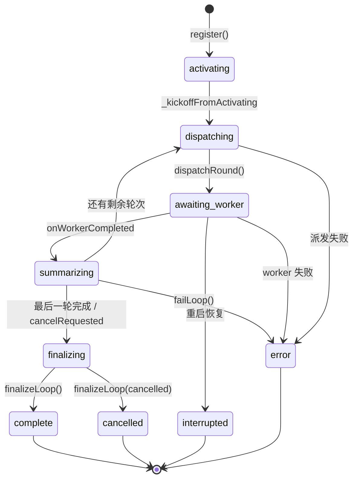
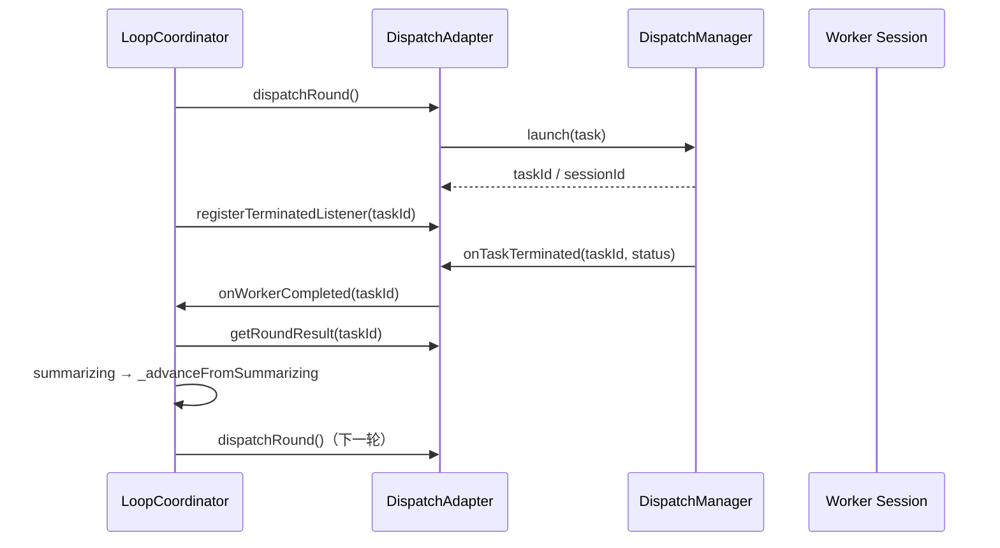

# 循环系统（Loop System）

循环系统让代理自主执行多轮迭代任务：每一轮把上一轮的摘要作为上下文，派发到隔离的 worker 会话。实现位于 `src/loop/`，由 `LoopCoordinator` 驱动推链（push-chain）调度，`DispatchAdapter` 桥接 dispatch 子系统，`LoopStore` 负责重启恢复。

> **本页的边界**：本页只讲引擎内部实现。`|loop|` 的使用者用法（激活语法、配方、何时该用 fresh 模式）见[函数系统](/02-Guide/functions)；`loop_*` 工具的参数与返回格式见[工具目录](/03-Reference/tool-catalog)；用图引擎编排多代理任务见[图工作流](/02-Guide/graph-workflows)。

> 自 v0.23.0 起，循环推进改为 `onTaskTerminated` 事件驱动的推链模型（此前依赖轮询空闲检测）；`|loop|` 函数自 v0.14.0 引入。

## 1. 组件构成

| 组件 | 模块 | 职责 |
|---|---|---|
| `LoopCoordinator` | `src/loop/coordinator.ts` | 循环注册、推链推进、重入保护、取消、重启后重新订阅 |
| worker 派发 | `src/loop/worker-dispatch.ts` | `dispatchRound()` / `handleSummary()` / `finalizeLoop()` / `failLoop()` |
| `LoopStore` | `src/loop/loop-store.ts` | 状态持久化（防抖写入）与重启对账 |
| `DispatchAdapter` | `src/loop/dispatch-adapter.ts` | 把 `DispatchManager` 适配成循环系统需要的 9 个方法 |
| 参数解析 | `src/loop/params.ts` | 解析 `\|loop:N,mode\|` 前缀，钳位越界轮数 |
| 取消判定 | `src/loop/cancellation.ts` | 判定一条消息是否构成取消信号 |
| 工具装配 | `src/loop/loop-tools.ts` | 创建 6 个 `loop_*` 工具 |
| 常量 | `src/loop/constants.ts` | 轮数、超时、延迟、锁与 schema 版本常量 |

```mermaid
graph TB
  subgraph Core[核心层]
    COORD[LoopCoordinator]
    STORE[LoopStore]
    PARAMS[params]
    CANCEL[cancellation]
  end
  subgraph Bridge[桥接层]
    ADAPTER[DispatchAdapter]
  end
  subgraph Dispatch[调度层]
    DM[DispatchManager]
    W[Worker Session 1..N]
  end
  LOOP["|loop:N| 任务"] --> COORD
  COORD --> ADAPTER
  ADAPTER --> DM
  DM --> W
  COORD --> STORE
  COORD --> PARAMS
  COORD --> CANCEL
  STORE -.->|persist / reconcile| FILE[.rolebox/state/loops-{dirHash}.json]
```

## 2. `|loop|` 的解析与上下文拼接

`LOOP_FUNCTION_NAME` 定义入口函数名 `loop`。参数由 `parseLoopParams()` 解析，同时接受位置参数与命名参数：

```text
|loop:3| 分析这三个提案
|loop:5,fresh| 从头开始重复实验
|loop:3,mode=fresh| 显式指定模式
|loop:iterations=3,mode=inherit| 完全命名形式
```

| 参数 | 位置 / 命名 | 类型 | 默认值 | 说明 |
|---|---|---|---|---|
| 轮数 | `_0` / `iterations` | `number` | `5` | 最小值 1；超过硬上限 50 时**静默钳位**并置 `clamped` 标志 |
| 模式 | `_1` / `mode` | `inherit` \| `fresh` | `inherit` | 别名：`on`/`true` → `inherit`，`no-inherit`/`off`/`false` → `fresh` |

钳位不抛错：`|loop:100|` 会静默按 50 轮运行，调用方只能通过解析结果的 `clamped` 字段或轮次记录发现。

`inherit` 模式的种子拼接在 `dispatchRound()` 中完成：取上一轮统一摘要的**末尾** `SEED_CHAR_CAP`（8000）字符，以 `---` 分隔符前置到原始任务之前。

```typescript
// 结构示意
let prompt = loop.basePrompt;
if (loop.mode === "inherit" && loop.lastSummary) {
  const seed = loop.lastSummary.length > SEED_CHAR_CAP
    ? loop.lastSummary.slice(-SEED_CHAR_CAP)
    : loop.lastSummary;
  prompt = seed + "\n\n---\n\n" + loop.basePrompt;
}
```

## 3. 生命周期状态机

`LoopPhase` 是 9 阶段状态机，其中 4 个是终态：


```mermaid
stateDiagram-v2
    [*] --> activating: register()
    activating --> dispatching: _kickoffFromActivating
    dispatching --> awaiting_worker: dispatchRound()
    awaiting_worker --> summarizing: onWorkerCompleted
    summarizing --> dispatching: 还有剩余轮次
    summarizing --> finalizing: 最后一轮完成 / cancelRequested
    finalizing --> complete: finalizeLoop()
    finalizing --> cancelled: finalizeLoop(cancelled)
    summarizing --> error: failLoop()
    awaiting_worker --> error: worker 失败
    dispatching --> error: 派发失败
    awaiting_worker --> interrupted: 重启恢复
    complete --> [*]
    cancelled --> [*]
    interrupted --> [*]
    error --> [*]
```

| 阶段 | 类型 | 说明 |
|---|---|---|
| `activating` | 活跃 | 初始化，准备第一轮 |
| `dispatching` | 活跃 | 正在把一轮派发给 `DispatchManager` |
| `awaiting_worker` | 活跃 | 等待 worker 任务结束 |
| `summarizing` | 活跃 | 读取 origin 摘要，推进轮次计数 |
| `finalizing` | 过渡 | 收尾：取消在途 worker、注入完成笔记 |
| `complete` | 终态 | 全部迭代成功结束 |
| `cancelled` | 终态 | 被显式取消 |
| `interrupted` | 终态 | 会话超时或重启丢失上下文 |
| `error` | 终态 | 不可恢复的错误 |

## 4. 推链调度

循环不轮询：每一轮结束时 dispatch 层发出任务终止事件，`DispatchAdapter` 把它转成 `onWorkerCompleted()`，协调器在同一临界区内完成「取结果 → 汇总 → 派发下一轮」，形成自驱链条。


```mermaid
sequenceDiagram
    participant LC as LoopCoordinator
    participant DA as DispatchAdapter
    participant DM as DispatchManager
    participant W as Worker Session
    LC->>DA: dispatchRound()
    DA->>DM: launch(task)
    DM-->>DA: taskId / sessionId
    LC->>DA: registerTerminatedListener(taskId)
    DM->>DA: onTaskTerminated(taskId, status)
    DA->>LC: onWorkerCompleted(taskId)
    LC->>DA: getRoundResult(taskId)
    LC->>LC: summarizing → _advanceFromSummarizing
    LC->>DA: dispatchRound()（下一轮）
```

`onOriginIdle()` 保留为兼容钩子，其内部 switch 已经为空——origin 会话的空闲事件不再推进任何阶段。

### 重入保护

`_advancing` 映射保证同一 origin 会话同时只有一个推进操作：

1. **显式加锁**：推进前写入 `sessionId → 时间戳`。
2. **暂停完成通知**：锁被持有时，`onWorkerCompleted()` 把任务 ID 放进 `_pendingCompletions` 队列。
3. **停滞锁扫描**：每 15 秒扫描一次，超过 30 秒的锁被强制释放并排空队列。
4. **finally 排空**：每次释放锁后处理队列中积压的完成事件。

### DispatchAdapter 的 9 个方法

| 方法 | 用途 |
|---|---|
| `dispatchRound()` | 通过 `DispatchManager` 提交一轮 worker 任务 |
| `getRoundResult()` | 取得已完成轮次的结果 |
| `cancelRound()` | 取消在运行的 worker 轮 |
| `readOriginSummary()` | 读取 origin 会话最新的助手输出 |
| `getLastMessageId()` | 取会话最后一条消息 ID |
| `injectNote()` | 向 origin 会话写入静默进度笔记 |
| `registerTerminatedListener()` | 注册 worker 终止的一次性回调 |
| `removeTerminatedListener()` | 移除已注册回调 |
| `getTaskStatus()` | 查询 dispatch 任务存活状态 |

每轮任务都以 `run_in_background: true` 和 `noParentInherit: true` 提交，因此 worker 不会继承父会话上下文——上下文只通过 §2 的 seed 拼接传递。

## 5. 取消

取消只由显式命令触发：`/stop-loop` 处理器把 `STOP_LOOP_SIGNAL`（`[rolebox:stop-loop]`）注入消息文本，`shouldCancelLoop()` 据此判定。

| 条件 | 行为 |
|---|---|
| 消息不含 `STOP_LOOP_SIGNAL` | 不取消（普通消息不再中断循环） |
| 阶段为终态 | 不取消 |
| 阶段为 `activating` / `summarizing` / `finalizing` | 不取消（origin 自持相位） |
| 阶段为 `awaiting_worker` 或 `dispatching` | **取消** |

协调器提供两个取消入口：`requestCancel()` 设置 `cancelRequested`，在下次汇总时生效；`cancelNow()` 立即清理 worker 监听器并强制进入 `finalizing`。如果 origin 会话正持有 `_advancing` 锁，`cancelNow()` 会先标记再等锁释放，避免与推链竞争。

收尾时 `finalizeLoop()` 取消仍活跃的 worker、把未执行的轮次标记为 cancelled，并向 origin 会话注入包含已完成轮次摘要的笔记。

## 6. 持久化与恢复

`LoopStore` 把状态写入 `<工作目录>/.rolebox/state/loops-{dirHash}.json`，`dirHash` 由工作目录短哈希得到，因此同一台机器上的多个工作区互不覆盖。

| 机制 | 说明 |
|---|---|
| 防抖保存 | `save()` 在 200 ms 窗口内合并多次调用为一次 I/O，并把所有等待者一起 resolve |
| 同步保存 | `saveSync()` 供关键路径立即落盘 |
| 版本校验 | 只接受 1–3 的 schema 版本，1/2 自动迁移到 3 |
| 终态修剪 | `complete` / `cancelled` / `interrupted` / `error` 的循环在加载与对账时被移除 |

### 重启恢复的三个阶段

1. **加载**：读取 JSON，校验格式与 `LOOP_STATE_SCHEMA_VERSION`。
2. **对账**：`reconcile()` 为每个非终态循环查询它的 worker 任务状态。
3. **重新订阅**：`reSubscribeListeners()` 重新挂上终止监听器，把推链接回运行中的循环。

| worker 状态 | 恢复动作 |
|---|---|
| `completed` | 阶段设为 `summarizing`，立即推进汇总与下一轮 |
| `running` / `pending` | 阶段设为 `awaiting_worker`，重新注册监听器 |
| `unknown` / `error` / `cancelled` | 阶段设为 `interrupted` |
| 任务不存在（无 `activeWorkerTaskId`） | 阶段设为 `interrupted` |

重新订阅时按阶段分派：`summarizing` 走 `_advanceFromSummarizing()`，`activating` 走 `_kickoffFromActivating()`，`awaiting_worker` 且已完成走 `onWorkerCompleted()`，否则只补注册监听器。

## 7. 配置常量

常量集中在 `src/loop/constants.ts`，没有对应的 role.yaml 字段。

| 常量 | 值 | 说明 |
|---|---|---|
| `DEFAULT_ITERATIONS` | `5` | 未指定时的轮数 |
| `MAX_ITERATIONS_HARD_CAP` | `50` | 轮数硬上限，超出静默钳位 |
| `DISPATCH_ROUND_TIMEOUT_MS` | `900000`（15 分钟） | 单轮超时 |
| `INTER_ROUND_DELAY_MS` | `2000` | 轮间最小延迟 |
| `SUMMARY_INPUT_CHAR_CAP` | `8000` | 送入汇总器的单轮输出上限 |
| `SEED_CHAR_CAP` | `8000` | 继承模式拼进下一轮的摘要上限 |
| `LOOP_STATE_SCHEMA_VERSION` | `3` | 持久化 schema 版本 |
| `ADVANCING_LOCK_TIMEOUT_MS` | `30000` | 推进锁停滞判定阈值 |
| `SWEEPER_INTERVAL_MS` | `15000` | 停滞锁扫描间隔 |
| `MAX_TREE_WORKER_SESSIONS` | `30` | 树状 worker 循环的并发上限 |
| `CONSECUTIVE_STALE_THRESHOLD` | `2` | 连续无进展轮数达到该值时提前终止 |

## 8. 可观测性

循环在关键节点向 origin 会话注入带 `LOOP_PROGRESS_MARKER`（`[loop-progress`）前缀的静默笔记：

```text
[loop-progress loop started: 3 rounds, inherit mode]
[loop-progress round 1/3 completed, session=abc123, duration=12.5s]
[loop-progress loop complete]
Rounds: r1:abc123(12.5s,completed), r2:def456(10.2s,completed), r3:ghi789(8.1s,completed)
```

- 各组件用 `createSubLogger` 写结构化日志，子日志名分别为 `loop/coordinator`、`loop/worker-dispatch`、`loop-store`；推链跟踪走 `loop-trace`，停滞锁事件走 `advancing-lock`。
- `getAdvancingLockState()` 返回 `{ activeLocks, staleLocks }`：当前持有的推进锁数量与累计清扫次数，可用于判断推链是否被卡住。

## 9. `loop_*` 工具集

`createLoopTools()` 一次性创建 6 个工具，它们都直接读写协调器状态，不经过图引擎：

| 工具 | 用途 |
|---|---|
| `loop_start` | 注册一个顺序多会话循环并启动首轮 |
| `loop_status` | 查询单个循环的快照；省略 `session_id` 返回聚合指标 |
| `loop_cancel` | 取消运行中的循环（接受 origin 或 worker 会话 ID） |
| `loop_output` | 读取指定轮次的 worker 输出，支持分页 |
| `loop_history` | 逐轮执行历史（worker 会话 ID、耗时、状态） |
| `loop_list` | 列出全部被跟踪的循环，可按阶段与 agent 过滤 |

参数与返回格式见[工具目录](/03-Reference/tool-catalog)。装配存在平台差异：dsh 插件直接注册这 6 个工具；opencode 的 `ToolService` 有意关闭了裸 `loop_*` 注册（注释写明是为了防止模型绕过图引擎），多代理编排统一走命令式 `graph_*` 引擎；Pi 的工具装配只在装配方显式传入 `loopTools` 时才注入，默认不注入。`loop_output` 在没有 `session_client` 时只返回循环元数据。

## 10. 与 dispatch 子系统的关系

循环建于 dispatch 之上，但两者职责不重叠：循环持有轮次语义与恢复能力，dispatch 只负责单轮任务调度。循环通过 `IDispatchAdapter` 接口访问 dispatch，不直接调用 dispatch 工具函数。

| 维度 | 循环系统 | dispatch 系统 |
|---|---|---|
| 职责 | 多轮迭代编排 | 单轮任务调度 |
| 状态 | `LoopState`（9 阶段） | `DispatchTask` 生命周期 |
| 并发控制 | `_advancing` 重入保护 | 并发槽位管理 |
| 持久化 | `LoopStore`（JSON） | 无 |
| 恢复 | `reconcile()` + `reSubscribeListeners()` | 无 |
| 超时 | `DISPATCH_ROUND_TIMEOUT_MS` | `backgroundStaleTimeoutMs` |

## 11. 当前实现边界

- **没有独立的循环配置文件**：轮数来自 `|loop:N|` 前缀，其余行为由 `src/loop/constants.ts` 的常量固定；`role.yaml` 不提供循环字段。
- **钳位静默**：轮数越界不报错，只在解析结果里留下 `clamped`。
- **普通消息不中断循环**：除了 `/stop-loop`，用户消息与系统重新提示都不会取消运行中的循环。
- **树状 worker 上限是全局的**：`MAX_TREE_WORKER_SESSIONS` 限制的是并发注册的树状循环会话数，不是任意会话数。

## 相关页面

- [函数系统](/02-Guide/functions) — `|loop|` 的激活语法与使用配方
- [工具目录](/03-Reference/tool-catalog) — `loop_*` 工具的参数与返回格式
- [图执行引擎](/04-Advanced/graph-engine) — 命令式编排的引擎模型
- [调度配置](/03-Reference/dispatch-config) — dispatch 子系统的配置面
- [平台与 Harness](/01-Overview/platform-harnesses) — 各 harness 的工具装配差异
