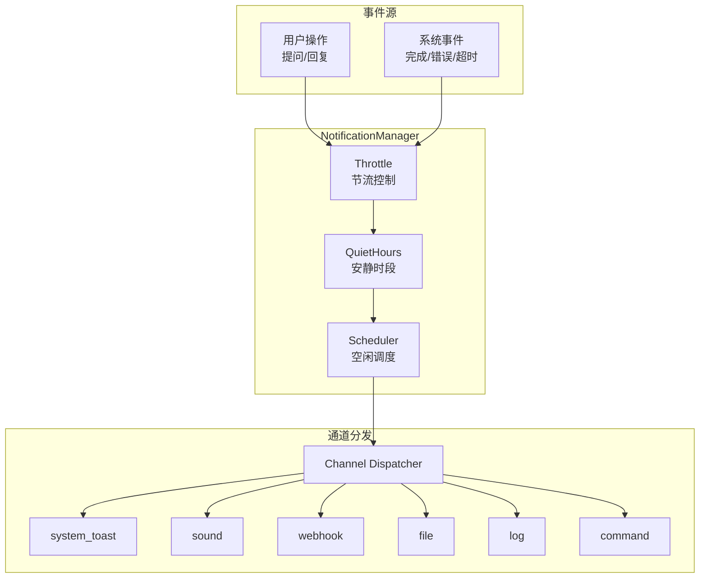
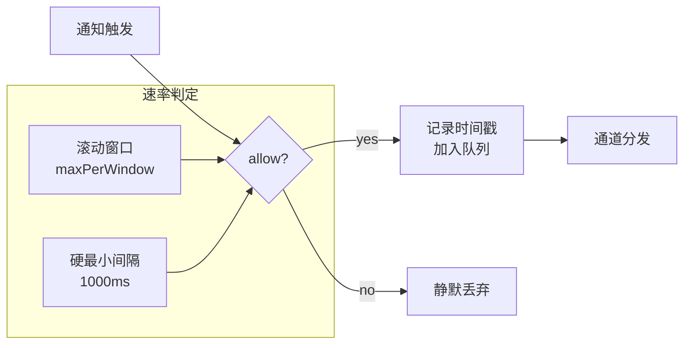
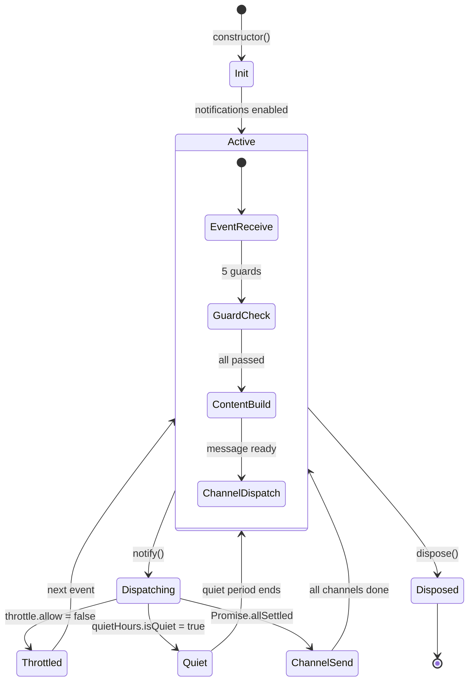
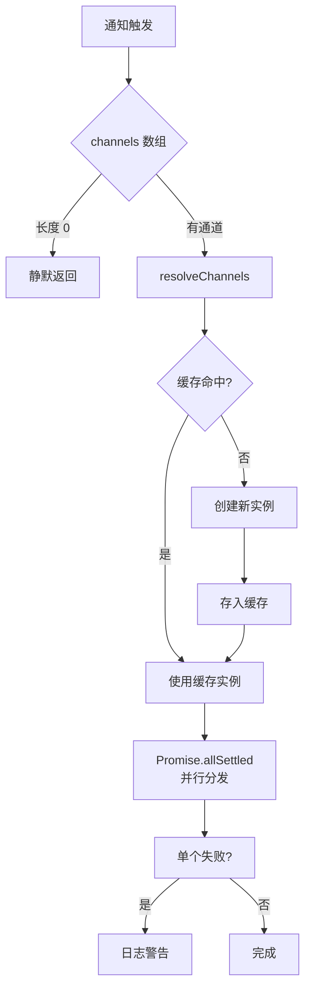

# 通知系统

> **v0.19.0 引入** — 通知管理子系统，支持 9 种事件类型、6 种通道分发、安静时段与节流控制（CHANGELOG.md:177）

> **相关文档：** [运行时行为](/04-Advanced/runtime-behavior) — 协作图状态机与 dispatch 驱动 | [会话工具](/04-Advanced/session-tools) — 10 工具会话管理套件 | [兼容性](/04-Advanced/compatibility) — 跨平台兼容性


通知系统让 rolebox 在后台任务完成、需要用户介入、或发生错误时主动提醒你。它通过 **NotificationManager** 统一管理事件接收、配置解析、静音检测、节流控制、多通道分发和空闲检测。



---

## 1. NotificationManager 架构

`NotificationManager`（`src/notifications/manager.ts:38-49`）是通知子系统的核心类。它持有以下子系统实例：

| 子系统 | 类型 | 职责 |
|--------|------|------|
| `scheduler` | `NotificationScheduler` | 空闲检测定时器管理（`scheduler.ts:44-79`） |
| `throttle` | `NotificationThrottle` | 速率限制和去重（`throttle.ts:38-64`） |
| `quietHours` | `QuietHours` | 静音时段判定（`quiet-hours.ts:86-91`） |
| `channelCache` | `Map<string, NotificationChannel[]>` | 通道实例缓存（`manager.ts:48`） |
| `platform` | `PlatformInfo` | 操作系统检测结果（`manager.ts:49`） |

### 构造函数

```typescript
// src/notifications/manager.ts:51-81
constructor(opts: {
  globalConfig: NotificationConfig;           // 全局通知配置
  roleConfigs: Map<string, NotificationConfig>; // 按角色覆盖的配置
  client: ISessionClient;                       // 会话客户端
  dir: string;                                  // 工作目录
})
```

构造时初始化所有子系统，并调用 `preWarmCommandCache` 预检查各平台可用的通知命令（`terminal-notifier`、`osascript`、`notify-send`、`afplay`、`paplay`、`aplay`、`powershell`）。

### 配置解析

`getConfigForSession`（`manager.ts:92-100`）按以下规则合并配置：

1. 若无 `agent` 参数，直接返回全局配置
2. 若 `agent` 在 `roleConfigs` 中存在，将角色配置 `merge` 到全局配置之上

合并策略（`config.ts:212-285`）：
- **标量字段**（`enabled`、`mainSessionOnly`、`idleDelayMs`、`throttle`、`quietHours`）：角色配置完全覆盖全局
- **`channels`**：角色配置的通道数组**替换**全局的
- **`events`**：按事件类型合并，角色的事件配置替换同类型全局配置，仅全局有的保留

### 核心通知流程 `notify()`

```typescript
// src/notifications/manager.ts:111-184
async notify(opts: {
  sessionID: string;
  eventType: string;
  agent?: string;
  roleName?: string;
  questionText?: string;
}): Promise<void>
```

执行以下顺序检查：

1. **校验事件类型**：不在 `VALID_NOTIFICATION_EVENT_TYPES` 中的静默忽略
2. **全局启用检查**：`config.enabled === false` 时跳过
3. **事件级别启用**：`events[eventType].enabled === false` 时跳过
4. **安静时段检查**：优先使用事件级别的 `quietHoursOverride`，否则使用全局安静时段
5. **节流检查**：调用 `throttle.allow()` 判断是否超过速率限制
6. **内容构建**：`buildNotificationContent()` 从会话数据组装消息
7. **通道分发**：对所有激活通道并行调用 `ch.send(message)`，失败仅日志警告

所有异常在顶层被 `try/catch` 捕获，`NotificationManager` **永不向外抛出异常**（`manager.ts:181-183`）。

---

## 2. 配置文件

通知系统通过 `notifications.jsonc` 文件配置，位于 `~/.config/opencode/rolebox/` 目录下。

### 配置结构

```typescript
// src/notifications/types.ts:181-198
interface NotificationConfig {
  enabled: boolean;                    // 总开关
  mainSessionOnly: boolean;            // 仅主会话触发通知
  idleDelayMs: number;                 // 空闲检测延迟（毫秒）
  questionToolNames: string[];         // 触发提问事件的目标工具名
  channels: NotificationChannelConfig[]; // 全局通道列表
  events?: Record<string, NotificationEventConfig>; // 按事件类型覆盖
  quietHours: QuietHoursConfig;        // 全局安静时段
  throttle: ThrottleConfig;            // 全局节流配置
}
```

### 默认值

```typescript
// src/notifications/config.ts:43-58
// src/constants.ts:134-139
```

| 字段 | 默认值 | 来源 |
|------|--------|------|
| `enabled` | `true` | `config.ts:44` |
| `mainSessionOnly` | `true` | `config.ts:45` |
| `idleDelayMs` | `1500` | `constants.ts:134` |
| `throttle.windowMs` | `3000` | `constants.ts:135` |
| `throttle.maxPerWindow` | `3` | `constants.ts:136` |
| `questionToolNames` | `["question", "ask_user_question", "askuserquestion"]` | `constants.ts:139` |
| `quietHours.enabled` | `false` | `config.ts:51` |

### JSONC 示例

```jsonc
// ~/.config/opencode/rolebox/notifications.jsonc
{
  // 总开关
  "enabled": true,

  // 空闲检测延迟（毫秒）
  "idleDelayMs": 1500,

  // 全局通道配置
  "channels": [
    { "kind": "system_toast", "enabled": true },
    { "kind": "sound", "enabled": true, "soundPath": "/path/to/notification.wav" },
    { "kind": "log", "enabled": true, "level": "info" }
  ],

  // 安静时段：22:00–08:00 不打扰
  "quietHours": {
    "enabled": true,
    "timezone": "Asia/Shanghai",
    "ranges": [
      { "start": "22:00", "end": "08:00" }
    ]
  },

  // 全局节流：3 秒窗口内最多 3 条
  "throttle": {
    "windowMs": 3000,
    "maxPerWindow": 3
  },

  // 按事件类型覆盖
  "events": {
    "error": {
      "enabled": true,
      "channels": [
        { "kind": "system_toast", "enabled": true },
        { "kind": "webhook", "enabled": true, "url": "https://hooks.example.com/alerts" }
      ]
    },
    "loop_complete": {
      "enabled": false  // 关闭循环完成的通知
    }
  }
}
```

### 环境变量插值

配置中的字符串值支持 `{env:VAR_NAME}` 语法，在运行时由 `resolveEnvVarsInConfig`（`config.ts:294-296`）解析为实际环境变量值。

```jsonc
{
  "channels": [
    {
      "kind": "webhook",
      "enabled": true,
      "url": "{env:SLACK_WEBHOOK_URL}"
    }
  ]
}
```

---

## 3. 事件类型

系统内置 9 种通知事件类型（`src/notifications/types.ts:3-13`），可通过 `events` 配置按类型覆盖通道、模板或节流。

| 类型常量 | 值 | 触发时机 | 源码位置 |
|----------|-----|----------|----------|
| `Idle` | `"idle"` | 会话在 `idleDelayMs` 内无活动 | `manager.ts:213-223` |
| `Question` | `"question"` | 代理调用匹配 `questionToolNames` 的工具 | `manager.ts:261-303` |
| `Permission` | `"permission"` | 代理请求用户权限（预留） | `types.ts:6` |
| `Error` | `"error"` | 会话发生错误 | `manager.ts:234-242` |
| `DispatchComplete` | `"dispatch_complete"` | 子任务完成派发 | `manager.ts:308-316` |
| `DispatchProgress` | `"dispatch_progress"` | 子任务进度更新（预留） | `types.ts:9` |
| `LoopComplete` | `"loop_complete"` | 循环迭代完成 | `manager.ts:319-327` |
| `SessionDeleted` | `"session_deleted"` | 会话被删除 | `types.ts:11` |
| `Custom` | `"custom"` | 用户自定义事件 | `types.ts:12` |

### 事件级别配置

```typescript
// src/notifications/types.ts:164-177
interface NotificationEventConfig {
  enabled: boolean;
  channels?: NotificationChannelConfig[];     // 事件专属通道，覆盖全局
  titleTemplate?: string;                      // 标题模板（{{var}} 语法）
  messageTemplate?: string;                    // 消息模板（{{var}} 语法）
  throttle?: Partial<ThrottleConfig>;          // 事件专属节流
  quietHoursOverride?: QuietHoursConfig;       // 事件专属安静时段
}
```

```jsonc
"events": {
  "error": {
    "enabled": true,
    "channels": [{ "kind": "webhook", "enabled": true, "url": "..." }],
    "throttle": { "windowMs": 60000, "maxPerWindow": 5 },
    "quietHoursOverride": { "enabled": false }  // 错误通知不遵循安静时段
  },
  "question": {
    "enabled": true,
    "titleTemplate": "需要你的回答",
    "messageTemplate": "代理 {{agent}} 在会话 {{sessionId}} 中有问题"
  }
}
```

---

## 4. 通道类型

系统内置 6 种通知通道（`src/notifications/types.ts:28-35`），每个通道在 `src/notifications/channels/` 下有独立实现。

| 通道类型 | 值 | 源码文件 | 用途 |
|----------|-----|----------|------|
| SystemToast | `"system_toast"` | `channels/system-toast.ts` | 原生 OS 桌面通知 |
| Sound | `"sound"` | `channels/sound.ts` | 播放提示音 |
| CustomCommand | `"custom_command"` | `channels/custom-command.ts` | 执行任意 shell 命令 |
| Webhook | `"webhook"` | `channels/webhook.ts` | POST 请求到指定 URL |
| File | `"file"` | `channels/file.ts` | 追加写入 JSONL 文件 |
| Log | `"log"` | `channels/log.ts` | 写入 rolebox 日志系统 |

### 4.1 SystemToast — 原生系统通知

平台自适应的桌面通知，按操作系统选择不同的底层命令：

- **macOS**：先尝试 `terminal-notifier`，回退到 `osascript`
- **Linux**：使用 `notify-send`（libnotify）
- **Windows**：使用 PowerShell 调用 `BurntToast` 或原生通知

```jsonc
{ "kind": "system_toast", "enabled": true }
```

标题截断至 256 字符，正文截断至 4000 字符（`system-toast.ts:35-36`）。

### 4.2 Sound — 提示音

播放通知声音文件：

```jsonc
{
  "kind": "sound",
  "enabled": true,
  "soundPath": "/usr/share/sounds/freedesktop/stereo/complete.oga"
}
```

播放器按平台选择（`sound.ts:37-51`）：
- **macOS**：`afplay`
- **Linux**：先尝试 `paplay`（PulseAudio），回退到 `aplay`（ALSA）
- **Windows**：PowerShell `SoundPlayer`

### 4.3 CustomCommand — 自定义命令

执行任意 shell 命令，通过环境变量传递通知内容（`custom-command.ts:32-40`）：

| 环境变量 | 值 |
|----------|-----|
| `NOTICE_TITLE` | 通知标题 |
| `NOTICE_BODY` | 通知正文 |
| `NOTICE_SESSION_ID` | 会话 ID |
| `NOTICE_EVENT_TYPE` | 事件类型 |
| `NOTICE_AGENT` | 代理名称 |
| `NOTICE_ROLE_NAME` | 角色名称 |
| `NOTICE_TIMESTAMP` | ISO 8601 时间戳 |

```jsonc
{
  "kind": "custom_command",
  "enabled": true,
  "command": "curl -X POST -d \"$NOTICE_BODY\" http://localhost:8080/notify",
  "passAsStdin": false,
  "env": { "MY_CUSTOM_KEY": "value" }
}
```

当 `passAsStdin` 为 `true` 时，完整 `NotificationMessage` 的 JSON 序列化通过 stdin 传入。命令默认超时 10 秒（`custom-command.ts:54`）。

### 4.4 Webhook — HTTP POST

向指定 URL 发送 JSON POST 请求（`webhook.ts:25-33`）：

```jsonc
{
  "kind": "webhook",
  "enabled": true,
  "url": "https://hooks.slack.com/services/T00/B00/xxx",
  "headers": { "Authorization": "Bearer {env:TOKEN}" },
  "timeoutMs": 5000
}
```

默认超时 5000ms（`webhook.ts:21`），默认 Content-Type 为 `application/json`。POST 正文为 `NotificationMessage` 完整 JSON。

### 4.5 File — 文件日志

将通知以 JSONL 格式追加写入文件（`file.ts:18-26`），自动创建目标目录：

```jsonc
{
  "kind": "file",
  "enabled": true,
  "path": "/tmp/rolebox-notifications.jsonl"
}
```

每行一条 JSON，格式为完整的 `NotificationMessage` 结构。

### 4.6 Log — 控制台日志

写入 rolebox 内部日志系统（`log.ts:15-31`），可选日志级别：

```jsonc
{
  "kind": "log",
  "enabled": true,
  "level": "info"  // info | warn | error | debug
}
```

日志格式：`[eventType] title — body`

---

::: tip 调试通知配置
要验证当前的通知配置是否生效，可以手动触发一条测试通知：通过 `|signal| type=progress payload={"test": true}` 发送一条信号。如果配置正确，NotificationManager 会按照当前的事件过滤、节流和安静时段设置在对应的通道上发出通知。也可以查看日志前缀 `notification:` 的诊断输出。
:::

## 5. 安静时段 (Quiet Hours)

安静时段在指定时间范围内静音通知，由 `QuietHours` 类（`quiet-hours.ts:86-91`）实现。

```typescript
// src/notifications/types.ts:60-65
interface QuietHoursConfig {
  enabled: boolean;
  timezone?: string;                    // IANA 时区（如 "America/New_York"）
  ranges: QuietHoursRange[];           // 安静时段范围列表
}

interface QuietHoursRange {
  start: string;                        // HH:MM 格式，24 小时制
  end: string;                          // HH:MM 格式，24 小时制
  days?: string[];                      // 工作日缩写（Mon/Tue/...），省略则每日有效
}
```

### 支持的时间范围类型

| 范围类型 | 示例 | 说明 |
|----------|------|------|
| 正常范围 | `22:00`–`08:00` | 午夜交叉，跨天有效 |
| 同日范围 | `09:00`–`17:00` | 同一天内有效 |
| 全天范围 | `00:00`–`00:00` | start === end，24 小时静默 |
| 按日筛选 | `start:"22:00"` `end:"08:00"` `days:["Sat","Sun"]` | 仅周末生效 |

```jsonc
"quietHours": {
  "enabled": true,
  "timezone": "Europe/Berlin",
  "ranges": [
    { "start": "22:00", "end": "07:00" },                     // 工作日夜晚
    { "start": "09:00", "end": "17:00", "days": ["Sat","Sun"] }  // 周末白天
  ]
}
```

### 时区处理

通过 `Intl.DateTimeFormat` 的 `timeZone` 选项（`quiet-hours.ts:36-47, 53-73`）实现时区感知计算。未识别时区会回退到系统本地时区并记录警告。

### `nextActiveTime()`

`QuietHours` 提供 `nextActiveTime(now?)` 方法（`quiet-hours.ts:160-196`），返回当前安静时段的结束时间（`Date` 对象），在收到"通知已延迟"的回复时提供"将在 XX 时恢复通知"的信息。

---

## 6. 节流控制 (Throttle)

节流防止短时大量通知轰炸，由 `NotificationThrottle` 类（`throttle.ts:38-64`）实现。

```typescript
// src/notifications/types.ts:69-81
interface ThrottleConfig {
  windowMs: number;                                             // 时间窗口（毫秒）
  maxPerWindow: number;                                         // 窗口内最大通知数
  perEventType?: Record<string, { windowMs: number; maxPerWindow: number }>;  // 按事件类型覆盖
}
```

### 默认值

| 参数 | 默认值 | 来源 |
|------|--------|------|
| `windowMs` | `3000`（3 秒） | `constants.ts:135` |
| `maxPerWindow` | `3` | `constants.ts:136` |

### 节流规则

1. **滚动窗口速率限制**：每个 `sessionID:eventType` 组合维护一个时间戳队列，超过 `maxPerWindow` 的请求被静默丢弃（`throttle.ts:97-103`）
2. **硬最小间隔**：相同 `sessionID:eventType` 的相邻通知间隔至少 1000ms（`throttle.ts:105-109`）
3. **自动过期清理**：每次 `allow()` 调用自动清理超出时间窗口的旧时间戳（`throttle.ts:82-90`）
4. **周期性全量清理**：每 5 分钟运行一次全面修剪（`throttle.ts:57-63`）

### 事件级别覆盖

```jsonc
"throttle": {
  "windowMs": 3000,
  "maxPerWindow": 3,
  "perEventType": {
    "error": { "windowMs": 60000, "maxPerWindow": 10 },
    "dispatch_complete": { "windowMs": 1000, "maxPerWindow": 1 }
  }
}
```



---

## 7. 空闲检测 (Idle Detection)

空闲检测在用户离开时（会话无活动超过 `idleDelayMs`）触发 `Idle` 类型通知。

### 核心机制

`NotificationScheduler`（`scheduler.ts:44-79`）管理每个会话的空闲定时器：

```typescript
// src/notifications/scheduler.ts:131-172
scheduleIdleNotification(sessionID: string, onFire: () => void): void
```

### 防重复机制

| 防护措施 | 说明 | 源码位置 |
|----------|------|----------|
| 版本计数器 | 每次调度递增版本号，过期回调静默忽略 | `scheduler.ts:61, 157-158, 194-199` |
| 已通知集合 | `notifiedSessions` 防止同一会话重复通知 | `scheduler.ts:52, 220` |
| 执行中锁 | `executingNotifications` 防止重叠执行 | `scheduler.ts:64, 187-192` |
| 活动回退 | `sessionActivitySinceIdle` 在调度后出现的活动阻止通知触发 | `scheduler.ts:58, 201-209` |
| 宽限期 | 活动在调度后 `activityGracePeriodMs`（默认 100ms）内到达不取消定时器 | `scheduler.ts:34, 95-106` |

### 活动标记

```typescript
// manager.ts:203-205
markActivity(sessionID: string): void
```

通过 `handleMessageUpdated` 和 `handleChatMessage` 间接调用（`manager.ts:245-251`），每次用户发消息或消息被更新时重置空闲倒计时。

### 会话清理

`handleSessionDeleted`（`manager.ts:228-231`）在会话删除时清理调度器和节流状态。`cleanupOldSessions`（`scheduler.ts:300-348`）在达到 `maxTrackedSessions`（默认 100）时按 LRU 策略淘汰旧会话。

---

## 8. 生命周期与热加载

### 生命周期流程图



### 热加载

`reloadConfig()`（`manager.ts:338-356`）支持运行时热加载通知配置：

1. 更新全局和角色级配置
2. 重新创建 `Throttle` 和 `QuietHours` 实例
3. 重建 `Scheduler` 并更新空闲延迟
4. 清空通道缓存（下次通知时按新配置重建）

### 资源释放

`dispose()`（`manager.ts:364-384`）按顺序清理：
1. 停止调度器所有定时器
2. 清除节流数据及定时器
3. 调用每个缓存通道的 `dispose()`
4. 清空通道缓存

---

## 9. 通道路由与解析

### 通道创建

`createChannels` 根据操作系统和已安装的命令选择可用的通道实现。`resolveChannels`（`manager.ts:193-198`）通过 `channelCache` 做缓存，防止并发通知导致重复创建。



### 通道降级

SystemToast 和 Sound 通道具备自动降级能力：
- **SystemToast**（`system-toast.ts:38-71`）：macOS 先尝试 `terminal-notifier`，回退到 `osascript`；两个都失败则记录警告
- **Sound**（`sound.ts:36-51`）：Linux 先尝试 `paplay`，回退到 `aplay`

---

## 10. 平台适配

`detectPlatform()` 在 `NotificationManager` 构造函数中调用，返回：

```typescript
// src/notifications/types.ts:45-47
interface PlatformInfo {
  os: "darwin" | "linux" | "win32" | "unknown";
}
```

系统根据平台选择不同的底层命令策略（`manager.ts:69-80`）：

| 平台 | 系统通知 | 声音播放 |
|------|----------|----------|
| macOS (darwin) | `terminal-notifier` → `osascript` | `afplay` |
| Linux | `notify-send` | `paplay` → `aplay` |
| Windows (win32) | PowerShell 脚本 | PowerShell `SoundPlayer` |

---

## 核心要点

| 维度 | 关键信息 |
|------|----------|
| **核心架构** | NotificationManager 统一管理事件接收 → 节流 → 安静时段检查 → 空闲调度 → 通道分发 |
| **事件类型** | 9 种事件：chat.message、tool.before/after 等 hook 事件 + session.idle/error 等生命周期事件 |
| **通道支持** | 6 种通道：SystemToast（各平台原生）、Sound、Webhook、File、Log、CustomCommand |
| **安静时段** | 支持全局和事件级别的安静时段配置，时区感知，跨天/全天范围 |
| **节流机制** | 按事件类型独立控制（突发上限 + 稳态速率），报告间隔 2s，去重窗口 5s |

## 引用索引

| 引用 | 文件 | 行号 |
|------|------|------|
| 事件类型定义 | `src/notifications/types.ts` | 3-13 |
| 通道类型定义 | `src/notifications/types.ts` | 28-35 |
| 完整类型定义 | `src/notifications/types.ts` | 1-198 |
| NotificationManager 类 | `src/notifications/manager.ts` | 38-385 |
| 构造函数 | `src/notifications/manager.ts` | 51-81 |
| 配置解析 | `src/notifications/manager.ts` | 92-100 |
| 通知主流程 | `src/notifications/manager.ts` | 111-184 |
| 空闲调度 | `src/notifications/manager.ts` | 213-223 |
| 热加载 | `src/notifications/manager.ts` | 338-356 |
| 资源释放 | `src/notifications/manager.ts` | 364-384 |
| 安静时段类 | `src/notifications/quiet-hours.ts` | 86-234 |
| 时区处理 | `src/notifications/quiet-hours.ts` | 35-73 |
| 节流类 | `src/notifications/throttle.ts` | 38-214 |
| 默认节流参数 | `src/notifications/throttle.ts` | 14-18 |
| 调度器类 | `src/notifications/scheduler.ts` | 44-349 |
| 空闲定时器 | `src/notifications/scheduler.ts` | 131-172 |
| 版本计数器 | `src/notifications/scheduler.ts` | 194-199 |
| 最大跟踪会话 | `src/notifications/scheduler.ts` | 300-348 |
| 配置解析 | `src/notifications/config.ts` | 72-158 |
| 配置合并 | `src/notifications/config.ts` | 212-285 |
| 环境变量解析 | `src/notifications/config.ts` | 294-296 |
| 默认配置 | `src/notifications/config.ts` | 43-58 |
| 配置子解析器 | `src/notifications/config-parsers.ts` | 70-237 |
| 通道解析器 | `src/notifications/config-parsers.ts` | 115-172 |
| SystemToast 通道 | `src/notifications/channels/system-toast.ts` | 1-77 |
| Sound 通道 | `src/notifications/channels/sound.ts` | 1-58 |
| CustomCommand 通道 | `src/notifications/channels/custom-command.ts` | 1-92 |
| Webhook 通道 | `src/notifications/channels/webhook.ts` | 1-56 |
| File 通道 | `src/notifications/channels/file.ts` | 1-29 |
| Log 通道 | `src/notifications/channels/log.ts` | 1-35 |
| 常量默认值 | `src/constants.ts` | 134-139 |
| 问题工具名默认值 | `src/constants.ts` | 139 |

---

## 下一步

- [运行时行为](/04-Advanced/runtime-behavior) — 协作图状态机与 dispatch 驱动推进
- [会话工具](/04-Advanced/session-tools) — 10 工具会话管理套件
- [兼容性](/04-Advanced/compatibility) — 跨平台兼容性与依赖要求
- [CLI 参考](/03-Reference/cli) — 命令行工具完整参考
