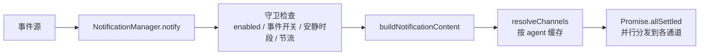
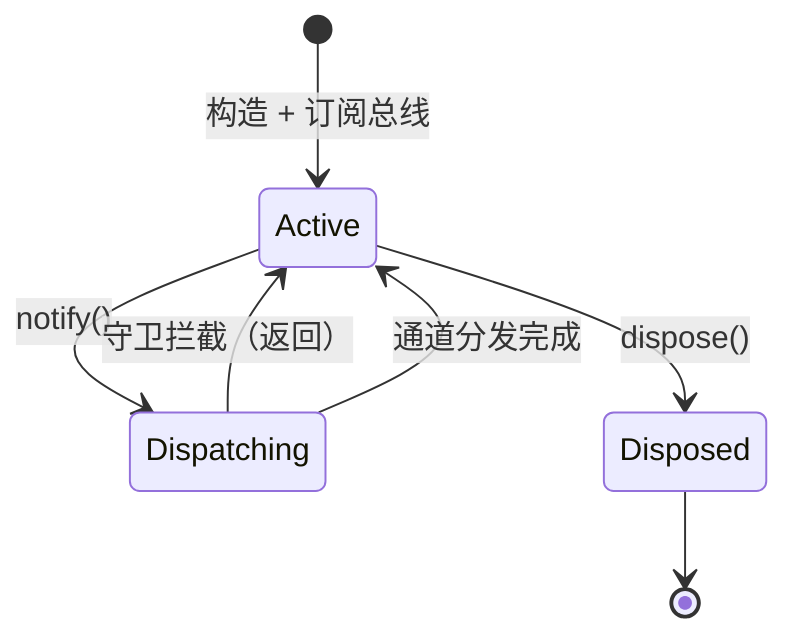

# 通知系统（Notification System）

通知子系统在后台任务完成、需要人工介入或发生错误时提醒用户：`NotificationManager` 统一接收事件、执行守卫检查、构建通知内容，再把消息分发到一个或多个通道。实现位于 `src/notifications/`，装配与事件总线订阅位于 `src/core/services/notification-service.ts`。

> **本页的边界**：本页只讲引擎内部实现；配置文件字段表保留在此，因为解析本身就是实现的一部分。使用者视角的内容在别处：角色级 `notifications:` 键见 [role.yaml 参考](/03-Reference/role-yaml)，触发通知的工具（`graph_*`、`signal` 等）的参数见[工具目录 · 编排分册](/03-Reference/tools/orchestration-tools)，`rolebox monitor` 的状态面板开关见 [CLI 参考](/03-Reference/cli)，自定义通道与事件的注册协议见[扩展机制](/03-Reference/extensions)。

> 自 v0.19.0 起，通知由 NotificationManager 统一管理；`approval_pending` 事件自 v1.7.0 起加入。

## 1. 组件构成

| 组件 | 模块 | 职责 |
|---|---|---|
| `NotificationManager` | `src/notifications/manager.ts` | 门面：配置解析、守卫检查、内容构建、通道分发、热加载 |
| `NotificationScheduler` | `src/notifications/scheduler.ts` | 每会话空闲定时器、活动标记、防重复守卫、LRU 会话清理 |
| `NotificationThrottle` | `src/notifications/throttle.ts` | 滚动窗口速率限制、硬最小间隔、定期清理 |
| `QuietHours` | `src/notifications/quiet-hours.ts` | 时区感知的静音判定与恢复时间计算 |
| 通道实现 | `src/notifications/channels/` | 6 种内置通道，各自实现 `send()` 与 `dispose()` |
| 通道路由 | `src/notifications/channels.ts`、`src/notifications/channel-resolver.ts` | 按配置创建通道实例、按 agent 缓存、自定义通道工厂注册 |
| 内容与格式化 | `src/notifications/content.ts`、`src/notifications/formatting.ts` | 模板变量渲染、会话信息读取、按平台转义与截断 |
| 平台探测 | `src/notifications/platform.ts` | 探测操作系统、在 PATH 中解析通知与播放命令 |
| 配置解析 | `src/notifications/config.ts`、`src/notifications/config-parsers.ts` | 默认值、字段校验、事件级合并、`{env:VAR}` 插值 |

构造 `NotificationManager` 时创建 scheduler / throttle / quietHours 三个子系统，调用 `detectPlatform()` 取得平台信息，并用 `preWarmCommandCache()` 预热 `terminal-notifier`、`osascript`、`notify-send`、`afplay`、`paplay`、`aplay`、`powershell` 的命令查找缓存（`findCommand()` 命中缓存后不再访问 PATH）。


```mermaid
graph LR
    S[事件源] --> M[NotificationManager.notify]
    M --> G[守卫检查<br/>enabled / 事件开关 / 安静时段 / 节流]
    G --> C[buildNotificationContent]
    C --> R[resolveChannels<br/>按 agent 缓存]
    R --> D[Promise.allSettled<br/>并行分发到各通道]
```

## 2. 配置加载与解析

通知配置分两层：全局配置来自环境变量 `ROLEBOX_NOTIFICATIONS_CONFIG` 指向的 YAML 文件，角色级配置来自 `role.yaml` 的 `notifications:` 块。`NotificationService.init()` 读取全局文件并解析每个已解析角色的 `notifications` 字段，再把两份配置交给 `NotificationManager`。

```yaml
# 全局配置文件，路径由 ROLEBOX_NOTIFICATIONS_CONFIG 指定
enabled: true
idleDelayMs: 1500
channels:
  - kind: system_toast
    enabled: true
  - kind: sound
    enabled: true
    soundPath: /path/to/notification.wav
  - kind: log
    enabled: true
    level: info
quietHours:
  enabled: true
  timezone: Asia/Shanghai
  ranges:
    - start: "22:00"
      end: "08:00"
throttle:
  windowMs: 3000
  maxPerWindow: 3
events:
  error:
    enabled: true
    channels:
      - kind: system_toast
        enabled: true
      - kind: webhook
        enabled: true
        url: https://hooks.example.com/alerts
  loop_complete:
    enabled: false
```

单独设置 `ROLEBOX_NOTIFICATIONS_ENABLED=false`（或 `0`）会在解析后把全局配置的 `enabled` 强制改为 `false`。

### 2.1 顶层字段

```typescript
interface NotificationConfig {
  enabled: boolean;                                       // 总开关
  mainSessionOnly: boolean;                               // 仅主会话触发（见 §9 实现边界）
  idleDelayMs: number;                                    // 空闲判定延迟（毫秒）
  questionToolNames: string[];                            // 触发 question 事件的工具名
  channels: NotificationChannelConfig[];                  // 全局通道列表
  events?: Partial<Record<string, NotificationEventConfig>>; // 按事件类型覆盖
  quietHours: QuietHoursConfig;                           // 全局安静时段
  throttle: ThrottleConfig;                               // 全局节流
}
```

| 字段 | 默认值 | 说明 |
|---|---|---|
| `enabled` | `true` | 总开关，关闭后 `notify()` 直接返回 |
| `mainSessionOnly` | `true` | 仅参与解析与合并，当前版本没有消费点（§9） |
| `idleDelayMs` | `1500` | 空闲多久后触发 `idle` 事件 |
| `questionToolNames` | `["question", "ask_user_question", "askuserquestion"]` | 命中的工具调用触发 `question` 事件 |
| `channels` | `[]` | 默认无通道，因此默认不发通知 |
| `events` | 仅 `approval_pending` 预置 `enabled: true` | 事件级覆盖的种子 |
| `quietHours` | `{ enabled: false, ranges: [] }` | 未启用即不静音 |
| `throttle` | `{ windowMs: 3000, maxPerWindow: 3 }` | 全局节流 |

### 2.2 事件级字段

每个事件类型可以覆盖通道、模板、节流与安静时段：

```typescript
interface NotificationEventConfig {
  enabled: boolean;
  channels?: NotificationChannelConfig[];   // 覆盖全局通道
  titleTemplate?: string;                    // 支持 {var_name} 占位符
  messageTemplate?: string;
  throttle?: Partial<ThrottleConfig>;
  quietHoursOverride?: QuietHoursConfig;
}
```

`approval_pending` 在默认配置中预置了 `enabled: true` 与标题模板 `Approval gate waiting: {graph_id}/{node_id}`，因此图审批门无需任何配置即可发通知。模板由 `renderTemplate()` 渲染，占位符语法是单个花括号的 `{var_name}`（源码注释里写的 `{{var}}` 是过时注释）；可用变量由 `buildTemplateVars()` 生成：`session_id`、`session_title`、`event_type`、`agent`、`role_name`、`last_user_message`、`last_assistant_message`、`timestamp`，图事件另外注入 `graph_id` 与 `node_id`。

未命中占位符时标题默认渲染为 `Rolebox · {event_type}`，正文默认渲染为 `{session_title}`；标题截断到 256 字符，正文截断到 4000 字符。

### 2.3 全局与角色的合并

`getConfigForSession()` 只在传入 `agent` 且该角色存在配置时做合并，否则直接返回全局配置。`mergeNotificationConfigs()` 的合并规则是「角色优先」：

| 字段类别 | 合并规则 |
|---|---|
| 标量字段（`enabled`、`mainSessionOnly`、`idleDelayMs`、`quietHours`、`throttle`） | 角色配置整体替换全局值 |
| `questionToolNames`、`channels` | 角色数组替换全局数组（不追加） |
| `events` | 按事件键合并：角色显式声明的键覆盖同名全局键；只出现在全局的键保留 |

### 2.4 环境变量插值

所有字符串值支持 `{env:VAR_NAME}` 语法，`resolveEnvVarsInConfig()` 递归解析；变量未设置时保留原占位符并记一条 info 日志（解析器位于 `src/resolver/env-resolver.ts`）。

```yaml
channels:
  - kind: webhook
    enabled: true
    url: "{env:SLACK_WEBHOOK_URL}"
```

注意：插值发生在 `parseNotificationConfig()` 之后、`NotificationManager` 构造之前，因此 `{env:...}` 不能用来提供非字符串字段。

## 3. 事件类型

`NotificationEventType` 是开放字符串类型（`export type NotificationEventType = string`），内置的 10 个常量只是 `VALID_NOTIFICATION_EVENT_TYPES` 的来源，用于 `notify()` 的运行时校验；任何自定义字符串都可以通过 `events` 配置注册与覆盖。

| 常量 | 值 | 触发点 |
|---|---|---|
| `Idle` | `idle` | 会话空闲超过 `idleDelayMs` 后由调度器回调 |
| `Question` | `question` | `handleToolBefore()` 匹配 `questionToolNames` 时 |
| `Permission` | `permission` | 预留，无内置触发点 |
| `Error` | `error` | 总线 `event:session.error` |
| `DispatchComplete` | `dispatch_complete` | 派发任务完成 |
| `DispatchProgress` | `dispatch_progress` | 预留，无内置触发点 |
| `LoopComplete` | `loop_complete` | 循环收尾 |
| `ApprovalPending` | `approval_pending` | 图进入等待审批状态时由 `handleApprovalPending()` 发出 |
| `SessionDeleted` | `session_deleted` | 预留，无内置触发点 |
| `Custom` | `custom` | 调用方自定义 |

`approval_pending` 走标准 `notify()` 路径，因此同样受安静时段、节流与事件过滤约束；它通过 `templateVars` 注入 `graph_id` 与 `node_id`，`node_id` 在图级接缝上可能为空字符串。

## 4. 通道类型

`NotificationChannelKind` 同样是开放字符串类型，6 个内置通道各有独立实现，此外扩展点 `notification_channels` 可以通过 `registerChannelFactory()` 注册自定义工厂。

| 通道 | `kind` 值 | 模块 | 用途 |
|---|---|---|---|
| SystemToast | `system_toast` | `src/notifications/channels/system-toast.ts` | 原生桌面通知 |
| Sound | `sound` | `src/notifications/channels/sound.ts` | 播放提示音 |
| CustomCommand | `custom_command` | `src/notifications/channels/custom-command.ts` | 执行任意 shell 命令 |
| Webhook | `webhook` | `src/notifications/channels/webhook.ts` | JSON POST 到指定 URL |
| File | `file` | `src/notifications/channels/file.ts` | 追加写 JSONL 文件 |
| Log | `log` | `src/notifications/channels/log.ts` | 写 rolebox 日志系统 |

通道配置是判别联合：`kind` 决定其余字段。

```yaml
channels:
  - kind: system_toast
    enabled: true
  - kind: sound
    enabled: true
    soundPath: /usr/share/sounds/freedesktop/stereo/complete.oga
  - kind: webhook
    enabled: true
    url: https://hooks.slack.com/services/T00/B00/xxx
    headers: { Authorization: "Bearer {env:TOKEN}" }
    timeoutMs: 5000
  - kind: custom_command
    enabled: true
    command: curl -X POST -d "$NOTICE_BODY" http://localhost:8080/notify
    passAsStdin: false
    env: { MY_CUSTOM_KEY: value }
  - kind: file
    enabled: true
    path: /tmp/rolebox-notifications.jsonl
  - kind: log
    enabled: true
    level: info
```

| 通道 | 字段 | 默认值 | 说明 |
|---|---|---|---|
| `system_toast` | `enabled` | — | 无可用发送器时该通道返回 `null`（不创建） |
| `sound` | `soundPath`、`enabled` | — | 无可用播放器时不创建 |
| `webhook` | `url`、`headers?`、`timeoutMs?` | `timeoutMs: 5000` | 正文为完整 `NotificationMessage` 的 JSON，`Content-Type: application/json` |
| `custom_command` | `command`、`passAsStdin?`、`env?` | 命令超时 10 秒 | 通知内容以 `NOTICE_*` 环境变量传入；`passAsStdin: true` 时整条消息 JSON 从 stdin 进入 |
| `file` | `path` | — | 每行一条 `NotificationMessage` JSON，自动创建父目录 |
| `log` | `level?` | `info` | 日志格式为 `[eventType] title — body` |

`custom_command` 注入的环境变量为 `NOTICE_TITLE`、`NOTICE_BODY`、`NOTICE_SESSION_ID`、`NOTICE_EVENT_TYPE`、`NOTICE_AGENT`、`NOTICE_ROLE_NAME`、`NOTICE_TIMESTAMP`。

### 4.1 平台选择与降级

`src/notifications/platform.ts` 在 PATH 中解析命令并缓存结果，`createChannel()` 按平台决定实例：

| 平台 | 桌面通知 | 提示音 |
|---|---|---|
| macOS | `terminal-notifier`，缺失时回退 `osascript` | `afplay` |
| Linux | `notify-send` | `paplay`，失败时回退 `aplay` |
| Windows | `powershell` 内联脚本（`Windows.UI.Notifications.ToastNotificationManager`） | `powershell` 的 `System.Media.SoundPlayer` |
| 其它 | 不创建通道 | 不创建通道 |

降级是逐层的：平台未知、主命令缺失时 `createChannel()` 直接返回 `null`，该通道被静默跳过；Sound 在 Linux 上的 `paplay` → `aplay` 回退发生在 `send()` 内部；SystemToast 在 macOS 上把 `osascript` 作为第二发送器交给通道实现，两者都失败只记警告。

## 5. 安静时段

`QuietHours.isQuiet()` 在任一范围命中时返回 `true`，`nextActiveTime()` 返回当前静音范围的结束时间（未处于静音时返回 `null`）。时间与星期都按配置的 IANA 时区计算；时区无法识别时回退本地时间并记警告。

```yaml
quietHours:
  enabled: true
  timezone: Europe/Berlin
  ranges:
    - start: "22:00"
      end: "07:00"
    - start: "09:00"
      end: "17:00"
      days: [Sat, Sun]
```

| 范围形态 | 示例 | 判定 |
|---|---|---|
| 同日范围 | `09:00`–`17:00` | `start <= now < end` |
| 跨午夜范围 | `22:00`–`08:00` | `now >= start` 或 `now < end` |
| 全天范围 | `00:00`–`00:00` | `start === end` 视为 24 小时静音 |
| 按日筛选 | `days: ["Sat", "Sun"]` | 星期缩写匹配（`Intl.DateTimeFormat` 的 `en-US` 短星期） |

事件级 `quietHoursOverride` 存在时，`notify()` 用覆盖配置临时构造一个 `QuietHours` 实例做判定，而不是复用全局实例。

## 6. 节流

节流的键是 `sessionID:eventType`，可全局配置，也可按事件类型覆盖：

```yaml
throttle:
  windowMs: 3000
  maxPerWindow: 3
  perEventType:
    error: { windowMs: 60000, maxPerWindow: 10 }
    dispatch_complete: { windowMs: 1000, maxPerWindow: 1 }
```

判定规则按顺序为：

1. **滚动窗口**：每个键维护时间戳队列，窗口内条数达到 `maxPerWindow` 时丢弃新通知。
2. **硬最小间隔**：同一键的相邻通知至少间隔 1000 ms（常量硬编码在 `src/notifications/throttle.ts`）。
3. **惰性清理**：每次 `allow()` 调用顺带清掉超出窗口的旧时间戳。
4. **周期清理**：每 5 分钟做一次全量修剪。

| 参数 | 默认值 | 说明 |
|---|---|---|
| `windowMs` | `3000` | 滚动窗口长度 |
| `maxPerWindow` | `3` | 窗口内最大通知数 |
| `perEventType` | 无 | 按事件类型覆盖窗口与上限 |

被节流丢弃的通知不产生任何输出，也不进入通道分发，因此排查「通知没来」时需要按顺序检查总开关、事件开关、安静时段与节流。

## 7. 空闲检测

`scheduleIdleNotification()` 为每个会话注册一个空闲定时器，定时器触发时调用 `notify()` 发 `idle` 事件。用户消息与消息更新都会通过 `markActivity()` 重置倒计时。

| 守卫 | 作用 |
|---|---|
| 版本计数器 | 每次调度递增版本，过期回调静默忽略 |
| `notifiedSessions` | 同一会话不重复通知 |
| `executingNotifications` | 防止回调重叠执行 |
| `sessionActivitySinceIdle` | 调度之后出现的活动阻止通知 |
| 宽限期 | 活动在调度后 `activityGracePeriodMs`（默认 100 ms）内到达时不取消定时器，避免抖动 |

会话删除时 `handleSessionDeleted()` 清理调度器与节流状态。调度器跟踪的会话数超过 `maxTrackedSessions`（默认 100）时按 LRU 淘汰最久未活动的会话。

## 8. 生命周期与热加载


```mermaid
stateDiagram-v2
    [*] --> Active: 构造 + 订阅总线
    Active --> Dispatching: notify()
    Dispatching --> Active: 守卫拦截（返回）
    Dispatching --> Active: 通道分发完成
    Active --> Disposed: dispose()
    Disposed --> [*]
```

- **装配**：`NotificationService.init()` 解析配置、创建 manager，然后订阅总线的 `hook:chat.message`、`hook:tool.execute.before`、`event:session.idle`、`event:session.error`、`event:session.deleted`、`event:message.updated`；每个订阅都包在 try/catch 中，通知失败不影响主流程。
- **热加载**：`reloadConfig()` 替换全局与角色配置，重建 throttle 与 quietHours 实例，用新的 `idleDelayMs` 重建调度器，并清空通道缓存；下一次通知按新配置重新创建通道。
- **释放**：`dispose()` 停止调度器定时器、清理节流数据、对每个已缓存通道调用 `dispose()`，最后清空缓存。

`notify()` 本身永不向外抛异常：所有异常在顶层被捕获并降级为警告日志。

## 9. 通道路由与缓存

`resolveChannels()` 以 agent 为缓存键（无角色时用 `__global__`）。缓存里存的是创建中的 Promise，因此并发通知不会重复创建通道；创建失败时删除缓存项并返回空数组。通道配置为空数组时 `notify()` 在分发前就返回。

### 当前实现边界

- `mainSessionOnly` 在类型、默认值、解析与合并路径上都存在，但 v1.9.0 的分发路径没有任何读取点：把它设为 `true` 或 `false` 都不会改变通知行为。
- 未在 `VALID_NOTIFICATION_EVENT_TYPES` 中的事件类型不会静默丢弃，`notify()` 会记一条 `Unknown notification event type` 警告后返回。
- `permission`、`dispatch_progress`、`session_deleted` 三个内置事件类型只保留了常量，没有内置触发点，需要调用方显式发出或通过 `events` 配置接管。

## 10. 观测

`rolebox monitor --show-notifications` 渲染通知状态面板（启用状态、安静时段、节流统计、最近事件），面板实现位于 `src/cli/commands/renderer/status-format.ts`。图审批门是最容易复现的触发路径：让一个 `needs_approval` 节点进入等待即触发 `approval_pending`。

## 相关页面

- [服务架构](/01-Overview/service-architecture) — NotificationService 在 11 个服务中的位置
- [扩展机制](/03-Reference/extensions) — `notification_channels` 与 `notification_events` 作用域
- [role.yaml 参考](/03-Reference/role-yaml) — 角色级 `notifications:` 键
- [工具目录](/03-Reference/tool-catalog) — 触发通知的工具参数
- [平台与 Harness](/01-Overview/platform-harnesses) — 各 harness 的装配差异
