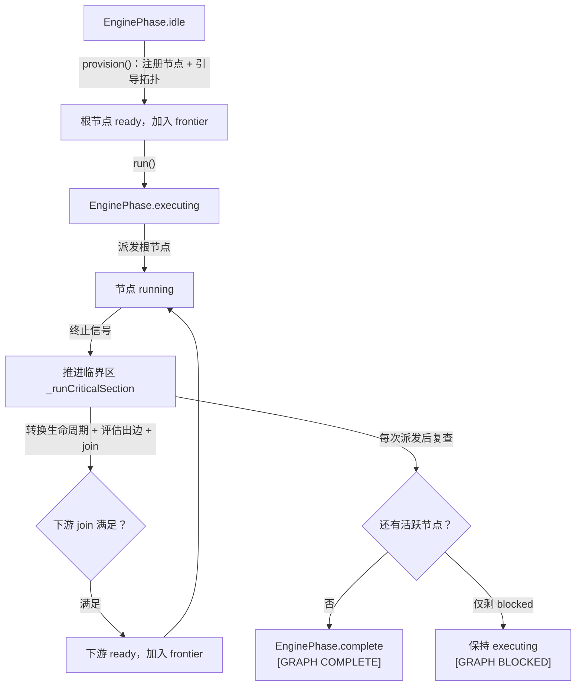

# 运行时行为（Runtime Behavior）

图声明通过校验后进入**运行时**阶段：一个运行时对象持有该图的全部状态，按节点发出的信号推进，把关键状态写盘，并在进程崩溃后接着跑。本页讲**时序**——一次执行按什么顺序发生什么、每个节点状态只能从哪里来、到哪里去。

引擎的静态模型（图的结构、运行时对象与状态字段、各子系统职责）在[图执行引擎](/04-Advanced/graph-engine)；把图搭起来并跑起来的操作步骤在[图工作流](/02-Guide/graph-workflows)；工具参数表在[编排工具](/03-Reference/tools/orchestration-tools)。本页不重复这三者的内容。

> 前置：[图执行引擎](/04-Advanced/graph-engine)｜相关：[图声明](/04-Advanced/graph-declaration)、[信号系统](/04-Advanced/signal-system)

## 1. 一次执行的时序总览

`createEngine()` 构造运行时但不派发任何东西；`provision()` 注册节点并引导拓扑；`run()` 把阶段从 `idle` 推到 `executing` 并派发根节点。此后引擎**不再轮询**：每次有节点发出终止信号，就进入一次推进临界区——转换生命周期、评估出边与 join、派发新的就绪节点，并在每次派发后复查终止条件。



两条旁路进的是同一个运行时：`recover()` 从磁盘上的持久化状态接续中断的执行；`adoptPrior()` 把先前一次运行的逐节点进度采纳进**新建**的运行时（工具层每次构建步骤之后都会重建引擎）。两者都不重复派发已经推进过的节点。

## 2. NodeStatus 状态机

9 个状态共享一张转换表（词汇表见[图执行引擎](/04-Advanced/graph-engine)）。合法性是 `(from, to)` 的纯函数，不读 `agent` / `prompt` / `needs_approval`；实现在 `src/graph/engine/node-lifecycle.ts`：

| `from` | 允许的 `to` |
|----------|---------------|
| `pending` | `ready`、`cancelled`、`escalate` |
| `ready` | `running`、`cancelled`、`escalate` |
| `running` | `completed`、`escalate`、`timeout`、`cancelled`、`blocked` |
| `completed` | `done`、`ready`、`escalate` |
| `blocked` | `completed`、`ready`、`escalate` |
| `timeout` | `done` |
| `escalate` | `done`、`ready` |
| `cancelled` | `done` |
| `done` | ——（终态，无） |

```text
正常路径：  pending → ready → running → completed → done
暂停路径：  running → blocked → completed（批准）/ ready（拒绝后携带反馈重入）
错误路径：  running → escalate → done，或 escalate → ready（自动重试）
            running → timeout → done
取消路径：  pending / ready / running → cancelled → done
级联路径：  pending → escalate（被上游升级波及、从未启动的节点）
```

两条**非顺序**边值得单独记住：

- `completed → ready` 是**循环组重入边**：收敛节点发出 `revise_needed` 且带修订内容时，失败的上游节点重新进入 `ready`，并受循环组 `max_traversals` 计数约束。
- `completed → escalate` 是**修订上限边**：评审节点完成了一轮 `revise_needed` 但循环组遍历额度已耗尽时，改为升级而不是继续循环。

状态转换与记账是同一次操作：`transitionNode()` 先断言合法性，再写入与状态耦合的字段——`ready → running` 递增 `sessionsSpawned`、写入派发任务 / 会话 ID 与 `startedAt`；任何 `→ completed` 写入 `completedAt` 与结果引用；每次状态变更都标记脏位并自动记录一份生命周期检查点。

## 3. 推进临界区：无轮询的推进

一次推进按固定顺序走完五步（`src/graph/engine/engine-advance.ts`）：

1. 转换本次终止节点的生命周期。
2. 评估出边（`always` / `on_signal`，`on_condition` 交给条件解析器）。
3. 检查下游扇入的 join。
4. 把满足条件的下游入队（加入前沿）。
5. 派发就绪节点。

整个过程运行在 `_advancing` 临界区内（`EngineState.advancingLock`）：同一时刻每个图实例只允许一个推进过程。**临界区持锁期间到达的信号不会丢失**——它们被排入 `pendingCompletions`，待当前临界区退出后在新的临界区中排空重放。锁与队列原语（`acquireAdvancingLock()` / `releaseAdvancingLock()` / `queuePendingCompletion()` / `drainPendingCompletions()`）都在 `src/graph/engine/engine-state.ts`。

一个已知的观测窗口：`status()` 是同步取的快照，**不获取推进锁**，因此临界区进行中读取快照时，看到的可能是该次推进的中间态而不是静止态。

## 4. 信号 → 生命周期：映射与时序

调度任务结束时，引擎把它映射成信号；映射是**共享的单一实现**，实时派发缝与恢复路径用的是同一份（`mapDispatchStatusToSignal()`，`src/graph/engine/engine-recovery.ts`）：

| 调度任务结局 | 引擎信号 |
|--------------|----------|
| `completed` | `answer` |
| `error` | `escalate`（携带任务错误） |
| `timeout` | `escalate` |
| `cancelled` | 无终止信号（节点直接取消） |

终止信号把节点推向终局（`answer` 使节点进入 `completed`，`escalate` 使节点进入 `escalate`；`revise_needed` 先完成评审节点自身，再由回边重开上游）；暂停信号（`need_approval` / `blocked` / `need_clarification`）把节点推入 `blocked`；同一次运行记录了多个终止信号时，按最坏严重度择一：`escalate` > `revise_needed` > `answer`。

循环组成员的终止信号不直接走上面的路径，而是先经过 `executeLoopStep()`（`src/graph/engine/loop-group-executor.ts`）的**合并收敛决策**：它协调遍历计数、revise 重派发、升级级联与上游取消，并返回六种结局之一——`converged` / `revising` / `stuck` / `max_traversals_exhausted` / `escalating` / `ignored`。上限耗尽或停滞退出时携带结构化升级载荷（`reason`、尽力抽取的未解决项、退出时的遍历计数）。

## 5. join 评估

**扇入**的判定入口是 `evaluateJoin(state, node)`（`src/graph/engine/join-evaluator.ts`）。它把每个上游按已记录的信号分入三桶：`answer` 计成功，任何非 `answer` 的终止信号计失败，尚无载荷的计待定；然后按策略给出三态结论 `JoinVerdict`：`satisfied` / `failed` / `waiting`。

| 策略 | 满足条件 | 失败条件 |
|------|----------|----------|
| 无上游边 | 图根节点，立即满足 | —— |
| `all` | 每个上游都记录 `answer` | 任一上游记录非 `answer` 终止信号 |
| `any` | 第一个上游 `answer` 到达 | 所有上游都在任何 `answer` 之前发出非 `answer` 终止信号 |
| `quorum:N` | `answer` 计数 ≥ N | `answer + pending < N`（配额已不可能达成） |

两条时序细节：循环组**首轮**（`traversalCount === 0`）会从上游集合中排除 `revise_needed` 回边，让入口节点的 join 只靠外部上游即可满足，后续轮次与非循环节点计入全部上游；`joinSatisfied()` 是同一评估的布尔投影（仅 `satisfied` 为真），结果缓存到节点运行状态供调用方免于重复推导拓扑。

## 6. revise 与 escalate 的传播时序

**revise 传播**（`propagateRevise()`，`src/graph/engine/signal-propagation.ts`）按固定顺序处理收敛节点发出的 `revise_needed`：

1. 节点不属于任何循环组 → 直接升级，原因为 `no loop group`。
2. **停滞早退**：连续两次收敛输出指纹相同，说明评审无法推进 → 以 `stuck` 置为 `done`。
3. **遍历计数**：递增循环组遍历计数失败（已达 `max_traversals`）→ 以 `max_traversals exhausted` 置为 `done`。
4. 否则沿 `on_signal(revise_needed)` 回边，把**同一循环组内**、且可由 `ready` 到达的上游节点重新标记 `ready` 并加入前沿，同时把修订反馈并入其重执行提示。

**escalate 传播**（`propagateEscalate()`）先过**重试闸门**：有效重试额度取三个来源的最大值——节点自身 `budget.max_retries`、任一出边 `retry.max`、任一入边 `retry.max`。额度尚有余额时递增 `retryCount`、把上一次失败原因并入提示、重新标记 `ready` 并加入前沿；若限定重试边声明了 `backoff_ms`，则把重新派发推迟到 `now + backoff_ms`（写入 `retryBackoffUntil`）。

额度用尽则沿出边做 BFS：单输入节点是透明直通；遇到第一个多输入扇入节点就把 `escalate` 记为上游结果并重新评估其 join——`failed` 则该汇聚节点也升级并继续前推；`satisfied` / `waiting` 表示部分失败被吸收（`any` / `quorum` 仍可推进），该分支停止。升级到达无出边的汇点，表示已到尽头。

## 7. 级联取消时序

`cancelPendingUpstreams(state, node, joinVerdict, dispatchPort?)`（`src/graph/engine/cascade-canceller.ts`）是扇入的**自动回收半边**：汇聚节点的 join 一旦判定完成，不再可能影响结果的上游就被退掉。

- `waiting` → 严格空操作，不取消任何节点。
- `satisfied` / `failed` → 逐个回收尚未产出载荷的上游：生命周期走 `running | ready | pending → cancelled → done`，并从前沿移除；有派发缝且节点带派发任务 ID 时，以 fire-and-forget 方式取消派发任务（永不等待确认）。
- 已经记录过载荷的上游（`answer` / `escalate` / `revise_needed`）报为 `alreadyResolved` 并原样保留，其部分失败信号继续供下游诊断使用。
- **共享上游守卫**：若某上游仍被另一个 join 未决（`waiting`）的兄弟汇聚节点需要，则跳过它，避免饿死兄弟节点。

上面这条路径只回收**上游**；取消一整张图或指定节点走的是另外两个入口——`cancel()`（整图，阶段推进到 `complete`，`blocked` 节点留给人工）与 `cancelNodes()`（局部，`cascade` 时级联到传递下游，不触碰阶段）。

## 8. 审批门与预算：运行时检查

声明了 `needs_approval` 的节点派发后进入 `blocked`。这是一个**暂停标志**：引擎停下该节点下游子图的推进，并按会话链向上发出 `[GRAPH BLOCKED]` 提示，等待人工决策。决策通过 `graph_approve` 工具进入：

| 决策 | 转换 | 效果 |
|------|------|------|
| 批准 `approve` | `blocked → completed` | 记录 `answer` 信号并激活前向 `answer` 边 |
| 拒绝 `reject` | `blocked → ready` 或 `blocked → escalate` | 有循环组可重开则携带反馈重入，否则升级 |
| 部分批准 | 分支级 | 接受 `approved` 上游、取消 `rejected` 分支的传递依赖，被拒上游重入 `ready` |

拒绝反馈的重执行提示合并由 `mergeRejectionFeedback()` 完成（`src/graph/engine/approval-handler.ts`）。对已经解决的节点再次调用 `graph_approve` 是**真正的空操作**：不派发就绪前沿、不复查终止，并如实返回 `applied=false`。

**预算检查有两个粒度。** `checkGraphBudget(graphId, state)` 是两层检查：先委托 `BudgetTracker.isRequestBudgetExceeded(graphId)`（图 ID 即请求作用域），再对照图声明自身的 `max_total_input_tokens` / `max_total_output_tokens` / `max_total_cost_usd` 比较累计计数器（`>=` 即越界），返回第一个越界项。`checkNodeBudget()` 是派发前的逐节点预检，对照节点声明的上限与节点累计用量。图级越界会让就绪节点升级并取消被搁置的 `pending` 节点，使图能到达 `complete` 而不是挂死；用量在任务终止时累计进预算总额。

一个容易误解的字段：未声明预算时，`state.budget.sessionsSpawned` 只是净值展示计数器，**永不**作为闸门。

## 9. 终止复查与通知

每次派发过程结束后，引擎复查一次终止（`_checkTermination()` → `checkGraphTermination()`，`src/graph/engine/engine-termination.ts`），只有三种结局：

1. 不再有活跃节点（无 `running` / `ready` / `pending` / `blocked`）→ 阶段 `executing → complete`，发出 `isBlocked=false` 的终止事件，提示为 `[GRAPH COMPLETE]`。
2. 不再有**调度活跃**节点（无 `running` / `ready` / `pending`）但仍有 ≥1 个 `blocked` → 发出 `isBlocked=true` 的终止事件，**但不做阶段转换**：图保持 `executing` 等待人工，提示为 `[GRAPH BLOCKED]`。
3. `pending` 节点**不是**调度活跃节点：它只等上游结果，自身永远无法推进图。

终止事件按状态分别计数（`completed` / `done` / `cancelled` / `escalate` / `timeout` / `blocked` / `running`），其中 `done` 与 `cancelled` 单独成桶，避免被取消或循环上限退场的节点被当成成功。两类终止事件各有两层去重——每次运行实例的标记加持久化的 `terminalNotified`——保证每轮至多通知一次。

## 10. 持久化、恢复与平台差异

| 文件 | 路径 | 说明 |
|------|------|------|
| 引擎状态 | `.rolebox/state/engine-{slug}.json` | 单个图的持久化状态（阶段、节点生命周期、预算、前沿、循环组、检查点）；slug 由 `engineStateSlug()` 从 `graphId` 提取 |
| 事件日志 | `.rolebox/state/graph-events-{hash}.ndjson` | 引擎写侧事件的追加式 NDJSON 日志（节点派发、终止转换、阶段变化、预算更新） |

持久化格式带版本号（`ENGINE_PERSISTENCE_VERSION = 2`）；序列化、反序列化与容错加载分别是 `serializeEngineState()` / `deserializeEngineState()` / `loadEngineStateFromJson()`；版本不匹配的文件不会被加载。写盘分两级（`src/graph/engine/engine-persistence.ts`）：

- **关键写（同步）**：节点生命周期、阶段、前沿、检查点、审批状态等关键变更立即同步落盘；`save()` 是原子写（临时文件 + rename），失败时返回 `false` 且**从不抛错**，调用方据此保留脏标记以便下次重试。
- **非关键写（防抖）**：信号台账历史、预算 / 逐节点用量计数等非关键变更走 `scheduleSave()`，`500 ms` 防抖合并为一次写；到达终止阶段时由 `flush()` 强制排空。
- 被替换或丢弃的运行时调用 `dispose()`：**取消**防抖并丢弃待写内容，绝不把陈旧状态刷到后继运行时的状态文件上。

进程崩溃后持久化状态仍在，但内存中的派发监听与推进临界区都已消失。重启后 `recover()` 按四步走：

1. 加载持久化状态。
2. 把每个 `running` 节点与调度系统对账：任务已消失 → `timeout`；任务在重启窗口内完成 → 重发其终止信号；任务仍存活 → 重新订阅其终止监听。
3. 由所有 `ready` 节点重建前沿。
4. 排空窗口期内推迟的完成事件。

相关原语包括 `reconcileEngine()`、`hydrateEngineState()`、`adoptPriorNodeStates()` 与陈旧临界区清理 `clearStaleCriticalSection()`（都在 `src/graph/engine/engine-recovery.ts`）。插件启动时还有一次**恢复扫掠**（`recoverInterruptedGraphs()`，`src/graph/engine/engine-startup.ts`）：扫描 `.rolebox/state/engine-*.json`，跳过阶段已是 `complete` 的图，对其余每个图构建引擎并等待恢复；逐图 try/catch，单个损坏文件绝不中断整轮扫掠。

**平台差异。** 在 opencode 平台上引擎完全在内存中运行：状态从不写入 `engine-*.json`，也没有持久化的事件日志，图生命周期与创建它的进程同生共死（契约见 `src/graph/tools/live-state.ts`）；dsh / Pi 走上面的磁盘持久化路径。

## 11. 每轮 graph_state 提示块

> 自 v1.8.0 起，引擎每轮向系统提示注入 `<graph_state>` 定向块，取代 v1 的旧状态注入块。

`buildEngineGraphStateBlock(states)` 是一个**纯渲染器**（`src/graph/engine/graph-state-block.ts`）：它接收引擎状态快照列表，只渲染实际存在的字段，回答「我在工作流的哪一步、下一步跑什么」。没有活动图时返回空字符串，调用方视作干净的空操作，提示里不会留下孤立标签。

```xml
<graph_state>
  <graph id="review-loop-1737000000000-1" phase="executing">
    <name>review-loop</name>
    <active_nodes>reviewer</active_nodes>
    <pending_nodes>writer, critic</pending_nodes>
    <loop_groups>
      <loop id="writer-critic" traversals="1/3" />
    </loop_groups>
    <blocked_nodes>
      <node id="gate" needs_approval="true">awaiting human approval</node>
    </blocked_nodes>
  </graph>
</graph_state>
```

- 数据来源是 `GraphToolSet.liveEngineStates()`：按注册顺序快照工具集内存注册表中的每个运行时（经 `EngineRuntime.status()`，因此是克隆副本）。
- `<active_nodes>` 收集 `running` 节点；`<pending_nodes>` 收集 `pending` 与 `ready` 节点。
- `<loop_groups>` 仅在存在循环组时出现，逐组给出 `traversals="已用/上限"`。
- `<blocked_nodes>` 仅在存在 `blocked` 节点时出现，正文是该节点的错误原因，缺省为 `awaiting human approval`，并带 `needs_approval` 属性。
- 图名与 ID 由用户 / 声明控制，渲染时转义 `&`、`<`、`>`、`"` 四类字符。
- 注入点是 `system.transform` 钩子（`src/hooks/system-transform.ts`）：每轮解析一次，非空时推入系统提示。

## 12. turn-end 决策管线（Copilot）

除图运行时之外，rolebox 在 `session.idle` 上还有一条**收尾决策**管线（`src/hooks/event-handler.ts` 触发）：一轮对话结束时决定「是否再给模型推一把」。`runTurnEndPipeline()`（`src/copilot/pipeline.ts`）按**严格优先级**依次评估三个来源，且每次 idle 至多注入一次：

| 顺序 | 来源 | 语义 |
|------|------|------|
| 1 | builtin 函数续跑 | 始终先评估；一旦注入即停止 |
| 2 | 用户启发式规则 | 对最后一条助手文本求值：命中 `skip` 即消费本轮（不注入、也不下沉到 LLM）；命中 continue / blocked / done 则注入回复文本并停止 |
| 3 | LLM 角色裁决 | 转录 → 提示 → 裁决；`advance` 注入回复文本，`hand_to_user` 或任何失败都不注入 |

规则语义（`src/copilot/rules.ts`）：按配置顺序求值，**首个命中者胜**；`match.pattern` 是对最后助手文本的正则，`match.contains` 是大小写不敏感子串，两者同时给出时**取与**；非法正则只告警并跳过该条规则，求值**永不抛错**；未命中则下沉到下一个来源。

角色未配置 copilot 或 `copilot.enabled` 为 `false` 时，**只有** builtin 来源运行。LLM 裁决跑在一个全新的子会话上并带硬超时（`max_verdict_timeout_ms` 默认 `30000`），任何失败都跳过。copilot 注入的提示带 `COPILOT_MARKER`（`src/copilot/constants.ts`），因此在 `chat.message` 重入时被归类为**合成注入**：既不重置续跑计数器，也不取消活跃循环。设计上不设注入预算或代码级护栏——破坏性与 HITL（人工在环）的谨慎属于**建议性**提示指引，由角色作者判断掌控。

## 相关页面

- [图执行引擎](/04-Advanced/graph-engine) —— 图、节点、边与子系统职责的静态模型
- [图声明](/04-Advanced/graph-declaration) —— 图文档的字段、校验与序列化
- [图工作流](/02-Guide/graph-workflows) —— 用 `graph_*` 编排团队的任务视角
- [信号系统](/04-Advanced/signal-system) —— 信号类型、台账与 `signal` 工具
- [循环系统](/04-Advanced/loop-system) —— LoopCoordinator 与 `|loop|` 函数
- [工作流模式](/04-Advanced/workflow-patterns) —— 内建拓扑与选型
- [源码索引](/06-Appendix/source-index) —— 概念到模块的总索引
