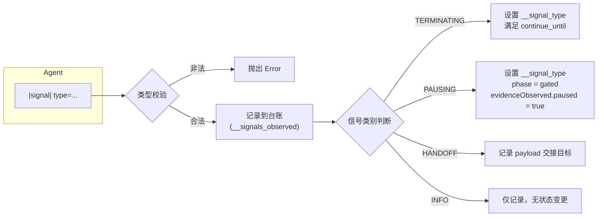
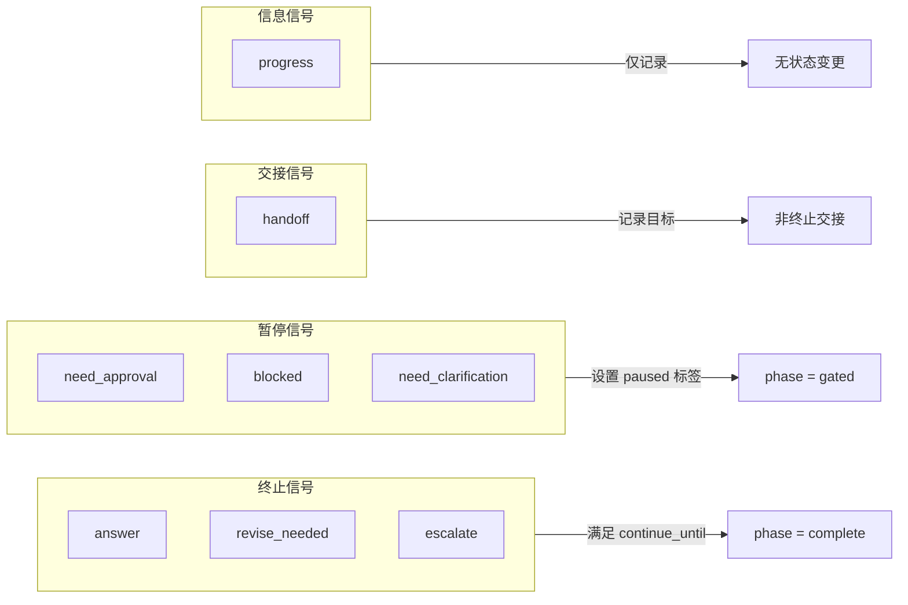
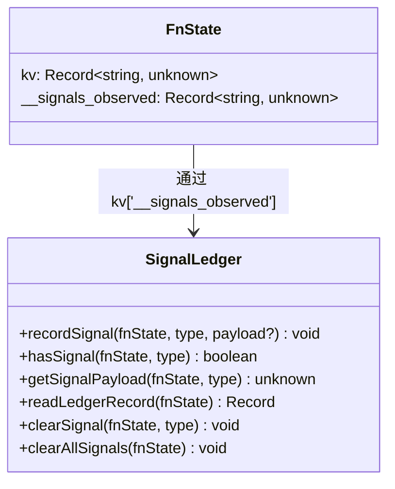
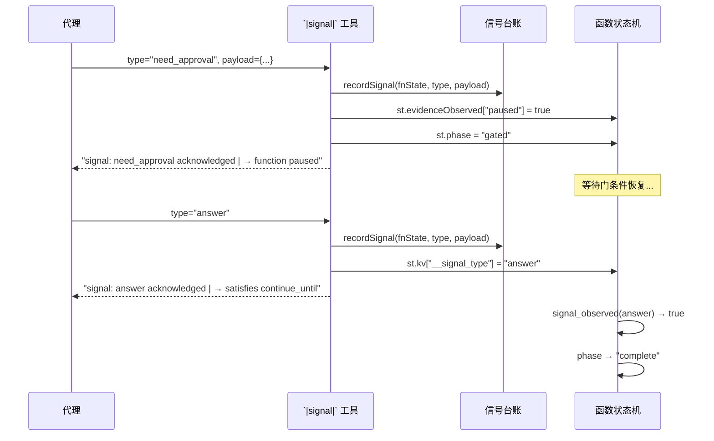

# 信号系统

> **相关文档：** [终止条件](/04-Advanced/termination-conditions) — continue_until 条件和运行时终止评估 | [运行时行为](/04-Advanced/runtime-behavior) — 图状态管理与 FSM 生命周期 | [会话工具](/04-Advanced/session-tools) — 10 工具会话管理套件

信号系统是 rolebox 的通用带外（out-of-band）控制信令机制。代理通过 `|signal|` 工具发出结构化信号，在不嵌入文本内容的前提下表达状态转换意图——包括完成确认、审批请求、交接目标、进度通知和异常升级。

信号系统于 `0.22.0` 版本引入（`CHANGELOG.md:50`），核心实现集中在 `src/signal/` 模块。

---

::: tip 何时使用信号
信号最适合**函数状态机集成**场景——函数可以通过 `signal_observed(type)` 条件监听特定信号类型，在 `gate`、`transitions` 或 `continue_until` 中作为触发条件。例如，让一个函数等待 `need_approval` 信号的批准后才继续执行。详见[条件表达式](/02-Guide/writing-functions#条件表达式)的 `signal_observed` 条目。
:::

## 1. 信号工具总览

`|signal|` 是一个由 `createSignalTool()`（`src/signal/signal-tool.ts:45-146`）创建的通用带外信号工具。其 Zod schema 定义了 8 种有效信号类型和一个可选 payload：

```typescript
// src/signal/signal-tool.ts:52-64
args: {
  type: z.enum([
    "answer",
    "need_approval",
    "blocked",
    "need_clarification",
    "handoff",
    "progress",
    "revise_needed",
    "escalate",
  ]),
  payload: z.record(z.string(), z.unknown()).optional(),
},
```

### 基本用法

```
# 简单完成信号
|signal| type=answer

# 带 payload 的审批请求
|signal| type=need_approval, payload={"reason": "LLM output requires human review"}

# 带目标信息的交接信号
|signal| type=handoff, payload={"target": "reviewer", "context": "analysis complete"}
```

### 执行流程

发出信号后，`createSignalTool().execute()`（`src/signal/signal-tool.ts:65-146`）执行以下操作：

1. **类型校验**：Zod 枚举在解析时已拦截非法类型；`ALL_SIGNAL_TYPES`（行 38-43）提供运行时 guard
2. **台账记录**：遍历所有活跃函数，将信号及其 payload 写入 `FnState.kv` 的 `__signals_observed` 台账
3. **状态变更**：根据信号类型决定是否触发暂停、终止或交接
4. **制品捕获**：若函数的 observe spec 声明了 `capture_payload_as`，将 payload 写入 ArtifactStore



---

## 2. 信号类型分类

四种信号类别根据其对函数状态机的影响不同，从终止执行到仅记录日志，构成一个影响递减的层级：



四种信号类别在 `src/signal/signal-tool.ts:16-43` 中通过 `Set` 常量定义：

| 类别 | 信号类型 | 台账记录 | 状态效果 | 说明 |
|------|----------|----------|----------|------|
| **TERMINATING** | `answer`、`revise_needed`、`escalate` | ✅ | 满足 `continue_until` 条件，下次空闲周期可能触发 `phase="complete"` | 当代理完成任务、需要修改或需要升级时使用（行 16） |
| **PAUSING** | `need_approval`、`blocked`、`need_clarification` | ✅ | `phase = "gated"` + `evidenceObserved["paused"] = true` | 需要人工介入或等待外部输入时使用（行 23） |
| **HANDOFF** | `handoff` | ✅ | 记录在台账中，payload 包含 `target` 或 `subagent` 字段 | 非终止性的交接过渡，不触发完成或暂停条件（行 30） |
| **INFO** | `progress` | ✅ | 无状态变更 | 纯信息型信号，仅用于日志和监控（行 36） |

### 2.1 TERMINATING — 终止信号

终止信号满足 `continue_until` 条件，通过 `signal_observed(…)` 条件评估时返回 `true`。

```typescript
// src/signal/signal-tool.ts:16
const TERMINATING_SIGNALS = new Set(["answer", "revise_needed", "escalate"]);
```

- **`answer`**：代理已完成任务并给出最终答案。最常见的使用场景。
- **`revise_needed`**：代理发现输出需要修订，请求重新进入处理流。
- **`escalate`**：代理遇到无法自行处理的问题，请求升级到更高级别的处理者。

执行时，终止信号会设置 `st.kv["__signal_type"]`（行 86），并在 handler 响应中附带 `→ satisfies continue_until condition` 消息（行 135-136）。

```typescript
// src/signal/signal-tool.ts:135-136
} else if (TERMINATING_SIGNALS.has(type)) {
  parts.push("→ satisfies continue_until condition");
```

### 2.2 PAUSING — 暂停信号

暂停信号将函数状态标记为"已暂停"，等待人工介入或外部条件恢复。

```typescript
// src/signal/signal-tool.ts:23
const PAUSING_SIGNALS = new Set(["need_approval", "blocked", "need_clarification"]);
```

- **`need_approval`**：函数结果需要人工审批后再继续执行。
- **`blocked`**：函数因外部依赖未就绪而阻塞。
- **`need_clarification`**：函数需要用户澄清需求或输入。

暂停信号执行两个关键动作（行 88-92）：

```typescript
// src/signal/signal-tool.ts:89-92
if (PAUSING_SIGNALS.has(type)) {
  st.evidenceObserved["paused"] = true;
  st.phase = "gated";
}
```

- 设置 `evidenceObserved["paused"] = true`：FSM 的条件系统可据此检测暂停
- 设置 `phase = "gated"`：函数被置于门控状态，等待门条件满足后恢复

### 2.3 HANDOFF — 交接信号

交接信号将工作从一个域转交给另一个，但不触发终止或暂停。

```typescript
// src/signal/signal-tool.ts:30
const HANDOFF_SIGNALS = new Set(["handoff"]);
```

交接信号的 payload 应包含交接目标信息。handler 从 `payload["target"]` 或 `payload["subagent"]` 中提取目标（行 138）：

```typescript
// src/signal/signal-tool.ts:137-139
} else if (HANDOFF_SIGNALS.has(type)) {
  const target = payload?.["target"] ?? payload?.["subagent"] ?? "(unspecified)";
  parts.push(`→ handoff to ${target}`);
```

### 2.4 INFO — 通知信号

通知信号仅记录信息，不触发任何状态转换。

```typescript
// src/signal/signal-tool.ts:36
const INFO_SIGNALS = new Set(["progress"]);
```

- **`progress`**：代理汇报阶段性进展。handler 附带 `→ informational (no state transition)` 消息（行 141）。

---

## 3. 信号台账 API

信号台账（Signal Ledger）存储在 `FnState.kv['__signals_observed']` 中，是一个 `Record<string, unknown>` 映射。台账 API 由 `src/signal/signal-ledger.ts` 提供，导出 6 个辅助函数。



### 3.1 recordSignal

写入一条信号记录。信号类型作为键，payload（或 null）作为值。同类型重复写入会**覆盖**之前的 payload。

```typescript
// src/signal/signal-ledger.ts:38-42
export function recordSignal(fnState: FnState, type: string, payload?: unknown): void {
  const ledger = readLedger(fnState);
  ledger[type] = payload !== undefined ? payload : null;
  writeLedger(fnState, ledger);
}
```

### 3.2 hasSignal

检查某类型信号是否已被记录。

```typescript
// src/signal/signal-ledger.ts:51-54
export function hasSignal(fnState: FnState, type: string): boolean {
  const ledger = readLedger(fnState);
  return type in ledger;
}
```

### 3.3 getSignalPayload

获取已记录信号的 payload。当信号不存在时返回 `undefined`。

```typescript
// src/signal/signal-ledger.ts:64-67
export function getSignalPayload(fnState: FnState, type: string): unknown | undefined {
  const ledger = readLedger(fnState);
  return ledger[type];
}
```

### 3.4 readLedgerRecord

返回台账的完整副本，适用于序列化或调试。

```typescript
// src/signal/signal-ledger.ts:72-74
export function readLedgerRecord(fnState: FnState): Record<string, unknown> {
  return { ...readLedger(fnState) };
}
```

### 3.5 clearSignal / clearAllSignals

清理单条或全部信号记录。

```typescript
// src/signal/signal-ledger.ts:82-94
export function clearSignal(fnState: FnState, type: string): void {
  const ledger = readLedger(fnState);
  delete ledger[type];
  writeLedger(fnState, ledger);
}

export function clearAllSignals(fnState: FnState): void {
  fnState.kv[LEDGER_KEY] = {};
}
```

---

## 4. FSM 集成

信号系统与 rolebox 的函数状态机（FSM）通过 `signal_observed` 条件集成。

### 4.1 signal_observed 条件

`signal_observed(type)` 是 FSM 内建命名条件之一，在 `src/function/conditions.ts:57-68` 中定义：

```typescript
// src/function/conditions.ts:57-68
signal_observed: (arg, env) => {
  const raw = env.state.kv["__signals_observed"];
  if (typeof raw === "object" && raw !== null && !Array.isArray(raw)) {
    return arg in (raw as Record<string, unknown>);
  }
  if (Array.isArray(raw)) {
    return (raw as string[]).includes(arg);
  }
  return false;
},
```

该条件读取 `FnState.kv["__signals_observed"]` 台账。支持两种格式：
- **台账格式**（当前版本）：`Record<string, unknown>`，通过 `arg in record` 检查键是否存在
- **旧版格式**（台账迁移前）：`string[]`，通过 `Array.includes(arg)` 检查

### 4.2 在函数定义中使用

条件可在函数的 `gate`、`transitions` 或 `continue_until` 中引用：

```yaml
# 示例：门控条件等待审批信号
gate: signal_observed(answer)

# 示例：转换条件在 escalate 信号触发时激活紧急处理
transitions:
  - when: signal_observed(escalate)
    activate: [emergency-handler]
```

### 4.3 信号与 continue_until 的配合示例

以下是一个完整的实际示例，展示如何将信号类型与 `continue_until` 条件配合使用，实现"审批-执行"的工作流模式。

```yaml
# 函数定义：awaiting-approval（等待审批）
---
name: awaiting-approval
description: 提交审批请求，等待人工确认后继续
continue_until: signal_observed(answer)
gate: signal_observed(answer)      # 只有收到 answer 信号才通过门控
observe:
  - tool: signal                    # 观察信号工具的调用
    capture_payload_as: approval-data  # 自动捕获审批 payload 到 Artifact
---
```

```yaml
# 函数定义：emergency-escalate（紧急升级）
---
name: emergency-escalate
description: 遇到不可处理问题时升级并终止
continue_until: signal_observed(escalate)
transitions:
  - when: signal_observed(escalate) # escalate 信号触发紧急处理
    activate: [emergency-handler]
---
```

执行流程：

```
# 第 1 步：代理需要审批，发出暂停信号
|signal| type=need_approval, payload={"reason": "修改涉及生产环境"}
# → 函数进入 gated 状态，等待 signal_observed(answer)
# → phase = "gated", evidenceObserved["paused"] = true

# ... 用户审查后批准 ...

# 第 2 步：用户或自动化流程发出 answer 信号
|signal| type=answer, payload={"approved": true}
# → signal_observed(answer) → true
# → 满足 continue_until 条件 → phase = "complete"
# → 函数自然完成

# 第 3 步：如遇不可处理的问题，发出 escalate 信号
|signal| type=escalate, payload={"reason": "需要架构师决策"}
# → 触发 transitions 中 emergency-handler 的激活
# → 也满足 continue_until 条件
```

**配合规则：**
- `TERMINATING` 信号（`answer` / `revise_needed` / `escalate`）满足 `signal_observed(...)` 条件，适合放在 `continue_until` 中作为正常退出条件
- `PAUSING` 信号（`need_approval` / `blocked` / `need_clarification`）不满足终止条件，适合放在 `gate` 中等待恢复
- `HANDOFF` 和 `INFO` 信号不触发任何 FSM 状态变更，适合不打断执行流程的通知场景

条件实现在 `src/function/conditions.ts:57-68` 中——`signal_observed(arg, env)` 检查 `FnState.kv["__signals_observed"]` 台账中是否存在指定类型。

### 4.4 完整的信号-FSM 交互流程



---

## 5. 信号类型与状态效果对照表

| 信号类型 | 台账 key | payload 覆盖语义 | 证据标签 | phase 变化 | 满足 continue_until |
|----------|----------|------------------|----------|------------|---------------------|
| `answer` | `answer` | 覆盖 | — | — | ✅ |
| `revise_needed` | `revise_needed` | 覆盖 | — | — | ✅ |
| `escalate` | `escalate` | 覆盖 | — | — | ✅ |
| `need_approval` | `need_approval` | 覆盖 | `paused` | → `gated` | ❌ |
| `blocked` | `blocked` | 覆盖 | `paused` | → `gated` | ❌ |
| `need_clarification` | `need_clarification` | 覆盖 | `paused` | → `gated` | ❌ |
| `handoff` | `handoff` | 覆盖 | — | — | ❌ |
| `progress` | `progress` | 覆盖 | — | — | ❌ |

> **注意：** 台账使用"后写入覆盖"策略（`src/signal/signal-ledger.ts:29-30`）。同信号类型的后续调用会覆盖之前的 payload。台账的键名与信号类型名一致。

---

## 6. 制品捕获集成

当观察（observe）规范声明了信号工具的 `capture_payload_as` 时，信号工具会在台账记录之外，将 payload 以 JSON 字符串形式写入 ArtifactStore（`src/signal/signal-tool.ts:101-122`）：

```typescript
// src/signal/signal-tool.ts:112-116
for (const obs of fn.observe ?? []) {
  if (obs.capture_payload_as && obs.tool === "signal") {
    artifacts.write(sessionID, obs.capture_payload_as, JSON.stringify(payload));
  }
}
```

此路径覆盖两种场景：
1. **标准 observe 流程**：框架标准的观察触发链路（通过 observe 系统执行）
2. **直接工具调用**：当 observe 系统可能未触发时，信号工具自身承担写入责任

---

## 7. 可观测性与调试

信号的所有操作都通过 `createSubLogger("signal-tool")`（`src/signal/signal-tool.ts:9`）记录结构化日志：

```typescript
// src/signal/signal-tool.ts:97
log.debug("signal recorded", { fnName, type, phase: st.phase });
```

无活跃函数时的信号执行返回提示信息：

```typescript
// src/signal/signal-tool.ts:126-128
if (fnCount === 0) {
  return `signal: ${type} acknowledged (no active functions)`;
}
```

---

## 引用索引

| 引用 | 文件 | 行号 |
|------|------|------|
| 信号工具入口 | `src/signal/signal-tool.ts` | 45-146 |
| TERMINATING 集合 | `src/signal/signal-tool.ts` | 16 |
| PAUSING 集合 | `src/signal/signal-tool.ts` | 23 |
| HANDOFF 集合 | `src/signal/signal-tool.ts` | 30 |
| INFO 集合 | `src/signal/signal-tool.ts` | 36 |
| ALL_SIGNAL_TYPES | `src/signal/signal-tool.ts` | 38-43 |
| Zod schema | `src/signal/signal-tool.ts` | 52-64 |
| 暂停信号处理 | `src/signal/signal-tool.ts` | 88-92 |
| 制品捕获 | `src/signal/signal-tool.ts` | 101-122 |
| signal_observed 条件 | `src/function/conditions.ts` | 57-68 |
| 台账记录函数 | `src/signal/signal-ledger.ts` | 38-42 |
| 台账检查函数 | `src/signal/signal-ledger.ts` | 51-54 |
| 台账查询函数 | `src/signal/signal-ledger.ts` | 64-67 |
| 台账清除函数 | `src/signal/signal-ledger.ts` | 82-94 |
| Changelog 引入记录 | `CHANGELOG.md` | 50 |

---

## 下一步

- [终止条件](/04-Advanced/termination-conditions) — continue_until 条件和运行时终止评估
- [运行时行为](/04-Advanced/runtime-behavior) — 图状态管理与 FSM 生命周期
- [会话工具](/04-Advanced/session-tools) — 会话管理套件
- [记忆系统](/04-Advanced/memory-system) — 跨会话持久记忆
