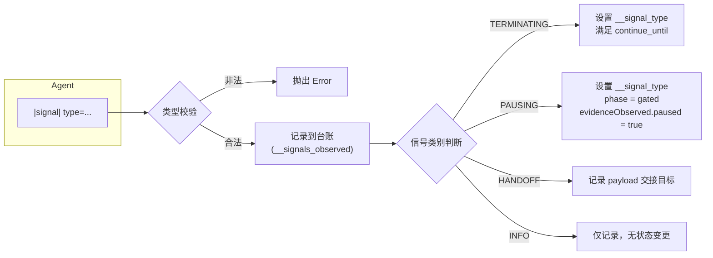
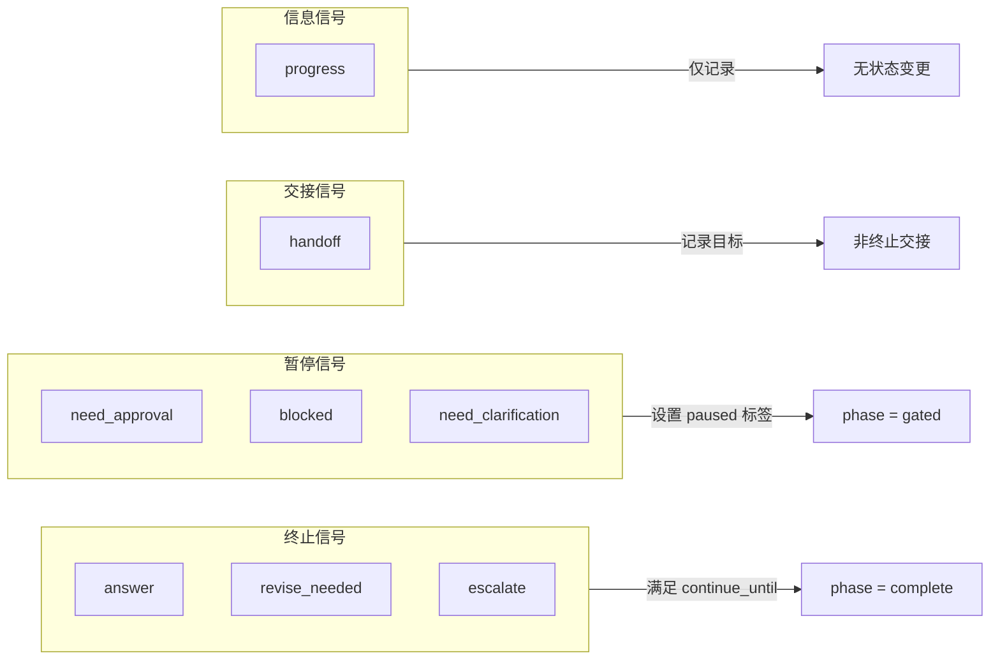
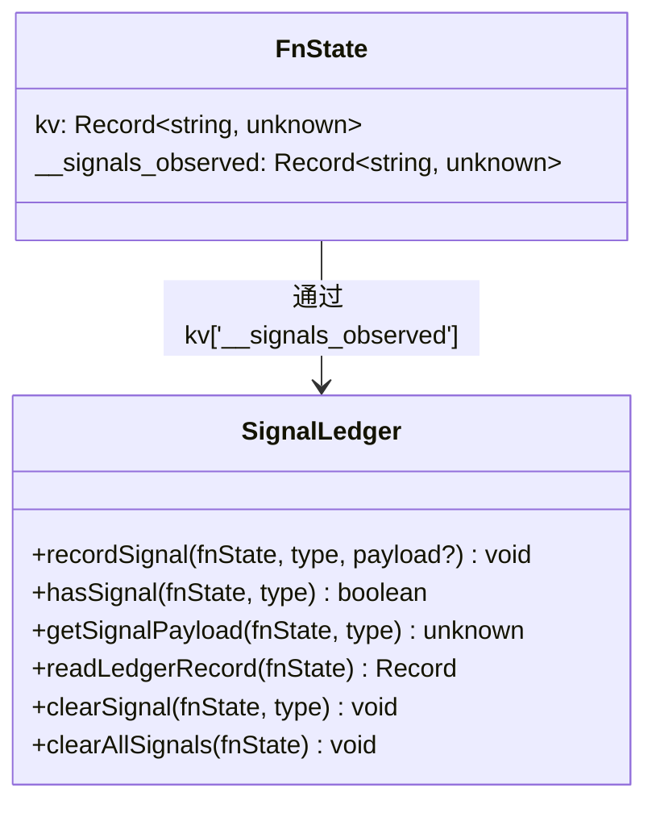
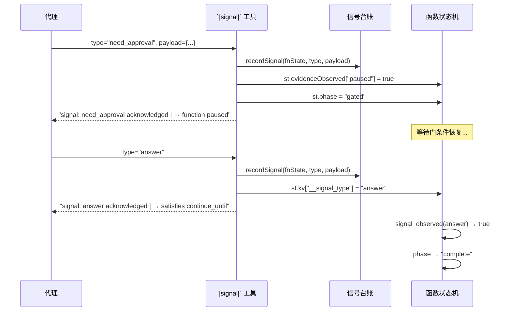

# 信号系统

> **相关文档：** [终止条件](/04-Advanced/termination-conditions) — continue_until 条件和运行时终止评估 | [运行时行为](/04-Advanced/runtime-behavior) — 图状态管理与 FSM 生命周期 | [会话工具](/04-Advanced/session-tools) — 10 工具会话管理套件

信号系统是 rolebox 的通用带外（out-of-band）控制信令机制。代理通过 `|signal|` 工具发出结构化信号，在不嵌入文本内容的前提下表达状态转换意图——包括完成确认、审批请求、交接目标、进度通知和异常升级。

信号系统于 `0.22.0` 版本引入（历史引入标记，`CHANGELOG.md:187`；当前版本为 `1.0.0`），核心实现集中在 `src/signal/` 模块。

---

::: tip 何时使用信号
信号最适合**函数状态机集成**场景——函数可以通过 `signal_observed(type)` 条件监听特定信号类型，在 `gate`、`transitions` 或 `continue_until`（一个终止/继续条件：持续执行直到某条件满足）中作为触发条件。例如，让一个函数等待 `need_approval` 信号的批准后才继续执行。详见[条件表达式](/02-Guide/writing-functions#条件表达式)的 `signal_observed` 条目。
:::

## 1. 信号工具总览

`|signal|` 是一个由 `createSignalTool()`（`src/signal/signal-tool.ts:14-124`）创建的通用带外信号工具。其 Zod schema 定义了 8 种有效信号类型和一个可选 payload：

```typescript
// src/signal/signal-tool.ts:21-33
args: {
  type: z.enum([
    "answer",
    "need_approval",
    "blocked",
    "need_clarification",
    "handoff",
    "progress",
    "revise_needed",
    "escalate",
  ]),
  payload: z.record(z.string(), z.unknown()).optional(),
},
```

### 基本用法

```
# 简单完成信号
|signal| type=answer

# 带 payload 的审批请求
|signal| type=need_approval, payload={"reason": "LLM output requires human review"}

# 带目标信息的交接信号
|signal| type=handoff, payload={"target": "reviewer", "context": "analysis complete"}
```

### 执行流程

发出信号后，`createSignalTool().execute()`（`src/signal/signal-tool.ts:34-122`）执行以下操作：

1. **类型校验**：Zod 枚举在解析时已拦截非法类型（`signal-tool.ts:21-33`）；`ALL_SIGNAL_TYPES`（`src/signal/signal-constants.ts:51-56`，在 `signal-tool.ts:12` 导入）提供运行时 guard（`signal-tool.ts:44-46`）
2. **会话级台账记录**：先将信号写入会话级信号台账（台账：按会话或函数记录的信号写入记录；`sessionSignalLedger.record`，`signal-tool.ts:39`）——该台账按 `sessionID` 键控，独立于函数激活，用于跨函数的终止 / HITL（人工在环，Human-in-the-loop：执行到需要人工确认处暂停，等人批准）信号查询
3. **函数级台账记录**：遍历所有活跃函数，将信号及其 payload 写入每个 `FnState.kv` 的 `__signals_observed` 台账（`signal-tool.ts:53-59`）
4. **状态变更**：根据信号类型决定是否触发暂停、终止或交接（`signal-tool.ts:61-69`）
5. **制品捕获**：若函数的 observe spec 声明了 `capture_payload_as`，将 payload 写入 ArtifactStore（`signal-tool.ts:77-99`）


```mermaid
flowchart LR
  subgraph Agent
    A["`|signal| type=...`"]
  end
  A --> B{类型校验}
  B -->|非法| C["抛出 Error"]
  B -->|合法| D["记录到台账<br/>(__signals_observed)"]
  D --> E{信号类别判断}
  E -->|TERMINATING| F["设置 __signal_type<br/>满足 continue_until"]
  E -->|PAUSING| G["设置 __signal_type<br/>phase = gated<br/>evidenceObserved.paused = true"]
  E -->|HANDOFF| H["记录 payload 交接目标"]
  E -->|INFO| I["仅记录，无状态变更"]
```

---

## 2. 信号类型分类

四种信号类别根据其对函数状态机的影响不同，从终止执行到仅记录日志，构成一个影响递减的层级：


```mermaid
flowchart LR
    subgraph Terminating[终止信号]
        TA[answer]
        TR[revise_needed]
        TE[escalate]
    end
    subgraph Pausing[暂停信号]
        PN[need_approval]
        PB[blocked]
        PC[need_clarification]
    end
    subgraph Handoff[交接信号]
        HH[handoff]
    end
    subgraph Info[信息信号]
        IP[progress]
    end

    Terminating -->|满足 continue_until| C[phase = complete]
    Pausing -->|设置 paused 标签| P[phase = gated]
    Handoff -->|记录目标| H[非终止交接]
    Info -->|仅记录| I[无状态变更]
```

四种信号类别在 `src/signal/signal-constants.ts` 中通过 `Set` 常量定义（`TERMINATING_SIGNALS:39`、`PAUSING_SIGNALS:42`、`HANDOFF_SIGNALS:45`、`INFO_SIGNALS:48`，汇总 `ALL_SIGNAL_TYPES:51-56`）：

| 类别 | 信号类型 | 台账记录 | 状态效果 | 说明 |
|------|----------|----------|----------|------|
| **TERMINATING** | `answer`、`revise_needed`、`escalate` | ✅ | 满足 `continue_until` 条件，下次空闲周期可能触发 `phase="complete"` | 当代理完成任务、需要修改或需要升级时使用（`signal-constants.ts:39`） |
| **PAUSING** | `need_approval`、`blocked`、`need_clarification` | ✅ | `phase = "gated"` + `evidenceObserved["paused"] = true`；`blocked` 额外设置超时 | 需要人工介入或等待外部输入时使用（`signal-constants.ts:42`） |
| **HANDOFF** | `handoff` | ✅ | 记录在台账中，payload 包含 `target` 或 `subagent` 字段 | 非终止性的交接过渡，不触发完成或暂停条件（`signal-constants.ts:45`） |
| **INFO** | `progress` | ✅ | 无状态变更 | 纯信息型信号，仅用于日志和监控（`signal-constants.ts:48`） |

### 2.1 TERMINATING — 终止信号

终止信号满足 `continue_until` 条件，通过 `signal_observed(…)` 条件评估时返回 `true`。

```typescript
// src/signal/signal-constants.ts:39
const TERMINATING_SIGNALS = new Set<string>(["answer", "revise_needed", "escalate"]);
```

- **`answer`**：代理已完成任务并给出最终答案。最常见的使用场景。
- **`revise_needed`**：代理发现输出需要修订，请求重新进入处理流。
- **`escalate`**：代理遇到无法自行处理的问题，请求升级到更高级别的处理者。

执行时，终止信号会设置 `st.kv["__signal_type"]`（`signal-tool.ts:59`），并在 handler 响应中附带 `→ satisfies continue_until condition` 消息（`signal-tool.ts:112-113`）。

```typescript
// src/signal/signal-tool.ts:112-113
} else if (TERMINATING_SIGNALS.has(type)) {
  parts.push("→ satisfies continue_until condition");
```

### 2.2 PAUSING — 暂停信号

暂停信号将函数状态标记为"已暂停"，等待人工介入或外部条件恢复。

```typescript
// src/signal/signal-constants.ts:42
const PAUSING_SIGNALS = new Set<string>(["need_approval", "blocked", "need_clarification"]);
```

- **`need_approval`**：函数结果需要人工审批后再继续执行。
- **`blocked`**：函数因外部依赖未就绪而阻塞。
- **`need_clarification`**：函数需要用户澄清需求或输入。

暂停信号执行关键动作（`signal-tool.ts:61-69`）：

```typescript
// src/signal/signal-tool.ts:62-68
if (PAUSING_SIGNALS.has(type)) {
  st.evidenceObserved["paused"] = true;
  st.phase = "gated";
  if (type === "blocked") {
    st.blockedAt = Date.now();
    st.blockedTimeoutMs ??= 120_000; // default 2 min if not configured
  }
}
```

- 设置 `evidenceObserved["paused"] = true`：FSM（有限状态机，Finite State Machine）的条件系统可据此检测暂停
- 设置 `phase = "gated"`：函数被置于门控状态，等待门条件满足后恢复
- **`blocked` 信号的超时处理**：`signal-tool.ts:65-68` 在发出 `blocked` 时记录 `blockedAt` 时间戳，并默认设置 `blockedTimeoutMs = 120_000`（2 分钟）。若函数长时间停留在 gated 状态，事件处理 hook 会执行"有界兜底"（bounded backstop，`src/hooks/event-handler.ts:146-164`）：当 `Date.now() - blockedAt > blockedTimeoutMs` 时强制解除阻塞（`phase = "active"`、清除 paused 标签与 `blockedAt`），使下一个空闲周期重新评估 `continue_until`，避免编排器被永久挂起。

### 2.3 HANDOFF — 交接信号

交接信号将工作从一个域转交给另一个，但不触发终止或暂停。

```typescript
// src/signal/signal-constants.ts:45
const HANDOFF_SIGNALS = new Set<string>(["handoff"]);
```

交接信号的 payload 应包含交接目标信息。handler 从 `payload["target"]` 或 `payload["subagent"]` 中提取目标（`signal-tool.ts:115`）：

```typescript
// src/signal/signal-tool.ts:114-116
} else if (HANDOFF_SIGNALS.has(type)) {
  const target = payload?.["target"] ?? payload?.["subagent"] ?? "(unspecified)";
  parts.push(`→ handoff to ${target}`);
```

### 2.4 INFO — 通知信号

通知信号仅记录信息，不触发任何状态转换。

```typescript
// src/signal/signal-constants.ts:48
const INFO_SIGNALS = new Set<string>(["progress"]);
```

- **`progress`**：代理汇报阶段性进展。handler 附带 `→ informational (no state transition)` 消息（`signal-tool.ts:117-119`）。

---

## 3. 信号台账 API（应用程序接口，Application Programming Interface）

信号台账分两个层级：

- **函数级台账**：存储在 `FnState.kv['__signals_observed']` 中，是一个 `Record<string, unknown>` 映射。API 由 `src/signal/signal-ledger.ts` 提供，导出 6 个辅助函数。
- **会话级台账**：`sessionSignalLedger`（`src/signal/session-signal-ledger.ts:136-273`）按 `sessionID` 键控，独立于函数激活，用于跨函数查询终止信号与 HITL（人工介入）信号。详见「3.6 会话级信号台账」。


```mermaid
classDiagram
  class FnState {
    kv: Record~string, unknown~
    __signals_observed: Record~string, unknown~
  }
  class SignalLedger {
    +recordSignal(fnState, type, payload?) void
    +hasSignal(fnState, type) boolean
    +getSignalPayload(fnState, type) unknown
    +readLedgerRecord(fnState) Record
    +clearSignal(fnState, type) void
    +clearAllSignals(fnState) void
  }
  FnState --> SignalLedger : 通过 kv['__signals_observed']
```

### 3.1 recordSignal

写入一条信号记录。信号类型作为键，payload（或 null）作为值。同类型重复写入会**覆盖**之前的 payload。

```typescript
// src/signal/signal-ledger.ts:38-42
export function recordSignal(fnState: FnState, type: string, payload?: unknown): void {
  const ledger = readLedger(fnState);
  ledger[type] = payload !== undefined ? payload : null;
  writeLedger(fnState, ledger);
}
```

### 3.2 hasSignal

检查某类型信号是否已被记录。

```typescript
// src/signal/signal-ledger.ts:51-54
export function hasSignal(fnState: FnState, type: string): boolean {
  const ledger = readLedger(fnState);
  return type in ledger;
}
```

### 3.3 getSignalPayload

获取已记录信号的 payload。当信号不存在时返回 `undefined`。

```typescript
// src/signal/signal-ledger.ts:64-67
export function getSignalPayload(fnState: FnState, type: string): unknown | undefined {
  const ledger = readLedger(fnState);
  return ledger[type];
}
```

### 3.4 readLedgerRecord

返回台账的完整副本，适用于序列化或调试。

```typescript
// src/signal/signal-ledger.ts:72-74
export function readLedgerRecord(fnState: FnState): Record<string, unknown> {
  return { ...readLedger(fnState) };
}
```

### 3.5 clearSignal / clearAllSignals

清理单条或全部信号记录。

```typescript
// src/signal/signal-ledger.ts:82-94
export function clearSignal(fnState: FnState, type: string): void {
  const ledger = readLedger(fnState);
  delete ledger[type];
  writeLedger(fnState, ledger);
}

export function clearAllSignals(fnState: FnState): void {
  fnState.kv[LEDGER_KEY] = {};
}
```

### 3.6 会话级信号台账（Session-level Ledger）

`sessionSignalLedger` 是 `SessionSignalLedger` 类的单例（`src/signal/session-signal-ledger.ts:275-276`），按 `sessionID` 记录本次会话内发出的所有信号，**独立于函数激活状态**。信号工具在每个信号发出时都调用 `sessionSignalLedger.record(sessionID, type, payload)`（`signal-tool.ts:39`），因此在没有活跃函数的场景下信号也不会丢失。

```typescript
// src/signal/session-signal-ledger.ts:164-175
record(sessionID: string, type: string, payload?: unknown): void {
  let sessionSignals = this.signals.get(sessionID);
  if (!sessionSignals) {
    sessionSignals = new Map();
    this.signals.set(sessionID, sessionSignals);
  }
  sessionSignals.set(type, {
    type,
    payload: payload !== undefined ? payload : null,
  });
  this._persist();
}
```

它提供以下查询能力：

- `getTerminating(sessionID)` — 返回最高严重度的终止信号（`escalate` > `revise_needed` > `answer`），或 `null`（`session-signal-ledger.ts:185-196`）
- `getHitlSignal(sessionID)` — 返回最高优先级的 HITL 信号（`need_approval` > `blocked` > `need_clarification`），或 `null`（`session-signal-ledger.ts:204-215`）
- `hasSignal(sessionID, type)` — 检查某类型信号是否已记录（`session-signal-ledger.ts:221-223`）
- `clearSession(sessionID)` — 清除该会话的所有信号（`session-signal-ledger.ts:228-231`）

台账通过延迟持久化（debounced，500ms）写入 `.rolebox/state/signalledger-{hash}.json`（`session-signal-ledger.ts:46-53`、`235-247`），并通过 `setStoreDirectory` / `recover` 在重启后恢复（`session-signal-ledger.ts:144-154`）。

---

## 4. FSM 集成

信号系统与 rolebox 的函数状态机（FSM）通过 `signal_observed` 条件集成。

### 4.1 signal_observed 条件

`signal_observed(type)` 是 FSM 内建命名条件之一，在 `src/function/conditions.ts:57-68` 中定义：

```typescript
// src/function/conditions.ts:57-68
signal_observed: (arg, env) => {
  const raw = env.state.kv["__signals_observed"];
  if (typeof raw === "object" && raw !== null && !Array.isArray(raw)) {
    return arg in (raw as Record<string, unknown>);
  }
  if (Array.isArray(raw)) {
    return (raw as string[]).includes(arg);
  }
  return false;
},
```

该条件读取 `FnState.kv["__signals_observed"]` 台账。支持两种格式：
- **台账格式**（当前版本）：`Record<string, unknown>`，通过 `arg in record` 检查键是否存在
- **旧版格式**（台账迁移前）：`string[]`，通过 `Array.includes(arg)` 检查

### 4.2 在函数定义中使用

条件可在函数的 `gate`、`transitions` 或 `continue_until` 中引用：

```yaml
# 示例：门控条件等待审批信号
gate: signal_observed(answer)

# 示例：转换条件在 escalate 信号触发时激活紧急处理
transitions:
  - when: signal_observed(escalate)
    activate: [emergency-handler]
```

### 4.3 信号与 continue_until 的配合示例

以下是一个完整的实际示例，展示如何将信号类型与 `continue_until` 条件配合使用，实现"审批-执行"的工作流模式。

```yaml
# 函数定义：awaiting-approval（等待审批）
---
name: awaiting-approval
description: 提交审批请求，等待人工确认后继续
continue_until: signal_observed(answer)
gate: signal_observed(answer)      # 只有收到 answer 信号才通过门控
observe:
  - tool: signal                    # 观察信号工具的调用
    capture_payload_as: approval-data  # 自动捕获审批 payload 到 Artifact
---
```

```yaml
# 函数定义：emergency-escalate（紧急升级）
---
name: emergency-escalate
description: 遇到不可处理问题时升级并终止
continue_until: signal_observed(escalate)
transitions:
  - when: signal_observed(escalate) # escalate 信号触发紧急处理
    activate: [emergency-handler]
---
```

执行流程：

```
# 第 1 步：代理需要审批，发出暂停信号
|signal| type=need_approval, payload={"reason": "修改涉及生产环境"}
# → 函数进入 gated 状态，等待 signal_observed(answer)
# → phase = "gated", evidenceObserved["paused"] = true

# ... 用户审查后批准 ...

# 第 2 步：用户或自动化流程发出 answer 信号
|signal| type=answer, payload={"approved": true}
# → signal_observed(answer) → true
# → 满足 continue_until 条件 → phase = "complete"
# → 函数自然完成

# 第 3 步：如遇不可处理的问题，发出 escalate 信号
|signal| type=escalate, payload={"reason": "需要架构师决策"}
# → 触发 transitions 中 emergency-handler 的激活
# → 也满足 continue_until 条件
```

**配合规则：**
- `TERMINATING` 信号（`answer` / `revise_needed` / `escalate`）满足 `signal_observed(...)` 条件，适合放在 `continue_until` 中作为正常退出条件
- `PAUSING` 信号（`need_approval` / `blocked` / `need_clarification`）不满足终止条件，适合放在 `gate` 中等待恢复
- `HANDOFF` 和 `INFO` 信号不触发任何 FSM 状态变更，适合不打断执行流程的通知场景

条件实现在 `src/function/conditions.ts:57-68` 中——`signal_observed(arg, env)` 检查 `FnState.kv["__signals_observed"]` 台账中是否存在指定类型。

### 4.4 完整的信号-FSM 交互流程


```mermaid
sequenceDiagram
  participant Agent as 代理
  participant Signal as `|signal|` 工具
  participant Ledger as 信号台账
  participant FSM as 函数状态机

  Agent->>Signal: type="need_approval", payload={...}
  Signal->>Ledger: recordSignal(fnState, type, payload)
  Signal->>FSM: st.evidenceObserved["paused"] = true
  Signal->>FSM: st.phase = "gated"
  Signal-->>Agent: "signal: need_approval acknowledged | → function paused"

  Note over FSM: 等待门条件恢复...

  Agent->>Signal: type="answer"
  Signal->>Ledger: recordSignal(fnState, type, payload)
  Signal->>FSM: st.kv["__signal_type"] = "answer"
  Signal-->>Agent: "signal: answer acknowledged | → satisfies continue_until"

  FSM->>FSM: signal_observed(answer) → true
  FSM->>FSM: phase → "complete"
```

---

## 5. 信号类型与状态效果对照表

| 信号类型 | 台账 key | payload 覆盖语义 | 证据标签 | phase 变化 | 满足 continue_until |
|----------|----------|------------------|----------|------------|---------------------|
| `answer` | `answer` | 覆盖 | — | — | ✅ |
| `revise_needed` | `revise_needed` | 覆盖 | — | — | ✅ |
| `escalate` | `escalate` | 覆盖 | — | — | ✅ |
| `need_approval` | `need_approval` | 覆盖 | `paused` | → `gated` | ❌ |
| `blocked` | `blocked` | 覆盖 | `paused` | → `gated` | ❌ |
| `need_clarification` | `need_clarification` | 覆盖 | `paused` | → `gated` | ❌ |
| `handoff` | `handoff` | 覆盖 | — | — | ❌ |
| `progress` | `progress` | 覆盖 | — | — | ❌ |

> **注意：** 台账使用"后写入覆盖"策略（`src/signal/signal-ledger.ts:29-30`）。同信号类型的后续调用会覆盖之前的 payload。台账的键名与信号类型名一致。

---

## 6. 制品捕获集成

当观察（observe）规范声明了信号工具的 `capture_payload_as` 时，信号工具会在台账记录之外，将 payload 以 JSON 字符串形式写入 ArtifactStore（`src/signal/signal-tool.ts:77-99`）：

```typescript
// src/signal/signal-tool.ts:89-92
for (const obs of fn.observe ?? []) {
  if (obs.capture_payload_as && obs.tool === "signal") {
    artifacts.write(sessionID, obs.capture_payload_as, JSON.stringify(payload));
  }
}
```

此路径覆盖两种场景：
1. **标准 observe 流程**：框架标准的观察触发链路（通过 observe 系统执行）
2. **直接工具调用**：当 observe 系统可能未触发时，信号工具自身承担写入责任

---

## 7. 可观测性与调试

信号的所有操作都通过 `createSubLogger("signal-tool")`（`src/signal/signal-tool.ts:10`）记录结构化日志：

```typescript
// src/signal/signal-tool.ts:74
log.debug("signal recorded", { fnName, type, phase: st.phase });
```

无活跃函数时的信号执行返回提示信息：

```typescript
// src/signal/signal-tool.ts:103-105
if (fnCount === 0) {
  return `signal: ${type} acknowledged (no active functions)`;
}
```

---

## 引用索引

| 引用 | 文件 | 行号 |
|------|------|------|
| 信号工具入口 | `src/signal/signal-tool.ts` | 14-124 |
| TERMINATING 集合 | `src/signal/signal-constants.ts` | 39 |
| PAUSING 集合 | `src/signal/signal-constants.ts` | 42 |
| HANDOFF 集合 | `src/signal/signal-constants.ts` | 45 |
| INFO 集合 | `src/signal/signal-constants.ts` | 48 |
| ALL_SIGNAL_TYPES | `src/signal/signal-constants.ts` | 51-56 |
| Zod schema | `src/signal/signal-tool.ts` | 21-33 |
| 运行时类型 guard | `src/signal/signal-tool.ts` | 44-46 |
| 会话级台账记录 | `src/signal/signal-tool.ts` | 39 |
| 函数级台账记录 | `src/signal/signal-tool.ts` | 53-59 |
| 暂停信号处理（含 blocked 超时） | `src/signal/signal-tool.ts` | 61-69 |
| blocked 超时兜底 | `src/hooks/event-handler.ts` | 146-164 |
| 制品捕获 | `src/signal/signal-tool.ts` | 77-99 |
| 无活跃函数返回 | `src/signal/signal-tool.ts` | 103-105 |
| signal_observed 条件 | `src/function/conditions.ts` | 57-68 |
| 会话级信号台账类 | `src/signal/session-signal-ledger.ts` | 136-273 |
| 会话级台账单例 | `src/signal/session-signal-ledger.ts` | 275-276 |
| 台账记录函数 | `src/signal/signal-ledger.ts` | 38-42 |
| 台账检查函数 | `src/signal/signal-ledger.ts` | 51-54 |
| 台账查询函数 | `src/signal/signal-ledger.ts` | 64-67 |
| 台账清除函数 | `src/signal/signal-ledger.ts` | 82-94 |
| Changelog 引入记录 | `CHANGELOG.md` | 187 |

---

## 下一步

- [终止条件](/04-Advanced/termination-conditions) — continue_until 条件和运行时终止评估
- [运行时行为](/04-Advanced/runtime-behavior) — 图状态管理与 FSM 生命周期
- [会话工具](/04-Advanced/session-tools) — 会话管理套件
- [记忆系统](/04-Advanced/memory-system) — 跨会话持久记忆
