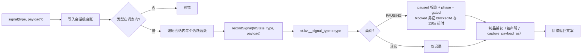

# 信号系统（Signal System）

信号（signal）是 rolebox 的带外控制通道：代理用一次 `signal` 调用表达状态转换意图，而不必把意图写进回复正文。
本页讲它的实现——词表与分类、两级台账、与函数状态机的对接、payload 的去向，以及发出一次信号究竟发生了什么。

> **本页边界**：`signal` 工具的**参数与返回文案**见[编排工具](/03-Reference/tools/orchestration-tools)；`signal_observed` 在函数定义里的写法与全部条件表达式见[函数规范](/02-Guide/writing-functions)；图引擎如何消费这些分类见[图执行引擎](/04-Advanced/graph-engine)；信号在节点生命周期里的运行时行为见[运行时行为](/04-Advanced/runtime-behavior)。

## 词表与分类

信号类型只有 8 个，定义在 `src/signal/signal-constants.ts`，是整条链路的唯一真相来源：工具的 Zod 枚举直接从同一份数组派生，所以校验边界不会与词表漂移。

按对状态机的影响，8 个类型分成四个类别，影响从「终止执行」递减到「仅记录」：

| 类别 | 类型 | 台账记录 | 状态效果 |
|------|------|----------|----------|
| TERMINATING | `answer`、`revise_needed`、`escalate` | 是 | 满足 `continue_until`，下次空闲周期可让节点完成 |
| PAUSING | `need_approval`、`blocked`、`need_clarification` | 是 | `phase = "gated"`，并打上 `paused` 证据标签 |
| HANDOFF | `handoff` | 是 | 不终止也不暂停，payload 里记录交接目标 |
| INFO | `progress` | 是 | 无状态变更，仅用于日志与监控 |

四个类别是四个 `Set` 常量（`TERMINATING_SIGNALS` / `PAUSING_SIGNALS` / `HANDOFF_SIGNALS` / `INFO_SIGNALS`），`ALL_SIGNAL_TYPES` 是它们的并集——运行时 guard 用它兜住绕过 Zod 的直接调用。图引擎侧（`src/graph/engine/signal-bridge.ts`）不重复定义词表，而是从同一文件导入并再导出。

### 终止严重度与合成 answer

多个终止信号同时存在时需要定序。`TERMINATING_SIGNALS_BY_SEVERITY` 固定为 `escalate` > `revise_needed` > `answer`，会话级台账的「最高严重度终止信号」查询按这个顺序取第一个命中的。

还有一个不出现在词表使用面的特殊值：`SYNTHETIC_ANSWER_SIGNAL`（`answer` 加 `payload: { __inferred: true }`）。当子代理正常完成任务却没有显式调用过 `signal` 时，完成评估器（`src/dispatch/completion/completion-evaluator.ts`）替它补发这个信号，`__inferred` 标记让下游能分辨「框架推断」与「代理声明」。若台账读取失败，兜底值同样是这个合成信号。

## 一次信号发出发生什么

`signal` 工具由 `src/signal/signal-tool.ts` 的 `createSignalTool()` 创建，在共享装配层无条件注册（三个平台都有）。它的执行分成五步：


```mermaid
flowchart LR
  A["signal(type, payload?)"] --> B["写入会话级台账"]
  B --> C{"类型在词表内?"}
  C -->|否| D["抛错"]
  C -->|是| E["遍历会话内每个活跃函数"]
  E --> F["recordSignal(fnState, type, payload)"]
  F --> G["st.kv.__signal_type = type"]
  G --> H{"类别?"}
  H -->|PAUSING| I["paused 标签 + phase = gated<br/>blocked 另记 blockedAt 与 120s 超时"]
  H -->|其它| J["仅记录"]
  I --> K["制品捕获（若声明了 capture_payload_as）"]
  J --> K
  K --> L["拼接返回文案"]
```

1. **会话级台账先行**：`sessionSignalLedger.record(sessionID, type, payload)` 在任何函数状态遍历之前执行，这样即便当前没有任何活跃函数，信号也不会丢；
2. **类型 guard**：Zod 枚举在解析阶段已经拦截非法类型，这一步是给绕过工具协议的直接调用兜底，命中就抛出「Unrecognized signal type」并列出合法取值；
3. **函数级台账**：遍历 `functionSessionState.getActive(sessionID)`，对每个有运行时状态的函数调用 `recordSignal(st, type, payload)`，并写入 `st.kv["__signal_type"] = type`，最后 `markDirty()` 让状态持久化；
4. **暂停处理**：PAUSING 类别额外设置 `st.evidenceObserved["paused"] = true` 与 `st.phase = "gated"`；`blocked` 还会记录 `blockedAt` 时间戳，并在未配置时把 `blockedTimeoutMs` 设为 120000（2 分钟）；
5. **制品捕获与返回**：payload 在满足条件时写进 ArtifactStore（下一节），随后按类别拼出返回文案。

返回文案是分层的：没有活跃函数时是 `signal: <type> acknowledged (no active functions)`；否则以 `signal: <type> acknowledged | recorded on N function(s)` 开头，再按类别追加一个箭头片段——PAUSING 是 `→ function paused`，TERMINATING 是 `→ satisfies continue_until condition`，HANDOFF 是 `→ handoff to <目标>`（依次取 payload 的 `target`、`subagent`，都没有则写 `(unspecified)`），INFO 是 `→ informational (no state transition)`。

## 函数级台账 API

函数级台账存放在 `FnState.kv["__signals_observed"]`，形状是 `Record<string, unknown>`——信号类型是键，payload（没有则 `null`）是值。`src/signal/signal-ledger.ts` 导出 6 个辅助函数，外部不直接读写这个键：

| 函数 | 行为 |
|------|------|
| `recordSignal(fnState, type, payload?)` | 写入或**覆盖**同类型记录 |
| `hasSignal(fnState, type)` | 键是否存在 |
| `getSignalPayload(fnState, type)` | 取 payload，未记录时返回 `undefined` |
| `readLedgerRecord(fnState)` | 返回台账的浅拷贝，供序列化或调试 |
| `clearSignal(fnState, type)` | 删除单条 |
| `clearAllSignals(fnState)` | 清空整个台账 |

覆盖语义是设计选择而不是缺陷：同一个函数在一次运行中多次发出同类型信号时，后写入的 payload 覆盖先前的，台账因此始终是「每种类型一条最新记录」，而不是事件流。

```typescript
export function recordSignal(fnState: FnState, type: string, payload?: unknown): void {
  const ledger = readLedger(fnState);
  ledger[type] = payload !== undefined ? payload : null;
  writeLedger(fnState, ledger);
}
```

`readLedger` 还做了一层兼容：如果 `kv["__signals_observed"]` 是数组（台账迁移前的旧格式），它会返回空对象，而条件求值那一侧会按旧格式再判一次（见下节）。

## 会话级台账

`sessionSignalLedger` 是 `SessionSignalLedger` 的单例（`src/signal/session-signal-ledger.ts`），内部是 `Map<sessionID, Map<type, SignalRecord>>`，**按会话键控、独立于函数激活**。它回答的是「这次会话里到底发过哪些信号」，而不是「某个函数看到了什么」。

| 方法 | 返回 |
|------|------|
| `record(sessionID, type, payload?)` | 写入；同类型覆盖 |
| `getTerminating(sessionID)` | 最高严重度的终止信号，或 `null` |
| `getHitlSignal(sessionID)` | 最高优先级的人工在环信号（`need_approval` > `blocked` > `need_clarification`），或 `null` |
| `hasSignal(sessionID, type)` | 该会话是否记录过某类型 |
| `clearSession(sessionID)` | 清除该会话的全部信号并触发持久化 |

持久化落到 `.rolebox/state/signalledger-<workspaceHash>.json`（文件形状是 `{ version: 1, sessions: [...] }`）。写入是**延迟合并**的：每次变更只把内部标记置脏，500ms 内的多次变更合并成一次原子写；`flushSync()` 用于在进程退出前同步落盘。`setStoreDirectory()` 指定工作区目录，`recover()` 在重启时从磁盘恢复，`resetAll()` 只清内存（不写盘），供状态重置路径避免出现多个实例。

## 与函数状态机的集成

信号进入函数状态机只有一个入口：内建命名条件 `signal_observed(type)`（`src/function/conditions.ts`）。它和 `user_approval`、`artifact_exists`、`plan_todos_complete`、`evidence_met`、`tool_observed`、`turn_count`、`state_eq` 并列。

求值按三步短路：

1. **台账格式**（当前）：读取 `FnState.kv["__signals_observed"]`，若是对象就用 `arg in record` 判断键存在；
2. **旧数组格式**：若是 `string[]`，用 `Array.includes(arg)` 判断；
3. **会话级兜底**：函数级台账没有该信号时，回退到 `sessionSignalLedger.hasSignal(env.sessionID, arg)`。

第三步是关键设计：它让「在没有活跃函数时发出的信号」仍然能满足 `continue_until: signal_observed(...)`，从而把人工审批这类带外事件接进函数的继续条件。

条件可以出现在函数定义的三个位置：

```yaml
continue_until: signal_observed(answer)   # 收到 answer 才认为这次运行结束
gate: signal_observed(answer)              # 门控：未满足前停在 gated
transitions:
  - when: signal_observed(escalate)        # 收到 escalate 时激活紧急处理函数
    activate: [emergency-handler]
```

配合规则按类别划分：TERMINATING 适合放进 `continue_until` 作为正常退出条件；PAUSING 适合放进 `gate` 等待恢复——它们把函数推进 `gated` 而不是让它完成；HANDOFF 与 INFO 不改变状态，适合只想留下记录、不打断流程的场景。

### blocked 的有界兜底

暂停态不能无限期停留。发过 `blocked` 的函数带上了 `blockedAt` 与 `blockedTimeoutMs`（默认 120 秒），空闲续跑路径（`src/copilot/sources/builtin.ts`）在检查 gated 函数时会判断 `now - blockedAt > blockedTimeoutMs`：超时就强制解封——`phase` 回到 `active`、清除 `paused` 标签与 `blockedAt`——让下一个空闲周期重新评估 `continue_until`，而不是让编排器永久挂起。

## 制品捕获

当某个活跃函数的 observe 规范声明了 `capture_payload_as` 且观察目标是 `signal` 时，payload 会以 JSON 字符串写进 ArtifactStore。触发条件有两个额外约束：payload 必须存在，且当前至少有一个活跃函数；查找方式是用 `src/resolver/registry.ts` 的角色函数表反查活跃函数的名字与 observe 声明。

这条路径与 observe 系统本身的处理是重复的，而且是有意为之：observe 系统在标准链路里已经会捕获 payload，但直接工具调用（observe 未触发）的场景需要一个兜底，于是信号工具自己承担了写入职责。反查失败（拿不到角色函数表）不会让信号失败——只记一条 warn 日志。

## 可观测性

信号子系统使用 `createSubLogger("signal-tool")` 与 `createSubLogger("session-signal-ledger")` 两个命名空间输出结构化日志：

- `signal-tool`：每发出一次信号记一条 session 级 debug；对每个函数再记一条含 `fnName`、`type`、`phase` 的 debug；制品反查失败记 warn；
- `session-signal-ledger`：延迟持久化失败记 warn。

排查时的两个抓手：一是返回文案已经区分了四种状态效果，可以直接从工具结果判断信号落在哪一类；二是没有活跃函数时返回的 `(no active functions)` 明确说明这次信号只进了会话级台账——如果此时期望的是函数状态变化，问题在「函数没有被激活」，而不在信号。

## 实现模块

| 模块 | 职责 |
|------|------|
| `src/signal/signal-constants.ts` | 8 个类型的词表、四个类别集合与严重度顺序 |
| `src/signal/signal-tool.ts` | `signal` 工具：会话/函数两级记录、暂停处理、制品捕获、返回文案 |
| `src/signal/signal-ledger.ts` | 函数级台账的 6 个读写辅助函数 |
| `src/signal/session-signal-ledger.ts` | `SessionSignalLedger` 单例：按会话键控、查询与延迟持久化 |
| `src/function/conditions.ts` | `signal_observed` 条件的三步求值 |
| `src/function/runtime-state.ts` | `FnState.kv`、`phase`、`blockedAt` 与 `blockedTimeoutMs` 的字段定义 |
| `src/copilot/sources/builtin.ts` | gated 函数的有界兜底（超时强制解封） |
| `src/function/artifact-store.ts` | `capture_payload_as` 的写入目标 |
| `src/graph/engine/signal-bridge.ts` | 图引擎侧的读取接缝：把信号记进节点台账并分类 |
| `src/dispatch/completion/completion-evaluator.ts` | 无显式信号时补发合成 `answer` |

## 备注

> 自 v0.22.0 起，rolebox 提供这套带外信号词表与 `signal` 工具；自 v1.9.0 起，dsh 适配器在任务落定时读取完成台账并写入终止信号，台账损坏时回退到合成 `answer`，不再中断落定路径。
