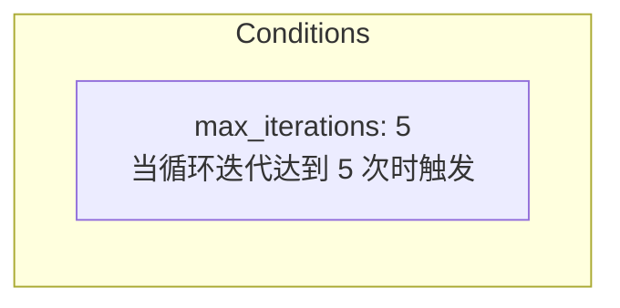

# 终止条件

> **相关文档：** [运行时行为](/04-Advanced/runtime-behavior) — 图状态管理与 FSM 生命周期 | [信号系统](/04-Advanced/signal-system) — 带外控制信令机制 | [工作流模式](/04-Advanced/workflow-patterns) — 协作图拓扑与边配置

协作图的终止条件（termination conditions）决定多代理工作流**何时停止执行**。rolebox 提供 5 种条件类型，支持 `any_of`（任一满足即止）和 `all_of`（全部满足才止）两种组合语义，以及条件间的优先级排序。

所有终止相关逻辑集中在 `src/graph/termination.ts`（同步评估）、`src/graph/termination-async.ts`（异步评估）和 `src/graph/termination-parser.ts`（配置解析）三个文件中。

---

## 5 种条件类型

`src/types.graph.ts:96-109` 定义了 `LoopCondition` 联合类型：

```typescript
// src/types.graph.ts:96-109
export type LoopCondition =
  | { max_iterations: number }
  | { timeout_ms: number }
  | { converged: string }
  | {
      result_matches: {
        agent: string;
        contains?: string;
        regex?: string;
        score_gte?: number;
        no_changes?: boolean;
      };
    }
  | { stuck: { repeats: number } };
```

### 1. max_iterations — 最大迭代次数

当协作循环的迭代计数器达到指定值时触发。迭代计数器在每次退边（back-edge）被遍历时递增（`src/graph/state.ts:119-122`）。

```yaml
# role.yaml
collaboration:
  topology: review-loop
  agents:
    - writer
    - critic
  termination:
    any_of:
      - max_iterations: 5
```



**内部机制：** `src/graph/termination.ts:47-54` 中的同步检查遍历所有 `loopGroups`，为每个 group 比较 `loopCounters[group.id] >= group.maxIterations`。Per-loop-group 的 `maxIterations` 由 `src/graph/termination-parser.ts:73-78` 从全局配置中提取。

```typescript
// src/graph/termination.ts:47-54
if ("max_iterations" in cond) {
  for (const group of graph.termination?.loopGroups ?? []) {
    if (group.maxIterations == null) continue;
    const counter = state.loopCounters?.[group.id] ?? 0;
    if (counter >= group.maxIterations) return true;
  }
  return false;
}
```

### 2. timeout_ms — 超时

当工作流从首次退边遍历（`loopStartTimeMs`）开始经过指定毫秒数后触发。

```yaml
# role.yaml
collaboration:
  topology: review-loop
  agents:
    - editor
    - reviewer
  termination:
    any_of:
      - timeout_ms: 120000
```

**内部机制：** `src/graph/termination.ts:56-59` 检查 `now - state.loopStartTimeMs >= cond.timeout_ms`。`loopStartTimeMs` 由 `advanceStep` 在首次遇到退边时设置（`src/graph/state.ts:112`）。

```typescript
// src/graph/termination.ts:56-59
if ("timeout_ms" in cond) {
  const start = state.loopStartTimeMs ?? now;
  return now - start >= cond.timeout_ms;
}
```

### 3. stuck — 停滞

当连续多次代理输出**完全相同**时触发。用于检测死循环或重复的无意义输出。

```yaml
# role.yaml
collaboration:
  topology: review-loop
  agents:
    - generator
    - checker
  termination:
    any_of:
      - stuck:
          repeats: 3
```

**内部机制：** `src/graph/termination.ts:61-69` 使用 `lastResults` 中每条结果的 SHA-256 hash（前 12 位，由 `src/graph/result-capture.ts:27-29` 计算）检测重复：

```typescript
// src/graph/termination.ts:61-69
if ("stuck" in cond) {
  const results = state.lastResults;
  if (!results) return false;
  const freq = new Map<string, number>();
  for (const r of Object.values(results)) {
    freq.set(r.hash, (freq.get(r.hash) ?? 0) + 1);
  }
  return Math.max(0, ...freq.values()) >= cond.stuck.repeats;
}
```

### 4. converged — 收敛

收敛检测通过**异步 judge 函数**（`JudgeFn`）判断结果是否达到质量标准。由 `src/graph/advance.ts` 在幕后启动异步评估。

```yaml
# role.yaml
collaboration:
  topology: review-loop
  agents:
    - creator
    - validator
  termination:
    any_of:
      - converged: validator
```

**内部机制：** `src/graph/termination-async.ts:68-103` 调用 `JudgeFn` 检查指定代理的最新结果是否满足收敛条件。该评估有 30 秒超时和最多 2 次重试（`src/graph/advance.ts:161-219`）：

```typescript
// src/graph/termination-async.ts:92-99
const results = await Promise.all(
  convergedConditions.map(async (c): Promise<boolean> => {
    try {
      return await judge(c.converged, context);
    } catch {
      return false;
    }
  }),
);
```

### 5. result_matches — 结果匹配

当指定代理的结果内容满足预定义条件时触发。支持 4 种匹配子类型：

```yaml
# role.yaml
collaboration:
  topology: review-loop
  agents:
    - solver
    - evaluator
  termination:
    any_of:
      # 包含特定文本
      - result_matches:
          agent: solver
          contains: "SOLUTION ACCEPTED"
      # 正则匹配
      - result_matches:
          agent: solver
          regex: "^Score: [89][0-9]"
      # 评分 >= 阈值
      - result_matches:
          agent: evaluator
          score_gte: 85
      # 结果无变化（与上一次完全一致）
      - result_matches:
          agent: solver
          no_changes: true
```

**内部机制：** `src/graph/termination-async.ts:143-178` 对 `lastResults[agent]` 的文本内容逐一检查：

```typescript
// src/graph/termination-async.ts:143-178
function evaluateSingleResultMatch(spec, state): boolean {
  const stored = state.lastResults?.[spec.agent];
  if (!stored) return false;
  // contains: 子串匹配
  if (spec.contains !== undefined) return text.includes(spec.contains);
  // regex: 正则匹配
  if (spec.regex !== undefined) return new RegExp(spec.regex).test(text);
  // score_gte: 从输出中提取 score: N
  if (spec.score_gte !== undefined) { /* 解析 score: N 格式 */ }
  // no_changes: 比较归一化 hash
  if (spec.no_changes !== undefined) return hashResult(normalized) === stored.hash;
}
```

---

## any_of / all_of 组合语义

`src/types.graph.ts:116-121` 定义了 `TerminationConfig` 支持两种组合策略：

```typescript
// src/types.graph.ts:116-121
export interface TerminationConfig {
  any_of?: LoopCondition[];   // 任一满足即终止
  all_of?: LoopCondition[];   // 全部满足才终止
}
```

### any_of（或逻辑）

列表中的**任意一个**条件成立即触发终止。优先级取**最高**的条件（数值最小的优先级值）。评估逻辑在 `src/graph/termination.ts:94-100`：

```yaml
# any_of：任意一个满足即终止
collaboration:
  termination:
    any_of:
      - max_iterations: 10   # 10 次迭代后终止
      - converged: judge     # 或 judge 判定收敛
      - timeout_ms: 30000    # 或 30 秒超时
```

```typescript
// src/graph/termination.ts:94-100
if (cfg.any_of?.length) {
  for (const cond of cfg.any_of) {
    if (checkCondition(cond, state, graph, now, asyncResults)) {
      return conditionReason(cond);
    }
  }
}
```

### all_of（与逻辑）

**所有**条件都成立后才终止。终止原因取满足条件中**优先级最高**的（`src/graph/termination.ts:102-113`）：

```yaml
# all_of：全部满足才终止
collaboration:
  termination:
    all_of:
      - max_iterations: 3    # 至少 3 次迭代
      - result_matches:
          agent: evaluator
          score_gte: 90      # 且评分 >= 90
```

```typescript
// src/graph/termination.ts:102-113
if (cfg.all_of?.length) {
  const satisfied: TerminationReason[] = [];
  for (const cond of cfg.all_of) {
    if (checkCondition(cond, state, graph, now, asyncResults)) {
      satisfied.push(conditionReason(cond));
    }
  }
  if (satisfied.length === cfg.all_of.length) {
    satisfied.sort(reasonPriority);
    return satisfied[0];
  }
}
```

### any_of + all_of 同时使用

两个列表的评估是**独立**的：先扫描 `any_of`（任一匹配则终止），再扫描 `all_of`（全部匹配才终止）。只要任一列表满足条件即触发终止。

### 优先级排序

每种终止原因有固定的优先级值（`src/graph/termination.ts:7-14`），数值越小优先级越高：

| 优先级 | 原因 | 说明 |
|--------|------|------|
| 0 | `converged` | 收敛——正常完成 |
| 1 | `result_match` | 结果匹配——正常完成 |
| 2 | `stuck` | 停滞——异常终止 |
| 3 | `max_iterations` | 达到上限——保护性终止 |
| 4 | `timeout` | 超时——保护性终止 |
| 5 | `error` | 错误——异常终止 |

当 `all_of` 同时满足多个条件时，优先级最小的原因被返回作为最终 `TerminationReason`（`src/graph/termination.ts:109-111`）。

---

## continue_until 与 exit_conditions 的区别

协作图中有两个相关的终止概念，容易混淆：

### exit_conditions（编译时指令）

`exit_conditions` 是 `buildCollaborationBlock`（`src/graph/prompt-builder.ts`）根据拓扑自动生成的 **XML 指令**，注入到大模型系统提示中，指导路由器何时停止派发：

```xml
<!-- Pipeline 的 exit_conditions（prompt-builder.ts:155-156） -->
<exit_conditions>
The graph completes when: the final agent returns their output, OR max 1 iteration(s) reached.
</exit_conditions>

<!-- Review-Loop 的 exit_conditions（prompt-builder.ts:192-193） -->
<exit_conditions>
The graph completes when: the final result meets quality criteria and exits, OR max 5 iteration(s) reached.
</exit_conditions>

<!-- Star 的 exit_conditions（prompt-builder.ts:220-222） -->
<exit_conditions>
The graph completes when: all agents have returned their outputs, OR max 5 iteration(s) reached.
</exit_conditions>

<!-- Custom 的 exit_conditions（prompt-builder.ts:267-270） -->
<exit_conditions>
The graph completes when: an exit-point agent returns their output, OR max 5 iteration(s) reached.
</exit_conditions>
```

### continue_until（运行时条件）

`termination` 配置（`continue_until` 的概念等价）是**运行时引擎**用来主动终止工作流的条件。代码层面通过 `evaluateSync` 函数在每个 `advanceStep` 之后同步检查（`src/graph/state.ts:138-146`）：

```typescript
// src/graph/state.ts:138-146
const reason = evaluateSync(state, graph, Date.now());
if (reason) {
  state.terminationReason = reason;
  if (reason === "converged" || reason === "result_match") {
    state.status = "complete";
  } else {
    state.status = "exhausted";
  }
}
```

### 关键区别总结

| 维度 | exit_conditions | termination（continue_until） |
|------|----------------|------------------------------|
| 本质 | 大模型提示指令 | 运行时引擎主动检查 |
| 位置 | prompt-builder.ts 生成 XML | state.ts termination.ts 代码执行 |
| 触发者 | 路由器（LLM）手动判断 | 引擎自动评估 |
| 精度 | 文本描述，依赖 LLM 理解 | 精确数值/布尔条件 |
| 典型用途 | Pipeline 末尾结束 | 循环保护、收敛检测、停滞检测 |

两者应**协同使用**：`exit_conditions` 告诉路由器在正常情况下如何结束，`termination` 作为安全网在异常情况下强制终止。

::: tip 最佳实践
`exit_conditions` 和 `termination` 是互补而非替代关系。`exit_conditions` 处理正常退出路径，依赖 LLM 理解指令；`termination` 处理异常保护，由引擎精确评估。典型的配置模式：将 `max_iterations` 和 `timeout_ms` 作为安全网，将 `result_matches` 或 `converged` 作为正常完成条件。
:::

---

## 内置条件与信号系统集成

除上述 5 种终止条件外，`signal_observed(type)` 是 FSM 的内建命名条件（`src/function/conditions.ts:57-68`），可在函数的 `gate`、`transitions` 或 `continue_until` 中引用。例如：

```yaml
termination:
  any_of:
    - max_iterations: 10
    - signal_observed(answer)  # 等待 answer 信号
```

详见[信号系统 → FSM 集成](/04-Advanced/signal-system#4-fsm-集成)。

## 扩展自定义条件

可以通过 `registerTerminationParser` API 注册自定义终止条件解析器：

```typescript
// src/graph/termination-parser.ts:39-49
export function registerTerminationParser(
  key: string,
  parser: (value: unknown, fullObj: Record<string, unknown>, availableAgents: string[]) => unknown | null,
): void {
  customTerminationParsers.set(key, parser);
  addTerminationConditionKey(key);
}
```

## 下一步

- [运行时行为](/04-Advanced/runtime-behavior) — 图状态管理与 FSM 生命周期
- [信号系统](/04-Advanced/signal-system) — signal 工具与信号账本
- [工作流模式](/04-Advanced/workflow-patterns) — 协作图拓扑与边配置

---
