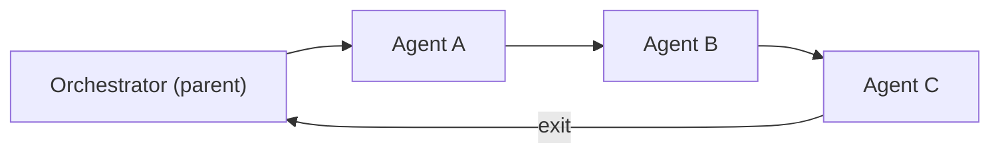
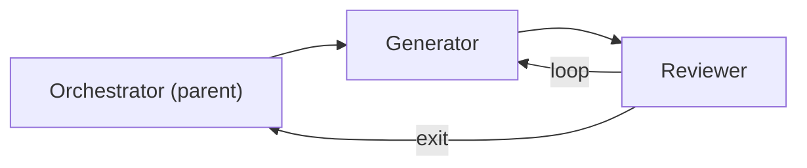
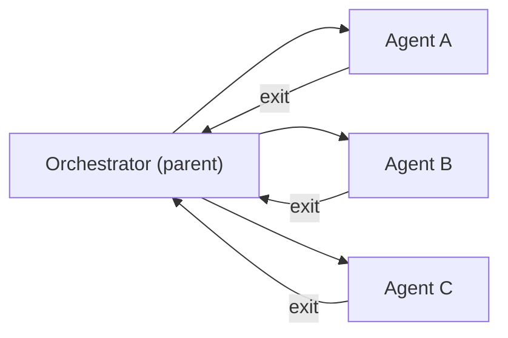
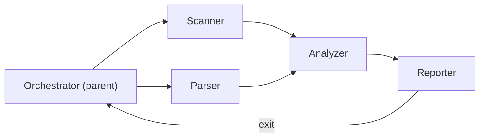
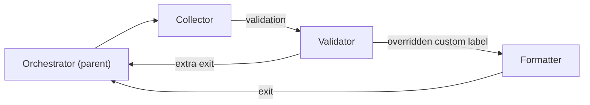

# 工作流模式

> **相关文档：** [运行时行为](/04-Advanced/runtime-behavior) — 图状态管理与 FSM 生命周期 | [终止条件](/04-Advanced/termination-conditions) — continue_until 条件与收敛检测 | [协作图](/02-Guide/collaboration-graph) — 内置拓扑与自定义流配置

协作图（collaboration graph）定义了子代理之间的工作流转路径。rolebox 提供三种内建拓扑（template）——**Pipeline**、**Review-Loop**、**Star**——同时支持通过显式 `flow` 边定义**自定义拓扑**，以及通过 `flow` 覆盖实现**混合模式**。

所有内建拓扑的扩展逻辑由 `src/graph/templates.ts` 实现，经过 `src/graph/parser.ts` 解析和 `src/graph/validator.ts` 校验后，最终由 `src/graph/prompt-builder.ts` 生成 `<collaboration_graph>` 指令注入到大模型系统提示中。

---

::: tip 拓扑选择指南
- **Pipeline**：代理之间有明确的先后依赖关系（如 调研 → 写作 → 编辑）
- **Review-Loop**：需要迭代审查和修订循环（如 编码 → 审查 → 修改 → 审查）
- **Star**：各代理独立工作，无需相互依赖（如 同时分析前端/后端/数据库）
- **自定义流**：上述三种无法覆盖的非标工作流
:::

## Pipeline（流水线）

Pipeline 是最简单的拓扑：代理前后串联，前一代理的输出作为后一代理的输入，最后一个代理的结果为最终输出。

### 拓扑结构



### 边展开逻辑

每个 pipeline 在代码层面展开为 `(n+1)` 条边：`parent → agents[0]`，`agents[i] → agents[i+1]`（共 n-1 条），以及 `agents[last] → parent`（标记为 exit）：

```typescript
// src/graph/templates.ts:51-59
function expandPipeline(agents: string[]): FlowEdge[] {
  const edges: FlowEdge[] = [];
  edges.push({ from: PARENT_NODE, to: agents[0] });
  for (let i = 0; i < agents.length - 1; i++) {
    edges.push({ from: agents[i], to: agents[i + 1] });
  }
  edges.push({ from: agents[agents.length - 1], to: PARENT_NODE, exit: true });
  return edges;
}
```

### YAML 配置

```yaml
# role.yaml
collaboration:
  topology: pipeline
  agents:
    - coder
    - reviewer
    - tester
  max_iterations: 1
```

路由器据此生成的指令序列为（`src/graph/prompt-builder.ts:131-159`）：
1. 向 `coder` 派发初始任务
2. 收集 `coder` 输出，派发给 `reviewer`
3. 收集 `reviewer` 输出，派发给 `tester`
4. `tester` 的输出为最终结果

---

## Review-Loop（评审循环）

Review-Loop 在 Pipeline 的基础上增加了一条**反馈边**：最后一个代理可以回环到第一个代理，形成迭代评审循环。

### 拓扑结构



### 边展开逻辑

```typescript
// src/graph/templates.ts:61-72
function expandReviewLoop(agents: string[]): FlowEdge[] {
  const edges: FlowEdge[] = [];
  edges.push({ from: PARENT_NODE, to: agents[0] });
  for (let i = 0; i < agents.length - 1; i++) {
    edges.push({ from: agents[i], to: agents[i + 1] });
  }
  const lastAgent = agents[agents.length - 1];
  const firstAgent = agents[0];
  edges.push({ from: lastAgent, to: firstAgent, label: "loop" });
  edges.push({ from: lastAgent, to: PARENT_NODE, label: "exit", exit: true });
  return edges;
}
```

关键区别在于：
- 新增一条 `agents[last] → agents[0]` 的反馈边，label 为 `"loop"`（`templates.ts:69`）
- 同时保留 `agents[last] → parent` 的出口边，label 为 `"exit"`（`templates.ts:70`）

### YAML 配置

```yaml
# role.yaml
collaboration:
  topology: review-loop
  agents:
    - writer
    - critic
  max_iterations: 5
  termination:
    any_of:
      - max_iterations: 5
      - converged: critic
      - stuck:
          repeats: 3
```

路由器在每次 `critic` 完成时判断输出质量：若质量达标则选择 exit 边结束流程；若需修订则选择 loop 边重新派发给 `writer`。迭代次数受 `max_iterations` 保护（`src/graph/state.ts:127`）。

### 循环检测

Review-Loop 中的循环由 `src/graph/loop-detector.ts` 通过 Tarjan 强连通分量算法自动检测（`loop-detector.ts:13-75`）。一旦检测到循环而未设置 `max_iterations`，验证器会给出警告并默认设为 3（`src/graph/validator.ts:167-179`）：

```typescript
// src/graph/validator.ts:172-178
if (!graph.maxIterations || graph.maxIterations <= 0) {
  const msg =
    "Cycle detected in graph but maxIterations is not set, defaulting to 3";
  warnings.push(msg);
}
```

---

## Star（星形）

Star 拓扑中，Orchestrator 依次向每个代理派发工作，所有代理独立处理，各自将结果返回给 Orchestrator。

### 拓扑结构



### 边展开逻辑

每个代理有两条边：`parent → agent` 和 `agent → parent`（exit）：

```typescript
// src/graph/templates.ts:74-81
function expandStar(agents: string[]): FlowEdge[] {
  const edges: FlowEdge[] = [];
  for (const agent of agents) {
    edges.push({ from: PARENT_NODE, to: agent });
    edges.push({ from: agent, to: PARENT_NODE, exit: true });
  }
  return edges;
}
```

### YAML 配置

```yaml
# role.yaml
collaboration:
  topology: star
  agents:
    - researcher
    - designer
    - writer
```

> **V1 限制**：虽然拓扑概念上是并行的，当前路由器按顺序分批派发，即每次只派发一个代理（`src/graph/prompt-builder.ts:213-214`）。

---

## Custom（自定义拓扑）

当内建拓扑无法满足需求时，可以使用 `flow` 字段显式定义任意有向边，`topology` 字段省略或留空。

### 多入口 / 多出口示例



### YAML 配置

```yaml
# role.yaml
collaboration:
  flow:
    - from: parent
      to: scanner
    - from: parent
      to: parser
    - from: scanner
      to: analyzer
    - from: parser
      to: analyzer
    - from: analyzer
      to: reporter
    - from: reporter
      to: parent
      exit: true
```

自定义拓扑的边使用 `src/graph/edge-parser.ts` 解析（`edge-parser.ts:14-39`），支持字符串语法和对象语法两种形式：

```yaml
# 字符串语法（edge-parser.ts:45-63）
flow:
  - "scanner -> analyzer"
  - "analyzer -> reporter: handoff"

# 对象语法（edge-parser.ts:68-85）
flow:
  - from: scanner
    to: analyzer
    label: "merge results"
```

---

## Hybrid（混合模式）

Hybrid 模式将模板展开的边与自定义 `flow` 边合并，`flow` 中的边会覆盖同名的模板边（`src/graph/edge-parser.ts:92-109`）：

```yaml
# role.yaml — pipeline 模板 + flow 覆盖
collaboration:
  topology: pipeline
  agents:
    - collector
    - validator
    - formatter
  flow:
    # 在 collector → validator 之间插入标签
    - from: collector
      to: validator
      label: "validation"
    # 添加一条 validator 到 parent 的额外退出路径
    - from: validator
      to: parent
      exit: true
```

合并逻辑使用 `from→to` 字符串作为键（`edge-parser.ts:99`），模板先加入 map，flow 后加入，因此 flow 中的同键边可以覆盖模板边：

```typescript
// src/graph/edge-parser.ts:96-108
function mergeEdges(templateEdges: FlowEdge[], flowEdges: FlowEdge[]): FlowEdge[] {
  const edgeMap = new Map<string, FlowEdge>();
  for (const edge of templateEdges) {
    const key = `${edge.from}->${edge.to}`;
    edgeMap.set(key, edge);
  }
  for (const edge of flowEdges) {
    const key = `${edge.from}->${edge.to}`;
    edgeMap.set(key, edge);
  }
  return Array.from(edgeMap.values());
}
```

### 混合模式的结构图



---

## 路由器如何分发

路由器收到协作图后，`src/graph/state.ts` 中的 `GraphSessionState` 管理执行状态（`state.ts:75-172`），包括：

- **Frontier**（前沿）：当前可被派发的代理集合
- **Completed**（已完列表）：已完成的代理列表
- **Iteration counter**（迭代计数器）：记录循环迭代次数

当路由器 `dispatch` 到某代理后，`advanceGraphForDispatch`（`src/graph/advance.ts:96-151`）推进状态：从 frontier 移除该代理，将后继节点加入 frontier，检查 `exit` 边判断是否终止。

### 自定义拓扑注册

开发者可以通过 `registerTopology` API 注册运行时自定义拓扑（`src/graph/templates.ts:14-22`）：

```typescript
// src/graph/templates.ts:14-22
export function registerTopology(
  name: string,
  expander: (agents: string[]) => FlowEdge[],
): void {
  customTopologies.set(name, expander);
}
```

同时需要在 `src/constants.ts` 中注册模板名称（`constants.ts:64-66`）：

```typescript
// src/constants.ts:64-66
export function addGraphTemplateValue(name: string): void {
  GRAPH_TEMPLATE_VALUES.add(name);
}
```

---

## 验证规则

`src/graph/validator.ts` 对所有拓扑统一执行 7 项检查（`validator.ts:23-44`）：

| # | 检查项 | 说明 |
|---|--------|------|
| 1 | 节点存在性 | 边中引用的所有节点必须在可用代理列表中 |
| 2 | 出口边存在 | 至少有一条 exit 边 |
| 3 | 入口点存在 | 至少有一条来自 `parent` 的边 |
| 4 | 孤立代理（警告） | 可用但未被任何边引用的代理 |
| 5 | 连通性（警告） | 所有节点必须从 `parent` 可达 |
| 6 | 循环检测 | 有环时不设 `max_iterations` 则默认 3 |
| 7 | 终止条件 | `converged` 和 `result_matches.agent` 引用已知代理 |

## 下一步

- [运行时行为](/04-Advanced/runtime-behavior) — 图状态管理与 FSM 生命周期
- [终止条件](/04-Advanced/termination-conditions) — continue_until 条件与收敛检测
- [协作图](/02-Guide/collaboration-graph) — 内置拓扑与自定义流配置

---
