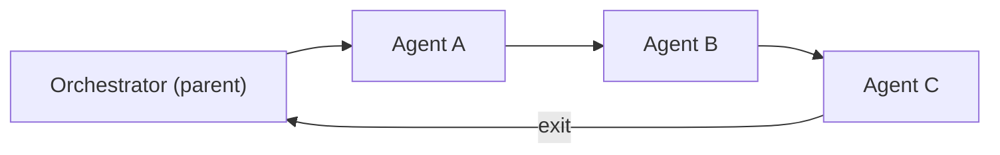
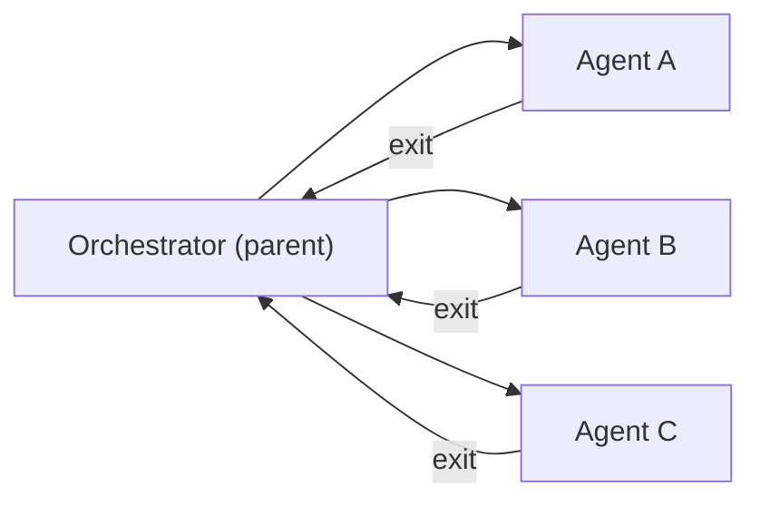
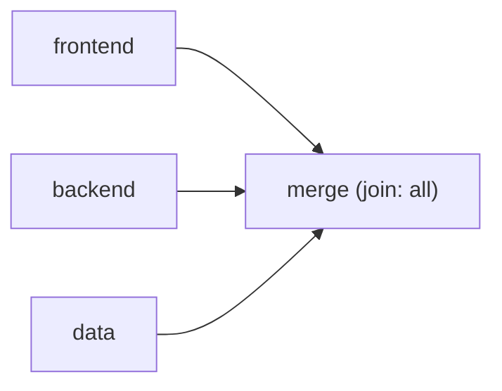
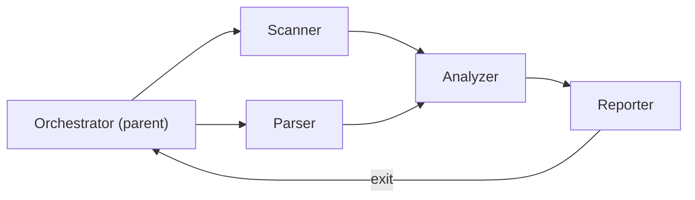

# 工作流模式（Workflow Patterns）

这一页回答「多个子代理协作，该选哪种结构」。**工作流模式（workflow pattern）**是对「谁先做、谁后做、谁可以并行、谁能把结果打回重做」的结构化表达；它只决定**边的形状**，真正让图跑起来的是八个 `graph_*` 工具。

> 前置：[图工作流](/02-Guide/graph-workflows)｜相关：[图执行引擎](/04-Advanced/graph-engine)｜[图声明参考](/04-Advanced/graph-declaration)｜[编排工具参数](/03-Reference/tools/orchestration-tools)

rolebox 保留三个内建**拓扑（topology，图的预设结构模式）**名字：`pipeline`、`review-loop`、`star`。这三个名字描述形状；图声明里的 `template:` 字段本身不会替你建边（机制见[图声明参考](/04-Advanced/graph-declaration)），命令式路径下更没有这个参数——你要照着下面的边形状自己用 `graph_add_edge` 连出来。

## 怎么选

| 你想要的效果 | 选用的模式 | 命令式骨架 |
|---|---|---|
| 串行接力，每一环吃上一环的输出 | Pipeline | `graph_create` + n 个节点 + n−1 条 `always` 边 |
| 迭代评审，结果不达标就打回重做 | Review-Loop | Pipeline 的串行链 + 一条 `revise_needed` 回边 + `graph_add_loop` |
| 互不依赖地并行开工 | Star（写法 A） | n 个节点彼此无边，全部是根节点 |
| 并行后汇总 | Star（写法 B） | 各分支 + 一个汇聚节点 + 分支到汇聚的入边 |
| 多入口汇合成一条管线、条件分叉 | 自定义拓扑 | 显式 `graph_add_edge` 搭 DAG，`on_condition` 做条件分叉 |
| 人工把关（可叠加在任意模式上） | 审批门 | 节点 `needs_approval: true` + `graph_approve` |

每个模式都只用「建图 → 加节点 → 连边 → 运行」四步搭出来。工具语义见[图工作流](/02-Guide/graph-workflows)，参数与返回格式见[编排工具](/03-Reference/tools/orchestration-tools)。

## Pipeline（流水线）

### 何时用

- 代理之间有明确的先后依赖（调研 → 写作 → 编辑），每一环的输入就是上一环的输出。
- 不需要回环：把链路串直就行。

### 边形状

内建拓扑 `pipeline` 展开出的形状是一条链，两端接编排器：


```mermaid
flowchart LR
  parent["Orchestrator (parent)"]
  agentA["Agent A"]
  agentB["Agent B"]
  agentC["Agent C"]
  parent --> agentA
  agentA --> agentB
  agentB --> agentC
  agentC -->|exit| parent
```

`parent` 是保留的编排器节点名，只出现在模板展开的边里——**命令式图没有隐式的 `parent` 节点**，编排工作流的就是调用工具的那个代理；链尾节点没有出边，它就是终点。

### 最小步骤：用 graph_* 搭出来

```text
graph_create   { "name": "pipeline" }                       → { "graph_id": "g-7f3a" }
graph_add_node { "graph_id": "g-7f3a", "id": "coder",    "agent": "team--coder",    "prompt": "实现功能" }
graph_add_node { "graph_id": "g-7f3a", "id": "reviewer", "agent": "team--reviewer", "prompt": "审查实现" }
graph_add_node { "graph_id": "g-7f3a", "id": "tester",   "agent": "team--tester",   "prompt": "运行测试" }
graph_add_edge { "graph_id": "g-7f3a", "from": "coder",    "to": "reviewer" }
graph_add_edge { "graph_id": "g-7f3a", "from": "reviewer", "to": "tester" }
graph_run      { "graph_id": "g-7f3a" }
               → { "phase": "executing", "active_nodes": ["coder"], "pending_nodes": ["reviewer", "tester"] }
```

`type` 省略即为 `always`，依次接力。

### 常见错误

- **指望 `template: pipeline` 替你连边**：`template:` 只是声明元数据，引擎执行的是声明里的节点、边与循环组；不连边就没有流水线。
- **给只有一条入边的节点写 `join`**：没有实际作用，汇聚只在多上游时才有意义。
- **链尾又连回上游却不声明循环组**：那就是一个环，需要 `graph_add_loop` 覆盖；增量建图时只是警告，运行前的校验会升级为错误。

## Review-Loop（评审循环）

### 何时用

- 产出需要反复打磨：评审不通过就打回重做，直到通过为止。
- 你愿意为「最多改几轮」设一个硬上限，而不是无限迭代。

### 边形状

内建拓扑 `review-loop` 在 Pipeline 的串行链上多两条尾部边：最后一个代理回到第一个代理的 `loop` 边，以及回到编排器的 `exit` 边。


```mermaid
flowchart LR
  parent["Orchestrator (parent)"]
  agentA["Generator"]
  agentB["Reviewer"]
  parent --> agentA
  agentA --> agentB
  agentB -->|loop| agentA
  agentB -->|exit| parent
```

命令式版本用一条 **revise 回边**（`type: "on_signal"` 且 `signal_filter` 含 `revise_needed`）表达 `loop` 边：引擎沿它把已经完成的上游节点重新拉回就绪，形成返工。

### 最小步骤：用 graph_* 搭出来

```text
graph_create   { "name": "review-loop" }                    → { "graph_id": "g-7f3a" }
graph_add_node { "graph_id": "g-7f3a", "id": "writer", "agent": "team--writer", "prompt": "撰写初稿" }
graph_add_node { "graph_id": "g-7f3a", "id": "critic", "agent": "team--critic", "prompt": "评审并给出修改意见" }
graph_add_edge { "graph_id": "g-7f3a", "from": "writer", "to": "critic" }
graph_add_edge { "graph_id": "g-7f3a", "from": "critic", "to": "writer",
                 "type": "on_signal", "signal_filter": ["revise_needed"] }
graph_add_loop { "graph_id": "g-7f3a", "id": "draft-review",
                 "nodes": ["writer", "critic"], "max_traversals": 5 }
graph_run      { "graph_id": "g-7f3a" }
```

`max_traversals` 是**硬性遍历上限**：触顶后 `revise_needed` 不再回环，成员节点升级为 `escalate`，并带上结构化载荷（退出原因、未解决项、已消耗的遍历次数）。

### 常见错误

- **把回边写成 `always`**：那不是返工，是纯 `always` 环——运行前的结构校验会直接报错，因为这样的环永远无法激活。
- **忘了 `graph_add_loop`**：一条回边就构成环；增量建图时只是警告，运行前必然报错。
- **把 `max_traversals` 当软提示**：它是硬上限，触顶即升级，不会再多跑一轮。
- **用 `mode: "fresh"` 追求逐轮隔离**：不支持，会返回显式错误；要隔离就每个回合另建一张图。
- **回边的 `signal_filter` 拼错**：列表里没有 `revise_needed` 的边不会被 revise 传播激活，返工永远不会发生。

## Star（星形）

### 何时用

- 若干子任务互不依赖，可以完全并行：前端分析、后端分析、数据层分析各做各的。
- 需要汇总时，再补一个汇聚节点。

### 边形状

内建拓扑 `star` 给每个代理两条边：编排器派发它（`parent → agent`），它完成后回到编排器（`agent → parent`，带 `exit`）。


```mermaid
flowchart LR
  parent["Orchestrator (parent)"]
  agentA["Agent A"]
  agentB["Agent B"]
  agentC["Agent C"]
  parent --> agentA
  parent --> agentB
  parent --> agentC
  agentA -->|exit| parent
  agentB -->|exit| parent
  agentC -->|exit| parent
```

命令式版本有**两种写法**：各自独立（不加任何边，全部是根节点），或显式汇聚（补一个扇入节点）。

### 最小步骤：用 graph_* 搭出来

写法 A —— 各自独立：

```text
graph_create   { "name": "star-fanout" }                    → { "graph_id": "g-7f3a" }
graph_add_node { "graph_id": "g-7f3a", "id": "frontend", "agent": "team--frontend", "prompt": "分析前端" }
graph_add_node { "graph_id": "g-7f3a", "id": "backend",  "agent": "team--backend",  "prompt": "分析后端" }
graph_add_node { "graph_id": "g-7f3a", "id": "data",     "agent": "team--data",     "prompt": "分析数据层" }
graph_run      { "graph_id": "g-7f3a" }
               → { "phase": "executing", "active_nodes": ["frontend", "backend", "data"], "pending_nodes": [] }
```

没有任何入边的节点都是根，`graph_run` 会一次性把它们全部派发。

写法 B —— 显式汇聚：


```mermaid
flowchart LR
  frontend["frontend"] --> merge["merge (join: all)"]
  backend["backend"] --> merge
  data["data"] --> merge
```

```text
graph_add_node { "graph_id": "g-7f3a", "id": "merge", "agent": "team--lead",
                 "prompt": "汇总三份分析", "join": { "strategy": "all" } }
graph_add_edge { "graph_id": "g-7f3a", "from": "frontend", "to": "merge" }
graph_add_edge { "graph_id": "g-7f3a", "from": "backend",  "to": "merge" }
graph_add_edge { "graph_id": "g-7f3a", "from": "data",     "to": "merge" }
graph_run      { "graph_id": "g-7f3a" }
```

省略 `join` 等价于 `all`；`any` 是任一上游应答即开始；`quorum` 要额外给 `quorum` 计数，且不得超过该节点的入度。

### 常见错误

- **以为有隐式汇总节点**：命令式图没有 `parent`，不显式声明 `merge` 就没人汇总。
- **汇聚节点用了 `quorum` 但计数大于入度**：这是永远无法满足的 join，会被校验拒绝。
- **所有节点都有入边**：图里没有根节点，`graph_run` 没有可派发的起始节点（校验会就此给出「可能死锁」的警告）。
- **分支之间偷偷加了边**：那就不是 Star 了；分支互相依赖时改用 Pipeline 或自定义 DAG。

## 自定义拓扑（Custom）

### 何时用

- 三个内建形状覆盖不了：多入口汇合、菱形 DAG、按条件分叉、一个节点等两个不同上游。
- 你愿意自己决定每一条边，并用 `join` / `on_condition` 表达汇聚与分叉。

### 边形状

多入口汇合成一条管线：


```mermaid
flowchart LR
  parent["Orchestrator (parent)"]
  scanner["Scanner"]
  parser["Parser"]
  analyzer["Analyzer"]
  reporter["Reporter"]
  parent --> scanner
  parent --> parser
  scanner --> analyzer
  parser --> analyzer
  analyzer --> reporter
  reporter -->|exit| parent
```

### 最小步骤：用 graph_* 搭出来

```text
graph_create   { "name": "scan-pipeline" }                  → { "graph_id": "g-7f3a" }
graph_add_node { "graph_id": "g-7f3a", "id": "scanner",  "agent": "team--scanner",  "prompt": "扫描输入" }
graph_add_node { "graph_id": "g-7f3a", "id": "parser",   "agent": "team--parser",   "prompt": "解析结构" }
graph_add_node { "graph_id": "g-7f3a", "id": "analyzer", "agent": "team--analyzer", "prompt": "合并分析",
                 "join": { "strategy": "all" } }
graph_add_node { "graph_id": "g-7f3a", "id": "publish",  "agent": "team--lead",     "prompt": "按条件决定是否发布" }
graph_add_edge { "graph_id": "g-7f3a", "from": "scanner",  "to": "analyzer" }
graph_add_edge { "graph_id": "g-7f3a", "from": "parser",   "to": "analyzer" }
graph_add_edge { "graph_id": "g-7f3a", "from": "analyzer", "to": "publish",
                 "type": "on_condition", "condition": "artifact_exists(report.md)" }
graph_run      { "graph_id": "g-7f3a" }
```

`on_condition` 的 `condition` 必须是已注册的条件名（`artifact_exists(report.md)` 这样的 `name(arg)` 形式），未注册的名字会被结构校验拒绝。自定义拓扑也可以整包注册给声明式图文档使用：`graph_topologies` 扩展点接受一个「代理列表 → 边集」的展开函数，见[扩展机制](/03-Reference/extensions)。

### 常见错误

- **`on_condition` 用了未注册的条件名**：写入时就被拒绝；空 `condition` 同样被拒绝。
- **边引用了未声明的节点**：`from` / `to` 必须指向已注册的节点 id。
- **忘了给汇聚节点写 `join`**：省略即 `all`，这通常是对的；但如果你要的是「任一上游先到就开工」，必须显式写 `any`。
- **以为必须一次把图建完**：每一步写入都是先校验再落库，所以「先加闭合环的边、再声明循环组」是允许的（此时未覆盖的环只算警告），反过来也同样安全。

## 备注

> 自 v1.8.0 起，声明式多代理工作流词汇表已整体移除；这些模式只能用命令式 `graph_*` 工具搭建。

- 三个内建拓扑的**展开规则**（`parent` 的含义、每种拓扑生成哪些边、自定义拓扑如何通过 `graph_topologies` 扩展点注册）见[图声明参考](/04-Advanced/graph-declaration)；本页只回答「该选哪个、怎么搭」。
- 工具逐个怎么用见[图工作流](/02-Guide/graph-workflows)；节点的状态机、join 评估与信号传播见[图执行引擎](/04-Advanced/graph-engine)与[运行时行为](/04-Advanced/runtime-behavior)。
- 若你的角色仍带着已移除的声明式协作配置块，逐条迁移对照见[迁移对照](/06-Appendix/migration)。
